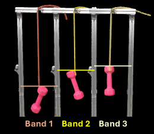
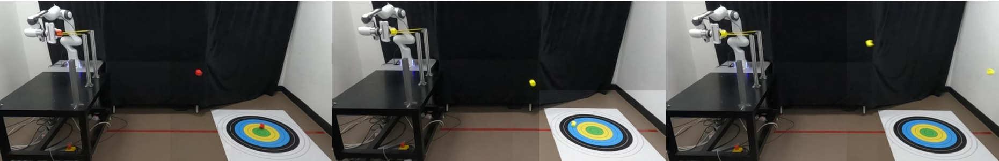

KAIST 연구진이 낸 [Sling2Sim2Real](https://arxiv.org/abs/2607.23268)을 정리했어요. 로봇이 새총을 당겨 표적에 맞히는 과제를 다루는데, 문제의 초점이 조준이 아니라 고무줄의 물성을 아는 데 있어요. [[2026-07-30_실패하는_자리까지_똑같아요|시뮬레이션을 훈련장이 아니라 계측기로 검증한 Real-to-Sim-to-Real]]가 시뮬을 실기 성능의 계측기로 쓰는 이야기였다면, 이 연구는 그 계측기를 어떻게 맞추느냐를 좁고 깊게 파요.

## 보이지 않는 물성

탄성체 조작이 어려운 이유를 저자들은 이렇게 정리해요. 변형이 고차원이고 비선형이며, 물체마다 성질이 달라서 탐색해야 할 상태 공간이 크게 늘어난다고요.

그런데 진짜 걸림돌은 따로 있어요. 탄성 성질은 시각 관측만으로는 사실상 구분되지 않는다는 점이에요. 카메라로 보면 두 고무줄이 똑같이 생겼는데 하나는 부드럽고 하나는 뻣뻣할 수 있어요. 시뮬레이터를 아무리 잘 만들어도 그 안에 넣을 숫자를 모르면 소용이 없어요.

<em>실험에 쓴 고무줄 세 종에 1.5kg 아령을 매달았을 때의 늘어난 정도 — 같은 하중에도 밴드마다 처지는 높이가 다르게 나와요(출처: Kang et al., Sling2Sim2Real)</em>

같은 무게를 걸어 늘어난 길이를 재면 차이가 드러나긴 해요. 문제는 그렇게 얻은 값 하나로는 발사 동역학을 예측하기에 부족하다는 점이에요. 당겼다 놓는 동안 힘이 어떻게 변하고 에너지가 얼마나 되돌아오는지를 알아야 하니까요.

실기에서 반복 시행하며 알아내는 방법도 막혀 있어요. 새총 과제에서 시행이란 발사체를 계속 쏘는 것이고, 그건 비싸면서 파괴적이에요. 고무줄이 늘어나고 상하니까요.

## 한 번, 쏘지 않고

제안은 단순한 문장으로 요약돼요. 파괴적이지 않은 단 한 번의 상호작용으로 탄성 파라미터를 알아낸다는 거예요.

구체적으로 로봇이 하는 동작은 이래요. 새총의 아래쪽 지점을 잡고, U자 포크 평면에서 40도만큼 미리 정한 방향으로 당긴 다음, 놓아서 탄성 동역학이 드러나게 해요. 발사체는 없어요. 이 한 번이 9초이고 30Hz로 300 타임스텝을 기록해요.

여기서 얻은 기록을 시뮬레이션과 맞추는데, 손실 함수가 세 항으로 이뤄져요. 실제와 시뮬 점군 사이의 챔퍼 거리, 힘 크기의 불일치, 그리고 역학적 일의 불일치예요. 마지막 항은 힘과 속도의 곱을 누적한 값이라, 형상만 맞추는 게 아니라 에너지가 어떻게 오가는지까지 맞추려는 장치예요.

## 골짜기가 여럿일 때 찾는 법

파라미터를 찾는 방식이 이 논문에서 가장 공들인 부분이에요. 탄성 파라미터 공간은 최적점이 여러 개 흩어져 있어서 한 곳에서 내려가면 엉뚱한 골짜기에 갇혀요.

그래서 두 단계로 나눠요. 먼저 차분진화로 전역을 훑으면서 탐색 이력을 버리지 않고 모아둬요. 그 이력에서 비최대 억제로 서로 다른 다섯 구역을 골라내고, 각 구역에서 가장 가까운 이웃 열다섯 개로 공분산 행렬을 추정해요. 이 공분산을 촐레스키 분해해 CMA-ES를 초기화하면, 등방으로 뿌리던 탐색 표본이 그 구역의 파라미터 상관 방향에 맞춰 늘어난 모양으로 바뀌어요.

파라미터끼리 얽혀 있는 방향을 미리 알고 그 방향으로 탐색한다는 뜻이에요. 다섯 구역을 동시에 정제하니 한 골짜기에 갇히지도 않고요.

## 정책은 시뮬에서만 배워요

보정된 시뮬레이터가 생기면 그 안에서 정책을 학습해요. 새총 던지기를 한 스텝짜리 결정 문제로 놓는데, 상태는 발사체 위치와 목표까지의 변위이고 행동은 2차원 당김 위치예요. 보상은 다트판처럼 착지 지점이 목표에 가까울수록 커지는 형태이고, 발사에 실패하면 벌점을 줘요. PPO로 학습하고 은닉층은 256, 128, 64예요.

학습이 끝나면 추가 실기 학습 없이 그대로 옮겨요. 실기에서 쓴 상호작용은 처음의 9초 한 번뿐이에요.

## 결과는 밴드에 따라 갈려요

<em>세 방법의 발사 장면 — 왼쪽부터 Sling2Sim2Real, Package SI, Real2Sim2Real이고 바닥의 과녁이 목표예요(출처: Kang et al., Sling2Sim2Real)</em>

Franka Emika Panda 팔에 성질이 다른 고무줄 세 종을 걸고 시험했어요. 최대 복원력이 각각 12.18N, 14.25N, 16.7N이에요. 목표 거리는 172.5cm, 192.5cm, 212.5cm 세 곳이고 방법마다 목표마다 다섯 번씩 쐈어요.

착지 오차를 보면 잘 맞는 조합과 그렇지 않은 조합이 뚜렷해요. 부드러운 실리콘 로프는 192.5cm에서 1.00±1.22cm로 거의 정확했고, 뻣뻣한 라텍스 밴드도 212.5cm에서 3.50±3.39cm였어요. 반면 같은 라텍스 밴드가 172.5cm에서는 35.50±1.87cm까지 벌어졌어요. 천연고무 호스도 212.5cm에서 23.50±2.55cm였고요.

방법 사이 비교로는 차선책이었던 Package SI 대비 손실을 최대 72.5% 줄였다고 밝혀요. 상대 비교로는 분명히 앞서지만, 절대 오차가 목표에 따라 수십 센티까지 벌어지는 구간이 남아 있다는 것도 표에 그대로 나와 있어요.

## 남는 것

저자들이 한계를 솔직하게 적어뒀어요. 설계한 손실과 국소 정제가 정확한 전이를 항상 보장하지는 않는다고 하면서, 특히 212.5cm 목표에서 CMA-ES 정제가 오히려 성능을 떨어뜨린 경우를 지목해요. 원인으로는 탄성체 시뮬레이션 자체의 부정확함과, 목표 설정에 따라 크게 달라지는 비선형 파라미터 공간을 들어요.

향후 과제로는 목표별 보정과 여러 목표를 아우르는 대규모 보정을 꼽았어요. 지금 방식이 한 번의 보정으로 모든 목표 거리를 커버하려다 보니 생기는 문제라고 읽혀요. 이 해석은 제 읽기예요.

과제 자체는 좁아요. 새총 하나이고 밴드 세 종이에요. 그래도 겨누는 지점은 좁지 않아요. 눈으로 안 보이는 물성을 파괴하지 않고 한 번에 알아내는 문제는 케이블이나 천, 포장재를 다루는 작업 어디에나 있으니까요.
