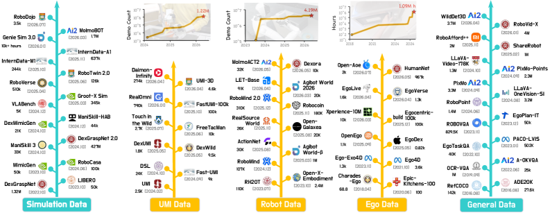

여러 기관이 함께 낸 [Data Pyramid for Embodied Manipulation](https://arxiv.org/abs/2607.24744)을 정리했어요. 로봇 조작 학습에 쓰이는 데이터를 다섯 갈래로 나누고, 각각이 무엇을 주고 무엇을 못 주는지를 한 장의 그림으로 세운 서베이예요. 지난주에 정리한 [[2026-07-22_로봇_없이_로봇_데이터를_모아요|수집 기기가 곧 로봇 그리퍼인 오픈소스 데이터 수집기 Grabette]]와 [[2026-07-28_리더암은_실물_로봇은_시뮬|실물 리더암으로 Isaac Lab 속 로봇을 조종해 시연을 모으는 LeIsaac]]이 각각 이 피라미드의 한 층씩을 다룬 셈이라, 이 글은 그 층들이 어디에 놓이는지를 보는 지도예요.

## 언어모델에는 있던 지름길이 없어요

출발점이 되는 관찰이 있어요. 멀티모달 파운데이션 모델은 인터넷 전체를 삼켜서 보고 말하는 법을 배웠는데, 임바디드 에이전트에는 그런 지름길이 없다는 거예요. 로봇에게 필요한 데이터는 관측에 물리적 상태와 행동이 함께 묶여 있어야 하는데, 웹에는 그런 짝이 없어요.

그래서 여러 출처를 섞어 쓰는데, 출처마다 성격이 달라요. 이 논문은 그 차이를 하나의 축으로 정리해요. 로봇과 얼마나 정확히 맞느냐와 얼마나 많이 모을 수 있느냐가 서로 반대로 간다는 축이에요.

## 다섯 층

꼭대기는 실로봇 데이터예요. 목표 로봇에서 직접 텔레오퍼레이션하거나 스크립트로 돌려 관측과 상태, 행동, 결과를 하나의 닫힌 루프로 기록해요. 로봇에 가장 정확히 맞는 대신 가장 비싸요.

그 아래가 UMI 계열이에요. 손에 드는 그리퍼로 말단 움직임을 기록해서 로봇 없이도 수집할 수 있어요. 수집 장소가 실험실을 벗어나 일상 공간으로 넓어져요.

세 번째는 에고센트릭과 엑소센트릭 영상이에요. 사람이 일하는 모습을 1인칭과 3인칭으로 찍은 기록인데, 진짜 물리와 사람 손의 섬세함, 그리고 일상의 다양함을 담아요.

네 번째는 시뮬레이션이에요. 물리 엔진이 만든 상호작용인데, 실행 가능한 행동과 함께 접촉이나 자세, 성공 신호처럼 실물에서는 못 얻는 특권 정보를 같이 줘요.

바닥은 일반 데이터예요. 웹 규모의 이미지와 영상, 언어, 시각언어 말뭉치가 의미와 공간 구조, 상식을 담고 있어요. 어떤 로봇 데이터셋보다 넓지만 행동에 대해서는 아무 말도 하지 않아요.

## 규모의 차이가 세 자릿수예요

<em>다섯 계층별 데이터셋을 연도순으로 늘어놓고 누적 규모 성장 곡선을 얹은 그림 — 왼쪽부터 시뮬레이션·UMI·로봇·에고·일반 데이터(출처: Ye et al., Data Pyramid for Embodied Manipulation)</em>

숫자를 나란히 놓으면 피라미드 모양이 왜 나오는지 바로 보여요. 실로봇 쪽에서 가장 큰 축에 드는 Open X-Embodiment가 240만 궤적에 임바디먼트 22종, 과제 527개예요. 시간으로 표기한 AgiBot World Beta는 2,976.4시간이고 RoboMIND 2.0이 1,000시간을 넘겨요.

에고센트릭으로 내려가면 자릿수가 달라져요. Ego4D가 3,670시간, Xperience-10M이 1만 시간, HumanNet은 96만 7천 시간이에요. 실로봇 최대급과 견주면 수백 배 차이예요. 사람이 카메라를 쓰고 다니기만 하면 쌓이는 데이터와, 로봇 앞에 사람이 붙어 조종해야 쌓이는 데이터의 차이가 그대로 드러나요.

UMI 계열은 그 사이에 있어요. FastUMI-100K가 시연 10만 개에 과제 32개이고, 양팔 데이터인 RealOmni가 78만 9천 8백 개예요. 로봇 없이 모으니 실로봇보다 많고, 사람 영상보다는 로봇에 가까워요.

## 층마다 다른 방식으로 부족해요

이 서베이가 값어치 있는 부분은 각 층의 한계를 나란히 적어둔 데 있어요.

실로봇은 수집 비용이 커서 대규모 병렬 수집이 막히고, 특정 로봇과 과제, 환경에 쏠려요. UMI는 시각 추적과 캘리브레이션이 깨지기 쉽고, 로봇으로 실행해보지 않으니 궤적 품질을 검증하기 어려워요. 힘 피드백이 없어 접촉이 중요한 작업에 약하고, 임바디먼트 갭을 완전히 없애지도 못해요.

사람 영상은 카메라 한 대의 제약을 받고, 손이 정작 접촉하는 부분을 가려요. 사람 동작을 로봇의 행동 공간으로 옮기는 과정에서 오차가 새로 생기고요. 시뮬레이션은 접촉과 마찰, 컴플라이언스, 센싱 잡음, 구동 지연을 담지 못해요. 일반 데이터는 인지와 추론을 받쳐줄 뿐 접촉이나 결과에 대해서는 말이 없어요.

읽고 나면 층을 고르는 문제가 아니라는 게 분명해져요. 부족한 방식이 서로 달라서 섞어야 메워지는 구조예요.

## 모델마다 섞는 비율이 달라요

실제로 최근 모델들이 어떻게 섞는지도 정리해뒀어요. 시각언어행동 모델은 주로 실로봇과 일반 데이터를 써요. 임바디드 브레인 계열은 인지와 추론을 위해 폭넓은 멀티모달과 에고센트릭 데이터를 가져가요. 월드-액션 모델은 행동 라벨이 없는 시계열과 행동 조건부 상호작용, 합성 경험을 함께 써요.

무엇을 만들려는지에 따라 필요한 층이 갈린다는 뜻이에요. 행동을 직접 내는 모델일수록 위쪽 층이 필요하고, 무엇을 해야 할지 판단하는 모델일수록 아래쪽 층이 넓게 필요해요.

## 남는 것

서베이라서 새 방법이나 실험 결과를 내놓지는 않아요. 어떤 비율로 섞어야 하는지, 층을 하나 더 넣었을 때 성능이 얼마나 오르는지 같은 정량적인 답은 이 글에 없어요. 데이터 생태계의 지도를 그린 문서로 읽는 게 맞아요.

그래도 지도로서는 쓸모가 커요. 새 수집 도구나 데이터셋을 만났을 때 그것이 어느 층을 두껍게 하는지, 그 층의 알려진 약점이 무엇인지를 바로 확인할 수 있으니까요.
