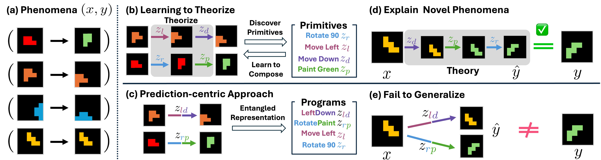

KAIST 안성진 교수 그룹이 낸 [Learning to Theorize the World from Observation](https://arxiv.org/abs/2605.03413)을 정리했어요. 먼저 밝혀둘 게 있어요. 이 논문은 로보틱스가 아니라 기계학습·인공지능 분야로 분류돼 있어요. 로봇 실험도 없어요. 그런데도 정리해 두는 이유는 월드모델이 무엇을 최적화해야 하는가를 정면으로 되묻기 때문이에요. [[2026-07-20_쪼개면_사라지는_행동|쪼개면 사라지는 행동]]처럼 잠재 세계모델을 다룬 글들과 같은 계열의 질문이에요.

## 잘 맞히면 이해한 걸까요

논문의 출발 문장이 좋아요. 세계를 이해한다는 게 무슨 뜻이냐고 물어요.

요즘 월드모델은 그 이해를 잠재 공간이나 관측 공간에서의 정확한 미래 예측으로 조작적 정의해요. 다음 프레임을 잘 맞히면 세계를 이해한 것으로 치는 거예요. 저자들은 발달인지과학이 다른 관점을 제시한다고 지적해요. 사람의 이해는 세계가 어떻게 돌아가는지에 대한 내적 이론을 세우면서 나타나고, 그 일은 언어가 무르익기 전에도 일어난다는 거예요.

여기서 중요한 비판이 나와요. 예측 정확도라는 목표는 얽힌 복합 변환을 통째로 외우는 것만으로도 충족될 수 있다는 점이에요. 입력과 출력의 대응을 통으로 기억해도 예측은 맞아요. 하지만 그건 세계의 구조를 알아낸 게 아니라 사례를 외운 거예요.

## 이론을 실행 가능한 프로그램으로

제안하는 방식이 Learning-to-Theorize이고, 구현체가 Neural Theorizer, 줄여서 NEO예요. 여기서 이론은 실행 가능한 합성적 프로그램으로 표현돼요.

프로그램을 이루는 원시 연산들은 미리 의미를 정해주지 않고 학습으로 얻어요. VQ-VAE 코드북으로 구현한 어휘인데, 저자들은 이걸 학습된 사고의 언어라고 불러요. 프로그램 하나는 이 원시들을 차례로 늘어놓은 것이고, 실행은 함수 합성이에요. 원시마다 대응하는 실행 함수가 있어서 입력에 차례로 적용하면 출력이 나와요.

실행을 맡는 건 공유 전이 모델이에요. 현재 잠재 상태와 원시 하나를 받아 다음 상태를 내놓는 신경망 하나가 모든 원시를 처리해요. 원시마다 다른 모듈을 두지 않는다는 게 재사용의 근거예요.

원시를 고르는 쪽은 따로 있어요. 이론 프로그래머라고 부르는 부분이 목표 관측에 조건부로 다음 원시를 골라요. 설명하려는 결과를 보면서 거기에 이르는 경로를 짜 나가는 구조예요.

<em>학습 쌍에서 원시를 뽑아내는 과정과, 얽힌 표현을 외우는 방식과의 대비, 그리고 보지 못한 프로그램 조합으로의 일반화를 함께 보인 개요(출처: Baek et al., Learning to Theorize the World from Observation)</em>

## 설명이 옮겨 가는지를 시험해요

설명 주도 일반화라는 말을 저자들은 세 가지로 풀어요. 여러 현상에 걸쳐 재사용 가능한 추상 원시를 발견하고, 그것들을 복잡한 관측에 대한 구조화된 설명으로 합성하는 법을 배우고, 같은 원시를 새로 조합해 처음 보는 현상을 설명하는 거예요.

시험 방식이 이 정의를 그대로 따라요. 같은 잠재 프로그램이 만들어낸 두 현상을 준비해서, 첫 번째 쌍에서 프로그램을 추론한 다음 그 프로그램을 두 번째 입력에 적용해 두 번째 출력을 예측해요. 학습된 이론이 개별 입출력 쌍에 맞춘 것인지, 아니면 옮겨 갈 수 있는 생성 메커니즘을 담은 것인지가 여기서 갈려요.

과제는 셋이에요. 격자 세계, 산술 인수분해 추론, 그리고 이미지 편집이에요. 규모는 작지 않아서 이미지 편집만 해도 학습 117만 쌍에 분포 내 시험 23만 4천 쌍, 학습 때보다 긴 프로그램을 다루는 시험이 39만 3천여 쌍이에요.

## 어휘를 작게 쓰고 길게 조합해요

기준선과의 설정 차이가 방법의 성격을 잘 보여줘요. 격자 세계에서 NEO는 코드북 크기 6에 최대 전이 길이 4를 쓰는데, 비교 대상인 단일 전이 모델은 코드북 36에 길이 1이에요. 산술에서는 16 대 40, 이미지 편집에서는 16 대 64예요.

읽어보면 방향이 분명해요. 기준선은 변환 하나하나에 기호를 하나씩 배정해 어휘를 키우고, NEO는 작은 어휘를 여러 번 조합해 같은 변환을 만들어요. 어휘가 작을수록 원시가 여러 현상에 걸쳐 재사용된다는 뜻이고, 그게 처음 보는 조합으로 넘어갈 수 있는 근거예요.

비용도 밝혀뒀어요. 순차 전이 때문에 단일 패스 기준선보다 학습 비용이 약 2배인데, 경사 기반 최적화보다는 훨씬 효율적이라고 해요. RTX 4090에서 배치당 학습 시간이 과제에 따라 75.4에서 106.7밀리초 사이예요.

## 남는 것

정직하게 짚을 게 있어요. 제가 확인한 범위에서는 정확도나 일반화 점수를 백분율로 제시한 표를 찾지 못했어요. 그래서 이 글에는 성능 수치가 없어요. 데이터셋 크기와 코드북 설정, 계산 비용처럼 확인된 값만 적었어요.

저자들이 밝힌 구조적 약점도 있어요. 중간 잠재 상태들이 유효한 관측에 대응할 필요가 없고 마지막 상태만 목표를 복원하면 되는데, 이 자유도가 오히려 합성적 구조를 찾는 걸 방해한다는 거예요. 완화책으로 중간 상태를 디코딩했다가 다시 인코딩하는 순환으로 정칙화하는 장치를 넣었어요. 실행을 결정론적으로 둔 것도 학습 안정성을 위한 단순화이지 완전한 확률적 정식화가 아니라고 적어뒀고요.

로봇으로 옮기려면 거리가 남아 있어요. 여기서 다루는 현상은 격자와 산술, 이미지 편집처럼 생성 규칙이 깔끔한 세계인데, 접촉과 마찰이 얽힌 물리는 그렇게 떨어지지 않아요. 그래도 질문 자체는 로봇 쪽에 그대로 유효해요. 다음 순간을 잘 맞히는 모델과 무엇이 왜 그렇게 되는지를 아는 모델은 다르고, 처음 보는 상황에서 갈리는 건 후자니까요.
