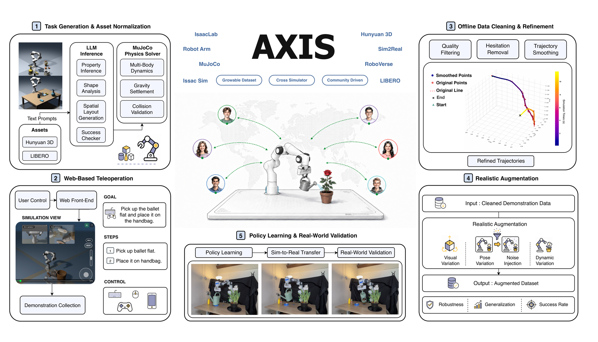

Axis Robotics와 버클리, 조지아텍 등이 함께 낸 [AXIS](https://axisaiorg.github.io/AXIS-V1/)를 정리했어요. 로봇 조작 시연을 웹 브라우저에서 모으고, 올라온 궤적을 자동으로 검사하고 다듬어 학습 가능한 데이터로 바꾸는 파이프라인이에요. [[2026-08-03_많을수록_로봇에서_멀어요|임바디드 조작 데이터의 다섯 계층과 층별 한계]]가 그린 데이터 피라미드에서 시뮬레이션 층에 해당하는데, 그 층을 누가 채우느냐를 바꿔놓은 접근이에요.

## 수집을 막는 건 로봇만이 아니에요

논문이 짚는 확장 병목은 셋이에요. 특수 하드웨어에 의존하고, 조작자가 한곳에 몰려 있어야 하고, 과제 목록이 고정돼 있다는 점이에요. [[2026-07-22_로봇_없이_로봇_데이터를_모아요|수집 기기가 곧 로봇 그리퍼인 오픈소스 데이터 수집기 Grabette]]가 첫 번째 문턱을 손에 드는 그리퍼로 낮췄다면, AXIS는 세 가지를 한꺼번에 웹으로 옮겨요.

기여자는 MuJoCo를 WebAssembly로 올린 브라우저 프런트엔드에서 프랑카 리서치 3 팔을 조종해요. 필요한 건 흔한 입력 장치뿐이고, 시뮬레이터를 로컬에 설치하거나 GPU를 갖출 필요가 없어요. 업로드된 궤적은 백엔드로 넘어가 검증과 정리, 리플레이, 렌더링, 증강, 내보내기를 거쳐요. 지연에 민감한 원격조작과 계산이 무거운 데이터 처리를 물리적으로 갈라놓은 구조예요.

<em>AXIS 시스템 개요 — 과제 생성과 에셋 정규화, 브라우저 원격조작, 오프라인 데이터 처리, 시뮬레이션 증강, 정책 학습, 실세계 검증(출처: Zhao et al., AXIS)</em>

## 과제도 사람이 다 만들지 않아요

파이프라인은 여섯 단계로 정리돼요. 과제 생성과 에셋 정규화, 브라우저 원격조작, 성공 판정과 궤적 업로드, 필터링과 머뭇거림 제거·평활화·리샘플링, IsaacSim 기반 시각·물리 증강, 그리고 VLA 학습과 고정 프로토콜 평가·실세계 롤아웃이에요.

앞단이 특히 눈에 띄어요. 새 조작 과제를 자동으로 만들고 검증하는데, 언어모델이 물체 속성과 형태를 추론하고 공간 배치와 성공 판정기를 생성하면 MuJoCo 물리 솔버가 다물체 동역학과 중력 안정화, 충돌 검사로 그 배치가 실제로 성립하는지 확인해요. 과제 목록이 고정된 게 아니라 계속 늘어날 수 있게 만든 부분이에요.

<video controls muted loop preload="metadata" style="width:100%"><source src="../assets/axis_collect_demo.mp4" type="video/mp4"></video>
<em>브라우저 기반 원격조작 세션 — AXIS 수집 인터페이스로 원격에서 과제를 수행하는 화면이에요(출처: Zhao et al., AXIS)</em>

## 궤적 하나에 무엇이 들어가나요

데이터셋 스냅샷은 과제 207개에 궤적 50K 이상, 과제·씬 변형 60K 이상이에요. 로봇은 평행 그리퍼를 단 프랑카 리서치 3 한 종이고, 관측은 서드뷰와 손목 RGB-D예요. 에피소드마다 언어 지시와 파라미터화된 시뮬레이션 씬, 에셋, 구조화된 성공 판정기가 함께 붙고, 궤적에는 로봇 상태와 물체 상태, 행동, 성공 라벨이 동기화돼 들어가요.

수록 항목 목록에는 실패 라벨도 들어 있어요. 성공한 시연만 골라 담는 게 아니라 어떤 시도가 실패했는지도 함께 남긴다는 뜻이에요. 불특정 다수가 올린 궤적을 그대로 학습에 쓸 수 없으니, 무엇을 남기고 무엇을 버릴지 판단하는 층이 파이프라인 한가운데 있어야 해요.

## 다듬을수록 재생이 덜 성공해요

커뮤니티가 모은 원본 시연에는 머뭇거림과 떨림, 낮은 샘플링에서 오는 인공물, 물리적으로 성립하지 않는 전이가 섞여요. 그래서 백엔드가 손상된 기록과 실패한 과제, 정지 구간, 지터, 비물리적 불연속을 걸러내요.

여기서 공개한 표가 흥미로워요. 원본 원격조작은 5.0Hz에 평균 가속도 1.3539, 평균 저크 11.5899이고 재생 성공률이 100.0%예요. 평활화를 거치면 가속도 0.6382, 저크 2.9160으로 훨씬 매끄러워지는데 재생 성공률은 91.4%로 내려가요. 20Hz로 리샘플링까지 하면 0.4885와 2.2243으로 더 부드러워지고 성공률은 86.2%가 돼요.

궤적을 매끄럽게 만드는 일과 그 궤적이 시뮬레이터에서 다시 실행됐을 때 과제를 성공시키는 일이 같은 방향이 아니라는 뜻이에요. 접촉이 걸린 구간에서는 사람이 낸 거친 움직임 자체가 성공에 필요한 정보였을 수 있어요. 정제 강도를 어디서 멈출지가 파이프라인의 설계 변수로 남아 있는 셈이고, 그 상충을 감추지 않고 수치로 내놓은 점이 이 문서에서 값어치 있는 부분이에요.

## 늘어나는 데이터를 스냅샷으로 끊어요

데이터셋을 한 번 공개하고 마는 대신, 학습 데이터를 점점 커지는 스냅샷으로 조직해요. AXIS-25%, AXIS-50%, AXIS-100%와 이후 버전이 데이터 포맷과 과제 정의, 성공 판정기, 롤아웃 예산, 평가 과제를 공유해요. 학습 범위가 늘어난 효과만 따로 떼어 볼 수 있게 나머지를 고정한 거예요.

효과는 LIBERO-Plus에서 쟀어요. π0.5를 그대로 쓰면 전체 성공률이 83.9인데, AXIS-25%로 이어서 사전학습하면 84.7, 50%는 85.7, 100%는 88.8로 올라가요. 데이터 양에 따라 단조롭게 오르는 흐름이에요. 같은 양의 시연을 RoboCasa로 맞춰 사전학습한 비교군은 57.5로, 사전학습을 안 한 원본보다도 크게 낮아요. 시뮬레이션 데이터라고 다 같은 몫을 하는 게 아니라는 신호예요.

축별로 보면 어디서 이득이 나오는지 갈려요. 센서 노이즈가 82.5에서 96.2로 13.7 오르고 카메라가 72.5에서 83.8로 11.3 올라요. 배경이 94.4에서 98.1로 3.7 오르고, 명시적으로 무작위화한 축이 아닌 로봇 자세도 74.4에서 78.2로 3.8 오르고요. 반면 조명은 98.2에서 96.5로 1.7 내려가고 언어는 89.6에서 88.3으로 1.3 내려가요. 조명은 원본이 이미 98.2라 더 오를 자리가 거의 없었고 언어는 이 증강이 건드리지 않는 축이라 그런 것으로 보여요.

다만 개별 축까지 데이터 양을 따라 곧게 오르지는 않아요. 카메라는 원본 72.5에서 AXIS-25%가 77.5로 올랐다가 AXIS-50%에서 68.8로 원본보다 떨어지고, AXIS-100%에 가서야 83.8이 돼요. 전체 성공률의 단조로운 상승은 축들이 서로 다른 속도로 움직인 결과를 합친 값이에요.

한계도 분명해요. 데이터는 프랑카 한 종의 테이블 위 조작에 묶여 있고, 실세계 검증은 서드뷰와 손목 시점 롤아웃 영상으로 제시돼요. 성공률 표는 시뮬레이션 벤치마크에서 나온 값이라 실기 성능을 그대로 말해주지는 않아요.

그래도 로봇 데이터의 병목을 모델이나 알고리즘이 아니라 수집 인터페이스로 보고, 그 인터페이스를 브라우저 URL 하나로 낮춰놨어요. 데이터를 모으는 사람의 수를 늘리는 쪽으로 확장 축을 옮긴 거예요.

---

<!-- src-block -->
출처 — https://axisaiorg.github.io/AXIS-V1/
