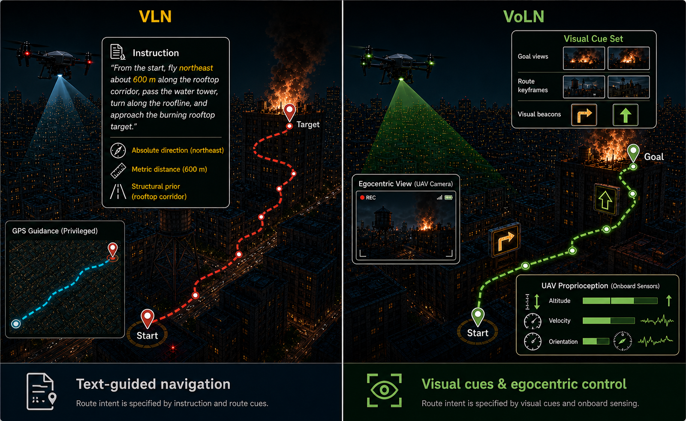

베이징항공항천대학이 낸 [VoLN: Vision-Only Long-Horizon Navigation](https://admire-ljb.github.io/VoLN-UAV/)을 정리했어요. 자연어 지시를 따라 이동하는 기존 항법 과제에서 언어를 걷어내고, 목표 지점 사진과 현장에 놓인 시각 표지만으로 날아가게 만든 과제 정의와 벤치마크예요. [[2026-07-23_웨이포인트만_보내면_되는_대회|웨이포인트만 보내면 되는 대회]]가 저수준 주행을 주최 측이 떠맡아 언어와 공간 추론만 남긴 이야기였다면, 이 논문은 반대편을 잘라내요. 언어가 조용히 대신 해주던 일을 없애고 지각만 남겨요.

## 지시문은 경로 정보를 함께 실어 날라요

Vision-and-Language Navigation은 "출발점에서 북동쪽으로 600미터쯤 옥상 통로를 따라가다 급수탑을 지나 지붕선을 따라 꺾어 불타는 옥상 표적으로 접근하라" 같은 문장을 받아 움직여요. 논문이 지적하는 건 이 문장에 담긴 정보의 성격이에요. 방향과 거리, 배치 같은 경로 수준의 사전정보가 문장에 인코딩돼 있는데, 이것들은 GPS가 닿지 않는 개활 환경에 배치된 기체가 온보드 센싱만으로는 명시적으로 얻을 수 없는 값이에요.

그래서 이 인터페이스에서 나온 벤치마크 점수는 두 가지를 한꺼번에 반영해요. 시각으로 길을 찾는 능력과, 지시문에서 뽑아낸 경로 구조를 활용하는 능력이에요. 둘이 섞여 있으면 지각 기반 항법이 실제로 얼마나 되는지를 떼어내 볼 수 없어요.

<em>왼쪽은 문장으로 절대 방향·거리·구조를 받고 GPS 안내까지 쓰는 기존 VLN, 오른쪽은 목표 뷰와 경로 키프레임, 현장 표지, 자기 상태만 받는 VoLN(출처: Lou et al., VoLN-UAV)</em>

## 목표는 사진으로, 경로는 현장 표지로

VoLN의 정의는 두 갈래로 요약돼요. 목적지는 도착 지점에서 보이는 뷰로 지정하고, 경로에 대한 안내는 국소적으로 관측 가능한 현장 표지로 제시해요. 실행 중에 외부에서 제공되는 에피소드 단위 텍스트, 전역 지도, GPS, 최단경로 정보는 인터페이스가 하나도 주지 않아요.

경로 의도를 복원할 재료는 세 가지로 좁혀져요. 장면 안의 의미 표지, 1인칭 관측, 그리고 온보드 센싱으로 얻는 자기 상태예요. 목표를 알려주는 방식이 문장에서 사진으로 바뀌었으니, 이제 도착 판정도 다른 시점에서 찍힌 목표 뷰와 지금 보고 있는 장면을 맞춰보는 문제가 돼요.

## 벤치마크는 장면을 겹치지 않게 갈랐어요

이 정의를 항공 항법으로 구현한 게 VoLN-UAV예요. 에피소드 7,210개를 학습 5,047, 검증-본 장면 1,082, 테스트-미본 장면 1,081로 나누는데, 분할 기준이 장면 출처라 테스트에서는 학습 때 본 적 없는 환경이 나와요. 사막과 숲, 산악, 도심 협곡, 야간 도심, 캠퍼스, 터널, 산업 통로, 개활지가 들어 있어요.

난이도는 기준 경로 길이로 갈라요. 300미터 미만이 Easy, 300에서 450미터가 Normal, 450미터 이상이 Hard예요. 미리 설정한 궤적과 조작자가 직접 모은 궤적에 경로를 고려한 표지와 스텝 단위 동기 주석을 붙여 만들었고, 온라인 평가용으로 언리얼 엔진과 AirSim 환경을 함께 배포해요.

## 초기 방법은 얼어붙은 모델 두 개를 이어요

함께 내놓은 VoLN-MLLM은 두 단계로 돌아가요. 1단계에서는 자기지도로 학습된 DINOv3 특징을 가벼운 어댑터로 CLIP 이미지 임베딩 공간에 옮겨요. 시각 특징과 의미 공간을 먼저 붙여두는 셈이에요. 2단계에서는 정렬된 관측과 목표 뷰, 자기 상태를 받아 실행 가능한 국소 웨이포인트 열을 예측해요.

구현은 얼어붙은 DINOv3 ViT-B/16 백본과 얼어붙은 Vicuna-7B-v1.5 플래너를 써요. 고정된 의미 은행에서 상위 8개 범주 토큰을 검색해 넣고, rank-16 LoRA 모듈이 Vicuna의 어텐션과 피드포워드 사영을 적응시켜요. 출력 헤드는 3차원 웨이포인트 여덟 개와 정지 신호를 내요. 큰 모델을 통째로 학습하는 대신 정렬 어댑터와 LoRA, 출력 헤드만 움직이는 구조예요.

## 성공률이 한 자릿수에서 시작해요

이 구조로 미본 장면 테스트를 돌린 결과가 이 벤치마크의 출발점이에요. VoLN-MLLM의 성공률은 Easy 7.4%, Normal 4.5%, Hard 1.8%예요. 비교 대상인 LAG-VG가 2.3 / 1.2 / 0.4%, CMA-VG가 1.6 / 0.8 / 0.2%, 무작위가 0.4 / 0.0 / 0.0%이니 베이스라인 대비로는 확실히 앞서요. 그런데 절대값이 한 자릿수예요.

다른 지표도 같은 그림을 그려요. 목표까지 남은 거리(NE)는 Easy 97.1미터, Normal 131.4미터, Hard 176.8미터예요. 가장 쉬운 구간에서도 최고 성능 방법이 목표를 눈앞에 두지 못한 채 멈춘다는 뜻이에요. 경로를 얼마나 닮게 갔는지 재는 nDTW는 53.1 / 41.2 / 28.0%인데, 이 지표가 가장 높았던 베이스라인 CMA-VG(33.2 / 26.4 / 18.5%)와 견주면 1.5배 남짓이에요. 경로 길이로 보정한 성공률(SPL)은 5.7 / 3.2 / 1.3%예요. 궤적을 비슷하게 따라가는 능력은 눈에 띄게 올랐는데 끝까지 도착하는 능력은 그만큼 오르지 않았어요.

<video controls muted loop preload="metadata" style="width:100%"><source src="../assets/voln_sim_demo.mp4" type="video/mp4"></video>
<em>시뮬레이션 롤아웃 — 같은 시각 목표 인터페이스에서 기체와 실행 궤적, 다음 시각 표지, 목표 영역을 겹쳐 표시해요(출처: Lou et al., VoLN-UAV)</em>

## 어디서 무너지는지가 보여요

정성 분석은 실패의 형태를 하나로 지목해요. 경로에 실제로 관계된 능동 표지를 고르고 관계없는 수동 방해물을 걸러내는 판단이 국소 결정을 경로에 붙들어 두느냐를 가른다는 거예요. 성공한 롤아웃은 수동 방해물을 무시하고 목표를 다시 식별해요. 실패한 롤아웃은 수동 단서에 확정적으로 올라타서 잘못된 국소 갱신을 내고, 그 오차가 쌓여 표류해요.

저자들이 남은 과제로 적어둔 것도 이 관찰과 이어져요. 장기 구간에 걸친 증거 통합, 시점이 다른 목표 매칭, 폐루프 안정성 세 가지예요. 한 번의 잘못된 표지 선택이 되돌아오지 못하는 구조라서, 표지 하나를 잘 고르는 문제가 아니라 여러 스텝에 걸친 증거를 어떻게 누적하느냐의 문제로 넘어가요.

실기체 실험은 스스로 범위를 좁혀 놓았어요. 실내 테스트베드는 대규모 정량 실세계 벤치마크가 아니라 예비적인 정성 타당성 확인이라고 명시해요. 지금 단계에서 실세계 성능을 주장하는 문서가 아니라는 뜻이에요.

읽고 나면 숫자가 낮다는 게 이 논문의 약점이 아니라 결과에 가깝다고 보게 돼요. 표에 실린 다섯 방법은 전부 언어가 없는 같은 프로토콜에서 평가된 값이라 언어를 줬을 때와 직접 견준 대조군은 여기 없어요. 그래도 경로 구조를 문장으로 받지 못하는 조건에서 최고 성능이 한 자릿수에 머문다는 사실 자체가, 기존 항법 벤치마크의 높은 성공률 중 얼마만큼이 지각에서 나온 것이었는지를 되묻게 만들어요. 그 질문을 과제 정의로 옮겨 놓은 셈이에요.
