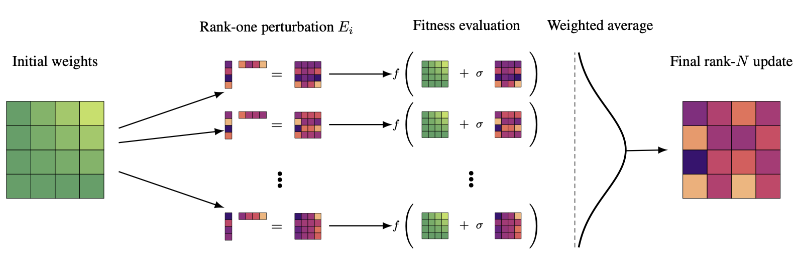
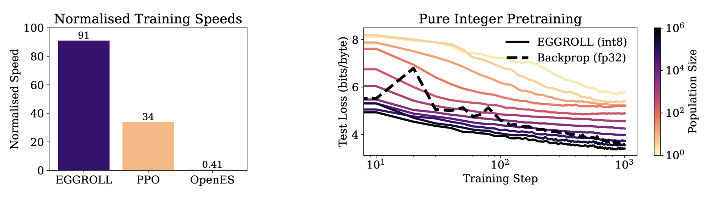

옥스퍼드 FLAIR와 MILA 등이 낸 [Evolution Strategies at the Hyperscale](https://arxiv.org/abs/2511.16652)을 정리했어요. 기울기를 쓰지 않는 진화전략(Evolution Strategies)을 수십억 파라미터 규모까지 끌어올린 방법인데, 병목을 알고리즘이 아니라 GPU가 연산을 처리하는 방식에서 찾았다는 점이 흥미로워요. [[2026-07-23_액체처럼_변하는_기억|액체처럼 변하는 기억]]에서 본 순환 계열 모델이 여기서는 상태 크기가 일정하다는 이유로 실험의 주력이 돼요.

## 기울기를 안 쓰면 열리는 것들

진화전략은 파라미터에 무작위 섭동을 여러 개 뿌리고, 각각의 적합도를 평가한 뒤 좋은 방향으로 가중 평균해 갱신해요. 미분이 필요 없으니 이산 파라미터를 가진 모델이나, 결과만 보고 점수를 주는 목적함수처럼 기울기를 얻을 수 없는 대상도 최적화할 수 있어요. 노이즈가 끼거나 조건수가 나쁜 지형에도 상대적으로 견디고, 순환 구조에서 생기는 기울기 소실·폭발 문제도 피해가요.

병렬화 성질도 좋아요. 개체별 적합도 평가가 서로 독립이라 장치 사이에 오갈 게 스칼라 값 하나뿐이에요. 역전파가 장치마다 기울기를 모으고 합쳐야 하는 것과 대비돼요. 저정밀 자료형도 마찬가지예요. 역전파로 낮은 정밀도 모델을 학습하려면 별도의 손질이 필요한데, 진화전략은 추론에 쓰는 자료형 그대로 최적화할 수 있어요.

## 막힌 곳은 탐색이 아니라 산술강도였어요

그럼에도 진화전략은 작은 모델과 작은 인구 크기에 갇혀 있었어요. 딥러닝 모델에서 학습 파라미터의 대부분은 행렬인데, 진화전략을 그대로 적용하면 개체마다 전체 파라미터를 복제한 풀랭크 섭동 행렬을 만들어야 해요. 메모리가 불어나고 큰 가중치 텐서를 계속 옮겨야 해요.

더 큰 문제는 계산 쪽이에요. 개체마다 별도의 행렬곱 열을 돌려야 하는데, 배치 행렬곱은 산술강도가 낮아요. 산술강도는 연산량과 메모리 통행량의 비율이라, 이 값이 낮으면 GPU가 계산을 하는 대신 데이터를 실어 나르는 데 시간을 써요. 수십억 파라미터 구간에서는 이 두 비용이 지배해요. 진화전략이 안 되는 게 아니라, 하드웨어가 좋아하는 모양이 아니었던 거예요.

## 섭동을 저랭크로 접어요

EGGROLL이 바꾸는 건 섭동의 모양 하나예요. 풀랭크 행렬 E를 뽑는 대신 A와 B 두 개의 얇은 행렬을 뽑아 E = (1/√r) ABᵀ로 만들어요. 랭크 r은 행렬의 두 변보다 훨씬 작아요. 기울기 학습에서 LoRA가 하던 저랭크 어댑터와 같은 발상인데, 여기서는 학습할 어댑터가 아니라 탐색용 노이즈에 적용해요.

효과가 두 갈래로 나와요. 층마다 저장해야 할 섭동 행렬이 mn에서 (m+n)r로 줄고, 그만큼 텐서 이동도 줄어요. 여기에 카운터 기반 결정론적 난수 생성기를 써서 노이즈를 필요할 때 다시 만들어내니 섭동이 메모리에 상주할 이유도 없어져요. 그리고 여러 개체를 동시에 평가할 때 저랭크 어댑터들을 배치로 묶고 기저 활성값을 공유해, 한 번의 순전파로 모든 갱신을 적용해요. 이 형태가 산술강도가 훨씬 높은 연산으로 바뀌면서 큰 모델·큰 인구에서 처리량이 백 배 넘게 올라가요.

<em>초기 가중치에 rank-1 섭동을 개체마다 얹어 적합도를 평가하고, 가중 평균해 최종 갱신을 만드는 구조(출처: Sarkar et al., Evolution Strategies at the Hyperscale)</em>

여기서 오해하기 쉬운 지점이 있어요. 섭동이 저랭크라고 갱신까지 저랭크가 되지는 않아요. 최종 갱신은 인구 전체에 걸친 가중 평균이라 랭크가 min(Nr, m, n)이 돼요. 개체 수가 충분하면 갱신은 사실상 풀랭크로 돌아와요. 저자들은 이론 쪽에서도 이 부분을 붙잡아요. 고정된 저랭크 갱신은 랭크가 1이어도 파라미터 차원이 커질수록 참 진화전략 기울기로 수렴한다는 걸 증명하고, 이와 별개로 랭크 r을 키우면 그 근사가 풀랭크 가우시안 진화전략 갱신에 O(r⁻¹) 속도로 수렴한다는 것도 보여요. 노이즈 크기에 대해서도 σ_d = o(d^(-1/2)) 아래에서 갱신이 선형화되며 1차 도함수로 수렴한다는 임계 조건을 제시하고, 선형화·임계·발산 세 영역을 나눠요.

## 배치 추론 처리량의 91%

속도는 순수 배치 추론 처리량을 100으로 놓고 재요. EGGROLL이 91, PPO가 34, 기존 OpenES가 0.41이에요. 학습이 추론과 거의 같은 속도로 돌아간다는 뜻이고, 반대로 말하면 종전 진화전략이 얼마나 심하게 막혀 있었는지가 0.41이라는 숫자에 드러나요.

<em>왼쪽은 순수 배치 추론을 100으로 정규화한 학습 속도 비교, 오른쪽은 인구 크기를 키워가며 int8 언어모델을 처음부터 학습한 테스트 손실 곡선(점선이 fp32 역전파)(출처: Sarkar et al., Evolution Strategies at the Hyperscale)</em>

## 정수만 쓰는 언어모델을 처음부터 학습해요

이 속도가 열어주는 실험이 EGG예요. 기울기가 필요 없으니 추론에 유리한 구조를 자유롭게 고를 수 있다는 논리로, 활성함수를 명시적으로 두지 않고 int8 연산의 클리핑이 만드는 암묵적 비선형성에만 기대는 순환 신경망을 만들었어요. 가중치가 전부 int8이에요.

6층에 은닉 차원 256인 모델로 minipile에서 문자 단위 예측을 학습해요. 개체마다 100토큰마다 파라미터를 갱신하고, 은닉 상태는 유지하다 문서 경계에서만 초기화하는 절단형 진화전략을 써요. 데이터 배치 크기를 16으로 고정한 채 인구 크기만 2에서 1,048,576까지 키우는데, 가장 좋은 테스트 손실이 3.40 bits/byte로 같은 배치를 쓴 fp32 트랜스포머의 역전파 학습(3.58)보다 낮아요.

다만 이 결과에는 대가도 함께 적혀 있어요. 가장 큰 인구는 같은 양의 데이터를 쓰면서 역전파 기준선보다 약 180배 많은 GPU 시간을 써요. 데이터가 제한된 상황에서 계산만으로 밀어붙이는 확장이라는 뜻이고, 저자들도 그렇게 표현해요. 인구 크기가 2인 설정은 같은 데이터를 봐도 크게 뒤처지니, 큰 인구가 이 사전학습의 핵심 조건이에요.

## 강화학습에서는 손해가 없고, LLM에서는 GRPO를 넘어요

저랭크 섭동이 최적화 거동 자체를 바꾸지 않는지도 확인해요. Navix와 Craftax, Brax, Kinetix, Jumanji에 걸친 16개 환경에서 OpenES와 붙였는데, 7개에서 대등하고 7개에서 앞서고 2개에서 뒤처져요. 성능을 잃지 않으면서 벽시계 시간만 줄인 셈이에요.

언어모델 사후학습으로 넘어가면 모델 선택부터 이 구조에 맞춰져요. 파인튜닝 대상은 RWKV-7인데, 순환 모델이라 트랜스포머였다면 KV 캐시가 가져갔을 메모리를 개체 평가에 돌려쓸 수 있다는 이유예요. 상태 크기가 입력 길이에 따라 늘지 않는 성질이 그대로 인구 크기로 바뀌는 셈이에요. 같은 하드웨어와 같은 시간을 주면 카운트다운 과제에서 1.5B 모델의 검증 정확도가 GRPO의 23%에 비해 35%로 올라가요. 한 GPU에서 EGGROLL은 병렬 생성을 1024개까지 돌리는데 GRPO는 64개에 그쳐요. 갱신 횟수는 오히려 GRPO가 많은데도(915 대 618) 결과가 갈려요.

14B 모델에서는 비교 자체가 불가능해져요. Adam 옵티마이저가 쓰는 추가 메모리 때문에 GRPO를 돌릴 수 없어서예요. DeepScaleR로 학습한 뒤 사고 예산 5000토큰으로 평가하면 AIME24가 13%에서 30%로, AIME25가 7%에서 33%로, HMMT25가 11%에서 13%로 올라가요. 32개 GPU로 12시간 학습한 결과예요.

## 남는 것

이 논문에서 가져갈 것은 "진화전략이 역전파보다 낫다"가 아니라 병목을 옮겨 놓은 방식이에요. 탐색 알고리즘을 손보는 대신 섭동의 대수적 구조를 바꿔 하드웨어가 잘하는 연산 모양으로 만들었고, 그 결과로 이전에는 시도할 수 없던 자료형과 구조가 학습 대상으로 들어왔어요.

저자들이 다음 방향으로 적어둔 것도 그 연장선이에요. 미분 불가능한 구성요소가 섞인 대규모 신경기호 시스템, 그리고 추론 시점의 하네스와 다른 에이전트와의 상호작용까지 인지하도록 학습되는 언어모델 시스템이에요. 접촉 판정이나 규칙 기반 안전 필터, 성공 여부만 알려주는 판정기처럼 로봇 쪽에서 흔한 비미분 요소도 같은 성격의 대상으로 보이는데, 이건 제 짐작이고 이 논문이 직접 다루는 범위는 아니에요. 그 자리에 쓸 수 있을지는 여기 실린 실험만으로는 아직 알 수 없어요.
