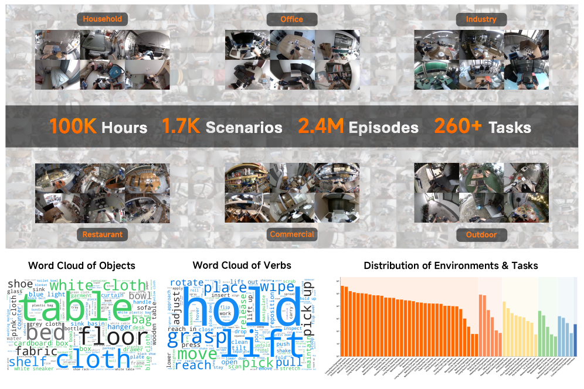
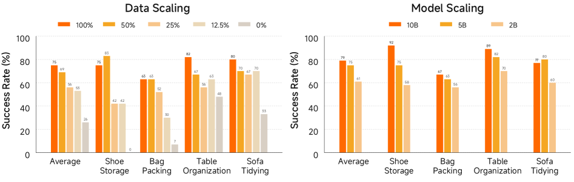

샤오미 로보틱스가 낸 [Xiaomi-Robotics-1](https://arxiv.org/abs/2607.15330)을 정리했어요. 손에 쥐는 그리퍼로 모은 10만 시간 궤적으로 사전학습한 시각-언어-행동 모델인데, 규모 자체보다 그 규모를 가능하게 만든 라벨링 방식이 이 논문에서 가장 눈에 띄는 부분이에요. [[2026-07-22_로봇_없이_로봇_데이터를_모아요|로봇 없이 로봇 데이터를 모아요]]가 수집 장치로 문턱을 낮춘 이야기였다면, 이 논문은 그 뒤에 남아 있던 두 번째 문턱을 다뤄요.

## 장치를 바꿔도 라벨링이 남아요

로봇 데이터를 모으는 지배적인 방식은 원격 조작이에요. 사람이 조종기를 잡고 실제 로봇을 움직여 시연을 기록하니 수집 속도가 보유한 로봇 대수에 묶이고, 실험실 몇 곳의 정해진 과제만 반복하게 돼 데이터가 좁은 구간에 몰려요.

UMI 계열 손잡이형 그리퍼는 그 제약을 풀어요. 로봇 없이 실제 환경에서 궤적을 기록하고, 집게 자세가 궤적에 직접 남으니 사람 손 관절을 로봇 관절로 옮기는 변환도 필요 없어요. [[2026-08-03_많을수록_로봇에서_멀어요|많을수록 로봇에서 멀어요]]의 피라미드에서 UMI 층이 실로봇 층보다 넓은 이유가 이거예요.

그런데 장치를 바꿔도 남는 일이 있어요. 언어 라벨링이에요. 기존 방식은 사람이 긴 영상을 과제 의미 단위로 잘라내고 구간마다 지시문을 적어야 하는데, 이 작업량은 데이터 시간에 그대로 비례해요. 10만 시간에서는 성립하지 않아요.

## 자르는 위치를 맞추는 대신 라벨을 바꿨어요

XR-1이 택한 길은 사람이 자르고 이름 붙이는 일을 아예 포기하는 거예요. 궤적을 기계적으로 같은 길이 조각으로 자른 뒤, 시각-언어 모델에게 그 조각 안에서 장면이 어떤 상태에서 어떤 상태로 바뀌었는지를 서술하게 시켜요.

이 전환이 왜 통하는지가 핵심이에요. 과제 이름을 붙이려면 자른 위치가 과제 경계와 맞아야 해요. 어중간하게 잘린 조각에는 붙일 이름이 없으니까요. 반면 상태 변화를 서술하는 라벨은 **어디서 잘라도 성립해요.** 어떤 조각이든 그 안에서 무언가는 움직였고, 그 움직임은 문장으로 적을 수 있어요. 경계를 정확히 찾는 문제를 경계가 필요 없는 문제로 바꾼 셈이에요.

그 결과 모인 사전학습 데이터가 10만 시간, 1,700개 시나리오, 240만 에피소드, 260개 이상 과제예요. 가정과 사무실, 공장, 식당, 상업 시설, 야외에서 모았어요.

<em>사전학습 데이터셋 개요 — 환경 여섯 갈래와 물체·동사 워드클라우드, 그리고 규모 표기(출처: Xiaomi Robotics, Xiaomi-Robotics-1)</em>

## 대가는 사후 학습이 치릅니다

공짜는 아니에요. 이 방식으로 학습한 모델은 두 가지가 어긋난 상태예요. 내놓는 행동은 UMI 그리퍼의 것이지 로봇의 것이 아니고, 조건으로 받는 문장은 사람이 로봇에게 던지는 명령문이 아니라 상태 변화를 적은 서술문이에요.

그래서 사후 학습이 두 간극을 메워요. 약 1만 시간의 이종 몸체 데이터를 쓰는데, 그중 7,200시간 이상이 모바일 매니퓰레이터와 양팔 로봇으로 직접 모은 것이고 1,000시간 이상이 지시문이 붙은 UMI 데이터예요. 나머지는 공개 데이터셋이고요. 규모를 얻는 단계와 정렬을 맞추는 단계를 분리한 구조예요.

구조도 이 분리와 맞물려요. 모델은 사전학습된 시각-언어 모델과 확산 트랜스포머를 Mixture-of-Transformers로 묶어요. 두 갈래가 파라미터는 따로 갖되 어텐션으로 연결되고, 확산 쪽 토큰은 지시문과 시각 관측의 표현만 참조하도록 행동 관련 토큰을 어텐션 계산에서 제외해요. 뒤에서 볼 2B·5B·10B는 이 구조 전체의 크기를 가리켜요.

## 스케일링이 검증 손실에서 멈추지 않았어요

이 논문이 실제로 확인하려던 건 스케일링이에요. 사전학습 데이터와 모델 크기를 키울 때 검증 오차만 내려가는 게 아니라 실제 로봇의 성공률까지 따라오는가예요.

처음 보는 환경에 그대로 투입한 평가에서, 행동 사전학습을 하지 않은 기준선이 26%였고 사전학습 데이터를 100% 쓴 모델이 75%였어요. 모델 크기 쪽은 2B가 61%, 5B가 75%, 10B가 79%예요.

<em>사후 학습 모델의 과제별 성공률 — 왼쪽이 사전학습 데이터 비율, 오른쪽이 모델 크기(출처: Xiaomi Robotics, Xiaomi-Robotics-1)</em>

여기서 그림을 읽는 데 필요한 단서가 하나 있어요. 저 100%는 10만 시간 전체가 아니에요. 논문은 컴퓨팅 예산 제한 때문에 약 20k 시간 분량의 UMI 데이터를 기준으로 12.5%, 25%, 50%, 100%를 나눠 학습했고, 모델 크기 실험도 같은 20k 시간을 써요. 두 실험은 조건이 어긋난 게 아니라 같은 풀 위에 있어요.

그래서 남는 사실이 하나 있어요. 이 보고서에 10만 시간 전체로 그린 스케일링 곡선은 없어요. 모은 데이터의 5분의 1 안팎 규모에서 잰 기울기를 근거로, 더 키우면 더 좋아진다는 방향을 제시한 구조예요. 논문도 그 방향을 "유망한 길"이라고 표현하지 어디까지 간다고 말하지 않아요.

두 패널을 나란히 놓고 읽을 때 조심할 것도 있어요. 데이터축의 0%는 행동 사전학습을 아예 하지 않고 시각-언어 모델 가중치에서 바로 시작한 조건이라 질적으로 다른 지점이에요. 반면 모델축의 최솟값인 2B는 이미 20k 시간을 다 거친 상태고요. 두 축의 바닥이 서로 달라서 26에서 75로 오른 폭과 61에서 79로 오른 폭은 같은 종류의 이득이 아니에요.

시뮬레이션 쪽에서는 RoboCasa365 성공률을 기존 최고 46.6%에서 57.4%로 올렸고, RoboDojo 평균 점수가 20.07로 기존 13.07보다 높아요. 새 과제에 맞추는 파인튜닝에서는 과제당 평균 10시간 미만 데이터로 네 과제 평균 75%를 냈는데, 같은 조건의 π0.5가 40%예요.

## 평균은 단조인데 과제별로는 아니에요

그림을 과제 단위로 뜯어보면 결이 달라져요.

신발 정리에서는 데이터 50%를 쓴 모델이 85%인데 100%를 쓴 모델은 75%예요. 데이터를 두 배로 늘렸더니 그 과제에서는 떨어졌어요. 탁자 정리에서는 12.5%가 63%로 25%의 56%보다 높고, 소파 정리에서도 12.5%가 70%로 25%의 67%보다 높아요. 모델 크기 쪽에서도 소파 정리는 5B가 80%로 10B의 77%보다 높아요.

논문 본문의 "단조롭게 증가한다"는 서술은 전체 평균 기준이에요. 평균이 단조롭다는 것과 모든 과제가 단조롭다는 것은 다른 주장인데, 스케일링 곡선은 전자만 보여줘요. 어떤 과제에서 언제 뒤집히는지는 아직 답이 없는 자리예요.

## 남는 것

이 논문에서 가져갈 것은 두 가지로 보여요. 하나는 수집 장치를 바꾼 뒤에도 라벨링이 다음 병목으로 남는다는 것이고, 다른 하나는 그 병목을 라벨의 정확도를 올려서가 아니라 라벨이 요구하는 조건을 낮춰서 풀었다는 것이에요. 정확한 경계를 찾는 대신 경계가 필요 없는 라벨을 고른 판단이 10만 시간을 만들었어요.

대신 그 선택이 만든 어긋남은 사후 학습이라는 별도 단계로 넘어갔어요. 전체를 보면 병목이 사라진 게 아니라 값싼 단계와 비싼 단계로 나뉜 구조예요. 이 분리가 어디까지 버티는지, 사후 학습에 필요한 1만 시간이 규모를 더 키울 때도 그 비율로 유지되는지는 이 보고서가 답하지 않아요.
