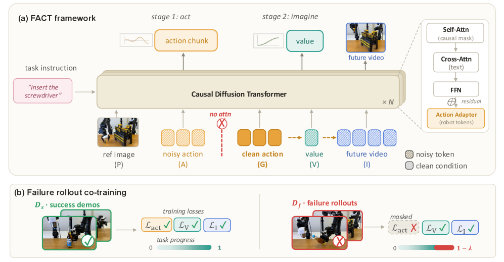
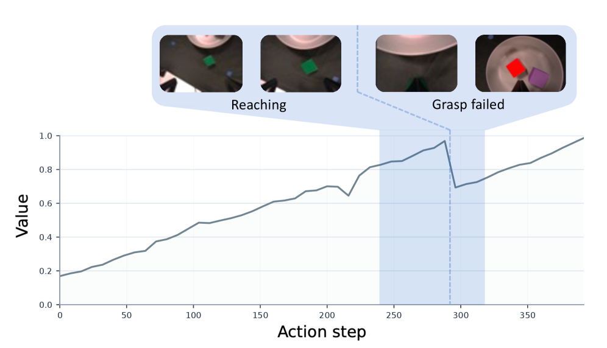
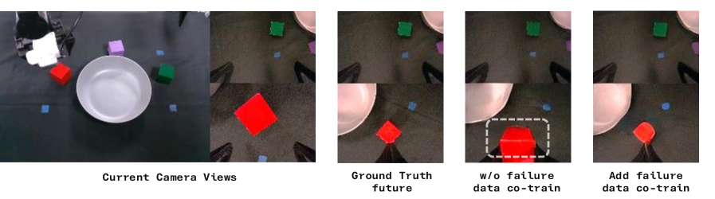
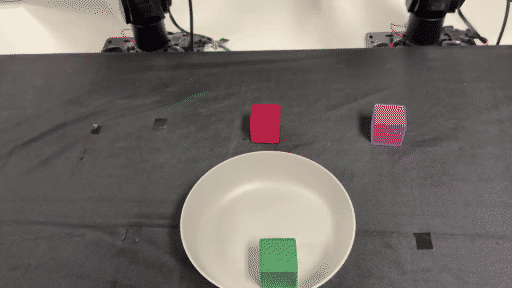
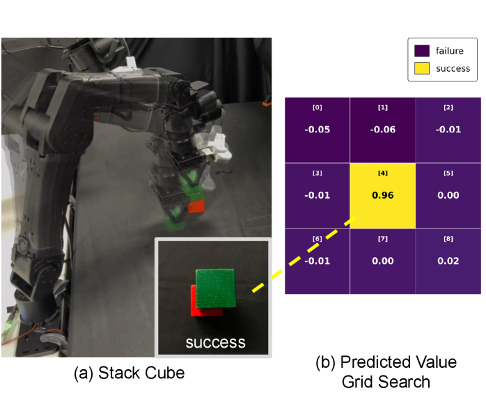

UCSD가 낸 [FACT](https://arxiv.org/abs/2608.10232)를 정리했어요. 미래 영상 예측을 함께 학습하는 월드-액션 모델인데, 이 논문이 다루는 건 예측 품질이 아니라 실패한 롤아웃을 어디에 넣을 것인가예요. [[2026-07-23_미래_영상은_훈련에서만_그려요|미래 영상 생성을 감독 신호로만 쓰는 World Action Model, GigaWorld-Policy]]가 미래 예측을 훈련 쪽으로 밀어 넣어 추론 비용을 없앤 이야기였다면, 이 논문은 그 미래 예측이 무엇을 조건으로 삼아야 하는지를 뒤집어요.

## 성공만 본 월드모델은 나쁜 행동의 결과를 몰라요

월드-액션 모델은 지금 두 갈래로 나뉘어요. 하나는 미래 영상을 먼저 상상하고 역동역학 모델로 행동을 되뽑는 비디오 우선 방식이에요. 강한 물리 사전지식을 얻지만 행동 디코딩이 2단계 네트워크에 묶이고, 제어를 시작하기 전에 미래 영상을 끝까지 디노이징해야 하는 경우가 많아요. 다른 하나는 예측한 미래 프레임이나 잠재를 행동 예측의 조건으로 쓰는 방식이에요.

두 방식 모두 학습 데이터가 전문가 시연이에요. 모델은 좋은 행동에 짝지어진 그럴듯한 미래만 보고, 나쁜 행동이 무엇을 부르는지는 한 번도 안 봐요. 그래서 테스트 때 잘못된 행동이 들어와도 여전히 성공 쪽으로 기운 미래를 그려요. 논문은 이걸 성공 편향 환각이라고 불러요.

실패 롤아웃을 그냥 학습 데이터에 섞으면 될 것 같지만 그럴 수 없어요. 행동 모방 손실이 그대로 걸려 있으면 실패한 행동을 따라 하도록 배우니까요. 그래서 논문이 세운 질문은 이거예요. 실패한 행동을 모방 대상으로 삼지 않으면서, 그 결과만 감독 신호로 쓸 수 있을까요.

## 행동을 먼저 만들고, 그 행동을 조건으로 미래를 그려요

FACT의 답은 인과 순서를 뒤집는 거예요. 먼저 행동을 제안하고, **실제로 실행된 그 행동을 조건으로** 미래 영상과 과제 진행도를 예측해요. 미래가 자기를 만든 행동에서 뻗어 나오니, 실패 롤아웃은 자기 자신의 나쁜 행동 아래에서 미래 예측 가지를 직접 감독하게 돼요.

구현은 토큰 순서와 어텐션 마스크로 이뤄져요. 하나의 인과 확산 트랜스포머가 관측 프리픽스 P, 잡음이 낀 예측 행동 A, 교사강요된 깨끗한 정답 행동 G, 진행도 값 V, 미래 영상 I 순으로 토큰을 늘어놓고 함께 디노이징해요. 여기서 핵심은 월드 쪽 예측인 V와 I가 A가 아니라 G를 참조하고, A는 G를 볼 수 없다는 제약이에요. 미래 예측이 행동 생성을 날카롭게 만들되 정답이 새지 않게 막는 장치예요.

<figure class="fig"><figcaption>왼쪽은 토큰 배치와 참조 관계, 오른쪽은 성공 시연과 실패 롤아웃의 손실 구성이에요 (출처: Peng et al., FACT · CC BY-NC-ND 4.0)</figcaption></figure>

이 분리 덕분에 손실을 데이터 종류별로 다르게 걸 수 있어요. 성공 시연은 행동·진행도·미래 셋 다 감독하고, 실패 롤아웃은 행동 모방 손실만 떼어낸 채 진행도와 미래 영상 감독은 그대로 살려요. 실패가 행동이 아니라 결과를 가르치는 구조예요.

추론은 두 단계로 돌아요. 1단계에서 프리픽스와 잡음 행동만으로 행동 청크를 디노이징하고, 행동만 필요하면 여기서 멈춰 월드 예측을 건너뛰어요. 결과 예측이나 후보 스코어링이 필요할 때만 2단계에서 그 깨끗한 행동을 조건 슬롯에 넣고 진행도와 미래 잠재를 디노이징해요.

진행도는 에피소드 길이가 달라도 비교되도록 0에서 1 사이로 정규화한 값이에요. 실험에서는 균등 보상을 써서 길이 T인 에피소드의 시각 t에서 t/T가 돼요. 실패 구간에 들어간 행동에는 여기서 일정량을 빼 더 낮은 목표를 줘요.

이렇게 학습한 값 헤드(value head)는 행동의 질에 민감해져요. Pick Cubes 롤아웃 하나를 보면 값이 과제 진행에 따라 오르다가 잡기에 실패하는 지점에서 떨어지고, 정책이 자세를 고쳐 다시 잡으면 회복해요. 값은 실행된 행동을 조건으로 계산되니, 그 행동이 나쁜 결과를 부르면 한참 뒤 시점에서도 값이 내려가요.

<figure class="fig"><figcaption>잡기에 실패하는 지점에서 예측 진행도가 떨어지고 재파지 후 회복해요 (출처: Peng et al., FACT · CC BY-NC-ND 4.0)</figcaption></figure>

## 실패 데이터가 성공 편향 환각을 줄여요

논문이 이 설계의 효과를 재는 방식이 깔끔해요. 성공만으로 학습한 체크포인트와 실패 롤아웃을 함께 학습한 체크포인트에 똑같이 나쁜 행동을 조건으로 주고, 각자가 그린 미래를 실제 일어난 일과 비교해요.

<figure class="fig"><figcaption>성공만 학습한 모델은 성공한 파지를 그려 내고(흰 점선), 실패를 함께 학습한 모델은 실제로 일어난 실패를 예측해요 (출처: Peng et al., FACT · CC BY-NC-ND 4.0)</figcaption></figure>

512개 홀드아웃 샘플을 성공과 실패 절반씩으로 나눠 잰 미래 예측 화질이에요.

| 대상 | 성공만 학습 | 실패 포함 학습 |
|---|---|---|
| 전체 | 22.82 dB | 26.00 dB |
| 성공 롤아웃 | 26.12 dB | 26.08 dB |
| 실패 롤아웃 | 19.51 dB | 25.92 dB |

읽을 점은 성공 롤아웃 칸이 26.12에서 26.08로 사실상 그대로라는 거예요. 실패 데이터를 넣어 얻은 6.4 dB는 실패 상황에서만 나왔고 정상 예측 품질을 깎아 얻은 게 아니에요. SSIM으로 봐도 같은 방향이라 실패 롤아웃이 0.7461에서 0.8290으로 오르고 성공 롤아웃은 0.8285와 0.8286으로 붙어 있어요.

## 실기에서는 하드웨어 구성이 먼저 보여요

실기 평가는 YAM 로봇 팔 두 대로 하는 양팔 조작이에요. 메인 시야에 인텔 리얼센스 D435 한 대, 양쪽 손목에 D405 두 대를 달고, 시연은 GELLO 원격조작 장치로 모아요. 세 카메라 스트림은 하나의 영상 캔버스로 묶어 넣어요. 정책이 보는 관측은 그대로 두면서 입력만 공유 비디오 백본이 받는 형식에 맞추려고요. 학습을 빠르게 하려고 뷰별 VAE 잠재는 미리 계산해 둬요.

<figure class="fig"><figcaption>Pick Cubes 자율 롤아웃 — 빨강·초록·보라 큐브를 하나씩 회색 접시에 옮겨요 (원본 17.5초 중 앞 12초) (출처: Peng et al., FACT)</figcaption></figure>

큐브 과제는 전문가 시연 200개, 나머지 과제는 50개를 쓰고, 큐브 과제마다 실패 롤아웃을 30개 안팎 모아 함께 학습해요. 각 칸은 20회 시행 평균이에요.

| 구성 | 시뮬 평균 | 실기 학습 | 실기 미학습 |
|---|---|---|---|
| π0.5 | 79.8% | 88% | 85% |
| Motus | 87.8% | 64% | 62% |
| FACT 예측 없음 | 81.8% | 58% | — |
| FACT 성공만 | 85.6% | 82% | 67% |
| FACT +실패 | 87.5% | 89% | 77% |
| FACT +실패+점수 | — | 92% | 82% |

시뮬레이션은 RoboTwin 50개 과제에 실패 롤아웃 1.3K개 안팎을 더해 학습했어요. 미래 예측을 빼면 81.8%로 떨어지니 미래 예측 자체가 행동 생성의 정칙화로 작동하고 있고, 실기에서는 그 낙폭이 82%에서 58%로 훨씬 커요.

절제 실험 두 개가 설계의 두 축을 각각 짚어요. 깨끗한 정답 행동 조건 G를 없애고 행동·값·미래를 함께 디노이징하면 실기 성공률이 82%에서 77%로 내려가요. 반대로 실패 롤아웃을 넣되 행동 모방 손실을 마스킹하지 않으면 63%까지 떨어져요. 실패한 행동은 결과를 가르쳐야지 행동을 가르치면 안 된다는 게 숫자로 나온 자리예요.

## 스코어링은 결과를 배운 뒤에야 쓸모가 있어요

값 헤드가 생겼으니 행동 후보를 여러 개 뽑아 점수로 고를 수 있어요. 1단계에서 N개를 병렬로 샘플링하고 2단계에서 각각의 진행도를 예측해 가장 높은 걸 실행해요. 프리픽스가 후보 사이에 공유되니 키-값 캐시를 재사용하고요.

여기서 이 논문이 가장 분명하게 말하는 게 있어요. 실패 결과를 배우지 않은 모델에 스코어링만 얹으면 79%로, 스코어링 없는 89%보다 낮아요. 성공만으로 학습한 값 예측은 전문가 행동 다양체 위에서만 보정돼 나쁜 후보에도 낙관적인 점수를 주기 때문이에요. 순위를 매기는 장치가 아니라 무엇으로 순위를 배웠는지가 결정적이에요.

<figure class="fig"><figcaption>같은 상태에서 3×3 격자로 배치 후보를 바꿔 점수를 매긴 결과 — 유일하게 성공하는 가운데 배치가 가장 높아요 (출처: Peng et al., FACT · CC BY-NC-ND 4.0)</figcaption></figure>

후보 수는 N이 1에서 4로 갈 때 완료도가 뚜렷이 오르고 그 뒤로는 늘어난 지연 대비 이득이 작아져서, 실기에서는 4를 써요.

## 배포에서는 지연이 같이 걸려요

이 설계가 실제 배포에서 어떤 자리인지는 지연 시간과 같이 봐야 해요. RTX PRO 6000에서 잰 값이에요.

| 모델 | 배포 지연 | 시뮬 | 실기 학습 |
|---|---|---|---|
| π0 | 45 ms | 62.2% | 48% |
| π0.5 | 47 ms | 79.8% | 88% |
| Cosmos | 620 ms | — | 25% |
| Motus | 1220 ms | 87.8% | 64% |
| FACT +실패 | 380 ms | 87.5% | 89% |

시뮬레이션 평균만 보면 Motus가 87.8%로 가장 높고 FACT가 87.5%로 근소하게 뒤지지만, 지연은 1220 ms 대 380 ms로 3배 넘게 벌어져요. 비디오 우선 방식이 미래를 먼저 만들어야 하는 구조적 비용을 그대로 무는 자리예요. FACT는 행동만 필요하면 1단계에서 끊을 수 있으니 그 비용을 선택 사항으로 돌렸어요.

## 남는 것

이 논문에서 가져갈 건 실패 데이터를 쓰는 방법 자체보다, 쓸 수 있게 만드는 조건이에요. 실패를 넣을 자리를 만들려면 미래 예측이 행동을 조건으로 삼아야 하고, 그러려면 미래를 먼저 그리던 순서를 뒤집어야 해요. 순서를 바꾸지 않은 채 실패 데이터만 늘리면 63%짜리 결과가 나와요.

남는 질문도 분명해요. 실패 데이터 스케일링은 RoboTwin 세 과제에서만 쟀고, 실패 롤아웃 비율을 0%, 50%, 100%로 올릴 때 평균 성공률이 32.7%에서 57.3%로 올라요. 다만 100% 지점에서 실패 데이터가 학습 세트의 45% 안팎을 차지해요. 실패가 절반 가까이 되는 배합이 과제를 넓혔을 때도 유지되는 값인지는 이 세 과제로는 알 수 없는데, 논문의 한계 절도 이 물음은 다루지 않아요. 거기서 짚는 건 더 넓은 데이터로의 확장, 값 헤드 교체 가능성, 그리고 best-of-N의 계산 비용 셋이에요.

값 헤드를 실패로 학습시켜야 쓸모가 생긴다는 대목은 다른 자리에서도 반복돼요. [[2026-08-14_보이는지부터_말해줘요|얼린 손 포즈 백본에 헤드만 얹은 Hand Visibility Detector]]는 관측 쪽에서 같은 일을 해요. 좌표를 하나 더 내놓는 게 아니라 그 좌표를 믿어도 되는지를 관절별로 말하게 만드는데, 거기서도 결정적인 건 출력 개수가 아니라 그 출력을 무엇으로 학습시켰느냐예요.

후보 스코어링도 계산을 신뢰성과 맞바꾸는 선택으로 남아 있어요. 논문 스스로 지연이 중요하면 행동 전용 모드로 돌리라고 적어 뒀고, 실기 92%는 후보 배치마다 추가 채점 패스를 도는 대가로 얻은 숫자예요. 저자들이 결론에서 온라인 롤아웃과 DAgger식 교정, 부정 경험 기반 강화학습을 다음 자리로 지목한 것도 같은 맥락으로 읽혀요. 실패를 결과로 읽는 인터페이스가 생기면 실패를 계속 만들어 내는 학습 방식과 이어붙일 수 있으니까요.

---

<!-- src-block -->
출처 — https://arxiv.org/abs/2608.10232
