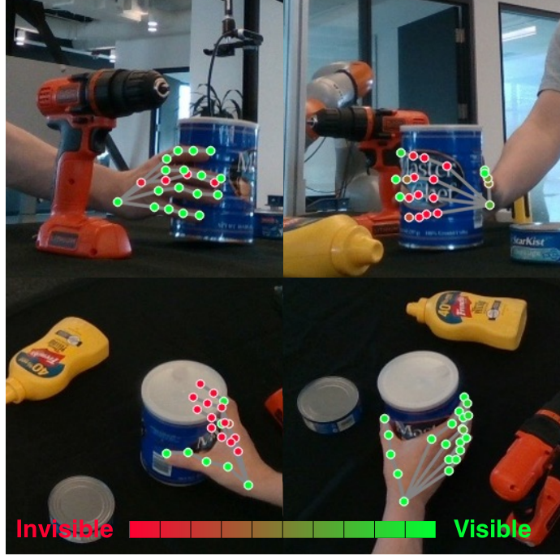
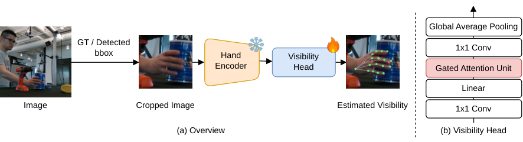
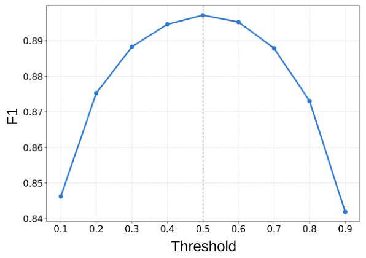
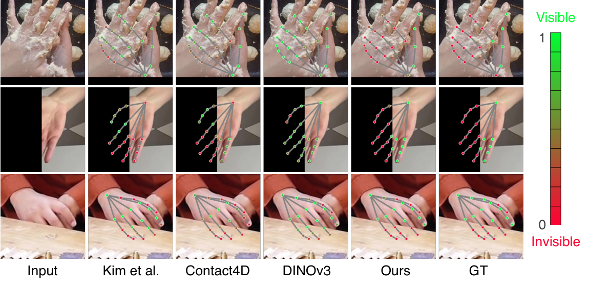
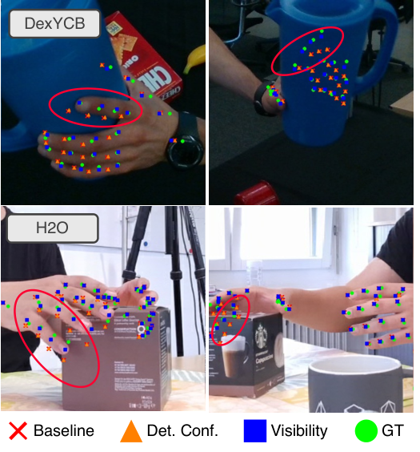

OMRON SINIC X와 도쿄대·게이오대·AIST가 함께 낸 [Hand Visibility Detector](https://arxiv.org/abs/2608.11574)를 정리했어요. 손 관절 하나하나가 이미지에서 실제로 보이는지를 재는 모델인데, 이 논문의 무게중심은 모델 자체보다 **가시성을 독립 과제로 떼어 놓고 처음으로 제대로 재 봤다**는 데 있어요.

## 관절 위치는 늘 나오지만 근거는 안 나와요

손 포즈 추정은 최근 몇 년 사이 크게 올라왔어요. 비전 트랜스포머와 데이터 규모 확장 덕분에 HaMeR나 WiLoR 같은 모델이 야외에서 찍은 단안 이미지에서도 21개 관절을 꽤 정확히 뽑아요.

문제는 이 모델들이 관절 위치를 항상 내놓는다는 데 있어요. 손등에 가려진 관절도, 물체 뒤로 들어간 관절도, 아예 화면 밖으로 나간 관절도 좌표가 나와요. 그 좌표가 실제로 관측된 것인지 구조에서 추론된 것인지는 출력만 봐서는 구분되지 않아요. AR·VR이나 로봇처럼 그 값을 믿고 다음 동작을 결정해야 하는 자리에서는 이 구분이 곧 신뢰도예요.

<figure class="fig"><figcaption>관절별 가시성을 0에서 1 사이 신뢰도로 내놓아요 — 초록이 보이는 관절, 빨강이 가려진 관절이에요 (출처: Hara et al., Hand Visibility Detector · CC BY-SA 4.0)</figcaption></figure>

가림이나 가시성을 다루는 연구가 없던 건 아니에요. 다만 대부분 포즈 추정 정확도를 올리기 위한 보조 신호로 썼어요. 그러면 가시성 추정 자체가 얼마나 맞는지는 직접 평가되지 않고 다운스트림 포즈 정확도로만 간접 확인돼요. 게다가 그런 방법들은 통제된 환경에서 찍은 데이터로 학습돼서 다양한 가림 조건으로 일반화되는지도 검증된 적이 없어요.

## 가려진 관절을 판정하려면 손 전체를 봐야 해요

설계 근거가 이 지점에서 나와요. 가려진 관절은 그 위치에 시각적 증거가 아예 없어요. 그러니 보이는지 아닌지를 판정하려면 그 지점이 아니라 손 전체 구조를 봐야 해요. 보이는 손가락들과의 공간 관계, 앞을 가로막을 만한 물체와의 배치 같은 것들이요.

논문은 그 구조 사전지식을 새로 배우는 대신 이미 가진 모델에서 가져와요. HaMeR와 WiLoR는 가림을 포함한 온갖 조건의 손 이미지 수백만 장에서 3D 포즈를 복원하도록 학습됐으니, 가려진 관절을 추론하는 데 필요한 사전지식을 이미 갖췄다고 보는 거예요. 그래서 그 ViT 백본을 사전학습 값 그대로 얼려 쓰고, 위에 가벼운 가시성 헤드만 얹어 학습해요.

<figure class="fig"><figcaption>왼쪽이 전체 파이프라인, 오른쪽이 가시성 헤드 구조예요 — 얼린 백본에서 특징을 뽑고 헤드만 학습해요 (출처: Hara et al., Hand Visibility Detector · CC BY-SA 4.0)</figcaption></figure>

헤드는 RTMPose의 헤드 설계를 따라요. 1×1 합성곱으로 특징 맵을 압축하고 토큰 열로 편 뒤, 게이트 어텐션 유닛으로 공간 위치들 사이의 전역 의존을 모델링하고, 다시 1×1 합성곱으로 21개 채널에 투영해 시그모이드를 통과시켜요. 학습은 관절별 이진 교차 엔트로피 하나예요.

라벨 정의에서 눈여겨볼 게 하나 있어요. 화면 밖으로 나간 관절도 보이지 않음으로 처리해요. 그러니까 이 논문에서 가시성은 가려지지도 않고 화면을 벗어나지도 않았다는 뜻이에요. 학습 데이터는 HInt로, 웹 이미지와 1인칭 영상 프레임이 섞인 야외 데이터에 사람이 직접 관절별 가시성을 붙인 데이터셋이에요. 학습에 25,273 프레임, 평가에 5,374 프레임을 써요.

학습 비용이 눈에 띄게 작아요. 학습하는 파라미터가 0.83M으로 631M 모델의 0.131%에 불과하고, 100 에폭을 H200 한 장에서 2.5시간 안팎에 돌려요. GPU 메모리도 10GB 정도면 돼요.

## 파인튜닝이 오히려 표현을 망가뜨려요

기존 방법과의 비교부터 보면 이래요. 셋 다 같은 HInt에서 세 시드로 돌린 값이에요.

| 방법 | mAP | F1 |
|---|---|---|
| Kim et al. | 0.895 | 0.858 |
| Contact4D | 0.897 | 0.860 |
| Hand Visibility Detector | 0.931 | 0.896 |

mAP로 3.4 포인트 차이인데, 두 기준선이 모두 ImageNet-1k에서 사전학습한 CNN 특징을 쓴다는 게 차이의 출처예요. 이걸 백본 절제 실험이 더 분명하게 보여줘요.

| 백본 | 크기 | mAP | F1 |
|---|---|---|---|
| CSPNeXt-X | 48M | 0.800 | 0.799 |
| ResNet-152 | 58M | 0.796 | 0.797 |
| ViT-H | 633M | 0.838 | 0.819 |
| DINOv3 | 840M | 0.897 | 0.866 |
| HaMeR | 631M | 0.932 | 0.896 |
| WiLoR | 631M | 0.931 | 0.896 |
| WiLoR 파인튜닝 | 631M | 0.622 | 0.704 |

두 가지가 읽혀요. 하나는 최근 범용 이미지 모델 중 가장 강한 DINOv3가 840M 파라미터로도 631M짜리 손 특화 모델에 못 미친다는 거예요. 규모가 아니라 무엇을 보고 배웠는지가 이 과제를 가른다는 뜻이에요.

다른 하나가 더 인상적이에요. WiLoR 백본을 가시성 추정에 맞춰 파인튜닝하면 mAP가 0.931에서 0.622로 떨어져요. 기준선 어느 쪽보다도 낮은 값이에요. 과제에 맞춰 미세조정하는 게 사전학습에서 얻은 특징 표현을 망가뜨린다는 신호인데, 백본을 얼린다는 설계 선택이 여기서 근거를 얻어요. 가시성 라벨이 붙은 데이터가 상대적으로 작다 보니 백본까지 열면 그 작은 데이터에 과적합되는 구조예요.

헤드 쪽 절제도 같이 보면, 게이트 어텐션 유닛을 빼면 0.931에서 0.887로 내려가고 Kim et al.의 선형 헤드로 바꿔도 0.905에 그쳐요. 공간 위치들 사이의 전역 의존을 모델링하는 부분이 실제로 일을 하고 있어요.

## 임계값을 어디에 두든 크게 흔들리지 않아요

확률 출력을 쓰는 모델은 임계값을 어디에 두느냐가 실무에서 늘 문제예요. 이 논문은 0.1에서 0.9까지 훑어 F1을 그렸는데, 0.5 근처에서 정점이고 0.3에서 0.7 사이 넓은 구간에서 0.88 위를 유지해요.

<figure class="fig"><figcaption>임계값 0.5 부근에서 정점이고 넓은 구간에서 완만해요 (출처: Hara et al., Hand Visibility Detector · CC BY-SA 4.0)</figcaption></figure>

정성 결과도 세 가지 가림 유형을 나눠 보여줘요. 손이 스스로를 가리는 경우, 화면 밖으로 잘린 경우, 물체에 가려진 경우예요.

<figure class="fig"><figcaption>위에서부터 자기 가림, 화면 잘림, 물체에 의한 가림이에요 — 관절 위치는 정답값이고 색만 예측이에요 (출처: Hara et al., Hand Visibility Detector · CC BY-SA 4.0)</figcaption></figure>

## 3D 주석 파이프라인의 가중치로 꽂혀요

가시성이 그래서 어디에 쓰이냐는 물음에 논문이 고른 답은 3D 손 주석이에요. [[2026-08-03_많을수록_로봇에서_멀어요|임바디드 조작 데이터의 다섯 계층과 층별 한계]]에서 에고센트릭 층이 규모는 자릿수가 다르지만 로봇에서 멀다고 했던 그 층의 주석 품질을 다루는 자리예요. 여러 각도에서 찍은 2D 키포인트를 삼각측량해 3D 좌표를 만드는 방식은 광학 마커나 장갑형 모션캡처와 달리 손 모습을 그대로 두면서 주석을 얻을 수 있어 널리 쓰여요. 대신 정확도가 각 뷰의 2D 추정 정확도에 그대로 묶여요.

여기서 기존 파이프라인의 빈틈이 보여요. 표준 삼각측량은 모든 뷰를 동등하게 다루고, RANSAC으로 이상치를 걷어내도 남은 저신뢰 점들은 그대로 쓰여요. Contact4D는 손 검출기의 검출 신뢰도로 가중을 주는데, 이 값은 뷰 하나에 하나라 그 뷰 안에서 어떤 관절은 잘 보이고 어떤 관절은 물체에 가려진 상황을 구분하지 못해요.

그래서 논문은 DLT로 삼각측량하면서 세 가중 방식을 비교해요. 가중 없음, 뷰 단위 검출 신뢰도 가중, 그리고 관절별 가시성 가중이에요. 평가는 재투영 오차로 하고 데이터셋 세 개를 써요. DexYCB가 12,902 프레임에 8뷰, HO3D가 4,854 프레임에 2뷰 또는 5뷰, H2O가 23,391 프레임에 4뷰예요.

<figure class="fig"><figcaption>삼각측량한 3D 관절을 각 뷰에 되쏜 결과예요 — 빨간 원이 가시성 가중으로 가장 크게 개선된 자리예요 (출처: Hara et al., Hand Visibility Detector · CC BY-SA 4.0)</figcaption></figure>

관절별 가시성 가중이 세 데이터셋 모두에서 중앙값·평균·사분위 범위를 낮췄고, 개선 폭이 가장 큰 건 HO3D의 평균 재투영 오차 10.1% 감소예요. 논문은 그 이유로 HO3D가 뷰 수가 적고 물체에 의한 가림이 심하다는 점을 들어요. 뷰가 많을 때는 나쁜 뷰 하나가 평균에 묻히지만 2뷰나 5뷰에서는 그럴 여유가 없다는 뜻으로 읽히는데, 이 해석까지 논문이 적어 두지는 않았어요.

## 남는 것

이 논문이 실제로 한 일은 새 모델을 만든 것보다 평가되지 않던 것을 평가한 쪽에 가까워요. 가시성은 그동안 포즈 정확도라는 최종 지표 뒤에 숨어 있었고, 그래서 얼마나 맞는지도 어디서 무너지는지도 알 수 없었어요. 독립 과제로 떼어 재기 시작하니 백본 선택이 규모가 아니라 도메인에 걸린다는 것, 파인튜닝이 오히려 해가 된다는 것 같은 사실이 바로 드러나요.

같은 결이 [[2026-08-14_나쁜_행동의_결과를_배워요|실패 롤아웃을 결과 감독으로 바꾼 행동 조건부 월드-액션 모델 FACT]]에도 있어요. 그쪽은 행동의 결과를 진행도 값으로 점수화해 모델이 자기 출력의 질을 말하게 만들고, 이쪽은 관측의 신뢰도를 관절별로 말하게 만들어요. 둘 다 출력을 하나 더 내놓는 게 아니라 그 출력을 무엇으로 학습시켰느냐가 쓸모를 가르는 구조고요.

한계는 논문이 직접 적어 뒀어요. 지금은 이미지 한 장 단위라 영상에서 시간적으로 일관된 가시성을 내놓지 못해요. 손이 잠깐 가려졌다 나오는 구간에서 판정이 프레임마다 튀는 문제는 남아 있어요.

여기에 하나 더 짚을 게 있어요. 이 방법의 성능은 HInt의 수동 라벨 품질에 묶여 있어요. 논문 자신이 기존 방법을 비판한 근거가 COCO-WholeBody의 손 가시성 라벨이 부정확하거나 빠진 경우가 많다는 관찰이었으니, 라벨 출처를 바꾼 게 개선의 상당 부분일 수 있어요. 백본 절제 실험이 같은 데이터 위에서 돌아 그 안에서는 비교가 성립하지만, 기준선과의 3.4 포인트 차이에서 사전지식 몫과 라벨 몫이 각각 얼마인지는 이 실험 구성으로는 갈라지지 않아요.

---

<!-- src-block -->
출처 — https://arxiv.org/abs/2608.11574
