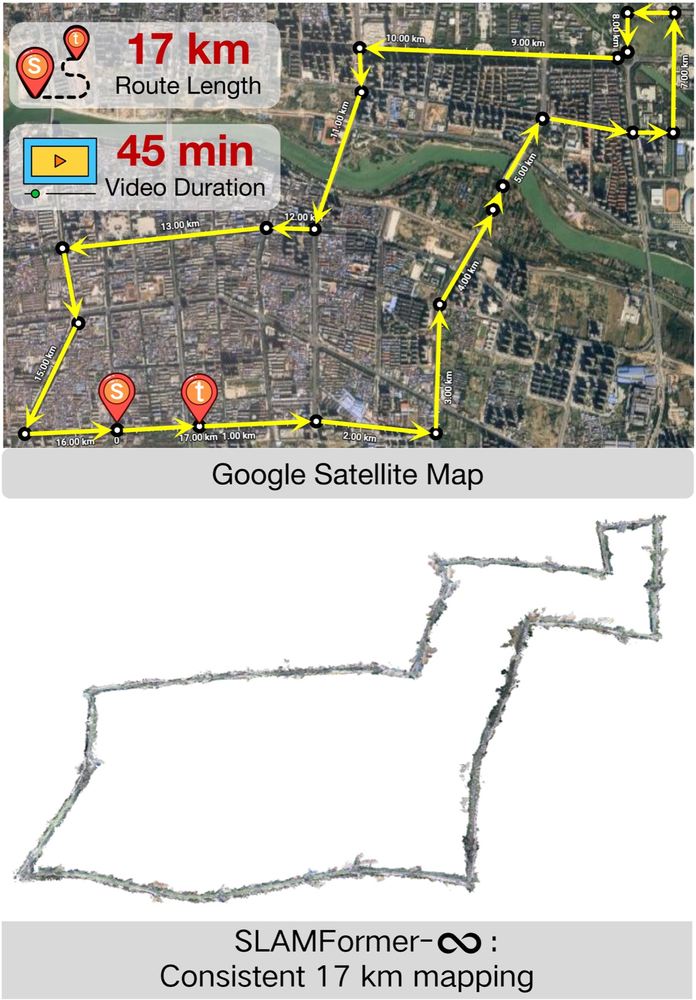
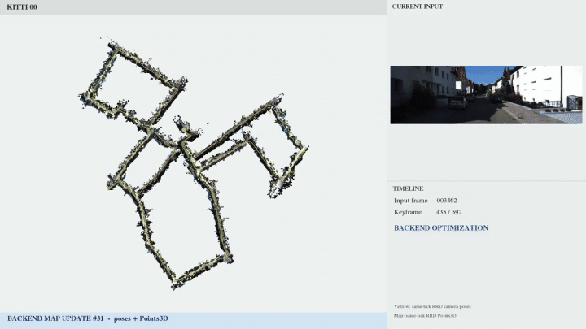

칭화대 IIIS(MARS Lab)가 낸 [SLAMFormer-∞](https://arxiv.org/abs/2608.03429)를 정리했어요. RGB 카메라 하나로 궤적과 밀집 지도를 함께 뽑는 단안 SLAM인데, 이 논문이 겨누는 건 정확도 순위표가 아니라 거리의 상한이에요. 기하 트랜스포머 기반 SLAM이 왜 몇 킬로미터에서 무너지는지를 좌표 정식화의 문제로 진단하고, 17km 자체 수집 주행까지 일관된 지도를 유지하는 걸 보여요. [프로젝트 페이지](https://tsinghua-mars-lab.github.io/SLAMFormer-Infinity/)에 시퀀스별 데모가 있어요.

## 기하 트랜스포머 SLAM이 막히는 두 방식

DUSt3R에서 VGGT로 이어진 기하 파운데이션 모델은 여러 장의 이미지를 넣으면 카메라 포즈와 포인트맵을 순전파 한 번에 회귀해요. 다만 모든 뷰가 유한한 어텐션 컨텍스트에 들어가야 하고 좌표계가 첫 프레임에 묶여 있어서, 시퀀스가 길어지면 정식화 자체가 깨져요. 실제로 KITTI 전체 시퀀스를 통째로 넣으면 VGGT, Fast3R, CUT3R 모두 단일 RTX 4090에서 메모리 초과로 기록돼요.

우회로는 두 갈래였어요. VGGT-Long은 시퀀스를 청크로 잘라 각각 재구성한 뒤 포즈만 전역 정렬해요. 고전 파이프라인에서 백엔드가 포즈 그래프 최적화로 카메라 포즈만 고치고 지도는 고친 포즈에 다시 투영하는 관행과 같은 구조라서, 궤적은 맞아도 국소 기하가 다듬어지지 않은 채 이어 붙어요. 반대편의 SLAM-Former는 프론트엔드와 백엔드를 트랜스포머 하나에 다 넣었지만, 전역 좌표를 통째로 학습하니 장거리 성능이 학습 궤적 분포에 묶여요. 짧은 시퀀스로 배운 모델은 긴 시퀀스를 모르는 거예요.

## 좌표 기준을 데이터가 아니라 조건으로 줘요

SLAMFormer-∞의 답은 좌표계를 모델 밖으로 빼는 거예요. 이웃 키프레임의 이미지와 포즈를 메모리 조건으로 함께 입력해서, 그 조건이 현재 프레임 예측의 기준 좌표계와 스케일을 정의하게 해요. 첫 프레임이 아니라 조건이 앵커가 되니, 모델은 늘 유계인 국소 컨텍스트만 보면서도 예측이 전역 좌표로 이어 붙어요. 프론트엔드는 이전 처리에서 쌓인 KV 캐시의 도움으로 국소 계산을 유지한 채 새 키프레임을 추적해요.

<figure class="fig"><figcaption>자체 수집한 17km·45분 도시 주행이에요. 위가 위성 지도의 실제 경로, 아래가 SLAMFormer-∞의 재구성인데, 같은 주행에서 VGGT-Long의 지도는 무너져요 (출처: Fang et al., SLAMFormer-∞ 프로젝트 페이지)</figcaption></figure>

## 백엔드가 포즈와 기하를 같은 반복에서 고쳐요

이 좌표 설계 위에 올린 백엔드가 포즈-기하 그래프 최적화(PGGO)예요. 그래프의 노드가 포즈만이 아니라 포즈와 포인트맵의 쌍이고, 포즈 사이는 상대 포즈 제약으로 명시적으로 잇되 기하 사이의 상관은 트랜스포머 어텐션이 암묵적으로 처리해요. 최적화는 반복 신경 정제로 풀어요. 조건을 받은 트랜스포머가 각 노드의 포즈와 포인트맵을 다시 예측하고, 포인트맵은 그대로 갱신하되 포즈는 감쇠 계수를 둔 보간으로 천천히 옮겨요. 루프가 검출되거나 시퀀스가 끝나면 이 반복을 전역에 돌려요.

**프론트엔드 추적, 국소 정제, 전역 PGGO가 전부 같은 가중치의 트랜스포머 하나로 돌아간다**는 게 구조의 요점이에요. 학습도 어텐션 마스크와 조건 패턴만 다른 네 가지 모드로 같은 모델을 훈련해요. 실내 변형은 12프레임 클립을 긴 변 518로, 실외 변형은 36프레임 클립을 긴 변 224로 학습했고, 둘 다 48장의 A100에서 10 에폭이에요.

<figure class="fig"><figcaption>KITTI 00 시퀀스의 온라인 재구성이에요. 왼쪽 지도가 쌓이는 동안 백엔드 최적화가 주기적으로 돌며 포즈와 포인트맵을 함께 갱신해요. 원본 데모 영상에서 일부 구간만 잘라 담았어요 (출처: Fang et al., SLAMFormer-∞ 프로젝트 페이지)</figcaption></figure>

## 실외에서 이기고 실내에서는 자리를 알아요

실외 수치는 방향이 일관돼요. KITTI 오도메트리 전체 시퀀스 평균 ATE RMSE가 VGGT-Long의 26.358m에서 23.011m로 줄고, 고속 주행이라 예외적인 Seq. 01을 빼면 19.298m 대 15.653m로 격차가 더 벌어져요. Waymo 도심 세그먼트 평균도 1.996m에서 1.813m로 줄어요. 더 눈에 띄는 건 재구성이에요. LiDAR 대비 포인트맵 정확도가 1.182에서 0.949로, 완전성이 2.860에서 2.777로, Chamfer 거리가 2.021에서 1.863으로 좋아져요. 포즈만 정렬하는 백엔드로는 안 움직이던 항목이 함께 최적화하니 움직인 거예요. 이 모든 평가를 카메라 내부 파라미터 없이, 캘리브레이션 없는 조건으로 했다는 점도 실무에선 의미가 있어요.

실내는 정직하게 적혀 있어요. 7-Scenes에서 VGGT-SLAM 대비 ATE 0.068m에서 0.046m, 재구성 0.054/0.060/0.057에서 0.029/0.049/0.039로 앞서지만, 실내 전체 최강은 여전히 SLAM-Former예요(TUM에서 0.039 대 본인 0.066). 저자들 스스로 짧은 분포 내 시퀀스에서는 끝까지 학습으로 푸는 모델이 유리하고, 이 논문의 선택은 무한 시퀀스 쪽 전역 최적화라고 선을 그어요.

## 남는 것

한계도 좌표 설계의 대가예요. SLAM-Former는 프레임 연결을 암묵적으로 배우지만 PGGO는 프론트엔드와 루프 검출이 만들어 준 그래프를 입력으로 받아요. 그래프 연결성의 품질이 성능을 좌우하는데 그 부분은 데이터에서 배우지 않아요. 루프 검출이 실패하는 지형이라면 전역 백엔드가 돌 계기 자체가 사라지는 셈이라, 고전 SLAM이 물던 약점 하나는 그대로 남아 있어요.

국소 계산은 싸게 유지하고 전역 일관성은 별도 단계가 책임지는 분해라는 점에서 [[2026-07-27_짧게_걷고_한_번에_풀어요|몬테카를로 국소 추정과 결정론적 전역 해를 결합한 경로 솔버 WoDS]]와 같은 꼴이에요. 그리고 컨텍스트 창 밖의 정보를 조건이라는 형태로 되먹여 상한을 지우는 수법은, 빠른 가중치에 과거를 눌러 담던 [[2026-07-16_5분을_기억하는_로봇|TTT 레이어의 빠른 가중치로 8K 스텝 컨텍스트를 얻은 RoboTTT]]와 문제의식이 겹쳐요. 트랜스포머의 유한한 창을 로봇의 무한한 시간축에 잇는 장치들이 정책과 SLAM 양쪽에서 같은 시기에 나오고 있어요.

---

<!-- src-block -->
출처 — [SLAMFormer-∞: Infinite SLAM Transformer for Unbounded Frontend and Backend Processing](https://arxiv.org/abs/2608.03429) · arXiv 비독점 배포 라이선스 · 그림·영상은 본문 논평 맥락에서 최소한으로 인용했으며 저작권은 원저자에게 있어요.
