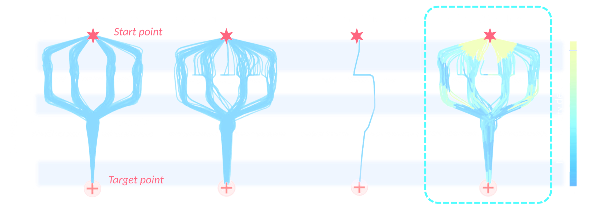
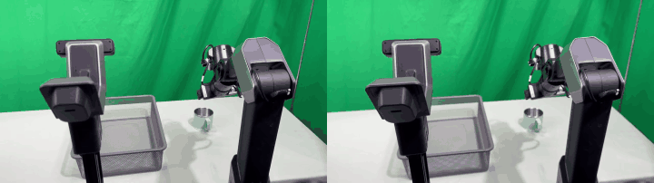

난양공대(NTU) MARS Lab이 낸 [MARS Policy](https://arxiv.org/abs/2605.29766)를 정리했어요. 모방학습 정책 설계에서 오래된 양자택일이 있어요. 디퓨전·플로 매칭 같은 생성 정책은 여러 갈래의 시연을 다 담지만 느리고, 회귀 정책은 빠르지만 갈래를 평균 내 버려요. 이 논문은 그 양자택일 자체를 거부해요. 멀티모달리티가 필요한 구간은 과제의 일부뿐이니, 그 구간에서만 켜자는 거예요. [프로젝트 페이지](https://jingliangli.com/MARS_Policy/)에 데모와 그림이 잘 정리돼 있어요.

## 표현력과 속도를 왜 맞바꿔 왔나요

플로 매칭 정책은 가우시안 노이즈에서 출발해 학습된 속도장을 따라 행동을 적분해 만들어요. 고품질 행동을 얻으려면 통상 9스텝 이상의 ODE 적분이 필요해서, 매 추론마다 그 비용을 물어요. 반대편의 A2A 같은 결정론적 정책은 직전 행동 이력을 출발점으로 삼아 한 스텝에 행동을 회귀해요. 빠르지만, 시연 데이터에 똑같이 유효한 행동이 두 갈래 있으면 MSE 손실이 둘을 평균 내요. 장애물 왼쪽과 오른쪽이 다 정답일 때 평균은 장애물 한가운데예요.

<figure class="fig"><figcaption>같은 2D 내비게이션 과제를 네 방식이 푼 결과예요. 생성 정책(b)은 두 갈래를 다 담지만 전 구간에서 디노이징 비용을 물고, 결정론 정책(c)은 갈래를 평균 내 장애물로 향해요. MARS(d)의 색은 구간별 멀티모달리티 정도인데, 분기점 근처에서만 밝아져요 (출처: Jia et al., MARS Policy 프로젝트 페이지)</figcaption></figure>

현업에서도 같은 갈림길에 서 왔어요. Diffusion Policy 계열을 쓸지 ACT 같은 회귀 계열을 쓸지는 결국 과제에 유효한 행동이 몇 갈래냐와 제어 루프 예산이 얼마냐 사이의 절충이었고, 지금까지는 정책 단위로 한쪽을 골라야 했어요.

## 멀티모달리티의 출처는 노이즈 초기화예요

논문의 출발점은 관찰이에요. 플로 매칭의 속도장 학습도 MSE라서 그 자체는 평균화 압력을 받는데, 표현력이 살아남는 이유는 시작점이 확률적이기 때문이에요. 다른 노이즈 샘플이 다른 ODE 궤적을 타고 다른 행동에 도착해요. 즉 멀티모달리티는 모델 구조가 아니라 초기 분포의 분산이 만들어요.

그런데 그 분산은 공짜가 아니에요. 초기 분산을 키울수록 학습 손실 수렴이 느려지고 성공률이 떨어지는 걸 논문이 분산 스윕으로 확인해요. 과제 대부분의 구간이 사실상 한 갈래인데도 전 구간에 같은 분산을 걸면, 유니모달 구간에서 불필요한 확률성을 학습하느라 비용만 내는 셈이에요.

## 노이즈를 시점과 차원 단위로 배급해요

MARS의 핵심 모듈은 모달 스케줄링 네트워크예요. Sigmoid로 끝나는 MLP가 관측을 보고 행동 차원별 가중치 w를 (0,1) 범위로 예측해요. 이 w가 플로의 출발 분포를 결정해요. 행동 이력과 가우시안 노이즈를 차원별로 볼록 결합해서, w가 0에 가까운 차원은 결정론적 이력에서, 1에 가까운 차원은 노이즈에서 출발해요. 같은 시점이라도 축마다 필요한 다양성이 다르다는 걸 차원 단위 분해가 받아 줘요. 인코더는 ResNet-18, 속도장 백본은 DiT예요.

학습 손실은 셋을 겹쳐요. 플로 매칭 손실에, 한 스텝 추론을 돕는 재구성 손실을 (1-w)로 게이트해서 얹고, 출발 분포의 퍼짐이 시연의 퍼짐에 못 미칠 때만 벌점을 주는 다양성 손실로 균형을 잡아요. 재구성 손실을 게이트 없이 그냥 걸면 표현력이 실제로 죽는다는 걸 정량으로 보여 주는데, 2D 내비게이션 100회 롤아웃에서 네 통로 배분이 20/24/29/24이던 것이 재구성 손실을 더하자 10/36/40/4로 가운데 두 통로에 쏠려요. 다양성 손실의 목표 퍼짐은 데이터셋 전체에 BallTree를 세워 비슷한 이력을 가진 이웃 시연들의 미래 행동 분산으로 미리 계산해 둬요.

추론에서도 같은 w를 써요. 스텝 수를 w의 최대 성분에 비례시켜서, 결정론적 국면은 한 스텝으로 끝내고 분기 국면만 전체 스텝 예산을 써요. **노이즈의 양과 디노이징 계산량을 같은 신호 하나로 함께 배급하는 것**이 이 설계의 요점이에요.

## 실기에서 지연 83.20%를 덜어 냈어요

평가는 시뮬레이션 8개, 실기 4개 과제예요. 실기는 Franka Emika Research3와 Galaxea R1 Lite 두 플랫폼에서 Push-T, Pick Cup, Block Push, Pick Vegetable을 돌렸어요. 플로 매칭 기준선 대비 성공률이 16.67% 오르고 추론 지연이 83.20% 줄었어요. 절대값으로는 추론 한 번에 약 5ms로, A2A의 약 3ms에 근접하고 플로 매칭의 약 28ms보다 6배쯤 빨라요. 실시간 제어 루프에 넣을 수 있는 지연이에요.

<figure class="fig"><figcaption>같은 정책, 같은 시작 상태의 두 롤아웃이에요. 한 번은 컵의 림(입구 테두리)을, 다른 한 번은 손잡이를 골라 잡아요. 결정론 정책이라면 매번 같은 파지 하나로 수렴했을 자리예요. 원본 두 클립의 뒷부분만 잘라 붙였어요 (출처: Jia et al., MARS Policy 프로젝트 페이지)</figcaption></figure>

멀티모달리티가 실제로 유지되는지는 모달 밸런스 γ로 재요. 성공 롤아웃이 두 모드에 몇 대 몇으로 배분됐는지를 2min(n1,n2)/(n1+n2)로 계산해서, 1이면 반반이고 0이면 한쪽 붕괴예요. Pick Cup의 기본 설정은 시연 200개에 400 에폭 학습인데, 시연을 50개로 줄이거나 800 에폭으로 과학습시켜도 MARS는 γ를 0.8 수준으로 유지해요. 같은 조건에서 플로 매칭은 모드가 무너져요. 저자들은 실세계 데이터의 잡음 요인이 과적합을 부추겨 모드 다양성을 접게 만드는데, 애초에 필요한 만큼만 노이즈를 유지하는 MARS가 그 붕괴에 강하다고 해석해요.

## 남는 것

반직관적인 결과가 하나 있어요. 전략적으로 유니모달인 과제에서도 MARS가 결정론 정책보다 빨리 수렴해요. 갈래는 하나여도 궤적에는 미세한 변주가 남아 있는데, 엄격한 회귀는 그걸 버리고 MARS는 잔여 다양성으로 모델링하기 때문이라는 설명이에요. 멀티모달리티 장치가 유니모달 과제에서 손해가 아니라는 건 이 방식을 기본값으로 쓸 근거가 돼요. 비용이 완전히 사라진 건 아니에요. 다양성 손실에 필요한 BallTree 구축과 이웃 퍼짐 계산은 데이터셋 크기와 이웃 수에 비례해 무거워진다고 저자들 스스로 한계 절에 적었고, 명시적 이웃 질의를 피하는 대안을 향후 과제로 꼽아요. 실세계 멀티모달리티와 시연량, 학습 에폭 사이의 정확한 관계도 마찬가지로 남은 물음이에요.

추론 지연을 정면에 둔다는 점에서 [[2026-07-31_늦은_정답은_틀린_답이에요|정확도 대신 응답 지연을 택한 로봇 두뇌 Gemini Robotics-ER 2]]와 같은 축 위에 있어요. 그쪽이 고수준 추론의 지연을 모델 선택으로 줄였다면, MARS는 저수준 정책의 지연을 스텝 배급으로 줄여요. 반복 디노이징 비용을 없애는 다른 길로는 [[2026-07-23_한_번에_그리는_미래|반복 디노이징을 한 번의 드리프트로 바꾼 디퓨전 월드모델 DriftWorld]]가 있는데, 그쪽이 반복을 상수로 접었다면 MARS는 반복 횟수 자체를 상황의 함수로 만들었어요.

---

<!-- src-block -->
출처 — [MARS Policy: Multimodality Only When It Matters](https://arxiv.org/abs/2605.29766) · arXiv 비독점 배포 라이선스 · 그림·영상은 본문 논평 맥락에서 최소한으로 인용했으며 저작권은 원저자에게 있어요.
