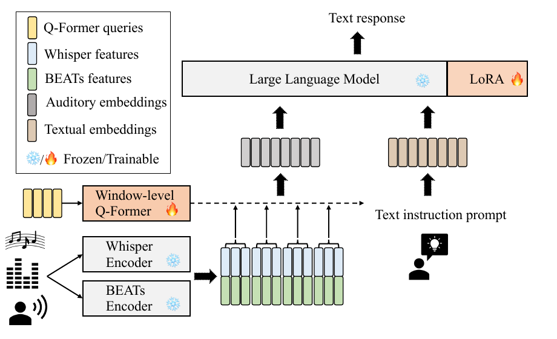
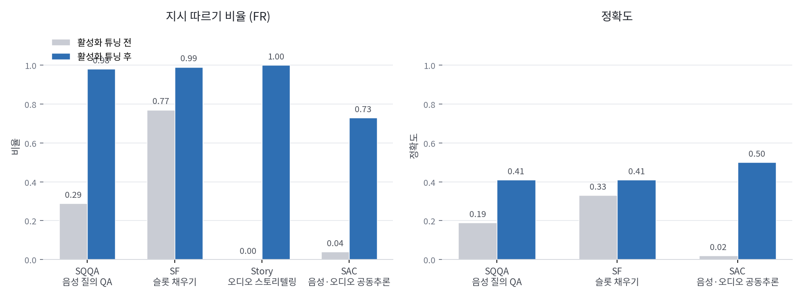

언어모델에 귀를 달 때 흔히 하는 선택은 음성 인코더 하나를 붙이는 것이에요. 그러면 말은 알아듣지만 문 닫히는 소리나 배경 음악은 다루지 못합니다. 칭화대와 바이트댄스의 [SALMONN](https://arxiv.org/abs/2310.13289)은 말, 소리 이벤트, 음악 셋을 한 모델로 받으려 한 시도인데, 흥미로운 부분은 구조보다 학습 과정에서 발견한 부작용 쪽이에요.

## 듣기는 한 종류의 신호가 아니에요

저자들이 세운 전제는 물리 세계에서 작동하는 인공지능에게 듣기가 필수 능력이고, 그 듣기가 최소한 말·소리 이벤트·음악 세 종류로 이뤄진다는 것입니다. 이 셋은 다루는 방식이 달라요. 소리 이벤트는 보통 고정 크기 스펙트로그램 이미지처럼 취급돼서 시각언어모델 방식이 그대로 통하는 반면, 저자들은 음성 인식에서 시간 해상도가 중요하다는 점을 설계 근거로 반복해 듭니다.

그래서 기존 연구는 한쪽으로 치우쳤어요. 소리 이벤트를 이미지처럼 처리하는 방법들은 말을 다루지 못하고, 여러 모델을 파이프라인으로 엮는 AudioGPT 같은 접근은 미리 정의한 과제 집합 안에서만 움직입니다. SALMONN은 이 둘을 한 종단간 모델로 합치려는 쪽이에요.

## 인코더 둘을 붙이고 창을 잘라 넣어요

구조는 인코더 둘, 연결 모듈 하나, 언어모델 하나입니다. 음성 쪽은 Whisper의 인코더를 쓰는데, 대량의 약지도 데이터로 음성 인식과 번역을 학습한 덕에 배경 잡음 정보까지 담깁니다. 비음성 쪽은 BEATs 인코더로, 오디오를 토큰화한 뒤 가리고 예측하는 반복적 자기지도 학습으로 높은 수준의 의미 정보를 뽑아요. 두 인코더의 출력 프레임 레이트가 50Hz로 같아서, 특징 차원을 따라 프레임끼리 이어 붙이면 그대로 하나의 시퀀스가 됩니다.

연결 모듈은 Q-Former인데 그냥 쓰지 않았어요. 원래 Q-Former는 이미지 인코더 출력을 고정 개수의 텍스트 토큰으로 바꾸는 모듈이라, 길이가 제각각인 오디오에는 맞지 않습니다. SALMONN은 이어 붙인 시퀀스를 길이 L짜리 창으로 자르고 마지막 창을 0으로 채운 뒤, 각 창을 마치 이미지인 것처럼 Q-Former에 넣어요. 이렇게 하면 출력 토큰 수가 입력 길이에 비례해 늘고, 무엇보다 출력이 입력과 단조 정렬을 이뤄 시간 해상도가 살아납니다. 음성 인식에는 이 정렬이 중요해요.

<figure class="fig"><figcaption>인코더 둘과 언어모델은 얼려 두고, 창 단위 Q-Former와 LoRA만 학습한다</figcaption></figure>
<em>SALMONN 구조 — 눈송이 표시가 얼린 모듈, 불꽃 표시가 학습하는 모듈이다(출처: Tang·Yu 외, SALMONN)</em>

언어모델은 130억 파라미터 Vicuna이고, LoRA로 자기어텐션의 질의·값 가중치만 적응시킵니다. 학습 대상은 창 단위 Q-Former와 LoRA뿐이라 갱신되는 파라미터가 약 33M으로 전체의 약 0.24%예요. 창 크기는 L을 17로 둬 약 0.33초에 해당하고, 학습 질의 수 N은 1이라 30초 오디오가 88개 텍스트 토큰이 됩니다. LoRA는 랭크 8, 스케일링 계수 4.0입니다.

## 지시 튜닝이 능력을 지워요

학습은 세 단계인데, 앞의 두 단계는 익숙한 구성이에요. 사전학습 단계에서는 음성 인식과 오디오 캡셔닝 데이터로 청각과 텍스트 사이 정렬을 잡습니다. 지시 튜닝 단계에서는 음성 인식, 번역, 오디오 캡셔닝, 음소 인식, 감정 인식, 음악 캡셔닝, 중첩 음성 인식, 화자 검증, 성별 인식, 그리고 음성·오디오·음악 질의응답까지 열두 종류를 섞어 넣어요. 합쳐서 약 4400시간, 약 2.3M 표본입니다.

여기까지만 하면 학습한 과제에서는 잘 나오는데, 학습하지 않은 과제는 거의 하지 못합니다. 심지어 지시를 무시하고 마치 음성 인식 지시를 받은 것처럼 엉뚱한 응답을 내놓기도 해요. 저자들은 이걸 과제 과적합(task over-fitting)이라 부르고, 원인을 확률 분해로 설명합니다. 응답 확률을 베이즈 규칙으로 쪼개면 모델 안에 내재된 조건부 언어모델 항이 나오는데, 학습에서 본 응답이 음성 전사나 캡션처럼 입력에 강하게 붙는 짧고 결정적인 문장뿐이라 이 항이 한쪽으로 치우친다는 거예요. 그 결과 응답이 다양해야 하는 처음 보는 지시의 확률이 작아집니다.

여기서 이 논문이 재미있어지는 건 진단 방법이에요. 내재 조건부 언어모델이 학습되는 자리는 창 단위 Q-Former와 LoRA뿐이니, LoRA 스케일링 계수를 테스트 시점에 낮추면 그 치우침을 완화할 수 있다는 가설이 섭니다. 실제로 계수를 원래의 절반인 2.0 근처로 내리면 질의응답과 스토리텔링 같은 교차 모달 창발 능력이 갑자기 나타나요. 대신 학습한 과제 성능은 눈에 띄게 나빠집니다. 능력이 사라진 게 아니라 눌려 있었다는 증거인 셈이에요.

## 열두 개 표본으로 되살려요

해법은 여기서 나옵니다. LoRA 계수를 낮춘 SALMONN이 만든 응답을 다시 학습 데이터로 써서 세 번째 단계를 도는 것으로, 저자들은 이를 활성화 튜닝이라 부릅니다. 오디오 클립을 보고 쓴 이야기 열두 편을 만들고, 한 스텝에 한 표본씩 열두 스텝만 교사 강요 방식으로 학습했어요.

<figure class="fig"><figcaption>지시 따르기 비율이 먼저 회복되고, 정확도가 뒤따라 오른다</figcaption></figure>
<em>논문 Table 3(b)를 그대로 옮겨 그린 그래프 — Story는 다양성 지표라 정확도 축에서 제외했다(출처: Tang·Yu 외, SALMONN의 수치를 필자가 도표화)</em>

효과가 가장 극적인 지표는 지시 따르기 비율(FR)이에요. 오디오 기반 스토리텔링은 활성화 튜닝 전 0.00에서 1.00이 되고, 음성·오디오 공동추론은 0.04에서 0.73으로 오릅니다. 음성 질의응답도 0.29에서 0.98이 돼요. 정확도로 보면 음성 질의응답이 0.19에서 0.41, 공동추론이 0.02에서 0.50입니다. 학습한 과제 쪽은 거의 그대로예요. 음성 인식 단어 오류율은 LibriSpeech test-clean에서 2.1%, test-other에서 4.9%로 변화가 없고 음소 오류율도 4.2%로 같습니다. GigaSpeech가 9.1%에서 10.0%로 조금 오른 정도예요.

**학습한 과제를 거의 건드리지 않고 학습하지 않은 과제만 되살렸다는 점, 그리고 그 대가가 표본 열두 개였다는 점이 이 논문에서 오래 남을 부분입니다.** 다만 남는 격차도 분명해요. 음성 질의응답 정확도 0.41은 Whisper로 전사해 Vicuna에 넣은 참조값 0.77에 한참 못 미치고, 슬롯 채우기도 0.41 대 0.46으로 뒤집니다. 종단간으로 듣는 쪽이 아직 전사 후 처리하는 쪽을 이기지 못하는 영역이 남아 있다는 뜻이에요. 반대로 학습하지 않은 언어로의 번역에서는 영어에서 독일어 18.6, 영어에서 일본어 22.7로 참조값 16.5와 15.6을 넘어섭니다.

## 로봇 쪽에서 읽으면 무엇이 남을까요

여기부터는 제 판단이에요. 이 논문은 로봇 논문이 아니지만, 로봇에 소리를 넣으려 할 때 부딪히는 문제를 미리 정리해 둔 쪽에 가깝습니다.

첫째로 인코더 선택의 근거가 명확해요. 말과 비음성 소리는 한 인코더로 잘 잡히지 않고, 프레임 레이트가 같은 두 인코더를 프레임 단위로 이어 붙이는 방식이 실제로 통했습니다. 로봇 마이크로 들어오는 신호가 사람 지시와 접촉음·구동음이 섞인 것이라면 이 구성이 그대로 참고가 돼요.

둘째로 과제 과적합은 로봇 정책에서 더 위험할 수 있다고 봅니다. 조작 데이터로 지시 튜닝을 하면 응답 분포가 행동 토큰 쪽으로 강하게 쏠리는데, 이건 SALMONN이 음성 전사 쪽으로 쏠린 것과 같은 종류의 치우침이에요. 학습에 없던 지시를 받았을 때 정책이 지시를 무시하고 익숙한 동작을 내는 실패는 실물에서 관찰하기 어렵고 원인을 짚기는 더 어렵습니다. LoRA 스케일을 낮춰 보는 진단은 학습을 다시 돌리지 않고도 해 볼 수 있으니 값싼 점검이 될 것 같아요.

셋째로 계산 비용이 생각보다 작습니다. 갱신 파라미터가 전체의 약 0.24%이고 마지막 단계는 열두 스텝이에요. 물론 앞의 두 단계가 수천 시간 규모라 전체를 재현하는 건 다른 이야기지만, 공개된 체크포인트 위에 마지막 단계만 얹는 방식이라면 접근 가능한 범위에 들어옵니다.

사람 말을 로봇 정책에 직접 넣는 문제는 [[2026-08-24_음성을_텍스트로_바꾸지_않고_듣는_VLAS|음성을 전사하지 않고 성문으로 개인화하는 VLA, VLAS]]가 이어받고, 물체가 내는 소리를 넣는 쪽은 [[2026-08-24_접촉음으로_접촉_전이를_읽는_Audio-VLA|접촉음을 VLA 입력으로 더해 접촉 전이를 읽는 Audio-VLA]]가 다룹니다. 세 편이 공통으로 가리키는 건 소리가 텍스트로 옮겨 적히는 순간 사라지는 정보가 있고, 그 정보가 필요한 과제가 실제로 존재한다는 사실이에요.

---
<!-- src-block -->
출처 — [SALMONN: Towards Generic Hearing Abilities for Large Language Models](https://arxiv.org/abs/2310.13289) · ICLR 2024 · arXiv 비독점 배포 라이선스 · 그림은 논문 인용.
