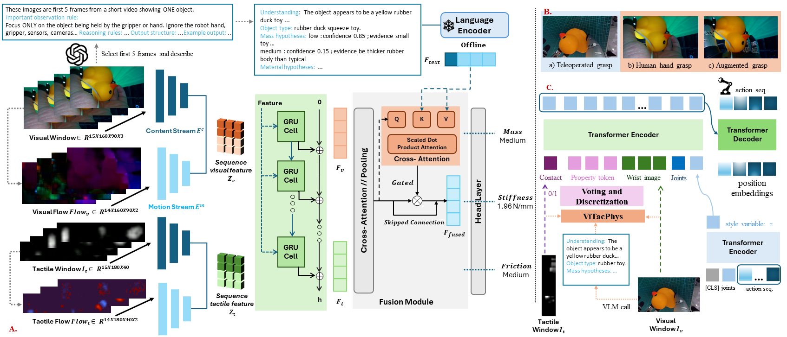
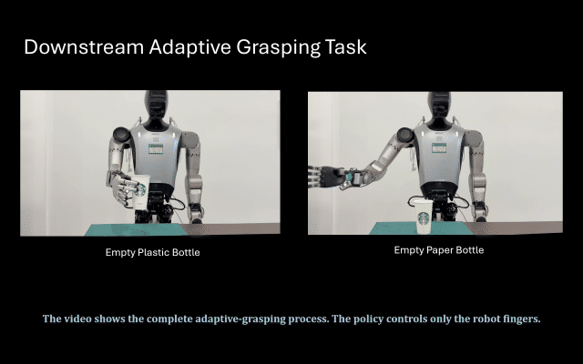

로봇이 페트병을 집을 때, 그 병이 비었는지 가득 찼는지는 겉모습만으로 알기 어려워요. 그런데 필요한 파지 힘은 그 무게와 표면 마찰, 뚜껑의 무름 정도에 따라 크게 달라집니다. 샤오미 로보틱스 팀의 [ViTacPhys](https://arxiv.org/abs/2608.21355)는 이 물리적 성질(물성)을 정책 학습의 명시적 중간 표현으로 끌어올려요. 겉모습에서 곧장 행동으로 가는 대신, 사람이 물건을 쥐는 시연에서 질량·마찰·강성을 먼저 추정하고 그 값으로 손가락 힘을 조절하는 구조입니다.

## 물성을 시각과 촉각으로 함께 추정해요

핵심 재료는 사람의 파지 시연이에요. 손목 시점 영상과 손끝 압력 맵(fingertip pressure map), 모션캡처 계측을 동기화해 받는 웨어러블 장치로, 강체부터 무른 고무 장난감까지 60종 물체를 다뤄요. 물체마다 접근 방향과 손 자세를 바꿔 프로토콜당 15회씩, 한 명이 총 1800회를 수집했습니다.

여기서 촉각 하드웨어 선택이 눈에 띄어요. 물성 데이터셋들은 보통 GelSight 같은 고정밀 비전 기반 촉각 센서에 기대는데, 이건 다관절 손가락에 장착하기가 어렵습니다. ViTacPhys는 대신 손끝 압력 맵을 쓰면서, 질량과 마찰계수는 세 등급의 순서형 클래스로, 강성은 로그 스케일의 연속 회귀 목표로 예측해요. 예측기는 시각의 내용·모션 스트림과 촉각 스트림을 각각 인코딩한 뒤 GRU로 시퀀스를 모으고, 교차어텐션(cross-attention) 융합 모듈에서 합칩니다.

<figure class="fig"><figcaption>물성 예측기(A)와 사람에서 로봇으로의 전이(B), 물성 토큰을 조건으로 받는 다운스트림 정책(C)</figcaption></figure>
<em>ViTacPhys의 전체 구성 — 시각·촉각 스트림을 융합해 질량·강성·마찰을 예측하고, 그 물성을 정책에 주입한다(출처: Wang 외, ViTacPhys)</em>

## 언어 모델의 사전지식을 조건으로 얹어요

융합 단계에는 시각언어모델(VLM)에서 뽑은 세만틱 프라이어(semantic prior)가 들어가요. VLM이 영상의 첫 프레임 몇 장을 보고 "노란 고무 오리 장난감, 질량은 낮은 쪽" 같은 텍스트 가설과 확신도를 내면, 이걸 언어 인코더로 임베딩해 융합 모듈의 게이트에 연결합니다. 물성을 순수하게 센서 신호로만 맞히지 않고, 물체가 무엇인지에 대한 상식을 함께 참고하는 거예요.

이 조합으로 학습에 쓴 물체에서는 질량 정확도 97.2%, 마찰계수 정확도 98.8%, 강성 MAPE 5.51%가 나와요. 학습에 안 쓴, 같은 범주의 미지 물체에서는 질량 87.5%, 마찰 97.5%, 강성 MAPE 9.08%로 떨어집니다. 완전히 새로운 물체가 아니라 아는 범주의 낯선 개체라는 조건에서의 수치라는 점은 짚어 둘 필요가 있어요.

## 사람 데이터를 로봇으로 옮겨 힘을 맞춰요

문제는 이 예측기를 사람 손 데이터로 학습했다는 점이에요. 로봇 손은 형태도 시점도 다릅니다. 그래서 세 가지를 섞어 재학습해요. 제한된 로봇 원격조작(teleoperation) 데이터, 행동을 맞춘 사람 시연, 그리고 영상 생성 모델로 사람 손을 로봇 손으로 바꿔치기한 증강 시연입니다. 예측된 물성은 접촉 여부와 질량·강성·마찰 임베딩을 이어 붙인 512차원 네 토큰의 물성 토큰이 되어, 다운스트림 파지 정책의 조건으로 들어가요.

<figure class="fig"><figcaption>물성을 조건으로 받은 정책이 같은 병의 빈 상태와 가득 찬 상태를 다르게 쥔다</figcaption></figure>
<em>다운스트림 적응형 파지 데모 — 정책은 로봇 손가락만 제어하고, 물성 추정이 온라인 모듈로 붙는다(출처: Wang 외, ViTacPhys)</em>

물성을 조건으로 받은 정책은 학습 분포 안 물체에서 파지 성공률 95.0%, 분포 밖 물체에서 83.4%를 기록해요. 더 흥미로운 건 힘의 결이에요. 두 방법이 모두 성공한 분포 밖 물체에서, ViTacPhys의 힘 프로파일은 물성을 명시적으로 쓰지 않는 모방학습 기준선 ACT보다 사람의 원격조작에 더 가깝게 나왔습니다. 성공/실패라는 이진 결과 너머에서 "사람처럼 조심스럽게 쥐는가"를 본 셈이에요.

## 물성을 중간 표현으로 두면 무엇이 남을까요

현업 관점에서 이 접근의 자리는 분명해요. 파지 힘을 정하는 길은 손목의 힘·토크 센서를 직접 다는 방법, GelSight 같은 촉각 센서로 접촉을 읽는 방법, 아니면 물성을 따로 두지 않고 픽셀에서 곧장 행동을 내는 종단간 정책이 있어요. ViTacPhys는 물성을 눈에 보이는 중간 변수로 떼어 내 디버깅과 조건화가 가능하게 만든 쪽입니다. 다만 저자들도 이걸 시스템 수준의 타당성 연구(feasibility study)로 못 박아요. 수집이 한 명, 물체가 60종이고, 향후 과제로 더 풍부한 힘 센싱과 더 많은 참가자·물체, 더 넓은 분포 밖 시험, 더 빠른 세만틱 프라이어를 들거든요. 실제 배치로 가려면 이 격차부터 메워야 한다는 뜻이에요.

겉모습에서 곧장 행동으로 가는 정책은 빠르지만, 왜 그 힘을 냈는지 설명하지 못해요. 물성을 명시적 중간 표현으로 세우면 한 층이 늘어 느려지는 대신, 정책이 무엇을 보고 힘을 정했는지가 드러납니다. 힘을 센서 없이 추정하는 흐름은 [[2026-07-20_힘_센서_없이_힘을_아는_로봇|전류-토크 선형 모델을 신경망으로 갈아끼운 NeuralActuator]]와 [[2026-07-27_센서가_달라도_힘은_같아요|촉각 신호를 3축 힘장으로 통일해 3만 시간을 묶은 N0 보고서]]에서도 이어져 온 주제인데, ViTacPhys는 그 추정치를 파지 힘으로 되먹이는 고리까지 닫으려 한 시도예요.

---
<!-- src-block -->
출처 — [ViTacPhys: Physical Property-Aware Grasping from Human Visual-Tactile Demonstrations](https://arxiv.org/abs/2608.21355) · arXiv 비독점 배포 라이선스 · 그림·영상은 프로젝트 페이지(vitacphys.github.io/ViTacPhys) 인용.
