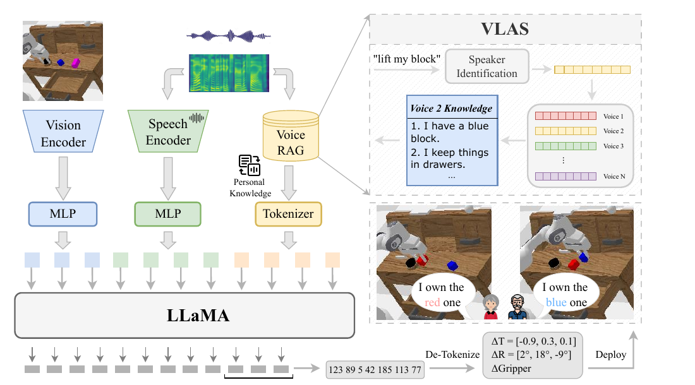
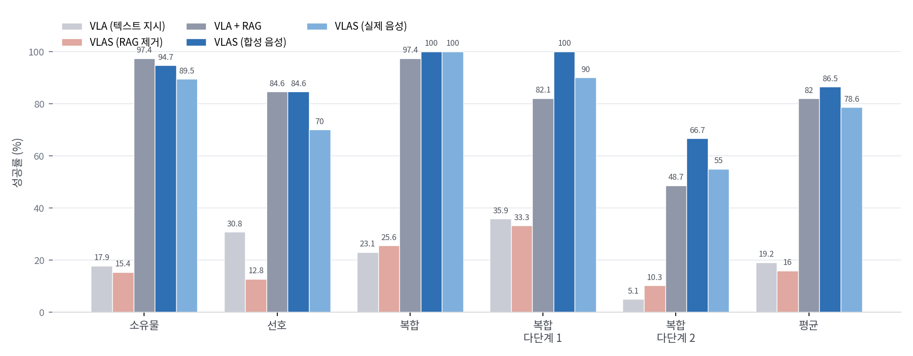

"내 컵 좀 집어 줘"라는 말에는 로봇이 알 수 없는 값이 하나 들어 있어요. '내'가 누구인지입니다. 문장을 아무리 정확히 받아 적어도 그 값은 글자 안에 없고, 말하는 사람의 목소리에 있어요. 웨스트레이크대 연구진의 [VLAS](https://arxiv.org/abs/2502.13508)는 이 지점을 겨냥합니다. 음성을 텍스트로 바꾼 뒤 VLA에 넣는 대신, 원시 음성을 시각 관측과 나란히 정책 모델에 직접 넣어요.

## 전사하면 사라지는 정보가 있어요

지금까지 음성으로 로봇을 움직이는 표준 경로는 외부 자동음성인식(ASR)으로 말을 글자로 바꾸고 그 글자를 VLA에 넣는 것이었어요. 저자들이 지적하는 문제는 둘입니다. 하나는 시스템이 커진다는 것이고, 다른 하나는 전사 과정에서 의미 바깥의 정보가 버려진다는 것이에요. 신원, 감정, 억양처럼 사람의 의도를 파악하는 데 쓰이는 단서들이 여기 해당합니다.

이 손실이 실제로 문제가 되는 건 지시가 불완전할 때예요. "내 컵을 집어 줘"는 문법적으로 완결이지만 지시 대상을 특정하지 못합니다. 텍스트만 받는 VLA는 어느 컵을 집어야 하는지 알 방법이 없고, ASR을 붙여도 같은 텍스트가 나오니 결과가 달라지지 않아요. 반면 원시 음성에는 화자를 특정할 수 있는 성문(voiceprint)이 남아 있습니다.

## 음성 토큰을 시각 토큰 옆에 나란히 놓아요

VLAS는 시각언어모델 LLaVA 위에 세워졌어요. 시각 인코더는 CLIP, 백본은 LLaMA를 지시 따르기용으로 미세조정한 Vicuna입니다. 여기에 음성 경로가 하나 더 붙어요. 음성 인코더는 Whisper의 인코더 부분을 쓰고, 입력 음성은 단시간 푸리에 변환으로 80빈 멜 스펙트로그램이 된 뒤 3000프레임 길이로 패딩됩니다. 인코더는 이걸 1500개의 은닉 표현으로 바꿔요.

문제는 이 시퀀스가 그대로 언어모델에 들어가면 너무 길다는 것입니다. VLAS는 시간 축으로 5분의 1이 되도록 단순 리셰이프를 적용해 길이를 줄이고, MLP로 언어 공간에 투사해요. 시각 토큰도 별도 MLP를 거쳐 같은 공간으로 옵니다. 두 갈래 토큰과 검색된 지식 토큰을 이어 붙인 뒤 LLaMA에 넣으면, 모델이 자기회귀 방식으로 행동 토큰을 뱉어요.

<figure class="fig"><figcaption>화자 식별로 뽑은 성문이 개인 지식 데이터베이스의 검색 키가 되고, 검색된 문장이 토큰으로 함께 들어간다</figcaption></figure>
<em>VLAS 전체 구성 — 같은 "내 블록을 들어 줘"에 목소리에 따라 다른 블록이 선택된다(출처: Zhao 외, VLAS)</em>

행동은 이산화해서 다룹니다. 연속값을 256개 구간으로 균등 분할하고, 언어모델 어휘에서 가장 덜 쓰이는 토큰 256개를 행동 토큰으로 재활용해요. 엔드이펙터 위치 셋과 회전각 셋, 그리퍼 상태 하나를 합친 7차원 값이 공백으로 이어진 문자열이 되어 학습 라벨로 쓰입니다.

성문이 개입하는 자리가 Voice RAG예요. 원시 음성이 화자 식별 모듈을 지나 성문이 되고, 그 성문이 외부 데이터베이스를 조회하는 키가 됩니다. "저는 파란 블록을 가지고 있어요" 같은 문장이 검색돼 배경지식으로 함께 들어가요. 화자 식별은 사전학습된 모듈을 그대로 써서 새로 학습하지 않습니다.

## 없는 데이터는 음성 합성으로 만들었어요

음성 지시가 붙은 조작 데이터셋이 존재하지 않으니 저자들은 두 벌을 새로 만들었어요. 둘 다 TTS로 텍스트를 읽어 만든 합성 음성입니다.

SQA는 음성 질의응답 데이터셋이에요. LLaVA의 시각 지시 튜닝 데이터에서 다중 턴 대화 중 한 라운드를 뽑아 질문 텍스트를 음성으로 바꿨고, ESPnet의 VITS 모델을 LibriTTS로 학습한 것을 썼습니다. 화자는 무작위로 골라 185K 표본에 1,152개 목소리가 담겼어요. CSI는 CALVIN의 텍스트 지시 389개를 500개 목소리로 읽어 만든 것으로, 23K 에피소드에 약 194K 오디오가 붙습니다. 학습할 때는 표본의 절반을 합성 음성으로 무작위 교체해서 텍스트와 음성 둘 다 받게 만들었어요.

학습은 세 단계로 나뉩니다. 1단계는 음성과 텍스트의 거친 정렬로, LibriSpeech-360으로 음성 인식 과제를 풀되 음성 인코더와 언어모델 사이의 MLP만 갱신해요. 2단계는 SQA와 원래 LLaVA의 시각 질의응답 데이터, LibriSpeech-100을 함께 써서 사전학습된 이미지·음성 인코더를 뺀 전 구성요소를 갱신하고, 여기서 나온 모델이 VLAS-Base입니다. 3단계에서 CSI로 행동 복제를 돌려 VLAS가 돼요.

## 성능은 어디서 갈릴까요

CALVIN 벤치마크에서 VLAS는 텍스트 지시로 평균 길이 3.74, 음성 지시로 3.70을 냈어요. 같은 구성으로 학습한 텍스트 전용 VLA 기준선이 3.80이니 거의 붙어 있습니다. 여기서 중요한 건 비교 대상이에요. 음성을 Whisper large-v2로 전사해 넣은 VLA는 3.13, Roboflamingo는 3.41로 떨어집니다. 로봇 제어 명령에 특화되지 않은 범용 ASR이 만드는 인식 오차가 뒤로 전파되기 때문이라고 저자들은 설명해요. 실제 사람 10명이 녹음한 음성으로 평가해도 VLAS는 3.61로, 텍스트 기준선과의 격차가 0.19에 그칩니다.

<figure class="fig"><figcaption>맞춤 과제 성능 — 성패를 가르는 축은 음성 자체보다 개인 지식 검색의 유무다</figcaption></figure>
<em>논문 Table 2를 그대로 옮겨 그린 그래프(출처: Zhao 외, VLAS의 수치를 필자가 도표화)</em>

차이가 벌어지는 건 개인 지식이 필요한 맞춤 과제입니다. 소유물 과제, 선호 과제, 그리고 둘을 겹친 복합 과제로 벤치마크를 새로 만들었는데, 텍스트 지시만 받는 VLA 기준선은 평균 19.2%에 그치고 VLAS는 86.5%를 냅니다. 실제 사람 음성으로도 78.6%예요.

다만 절제 실험을 같이 보면 결이 조금 달라집니다. VLAS에서 RAG를 떼면 16.0%로 무너지고, 반대로 텍스트 VLA에 RAG를 붙이면 82.0%까지 올라와요. **이 벤치마크에서 성패를 가른 축은 음성 입력 자체라기보다 개인 지식을 검색해 넣었는지 쪽입니다.** 음성 경로가 기여하는 몫은 그 위에 얹힌 차이입니다. 게다가 텍스트 기준선은 오류 없는 정답 텍스트를 받는 조건이었으니, 그 유리함까지 감안해야 공정해요. 성문이 없으면 애초에 검색 키를 만들 수 없다는 점이 음성 경로의 진짜 값어치이고, 논문의 구성도 그쪽을 가리킵니다.

기반 모델 쪽도 확인해 뒀어요. VLAS-Base는 일반 멀티모달 벤치마크에서 LLaVA v1.5와 거의 같은 값을 내서, 음성 모달리티를 넣은 것이 원래 성능을 깎지 않았습니다. 음성 인식에서는 LibriSpeech 단어 오류율 2.79%로 Whisper의 2.7%에 근접하는데, 저자들은 스펙트럼을 5분의 1로 줄인 축소 비율을 최적화하거나 더 나은 다운샘플링 모듈을 쓰면 이 값이 더 나아질 여지가 있다고 봐요. 다만 음성 질의응답 벤치마크에서는 정답 텍스트를 받은 LLaVA가 62.0인 데 비해 VLAS-Base는 50.8로, 음성을 거치면서 잃는 몫이 남아 있습니다. 이 격차의 원인에 대해서는 원문이 따로 설명하지 않아요.

## 우리 팔에 얹는다면 무엇이 남을까요

여기부터는 제 판단입니다. 실물 검증이 UR5 팔에서 컵 집기 정도로 제한적이라, 이 구조를 그대로 가져오기보다 어느 조각이 재사용 가능한지를 보는 편이 낫겠어요.

가장 값싼 조각은 Voice RAG입니다. 성문으로 사용자를 식별하고 그 사용자의 사전 지식을 프롬프트에 끼워 넣는 부분은 정책 모델과 분리돼 있어서, 사전학습된 화자 식별 모듈과 작은 지식 테이블만 있으면 기존 파이프라인 앞단에 붙일 수 있습니다. 텍스트 VLA에 RAG만 붙여도 82.0%가 나왔다는 결과가 이 조각의 독립성을 보여 줘요.

반대로 비싼 조각은 음성 경로를 정책에 통합하는 부분이에요. LLaVA 급 백본에 세 단계 학습을 다시 돌려야 하고, 무엇보다 조작 데이터에 음성 지시를 붙인 데이터셋이 필요합니다. 저자들이 TTS로 합성해 해결한 대목인데, 합성 음성으로 학습하고 실제 음성에서 평가했을 때 CALVIN 길이가 3.70에서 3.61로, 맞춤 과제가 86.5%에서 78.6%로 내려간 것은 그 간극이 공짜가 아니라는 뜻으로 읽혀요.

한국어라는 조건도 남습니다. Whisper 인코더 자체는 다국어를 다루지만, 이 논문의 세 단계 학습은 LibriSpeech와 LibriTTS 계열 영어 데이터로 짜여 있어요. 한국어 지시로 같은 구조를 세우려면 1단계 정렬용 음성 인식 데이터와 3단계용 합성 지시를 한국어로 다시 마련해야 하고, 그 비용이 이 접근의 실질적 진입 장벽이 될 겁니다.

말을 글자로 바꾸는 순간 목소리는 사라져요. 그 사라짐이 문제가 되지 않는 과제라면 ASR을 앞에 두는 편이 여전히 단순하고, 화자가 누구인지가 지시의 일부인 과제에서만 이 구조가 값을 합니다. 소리를 정책에 직접 넣는 흐름은 [[2026-08-24_접촉음으로_접촉_전이를_읽는_Audio-VLA|접촉음을 VLA 입력으로 더해 접촉 전이를 읽는 Audio-VLA]]와 같은 방향인데, 그쪽이 물체가 내는 소리를 다뤘다면 이쪽은 사람이 내는 소리를 다뤘고, 두 경우 모두 소리에서 뽑아내는 건 텍스트로 옮겨 적을 수 없는 종류의 정보였어요. 음성과 환경음을 한 인코더로 함께 듣는 문제는 [[2026-08-24_말과_소리를_한_모델로_듣는_SALMONN|말·소리·음악을 한 모델로 듣는 SALMONN과 과제 과적합]]에서 이어집니다.

---
<!-- src-block -->
출처 — [VLAS: Vision-Language-Action Model with Speech Instructions for Customized Robot Manipulation](https://arxiv.org/abs/2502.13508) · ICLR 2025 · arXiv 비독점 배포 라이선스 · 그림은 논문 인용.
