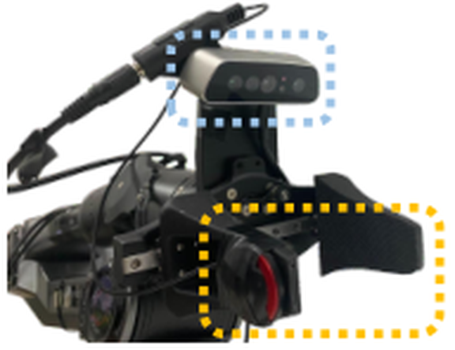
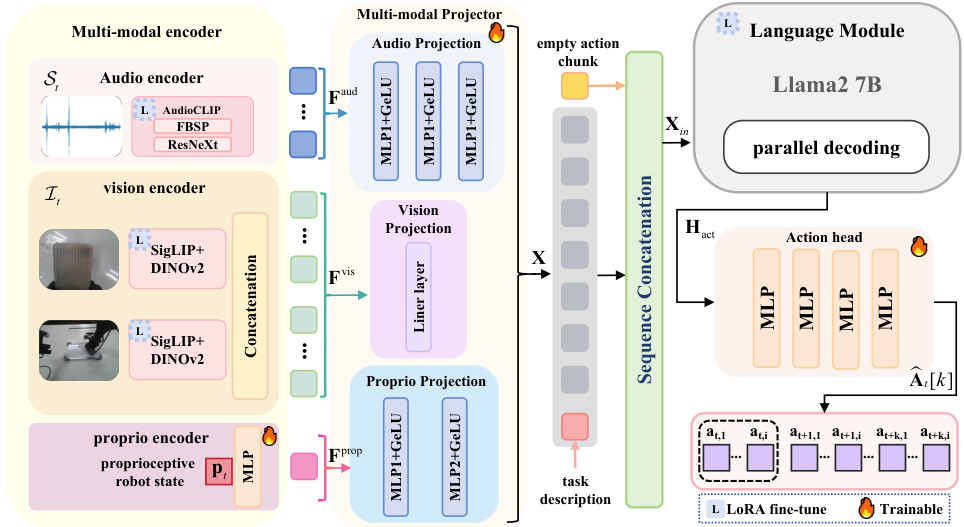
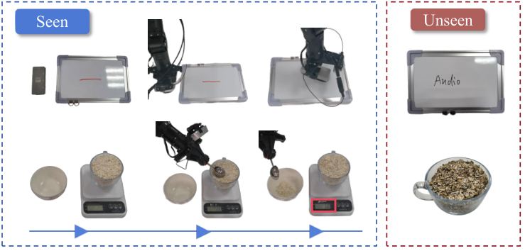
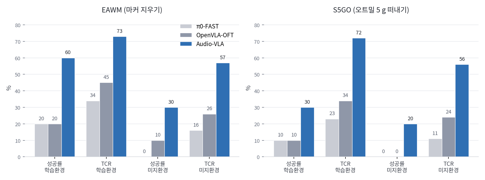

지우개를 화이트보드로 가져가는 동작은 카메라로 충분히 보입니다. 그런데 지우개가 판에 닿았는지, 얼마나 눌리고 있는지는 그리퍼와 지우개에 가려 보이지 않아요. 화둥사범대·푸단대 연구진의 [Audio-VLA](https://arxiv.org/abs/2511.09958)는 이 가려진 구간을 소리로 메웁니다. 그리퍼에 압전 접촉 마이크를 붙여 접촉음을 받고, 그 신호를 시각·자기수용 감각과 나란히 토큰으로 만들어 시각언어행동(VLA) 모델에 밀어 넣는 구조예요.

## 시각은 접촉이 시작되는 순간을 놓쳐요

저자들이 짚는 문제는 단순합니다. 기존 VLA는 조작 시퀀스를 시작하기는 하는데, 가림 때문에 상태를 판정할 수 없는 접촉 의존 전이(contact-dependent transition) 지점에서 실패한다는 거예요. 화이트보드 과제에서 시각은 지우개를 판까지 안내하지만 표면 접촉 여부를 결정하지 못하고, 오트밀 떠내기 과제에서는 숟가락의 삽입 깊이와 담긴 무게의 관계를 모델링하지 못합니다.

대안으로 흔히 드는 촉각 센서는 자리가 다릅니다. GelSight 계열의 비전 기반 촉각 센서는 수십 마이크로미터 해상도로 기하와 힘을 읽지만, 비싸고 엔드이펙터에 통합해야 하며 국소 접촉만 감지해요. 저자들이 더 결정적으로 보는 건 촉각 센서의 낮은 표본화 주파수가 도구와 물체의 상호작용을 놓친다는 점이에요. 그에 비해 접촉음은 통상적인 촉각 센서보다 1000배 높은 주파수에서 접촉 이벤트를 잡고, 조명이나 색 변화 같은 환경 변동에 영향받지 않습니다. 압전 접촉 마이크는 구조 진동을 직접 받는 부품이라 기구를 개조하지 않고 붙일 수 있다는 점도 근거로 들어요.

<figure class="fig"><figcaption>손목 카메라(위 점선)와 그리퍼 턱에 붙인 압전 접촉 마이크(아래 점선)</figcaption></figure>
<em>기구 개조 없이 그리퍼 양쪽에 접촉 마이크를 덧붙인 실물 설치(출처: Wei 외, Audio-VLA)</em>

## 접촉음을 토큰으로 바꿔 언어모델에 넣어요

구성은 인코더, 프로젝터, 언어 모듈, 액션 헤드 넷으로 갈립니다. 시각 인코더는 DINOv2와 SigLIP을 함께 써 3인칭 시점과 손목 카메라 영상을 각각 256개 패치로 뽑고, 자기수용 감각 인코더는 관절각 같은 로봇 상태를 MLP로 임베딩해요. 오디오 인코더는 AudioCLIP인데, 사전학습 가중치 위에 ManiWAV 조작 데이터셋으로 추가 학습을 얹습니다. 사전학습 모듈은 시각·오디오 인코더와 언어 모델까지 LoRA로 미세조정해 붙여요.

오디오 처리에서 눈에 띄는 선택이 둘 있어요. 하나는 시간 해상도를 위해 AudioCLIP의 FBSP 층에서 윈도 길이와 홉 길이를 줄인 것입니다. 윈도 1024, 홉 256으로 복소 스펙트로그램을 뽑고 파워 스펙트럼에 로그 스케일을 씌운 뒤 ResNeXt로 특징을 만들어요. 다른 하나는 선행 오디오 처리 방식과 달리 오디오를 타임스텝마다 독립적으로 처리한다는 점입니다. 즉각적인 접촉 이벤트 검출과, 시각·상태·행동 모달리티와의 정확한 시간 정렬을 노린 설계예요.

<figure class="fig"><figcaption>모달리티별 프로젝터가 특징을 같은 공간으로 옮기고, 빈 행동 토큰 자리에서 나온 은닉 상태를 액션 헤드가 연속 행동으로 바꾼다</figcaption></figure>
<em>Audio-VLA 전체 구성 — LoRA 미세조정 대상과 전체 학습 대상이 표시로 구분되어 있다(출처: Wei 외, Audio-VLA)</em>

프로젝터는 모달리티마다 다릅니다. 시각은 선형 변환, 오디오는 3층 MLP, 자기수용 감각은 2층 MLP로 각각 언어모델 차원에 맞춰요. 이렇게 이어 붙인 시퀀스를 명령어 토큰과 학습 가능한 빈 행동 임베딩과 함께 Llama2 7B에 넣고 병렬 디코딩하면, 행동 자리의 은닉 상태가 나옵니다. 4층 MLP 액션 헤드가 이걸 미래 여러 스텝의 연속 행동 블록으로 바꾸고, 학습은 전문가 시연과의 평균 L1 손실을 줄이는 방향으로 진행돼요. 토큰을 이산화해 언어처럼 예측하는 방식이 아니라 연속값을 직접 회귀하는 쪽입니다.

## 시뮬레이터에 충돌음을 심어 학습 재료를 만들었어요

접촉음을 쓰려면 소리가 있는 시뮬레이터가 필요합니다. LIBERO와 RLBench에는 소리가 없으니, 저자들은 물리 충돌 검출을 방아쇠로 삼아 실제 녹음을 재생하는 방식으로 두 환경을 개조했어요. 시뮬 과제마다 대상 물체를 재질과 크기로 식별하고, 비슷한 실물로 같은 조작을 수행하면서 그리퍼에 장착한 마이크로 48kHz 접촉음을 녹음합니다. 이 녹음을 재질 쌍, 상호작용 유형, 힘 크기로 색인한 라이브러리로 정리해요.

시뮬레이션 중에는 그리퍼와 물체의 직접 접촉, 그리고 잡은 물체와 환경의 상호작용 두 종류를 감시합니다. 충돌이 검출되면 참여 물체와 충격 속도, 힘 크기를 확인해 라이브러리를 조회하고, 꺼낸 소리를 충돌 힘으로 진폭을 키우고 물체 크기로 음높이를 옮기고 지속 접촉이면 길이를 늘려 변조해요. 물리적으로 유도한 게 아니라 실측 녹음을 조건부로 재생하는 방식이라는 점은 짚어 둘 필요가 있습니다. 두 환경은 공개할 예정이라고 밝혀 두었어요.

## 결과가 아니라 과정을 재는 TCR을 세웠어요

두 번째 기여는 지표입니다. 기존 평가가 최종 성패만 보기 때문에, 저자들은 달성한 진척을 과제 목표로 나눈 과제 완료율(Task Completion Rate, TCR)을 도입해요. 화이트보드 과제에서는 지워진 자국의 면적, 오트밀 과제에서는 떠낸 무게가 분자가 됩니다. 이진 성패로는 다 실패인 시도들 사이에서 얼마나 진행했는지를 가르려는 장치예요.

<figure class="fig"><figcaption>왼쪽 세 컬럼이 학습 환경, 오른쪽이 마커 종류와 오트밀 품종을 바꾼 미지 환경</figcaption></figure>
<em>실물 과제 둘 — 오트밀 과제는 주방 저울로 떠낸 무게를 계측한다(출처: Wei 외, Audio-VLA)</em>

이 지표를 실제로 재려면 진척을 물리적으로 계측할 수 있는 장치가 필요합니다. 실물 실험은 AgileX Mobile ALOHA 플랫폼의 7자유도 Piper 팔 가운데 오른팔만 써서 진행했어요. 손목과 3인칭 카메라는 Orbbec 계열, 마이크는 그리퍼 양쪽에 두 개를 붙여 44.1kHz로 녹음하고, 원시 스트림을 타임스텝 단위 고정 길이 청크로 잘라 영상과 시간 정렬합니다. 과제당 시연 40회를 원격조작으로 모으고, 추론은 NVIDIA H20에서 돌리며 ROS로 로봇과 통신해 추론과 실행을 병렬로 25Hz 연속 제어를 유지했어요. 학습은 H20 2대, LoRA 랭크 32, 배치 8, 학습률 1e-4 코사인 감쇠로 과제에 따라 50k에서 100k 스텝입니다.

<figure class="fig"><figcaption>실물 과제 성능 — 성공률이 0인 칸에서도 TCR은 진척 차이를 남긴다</figcaption></figure>
<em>논문 Table II를 그대로 옮겨 그린 그래프(출처: Wei 외, Audio-VLA의 수치를 필자가 도표화)</em>

학습 환경에서 Audio-VLA는 화이트보드 과제 성공률 60%, 오트밀 과제 30%로 시각 전용 기준선들의 정확히 세 배를 냈고, TCR은 두 과제 모두 70%를 넘습니다. 마커와 오트밀 품종을 바꾼 미지 환경에서는 성공률이 30%와 20%로 떨어지지만, 기준선들이 0%에 가깝게 무너지는 것과 대비돼요. 여기서 TCR의 쓸모가 드러납니다. 미지 환경 오트밀 과제에서 두 기준선의 성공률은 모두 0이라 이진 지표로는 구분되지 않는데, TCR은 11%와 24%로 갈라져요.

시뮬레이션에서는 차이가 더 작습니다. 표준 환경 LIBERO 평균 97.6%는 OpenVLA-OFT의 97.1%와 거의 붙어 있어요. 차이가 벌어지는 건 접촉 집약 과제와 도메인 시프트 조건입니다. RLBench 평균은 55.1%로 48.1% 대비 앞서고, 사각 페그 삽입과 전구 끼우기에서 각각 2.7과 10.2퍼센트포인트 더 높아요. 조명과 책상 표면 색을 무작위로 바꾼 도메인 시프트에서는 LIBERO 74.7%, RLBench 41.5%를 유지하는데, LIBERO 하락 폭이 상대 23.5%로 기준선보다 덜 급합니다. 접촉 집약 과제 둘에서는 66%를 넘는 성능 유지율을 보여요. 소리는 조명과 색이 바뀌어도 같은 진동 패턴으로 남는다는 주장의 근거가 여기입니다.

## 오디오와 LoRA를 하나씩 떼어 봤어요

절제 실험이 흥미로운 지점을 하나 남깁니다. RLBench에서 시각 전용은 평균 48.0%, 오디오를 넣되 LoRA를 빼면 51.5%, 전체는 55.1%였어요. 실물에서는 격차가 더 커서, 화이트보드 과제 성공률이 시각 전용 20%, LoRA 없이 30%, 전체 60%로 나옵니다. 저자들이 강조하는 대목은 이 마지막 구간이에요. 오디오를 넣어 둔 상태에서 인코더를 미세조정하기만 해도 성공률이 두 배가 되니, 개선의 상당 부분이 오디오 자체보다 오디오를 읽는 법에서 나왔다는 뜻입니다.

저자들의 해석은 사전학습된 오디오 인코더가 조작 특유의 소리를 처리하지 못한다는 것입니다. AudioCLIP은 환경음과 음악 같은 일반 오디오로 학습돼 있는데, 그리퍼 마이크가 받는 건 구조를 타고 오는 마찰음과 충격음이라 분포가 다르니까요. 접촉음을 쓰겠다면 인코더 적응이 선택 사항이 아니라 필수 공정이라는 결론이 됩니다.

## 양팔 매니퓰레이터에 얹으려면 무엇이 걸릴까요

여기부터는 논문이 다루지 않은 영역에 대한 제 판단입니다. 눈에 걸리는 건 플랫폼이 이미 양팔 ALOHA인데도 오른팔 하나만 썼다는 점이에요. 접촉음을 양팔로 확장하면 논문 설정에 없던 문제가 생깁니다. 팔마다 그리퍼 양쪽에 마이크를 달면 채널이 넷이 되고, 두 팔이 같은 테이블이나 같은 물체를 통해 연결되면 한쪽의 접촉음이 다른 쪽 채널로 새어 들어와요. 압전 접촉 마이크는 공기 전달음보다 구조 전달음을 크게 받으니 팔이 떨어져 있는 동안에는 누화가 작을 텐데, 한 물체를 두 팔이 함께 잡는 순간부터는 같은 구조체를 공유하게 됩니다. 어느 팔의 접촉인지 가르는 문제는 채널을 합치지 않고 팔별로 오디오 토큰을 따로 유지하는 설계로 먼저 다뤄 볼 만해요.

두 번째는 시간 정렬입니다. 이 구조의 전제는 오디오 청크 하나가 제어 스텝 하나에 정확히 대응한다는 것이고, 저자들이 타임스텝마다 오디오를 독립 처리한 이유도 그 정렬이었어요. 양팔이면 두 팔의 관절 상태, 카메라 넷 안팎, 오디오 스트림 둘을 한 스텝에 묶어야 합니다. ROS 쪽에서는 근사 시간 동기화로 묶는 게 일반적인데, 오디오는 영상보다 표본화 주기가 훨씬 짧아 같은 허용 오차를 그대로 쓰면 접촉 순간이 이웃 스텝으로 밀릴 수 있어요. 마이크 입력과 카메라 프레임에 하드웨어 타임스탬프를 붙이고 청크 경계를 제어 주기에 맞춰 자르는 쪽이 안전합니다.

세 번째는 소음 환경이에요. Piper 같은 산업용 팔과 달리 저가 직렬 버스 서보로 만든 팔은 자체 구동음과 감속기 소음이 큽니다. 접촉음의 신호 대 잡음비를 깎는 방향이니, 마이크 위치를 서보 하우징에서 최대한 떼어 놓고 그리퍼 턱 쪽으로 붙이는 배치가 중요해질 거예요. 이 부분은 실물에서 재 봐야 알 수 있는 값입니다.

그래도 제가 이 논문을 기록해 두는 이유는 문제의 성격이 겹치기 때문이에요. 접촉을 서보 부하의 변화로 판정하는 방식은 이미 눌린 뒤에야 신호가 나오고, 구조광 깊이 센서는 얇거나 반사가 심한 물체를 놓칩니다. 접촉음은 접촉이 시작되는 순간 자체에서 나오는 신호라 이 둘의 사각지대와 겹치지 않아요. 전체 구조를 재현하기엔 H20 2대 규모의 학습이 부담이니, 저는 오디오 인코더에 LoRA를 얹어 접촉 이벤트 분류기만 먼저 세우고 그 출력을 기존 제어 루프의 접촉 판정에 병렬로 넣어 보는 축소판이 현실적인 출발점이라고 봅니다.

TCR이라는 지표 쪽도 남겨 둘 만해요. 성공률이 0인 칸에서 11%와 24%가 갈렸다는 건, 실패한 시도들 사이에도 정보가 있었는데 이진 지표가 그걸 버려 왔다는 뜻입니다. 접촉음이라는 새 입력이 정말 기여했는지를 보이는 데 성공률만으로는 부족했고, 과정을 재는 지표를 함께 만든 것이 이 논문에서 오래 남을 부분이라고 생각해요. 힘을 명시적인 중간 표현으로 끌어올리는 흐름은 [[2026-08-24_사람_손_시연에서_물성을_읽는_파지|사람 손 시연에서 물체 물성을 읽어 파지 힘을 맞추는 ViTacPhys]]와 [[2026-07-27_센서가_달라도_힘은_같아요|촉각 신호를 3축 힘장으로 통일해 3만 시간을 묶은 N0 보고서]]에서도 이어져 왔는데, Audio-VLA는 그 자리에 센서 대신 소리를 놓았습니다.

---
<!-- src-block -->
출처 — [Audio-VLA: Adding Contact Audio Perception to Vision-Language-Action Model for Robotic Manipulation](https://arxiv.org/abs/2511.09958) · arXiv 비독점 배포 라이선스 · 그림은 논문 HTML판(arxiv.org/html/2511.09958v1) 인용.
