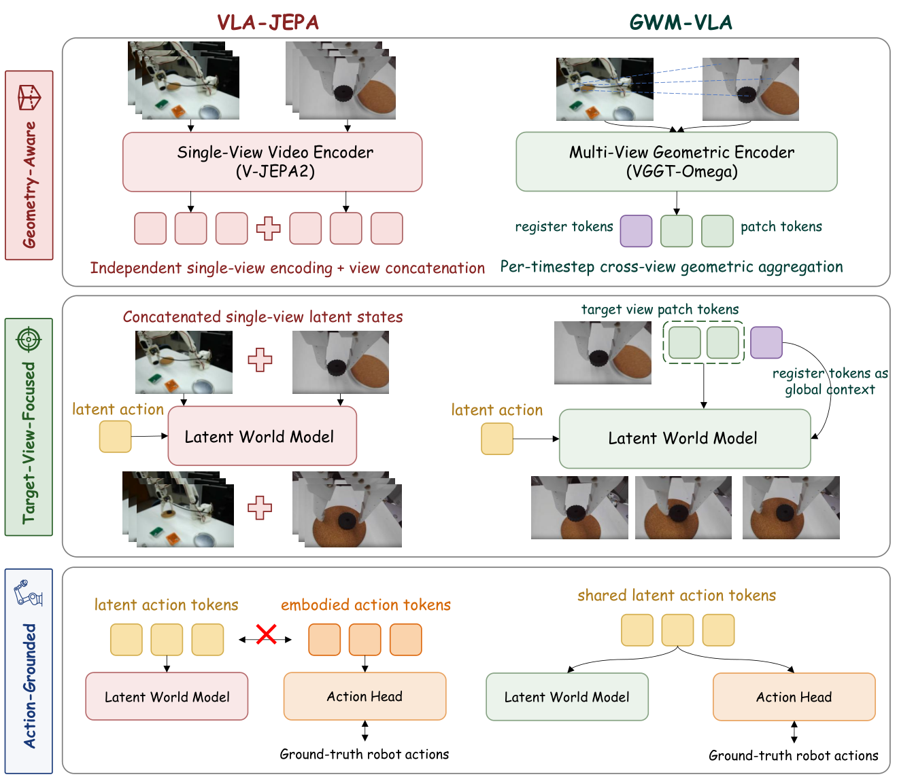
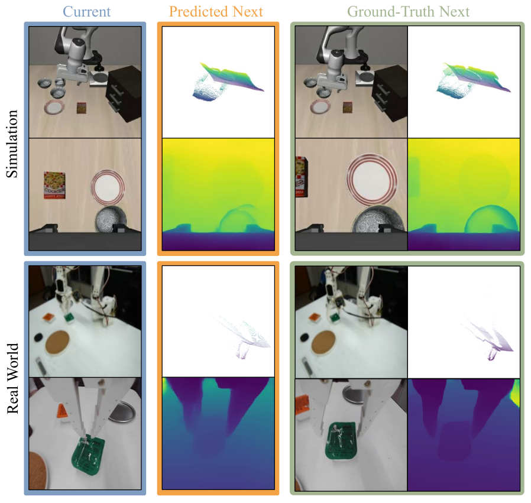

성능이 좋은 VLA 정책도 카메라 시점이나 조명, 배경 텍스처, 물체 배치, 센서 잡음이 통제된 방식으로 바뀌면 크게 무너집니다. 통지대 연구진의 [GWM-VLA](https://arxiv.org/abs/2608.07619v1)는 그 취약성을 정책이 장면의 반응이 아니라 겉모습에 특화된 상관을 붙잡은 결과로 읽고, 시점 사이의 기하 관계를 표현에 명시적으로 넣는 방향으로 답합니다.

## 미래 영상을 그리면 조명과 텍스처까지 예측해야 해요

월드모델을 VLA에 붙이는 방식이 몇 갈래로 갈립니다. DreamZero 같은 월드-액션 모델은 미래 영상 예측과 행동 생성을 한 정책 안에 합치고, π₀.₇은 별도 월드모델로 시각 하위 목표를 만들어 VLA에 넘겨요. 둘 다 명시적 월드모델이라 미래 시각 관측을 생성해야 하는데, 그러면 예측 목표가 제어에 관련된 상태 변화뿐 아니라 텍스처와 조명, 배경 같은 겉모습 세부까지 모델링해야 합니다.

잠재 월드모델은 미래 표현을 예측해 이 부담을 덜어요. VLA-JEPA가 그 방향인데, 학습된 잠재 행동을 조건으로 미래 시각 잠재를 예측합니다. 다만 여기에 이 논문이 겨냥하는 빈틈이 있어요. VLA-JEPA는 사전학습된 V-JEPA2 인코더로 카메라 시점을 각각 독립으로 인코딩한 뒤 그 특징들을 이어 붙입니다. 그래서 시점 간 시각 대응이나 카메라 기준 장면 구조 같은 교차 시점 기하 관계가 암묵적으로만 남아요.

<figure class="fig"><figcaption>세 층에서 설계가 갈린다. 기하 인식, 목표 시점 집중, 그리고 행동 접지</figcaption></figure>
<em>VLA-JEPA와 GWM-VLA의 기법 수준 비교 — 시점을 언제 합치는지가 첫 갈림길이다(출처: Zhao 외, GWM-VLA)</em>

## 시점을 언제 합치느냐가 첫 설계 결정이에요

GWM-VLA는 VGGT-Ω를 기하 인식 인코더로 씁니다. 피드포워드 기하 파운데이션 모델 계열로, 여러 시점을 함께 집계해 교차 시점 기하 구조를 인코딩해요. 학습 내내 이 집계기는 얼려 둡니다. 매 시각(timestep)마다 그 순간의 모든 카메라 영상을 하나의 기하 표본으로 함께 처리하고, 서로 다른 시각끼리는 독립으로 다뤄요. 함께 묶이는 것은 같은 순간의 여러 카메라이고, 독립으로 처리되는 것은 시간축입니다.

두 번째 결정이 무엇을 예측할지입니다. 다시점 상태 전체를 예측하면 예측 목표가 모든 카메라 스트림에 흩어져요. 그래서 예측 손실을 고른 목표 시점 하나에만 걸고, 그 시점의 레지스터 토큰을 전역 기하 맥락으로 월드모델에 조건으로 줍니다. 패치 토큰과 레지스터 토큰이 둘 다 다시점 집계를 거친 뒤에 뽑히기 때문에, 한 시점만 예측하면서도 다시점 관측에서 얻은 기하 정보를 그대로 씁니다.

실험에서 고른 목표 시점은 손목 카메라예요. 엔드이펙터 운동과 그리퍼-물체의 국소 상호작용에 밀착해 있다는 것이 이유입니다. 절제 실험이 이 선택을 뒷받침하는데, LIBERO-Spatial에서 손목 시점 예측이 92.8%, 3인칭 시점 예측이 87.8%로 갈려요. 손목 80%와 3인칭 20%를 섞은 구성은 92.4%로 손목 단독과 비슷하되 약간 낮습니다.

세 번째가 잠재 행동 표현을 공유한 것입니다. Qwen3-VL-2B 백본이 현재 다시점 관측과 언어 지시에서 시점별로 묶인 잠재 행동 토큰을 내는데, 이 시퀀스가 잠재 월드모델과 플로우 매칭 행동 헤드 양쪽의 조건이 돼요. VLA-JEPA가 행동 생성용으로 별도의 임바디드 행동 질의를 두는 것과 다른 지점이고, 그래서 잠재 예측 목표와 실제 로봇 행동 감독이 같은 표현을 함께 빚습니다. 절제 실험에서 직접 조건화가 임바디드 질의 변형보다 4.8 %p 앞섰어요.

전체 손실은 행동 손실에 월드모델 손실을 가중치 0.1로 더한 형태입니다. 이 손실은 보조 학습 목표일 뿐 배포 시에는 쓰지 않아요.

## 정상 조건에서는 동률이고 교란에서 갈려요

LIBERO 네 과제군 평균에서 GWM-VLA는 97.1%로 OpenVLA-OFT와 동률 최고입니다. 직접 비교 대상인 로봇 전용 VLA-JEPA(96.1%)보다 1.0 %p 앞서요. 분포 안에서는 큰 차이가 나지 않는다는 뜻이고, 저자들도 기하 인식 잠재 월드모델이 분포 내 제어를 해치지 않는다는 정도로 해석합니다.

차이가 벌어지는 곳은 교란 벤치마크입니다. LIBERO-Plus는 같은 과제군에 카메라 시점, 로봇 초기 상태, 언어 지시, 조명, 배경, 시각 잡음, 물체 배치 일곱 축의 교란을 겁니다.

| 방법 | 카메라 | 로봇 | 언어 | 조명 | 배경 | 잡음 | 배치 | 평균 |
|---|---|---|---|---|---|---|---|---|
| UniVLA | 1.8 | 46.2 | 69.6 | 69.0 | 81.0 | 21.2 | 31.9 | 42.9 |
| OpenVLA-OFT | 56.4 | 31.9 | 79.5 | 88.7 | 93.3 | 75.8 | 74.2 | 69.6 |
| π₀ | 13.8 | 6.0 | 58.8 | 85.0 | 81.4 | 79.0 | 68.9 | 53.6 |
| π₀-FAST | 65.1 | 21.6 | 61.0 | 73.2 | 73.2 | 74.4 | 68.8 | 61.6 |
| WorldVLA | 0.1 | 27.9 | 41.6 | 43.7 | 17.1 | 10.9 | 38.0 | 25.0 |
| VLA-JEPA (로봇 전용) | 40.3 | 55.7 | 72.9 | 88.2 | 70.5 | 38.2 | 74.6 | 62.9 |
| GWM-VLA | 57.9 | 54.7 | 89.8 | 95.4 | 90.8 | 72.5 | 77.1 | 76.9 |

평균 76.9%로 OpenVLA-OFT보다 7.3 %p, VLA-JEPA보다 14.0 %p 앞섭니다. **이 표에서 더 읽을 만한 것은 평균이 아니라 열별 편차예요.** UniVLA는 배경 교란에서 81.0%를 내면서 카메라 시점 교란에서는 1.8%로 무너지고, π₀는 잡음에서 79.0%인데 로봇 초기 상태에서 6.0%입니다. WorldVLA는 카메라에서 0.1%예요. 분포 내 LIBERO 평균에서는 이만한 편차가 드러나지 않는데, 교란 축을 나눠 보면 각자 완전히 다른 곳에서 부서집니다. 평균 성공률 하나로는 이 구조가 전혀 보이지 않아요.

GWM-VLA도 모든 열에서 1위는 아닙니다. 언어·조명·물체 배치에서 1위고 카메라·로봇 초기 상태·배경에서 2위이며, 잡음에서는 72.5%로 π₀의 79.0%와 OpenVLA-OFT의 75.8%에 밀려요. 저자들은 VLA-JEPA 대비 가장 큰 이득이 시각 잡음·배경·카메라 시점·언어 변화에서 나왔다고 적습니다.

## 저자들의 실기 검증은 SO-101 픽앤플레이스였어요

저자들은 SO-101 로봇에 오픈소스 LeRobot 배포 스택을 얹고, 픽앤플레이스 학습 과제 다섯 개에 걸쳐 원격조작 시연 100개를 모았습니다. 모든 비교 대상을 같은 시연 집합으로 적응시키고 평가 과제마다 10회씩 시도했어요. 제가 쓰는 것과 같은 기체라 실험 구성을 그대로 읽을 수 있는 드문 경우입니다.

평가를 세 설정으로 나눈 것이 이 실험의 핵심입니다. 분포 내(ID)는 학습 과제 집합에서 본 지시 세 개를 정상 배치에서 수행하고, OOD 과제는 학습에서 뺀 물체-용기 재조합 세 개이며, OOD 배치는 같은 ID 지시 세 개를 새로운 물체 배열에서 평가해요. 하나의 성공률로 뭉뚱그리지 않고 무엇이 바뀌었는지로 축을 나눈 것입니다.

결과가 축마다 갈립니다. GWM-VLA는 실기 평균 성공률이 가장 높고 ID와 OOD 배치에서 가장 효과적이에요. 반면 OOD 과제 설정에서는 π₀.₅가 60.0%로 앞서고 GWM-VLA는 53.3%입니다. 저자들의 해석이 명확한데, 공간적 강건성과 지시의 조합적 일반화가 서로 다른 도전이라는 거예요. 기하 인식 표현은 배치가 바뀌어도 버티게 하지만, 본 적 없는 물체-용기 조합을 언어에서 재조합하는 능력은 그것과 다른 축입니다.

<figure class="fig"><figcaption>아래 두 줄이 SO-101 실기 장면이다. 그리퍼 주변 기하는 살아남고 세부는 뭉개진다</figcaption></figure>
<em>예측된 다음 스텝 잠재 상태를 얼린 깊이 디코더로 되푼 정성 프로빙 — 3D 복원 정확도 측정이 아니다(출처: Zhao 외, GWM-VLA)</em>

예측된 잠재가 실제로 기하 정보를 담고 있는지는 정성 프로빙으로만 확인합니다. 관측된 다음 스텝 토큰으로 시각화 디코더를 학습시켜 얼린 밀집 헤드의 깊이맵과 맞춘 뒤, 그 디코더를 얼려 예측된 토큰에 적용해요. 디코딩 결과가 주요 장면 배치와 그리퍼·조작 물체 주변 기하를 보존하되 세부는 매끄럽게 뭉개집니다. 저자들이 이것을 3D 복원 정확도의 측정이 아니라 정성 프로빙이라고 못박아 둡니다.

한계도 설계에서 곧장 따라옵니다. 같은 시점의 다시점 관측이 있어야 기하 인식 잠재 상태를 만들 수 있어서, 그런 관측이 대개 없는 대규모 사람 영상 사전학습에는 바로 적용하기 어려워요. 목표 시점도 학습 중 고정입니다. LIBERO-Spatial에서 손목 시점이 가장 좋았지만 최적 목표는 과제와 센서 구성에 따라 달라질 수 있다고 적어 둡니다.

## 평가 축을 나누는 것이 수집 설계의 일부예요

이 논문에서 제 하네스로 옮길 만한 것은 모델 구조보다 평가 설계입니다. 시연 100개, 과제 다섯 개, 평가 시도 10회는 제가 SO-101로 접근할 수 있는 규모예요. 그 규모에서 의미 있는 결론을 낸 이유가 성공률을 ID·OOD 과제·OOD 배치 셋으로 나눴기 때문입니다. 하나로 합쳤다면 공간적 강건성에서 이기고 조합적 일반화에서 지는 구조가 평균 뒤에 숨었을 거예요.

이건 채점을 나중에 붙일 수 없다는 뜻이기도 합니다. OOD 배치를 평가하려면 애초에 정상 배치와 새 배치를 구분해 기록해야 하고, OOD 과제를 평가하려면 어떤 물체-용기 조합을 학습에서 뺄지를 수집 전에 정해야 해요. 정확도로 점수를 매기겠다는 결정은 수집 스크립트가 무엇을 메타데이터로 남기느냐의 문제로 되돌아옵니다. 조명과 물체 위치, 배치 조합을 에피소드마다 기록해 두지 않으면 나중에 축을 나눌 방법이 없어요.

손목 시점을 목표로 고른 판단도 참고할 만합니다. 픽앤플레이스에서 판정이 갈리는 순간은 그리퍼와 물체가 만나는 지점이고, 그 순간을 가장 잘 보는 카메라가 손목이에요. 같은 논리를 채점부에 적용하면 파지 성립 여부를 3인칭 화면이 아니라 손목 시점에서 판정하는 쪽이 자연스럽습니다. 다만 이 논문이 확인한 것은 예측 목표로서의 손목 시점 우위이지 판정 근거로서의 우위가 아니라는 점은 구분해 둬야겠어요.

같은 벤치마크를 다른 축에서 다룬 [[2026-07-20_관측을_로봇의_좌표로_옮기면|관측을 로봇 좌표계로 옮겨 VLA 시점 취약성을 줄인 로봇 중심 포인트맵]]과 나란히 두면 대비가 선명합니다. 그쪽은 관측을 로봇 좌표계로 변환해 시점 의존성을 없애는 쪽이고, GWM-VLA는 변환하지 않고 여러 시점을 함께 인코딩해 기하 관계를 표현 안에 남겨요. 둘 다 시점 취약성을 겨냥하는데, 하나는 좌표계를 통일하고 다른 하나는 시점 간 관계를 학습합니다.

---
<!-- src-block -->
출처 — https://arxiv.org/abs/2608.07619v1
