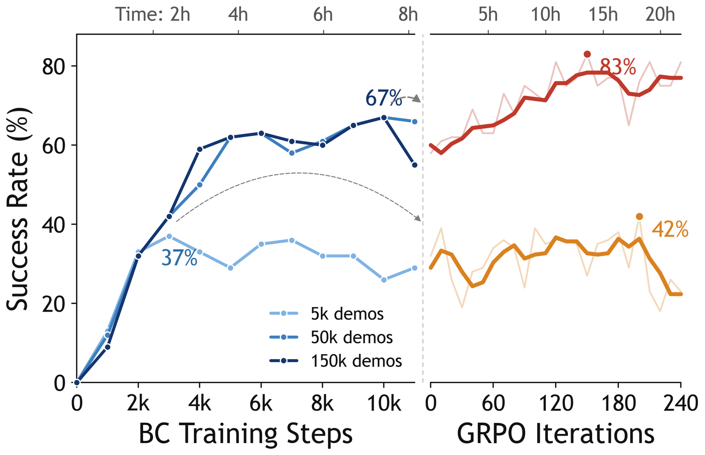
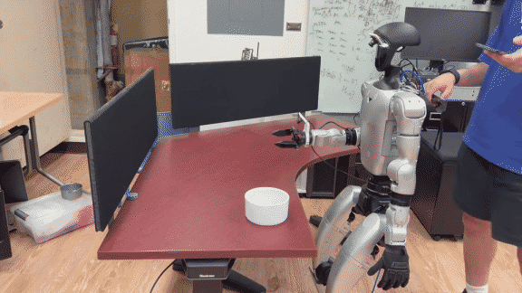

데이터를 더 모으면 성능이 오른다는 전제는 어디까지 성립할까요. UCLA와 Allen AI·워싱턴대 연구진의 [FetchMan](https://orayyan.com/fetchman.html)은 그 전제가 깨지는 지점을 그래프 한 장으로 보여줍니다. 시뮬레이션 장면 15만 개에서 합성 시연을 만들어 행동 복제(behavior cloning)로 휴머노이드를 학습시켰는데, 시연을 5만 개에서 15만 개로 늘려도 성공률이 같은 자리에 머물렀어요.

<figure class="fig"><figcaption>왼쪽 패널에서 50k와 150k 곡선이 겹쳐 67%에 머문다. 5k에서 출발한 오른쪽 주황 곡선은 정제해도 42% 언저리에서 멈춘다</figcaption></figure>
<em>행동 복제의 천장과 Flow-GRPO 정제 — 데이터를 세 배로 늘린 효과가 곡선에서 보이지 않는다(출처: Rayyan 외, FetchMan)</em>

## 데이터 생성은 장면을 무작위로 조립하는 파이프라인이에요

에피소드 하나를 만드는 절차가 다섯 단계입니다. Molmo Spaces에서 집을 하나 무작위로 뽑고, 물체를 하나 무작위로 뽑고, 충돌하지 않는 시작 자세와 A* 경로를 뽑은 뒤, 여러 축으로 도메인 랜덤화를 걸고, 상호작용 에피소드를 굴려요. 집이 약 15만 채, 물체가 약 5만 개입니다.

랜덤화 축 목록이 구체적입니다. 에피소드마다 텍스처, 조명별 위치·색·강도·점등 여부, 두 카메라의 내부 파라미터와 외부 파라미터, 물체를 받치는 면의 높이, 그 위에서의 목표물 자세, 그리고 명령별 행동 노이즈를 다시 뽑아요. 프로젝트 페이지가 축 하나씩만 다시 굴린 클립을 따로 두는데, 각 축의 효과를 분리해 보이려는 구성입니다.

랜덤화 축에 카메라 파라미터가 들어간 것은 실기 전이를 처음부터 겨냥한 선택으로 보여요. 실물 유니트리 G1의 카메라 장착 위치와 렌즈가 시뮬레이터 기본값과 정확히 같을 리 없으니, 그 차이를 학습 시점에 분포로 흡수시키는 방식입니다. 정책이 보는 것은 어안 렌즈가 달린 머리 카메라와 손목 카메라 두 스트림이고, 여기에 "Fetch the ○○" 형태의 텍스트 조건이 붙어요.

## 복제 천장은 데이터 양의 문제가 아니었어요

핵심 관찰은 이렇습니다. 대본으로 만든 시연자(scripted demonstrator)를 복제하면 정책이 그 시연자보다 한참 낮은 자리에서 포화하고, 시연을 더 줘도 움직이지 않아요. 단일 물체 설정에서 복제는 67%에서 평평해집니다. 5만 시연 곡선과 15만 시연 곡선이 그래프에서 겹치는 것이 그 증거예요.

Flow-GRPO는 복제된 정책에서 이어받아 같은 과제 위에서 계속 올라갑니다. 단일 물체에서 83%, 여러 물체 설정에서는 복제 40%가 62%까지 가요. 보상은 하나뿐입니다. 잡아서 들어 올리면 1, 아니면 0이에요. 조밀한 보상 설계 없이 성공 여부만 주는데도 복제가 못 넘던 곳을 넘습니다.

작동 원리를 저자들이 짧게 적어 둡니다. 롤아웃마다 플로우를 다섯 번의 가우시안 스텝으로 적분하고 각 추출이 닫힌 형태 가능도를 갖게 해요. 결정론적 오일러 스텝을 정류 플로우(rectified flow) 스케줄에 맞는 가우시안 전이로 바꾼 것이 Flow-GRPO의 실체이고, 그러면 스텝별 로그 가능도를 닫힌 형태로 얻어 정책 경사를 계산할 수 있습니다. 갱신 한 번마다 같은 리셋 상태에서 8개 에피소드씩 64그룹을 모으는데, 그룹 안의 에피소드들은 주입된 SDE 노이즈만 다릅니다. 노이즈만으로 결과가 갈리고 성공한 쪽이 강화되고 실패한 쪽이 밀려나요.

이득 판정에 가치 함수를 쓰지 않고 그룹 상대 수익을 표준화해 쓰며, 결과가 균일한 그룹은 버립니다. 전부 성공했거나 전부 실패한 그룹은 비교 신호가 없으니 학습에 기여하지 않기 때문이에요. 여기에 PPO식 이중 클리핑 목적함수와 얼린 복제 정책으로의 KL 페널티를 겁니다.

시작점의 질이 정제의 상한을 정한다는 관찰도 함께 나옵니다. 5천 시연으로 학습한 약한 체크포인트에서 같은 정제를 걸면 42% 언저리에서 멈춰요. 강화학습이 천장을 뚫는다고 해서 아무 데서나 출발해도 되는 것은 아닙니다.

## 강화학습의 이득이 걷기 쪽에만 붙어요

결과 표를 축별로 나눠 보면 어디가 개선됐는지가 분명합니다.

| 방법 | 시뮬 조작 | 시뮬 이동조작 | 실기 조작 | 실기 이동조작 |
|---|---|---|---|---|
| 시행 횟수 | 100 | 100 | 22 | 30 |
| BC | 75.0 ± 4.3 | 67.0 ± 4.7 | 72.7 ± 9.5 | 56.7 ± 9.0 |
| BC + RL | 79.0 ± 4.1 | 83.0 ± 3.8 | 77.2 ± 8.9 | 73.3 ± 8.1 |

이동조작(loco-manipulation)은 시뮬레이션에서 67%에서 83%로, 실기에서 56.7%에서 73.3%로 오릅니다. 조작만 떼어 보면 72.7%에서 77.2%로 거의 움직이지 않아요. 저자들의 설명이 간결합니다. 파지는 이미 잘 복제되었고 걷기는 그렇지 않았다는 거예요.

행동 비교 클립을 보면 무엇이 달라졌는지 보입니다. 복제된 정책은 물체가 가까워지면 베이스를 거의 다시 놓지 않는데, 정제된 정책은 다시 놓고 걷기와 조작 사이를 더 쉽게 오갑니다. 대본 시연자가 만든 궤적에는 그 재배치가 최적의 형태로 들어 있었을 텐데, 복제는 관측에서 그 결정으로 가는 대응을 학습하지 못했어요. 결과만 보고 강화하는 쪽이 그것을 찾아냅니다.

<figure class="fig"><figcaption>Flow-GRPO로 정제한 정책의 실기 롤아웃. 원문 페이지는 이 클립을 복제 정책 클립과 나란히 두는데, 여기서는 정제된 쪽만 옮겼다</figcaption></figure>
<em>실물 유니트리 G1 제로샷 배포 — 실기 학습 데이터나 미세조정 없이 시뮬레이션 학습만으로 돈다(출처: Rayyan 외, FetchMan)</em>

## 전이를 지탱한 것은 두 가지 설계 선택이었어요

이 논문에서 가장 값이 나가는 실험은 성공률 표가 아니라 절제 실험입니다. 시뮬레이션에서 실물로의 전이를 실제로 지탱한 것이 두 가지라고 저자들이 지목하는데, 얼린 DINOv3 인코더와 델타 행동 목표예요. 둘 중 하나만 바꿔도 전체 과제의 실기 성공률이 0으로 무너집니다.

| 변형 | 시뮬 조작 | 시뮬 이동조작 | 실기 조작 | 실기 이동조작 |
|---|---|---|---|---|
| DINOv3 + 델타 | 75.0 ± 4.3 | 67.0 ± 4.7 | 72.7 ± 9.5 | 56.7 ± 9.0 |
| SigLIP으로 교체 | 58.0 ± 4.9 | 42.0 ± 4.9 | 8.3 ± 8.0 | 0.0 |
| 절대 행동으로 교체 | 62.0 ± 4.9 | 45.0 ± 5.0 | 16.7 ± 10.8 | 0.0 |

실기 시행 수는 기준 구성이 조작 22회·이동조작 30회, 절제 변형이 각각 12회·10회입니다.

**이 표에서 읽어야 할 것은 시뮬 열과 실기 열의 낙차입니다.** SigLIP으로 바꾼 변형은 시뮬레이션 이동조작에서 42.0%를 냅니다. 기준의 67.0%보다 낮지만 무너진 값은 아니에요. 그런데 같은 정책이 실기에서 0.0%입니다. 절대 행동으로 바꾼 변형도 시뮬 45.0%에서 실기 0.0%로 떨어져요. 시뮬레이션 지표만 보고 있었다면 두 변형 모두 "조금 나쁜 설정"으로 보였을 것이고, 그 판단은 실기에서 완전히 틀립니다.

행동 표현 쪽 설계도 구체적입니다. 얼린 DINOv3 ViT-B/16이 카메라마다 패치 토큰을 내고 고유수용성이 상태 토큰 하나가 되며, DiT 형태의 행동 헤드가 명령 16개를 예측해 앞의 8개만 실행해요. 그리고 11차원의 절대 목표를 청크별 델타로 재매개화합니다. 절대 목표를 그대로 쓰면 시뮬레이터의 좌표 원점과 실물의 원점이 어긋난 만큼이 그대로 오차가 되는데, 델타는 그 오프셋에 둔감해요.

## 수집량을 늘리기 전에 천장부터 확인할 문제로 읽었어요

이 논문이 제 SO-101 자동 픽앤플레이스 수집 계획에 던지는 질문은 분명합니다. 에피소드를 더 모으는 것이 지금 성능을 올릴 수 있는 구간인지 먼저 확인해야 한다는 거예요. FetchMan의 곡선에서 5만과 15만이 겹친다는 것은 그 구간에서 데이터를 세 배로 늘리는 데 든 비용이 성능으로 전혀 환산되지 않았다는 뜻입니다. 자동 수집은 그 비용을 싸게 만들 뿐 이 천장을 옮기지 못해요.

절제 실험 쪽 교훈은 채점 기준으로 곧장 옵니다. 정확도를 시뮬레이션에서만 매기면 실기에서 0이 될 설정을 걸러낼 수 없어요. 여기서 실기 시행 수는 아주 적습니다. 기준 구성이 조작 22회와 이동조작 30회이고, 절제 변형은 각각 12회와 10회예요. 그렇게 적은 시행으로도 판정이 갈린 것은 결과가 0.0%였기 때문입니다. 시뮬에서 42~45%를 내던 설정이 실기에서 한 번도 성공하지 못했다는 사실은 표본이 10회여도 시뮬 지표를 신뢰할 수 없다는 신호로 충분해요. 반대로 두 변형 사이의 우열처럼 값이 붙어 있는 비교는 이 표본 수로 가릴 수 없습니다.

같은 문제를 시뮬레이터 쪽에서 다룬 [[2026-07-30_실패하는_자리까지_똑같아요|시뮬레이션을 훈련장이 아니라 계측기로 검증한 Real-to-Sim-to-Real]]와 나란히 두면 방향이 반대입니다. 그쪽은 시뮬레이터가 실기를 얼마나 정확히 재는지를 검증했고, FetchMan은 시뮬레이터를 계측기로 믿지 않고 실기 시행으로만 최종 판정을 내려요. 시뮬 성능이 절반쯤 남았는데 실기가 0이 되는 사례가 그 불신의 근거입니다.

---
<!-- src-block -->
출처 — https://orayyan.com/fetchman.html
