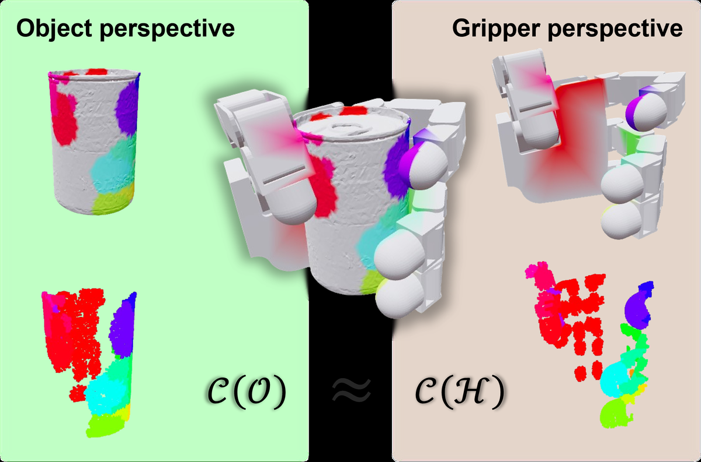
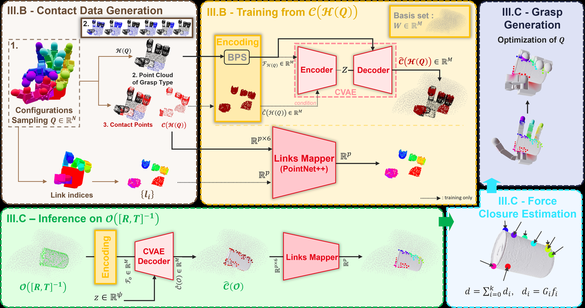
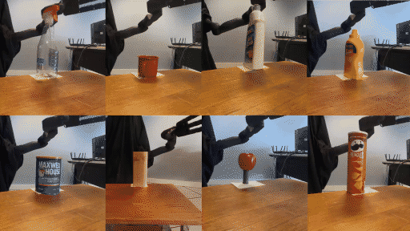

다지(multifingered) 그리퍼로 물건을 집는 계획기는 대개 "이 물체는 이렇게 잡는다"는 예시 묶음으로 학습합니다. 그래서 학습에 쓴 물체 집합을 벗어나면 성능이 떨어지는데, 모델 용량이 아니라 데이터가 물체 기하에 묶여 있다는 문제예요. CEA List와 Ecole Centrale de Lyon 연구진의 [GOAG](https://arxiv.org/abs/2608.19759)는 학습 단계에서 물체를 한 번도 보지 않는 파지 계획기를 제안합니다.

## 접촉면은 물체의 성질이 아니라 두 기하의 교집합이에요

출발점은 관찰 하나입니다. 파지가 성립하는 순간 그리퍼 표면과 물체 표면은 접촉 지점에서 같은 기하를 공유해요. 그러니 "물체 위의 어디를 잡을 것인가"로 정의하던 접촉 영역을 뒤집어 "그리퍼 표면의 어디가 물체에 닿는가"로 정의할 수 있습니다. 물체를 그리퍼 좌표계로 역변환해서 보면 같은 접촉 영역이 그리퍼 쪽 부분집합으로 표현돼요.

<figure class="fig"><figcaption>물체 관점의 접촉 영역과 그리퍼 관점의 접촉 영역은 사실상 같은 집합이다</figcaption></figure>
<em>GOAG 패러다임 — 접촉 영역을 물체가 아니라 그리퍼의 고유 성질로 다시 정의한다(출처: Mérand 외, GOAG)</em>

이 재정의가 실용적인 이유는 오른쪽 그림이 물체 없이도 만들어진다는 데 있어요. 그리퍼의 관절 한계 안에서 자세를 뽑고 어느 표면이 닿는지 표시하면 됩니다. 물체는 추론할 때 처음 등장해요.

## 파지 분류 체계가 무작위 샘플링을 대신해요

학습 데이터는 전부 합성입니다. 그리퍼의 운동학 한계 안에서 관절 구성 Q를 균등 샘플링해 10,000개를 뽑고, 각 구성마다 파지 분류 체계(grasp taxonomy)에서 유형 하나를 골라 그 유형이 허용하는 영역 안에서만 접촉점을 50벌씩 뽑았어요. 결과는 라벨 붙은 점군 3,000,000개입니다.

여기서 분류 체계를 쓰는 이유가 중요해요. 표면에서 접촉점을 무작위로 뽑아도 데이터는 채워지지만, 그렇게 뽑힌 조합은 손가락들이 협응하지 않는 임의의 점 모임이 되기 쉽습니다. 사람 손 파지 분류에서 로봇 그리퍼에 맞는 6종을 골라 각 유형의 허용 영역을 정해 두면, 뽑히는 표본이 전부 운동학적으로 말이 되는 조합이 돼요. 저자들은 이 6종이 기계공 작업 시간의 92.5%, 가사 노동 시간의 96.2%를 차지한다는 선행 연구를 근거로 듭니다.

데이터 생성 비용이 이 설계의 직접적인 결과예요. 전체 생성에 RTX 4090 한 장으로 약 1 GPU 시간이 들었습니다. 비교 대상인 GenDexGrasp는 A100 기준 1,400 GPU 시간을 보고했어요. 물체별로 시뮬레이터를 돌려 안정 파지를 검증하는 과정이 통째로 빠지기 때문입니다.

## 그리퍼 작업공간을 기저 점집합으로 삼아요

가변 길이 점군을 고정 크기 벡터로 바꾸는 데는 기저 점집합(Basis Point Set, BPS) 인코딩을 씁니다. 미리 정한 기저점 M개에서 입력 점군까지의 최근접 거리를 재 M차원 벡터를 만드는 방식이에요. GOAG는 이 기저점을 바운딩 박스가 아니라 그리퍼의 운동학적 작업공간을 이산화해 잡습니다. 손바닥 기준 좌표계에서 손가락이 닿을 수 있는 부피에만 기저점이 몰리니, 파지가 일어나는 영역에 표현력이 집중돼요. 논문은 M을 8,192로 두었습니다.

거리는 유클리드 거리가 아니라 표면 법선 정렬을 반영한 정렬 거리(aligned distance)예요. 법선이 어긋나면 값이 커지도록 지수 항을 붙여, 스치는 근접과 마주 보고 닿는 접촉을 구분합니다.

<figure class="fig"><figcaption>학습 경로는 그리퍼 점군만, 추론 경로는 물체 점군만 통과한다</figcaption></figure>
<em>GOAG 전체 구성 — CVAE가 접촉 분포를, PointNet++ 링크 매퍼가 접촉점과 지골의 대응을 맡는다(출처: Mérand 외, GOAG)</em>

학습되는 모델은 둘입니다. 하나는 조건부 변분 오토인코더(CVAE)로, 거리장과 접촉 라벨을 함께 받아 잠재 분포를 만들고 디코더가 접촉 가능도를 복원해요. 잠재 차원은 128, KL 항 가중치는 0.01이고, 복원 손실에는 접촉 가능도가 높은 기저점에 지수 가중(계수 3.0)을 걸어 접촉이 실제로 일어나는 영역의 정확도를 우선했어요. 다른 하나는 PointNet++ 기반 링크 매퍼로, 접촉점이 어느 지골(phalanx)에 대응하는지 라벨을 붙여요. 이게 없으면 뒤따르는 최적화가 어느 손가락을 어디로 보낼지 알 수 없습니다.

## 추론은 인코더를 건너뛰고 잠재 공간에서 샘플링해요

새 물체가 들어오면 역변환으로 그리퍼 좌표계에 놓고 같은 방식으로 거리장을 계산합니다. 그다음 인코더를 건너뛰고 표준정규분포에서 잠재 벡터를 뽑아 거리장과 함께 디코더에 넣어요. 디코더가 뱉은 접촉 가능도에서 임계값 0.8을 넘는 기저점만 남기면 이산 접촉점 집합이 됩니다. 예측을 물체 표면에 되투영하지 않고 작업공간에서 바로 다룹니다.

여기까지는 기하적으로 그럴듯한 접촉 지도일 뿐 물리적 안정성은 보장되지 않아요. 사전 검증된 파지 데이터로 학습한 방법들과 달리 생성 모델은 안정성을 따로 확인해야 해서, 포스 클로저(force closure) 추정이 뒤따릅니다.

포스 클로저는 접촉점들이 만들 수 있는 렌치(wrench, 힘과 모멘트를 묶은 6차원 벡터)의 볼록껍질 안에 원점이 내부점으로 들어 있는지를 보는 조건이에요. 원점이 내부면 어떤 외란도 접촉력 조합으로 상쇄할 수 있다는 뜻입니다. GOAG는 지골별로 접촉점 군집의 무게중심을 물체 표면에 투영해 접촉 위치를 하나씩 정하고, 쿨롱 마찰 모델에 마찰계수 0.3을 가정해 마찰원뿔 모서리 방향의 단위 힘들로 렌치 공간을 만들어요. 그리퍼 기준 좌표계에서 기하적 성립 여부만 보는 단계라 중력과 물체 무게는 넣지 않습니다.

조건을 만족하지 못하면 예측을 버리고 잠재 벡터를 새로 뽑아 다시 생성해요. 물체 자세가 작업공간 경계 근처처럼 조건이 나쁜 곳에 잡히면 탐색이 끝없이 이어질 수 있어서, 재샘플링은 최대 20회로 제한합니다.

다만 이 판정이 보장하는 범위는 좁습니다. 저자들은 이 단계가 무게중심으로 단순화한 접촉점들의 이론적 안정성만 검증한다고 못박아요. 포스 클로저를 통과한 접촉 분포도 실제로는 손가락이 닿을 수 없거나 물체 형상에 가로막힐 수 있어서, 최종 품질은 뒤이은 최적화와 시뮬레이션 검증으로만 판정됩니다.

마지막이 관절 최적화예요. 접촉 거리, 물체 관통, 자기 충돌, 관절 한계 네 항을 가중합한 에너지 함수를 최소화하는 관절값을 찾습니다. 가중치는 각각 1.0, 50.0, 0.1, 1.0으로 관통 항이 압도적으로 커요. 물리적으로 불가능한 해를 먼저 배제하겠다는 설계예요.

## 정확도보다 확장 특성이 더 눈에 띄어요

평가는 Isaac Gym에서 합니다. 최적화된 자세로 물체와 그리퍼를 놓고 ±xyz 방향으로 1초씩 외력을 가했을 때 물체가 원래 자세에서 2 cm 미만으로 벗어나면 성공이에요. MultiDex 테스트셋은 ContactDB와 YCB에서 온 물체 10개고, 방법마다 추론을 100회 돌렸습니다.

| 방법 | 물체 비의존 학습 | Barrett | Allegro | ShadowHand | 평균 |
|---|---|---|---|---|---|
| DFC | 예(학습 없음) | 83.10 | 82.71 | 72.15 | 79.32 |
| GenDexGrasp | 아니오 | 70.26 | 71.48 | 71.15 | 70.96 |
| DRO-Grasp | 아니오 | 78.30 | 75.80 | 63.30 | 72.47 |
| GOAG (포스 클로저 없이) | 예 | 86.30 | 91.20 | 74.70 | 84.07 |
| GOAG | 예 | 87.40 | 93.20 | 77.90 | 86.93 |

성공률 86.93%도 세 그리퍼 모두에서 기준선을 넘지만, 효율 쪽 숫자가 설계 차이를 더 잘 드러냅니다. 파지당 생성 시간이 GOAG는 그리퍼별로 0.18·0.19·0.20초인데, DRO-Grasp는 0.88·0.42·1.72초, GenDexGrasp는 9.78·16.45·14.65초, DFC는 1800초를 넘어요. 다만 단일 파지만 보면 DRO-Grasp가 더 빨라 보이는데, 그쪽은 파지마다 독립 최적화라 개수에 선형으로 비례해요. GOAG는 후보 전체에 에너지 함수 하나를 벡터화해 최소화하므로 초기 오버헤드가 있는 대신 다수를 뽑을 때 시간이 완만하게 늘어납니다. 위 수치는 파지 100개 총 시간을 하나로 나눈 값입니다.

포스 클로저를 뺀 변형(84.07%)이 기준선보다 여전히 높다는 것도 읽을 만합니다. 안정성 검사 없이도 이 정도가 나온다는 건 그리퍼 기하만 학습한 모델이 파지 역학을 어느 정도 암묵적으로 익혔다는 뜻이에요. 포스 클로저는 여기에 성공률을 조금 더 얹으면서 파지당 시간을 늘리는데, Barrett 기준으로 0.09초가 0.18초가 됩니다.

여기까지가 시뮬레이션 안의 이야기예요. 저자들은 같은 파이프라인을 실제 손에 올려 확인합니다.

<figure class="fig"><figcaption>Allegro Left Hand를 7자유도 팔에 달아 YCB 물체 11개를 집었다. 원본 영상의 앞부분만 잘랐다</figcaption></figure>
<em>실기 파지 실험 — 시뮬레이션에서 최적화한 관절 구성이 실제 물체 파지로 옮겨간다(출처: Mérand 외, GOAG)</em>

## 한 번 학습한 모델을 다섯 벤치마크에 그대로 넣었어요

일반화 평가가 이 논문의 핵심 실험입니다. 시뮬레이션 데이터셋 셋에 실기·사람 손 데이터셋 하나씩을 더해 물체 3,438개를 전부 Shadow Hand로 돌렸어요. 비교 대상들은 데이터셋마다 재학습했지만 GOAG는 Shadow Hand 운동학으로 한 번 학습한 모델 하나입니다. 아래 표에서 GraspTTA(평균 19.52%) 행은 뺐어요.

| 방법 | 데이터셋별 재학습 | DexGraspNet | UniDexGrasp | MultiDex | RealDex | DexGRAB | 평균 |
|---|---|---|---|---|---|---|---|
| UniDexGrasp | 예 | 33.9 | 23.7 | 21.6 | 27.1 | 20.8 | 25.42 |
| SceneDiffuser | 예 | 26.6 | 28.3 | 69.8 | 21.7 | 39.1 | 37.10 |
| UGG | 예 | 46.9 | 46.0 | 55.3 | 32.7 | 42.7 | 44.72 |
| DGA | 예 | 57.5 | 53.1 | 79.1 | 44.8 | 57.9 | 58.48 |
| GOAG | 아니오 | 43.07 | 49.51 | 77.90 | 37.37 | 62.13 | 53.97 |

평균 53.97%로 2위입니다. 1위인 DGA는 58.48%예요. 재학습 없이 낸 값이라는 조건을 감안하면 의미가 있지만, 논문이 최고 성능을 주장하는 게 아니라는 점은 분명히 해 둬야 합니다. 저자들도 이 결과가 볼록껍질을 110% 팽창시켜 자세를 균등 샘플링하는 단순한 전략에서 나왔고, 그리퍼 작업공간 안에 들어오는 크기의 물체에 잘 맞으며 **큰 물체에서는 이 방식이 덜 효과적**이라고 적었어요. 실제로 DexGraspNet과 RealDex에서 DGA에 크게 뒤지고 DexGRAB에서만 앞섭니다.

다양성의 출처가 다르다는 점도 한계입니다. GOAG는 그리퍼 중심이라 한 물체의 파지 다양성이 네트워크 출력의 성질이 아니라 물체 자세를 얼마나 폭넓게 샘플링했는지에 달려 있어요. 같은 자세에서 잠재 공간을 다시 뽑아 다른 파지 유형을 만들 수는 있지만, 물체 전체를 훑는 커버리지는 바깥의 자세 샘플링이 책임집니다.

학습과 추론이 다른 종류의 기하를 본다는 점도 남습니다. 학습 때 인코더에 들어가는 건 그리퍼 점군이고 추론 때는 물체 점군이라, 저자들 표현으로 내재적인 도메인 시프트가 있어요.

## 데이터를 줄이는 방향으로 읽어 볼 수 있어요

이 논문의 실질적인 기여는 성공률이 아니라 학습 데이터가 무엇에 묶여 있는지를 옮긴 것이라고 봅니다. 파지 데이터셋을 만드는 비용은 물체 수에 비례하고 그 물체 집합이 곧 일반화의 한계가 되는데, 접촉 조건을 그리퍼 쪽에 정의하면 그 비례가 끊어져요. 1,400 GPU 시간과 1 GPU 시간의 차이는 최적화 기법이 아니라 무엇을 데이터로 볼 것인가의 차이에서 나왔습니다.

같은 문제를 반대편에서 다루는 접근과 나란히 두면 대비가 선명해져요. [[2026-08-24_사람_손_시연에서_물성을_읽는_파지|사람 손 시연에서 물체 물성을 읽어 파지 힘을 맞추는 ViTacPhys]]는 물체마다 다른 무게와 마찰을 시연에서 읽어내 파지 힘을 조절합니다. 물체 고유의 성질을 더 정밀하게 획득하는 쪽이에요. GOAG는 반대로 물체 의존성을 학습에서 제거해 기하적 도달 가능성만 남깁니다. 둘은 경쟁이라기보다 층이 다른데, 어디에 손가락을 놓을지는 기하로 풀고 얼마나 세게 쥘지는 물성으로 푸는 분업이 자연스러워 보여요. GOAG의 포스 클로저가 마찰계수를 0.3으로 고정하고 중력을 무시하는 것도 그 층을 비워 둔 결과입니다.

---
<!-- src-block -->
출처 — [GOAG: Generative and Object-Agnostic Grasp Planner for Dexterous Robotic Manipulation](https://arxiv.org/abs/2608.19759) · CC BY 4.0 · 그림과 영상은 저자 프로젝트 페이지에서 인용, 영상은 GIF로 변환하며 앞 12초만 잘랐습니다.
