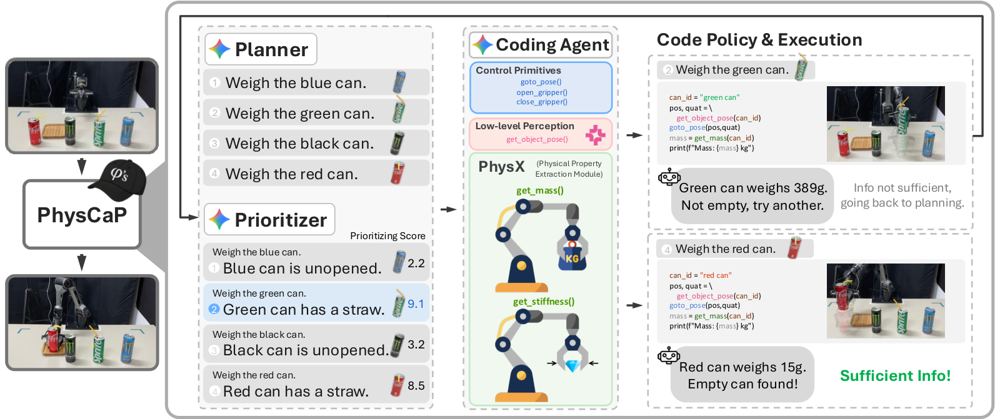
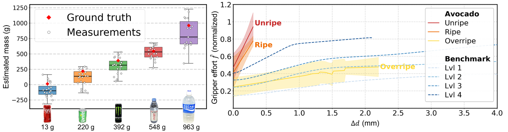

책상을 치울 때 사람은 캔을 들어 보거나 흔들어서 비었는지 확인합니다. 따지 않은 캔은 비어 있을 가능성이 낮다는 사전 지식을 써서 정보가 되는 행동만 고르고요. 국립대만대·양밍자오퉁대와 NVIDIA 연구진의 [PhysCaP](https://arxiv.org/abs/2608.21031)은 이 두 가지, 상호작용으로 물성을 재는 것과 어떤 상호작용이 정보가 되는지 고르는 것을 코드-애즈-폴리시(code-as-policy) 에이전트에 얹습니다.

문제 설정이 명확해요. 대규모 모방학습으로 학습한 VLA 정책은 옷 접기나 물체 재배치 같은 복잡한 조작을 잘 하지만, 과제 완수 행동을 재현할 뿐 정보를 구하는 상호작용을 배우지는 않습니다. 강화학습이 원리적으로는 그런 행동을 찾아낼 수 있지만 탐색 행동에 대한 보상이 희소하고 지연돼 표본 효율이 나쁘고, 나온 정책을 해석하거나 수정하기 어려워요.

<figure class="fig"><figcaption>Planner가 무엇이 빠졌는지 판단하고, Prioritizer가 만져 볼 순서를 정하고, 코드 생성기가 측정 모듈을 호출하는 프로그램을 쓴다</figcaption></figure>
<em>PhysCaP 전체 구성 — 코드-애즈-폴리시 위에 물리 정보 탐색 층을 얹었다(출처: Lin 외, PhysCaP · CC BY 4.0)</em>

## 질량은 토크 차이로, 강성은 죠 변위와 모터 부하로 재요

물성 추출 모듈 둘이 이 논문의 하드웨어 쪽 기여입니다. 둘 다 학습이 필요 없고 촉각 센서 같은 추가 감지 장비도 쓰지 않아요.

질량 모듈은 관절 토크만 씁니다. 파지점에서 엔드이펙터를 15 cm 들어 올리는 고정 궤적을 정해 두고, 먼저 빈손으로 그 궤적을 돌며 기준 토크를 기록한 뒤 물체를 쥐고 같은 궤적을 반복해요. 측정 자세에서 짧게 멈춰 진동이 가라앉기를 기다립니다. 두 토크의 차이가 물체의 중력 기여만 남기고, 여기에 수직 방향으로 투영한 엔드이펙터 야코비안을 써서 질량을 계산해요. 야코비안을 끼워 넣는 이유는 국소 기구학 구성을 반영해 물체를 어디에 놓았든 같은 값이 나오게 하려는 것입니다.

강성 모듈이 더 흥미로워요. 그리퍼 죠 변위와 정규화된 모터 부하만으로 물체의 단단함을 추정하는데, 두 단계로 돕니다. 첫 단계는 진짜 접촉을 감지하는 것이에요. 그리퍼를 조금씩 닫으면서 실제 힘 반응이 있는지 보는데, 여기에 내부 마찰을 배제하는 장치가 붙습니다. 죠를 살짝 되열어 보는 백오프 테스트를 해서 모터 부하가 그에 비례해 떨어지는지 확인해요. 그 반응이 관측될 때만 그 위치를 접촉 기준 변위로 저장합니다.

부하가 올라간 것만으로는 접촉의 증거가 되지 않고, 되열었을 때 부하가 비례해 내려가야 접촉입니다. 그리퍼 내부 마찰이나 기구적 저항도 부하를 올리기 때문이에요. 이 판별은 제가 SO-101 그리퍼에서 겪은 문제와 정확히 같은 자리에 있습니다. 상승 임계값을 기다리는 방식으로 접촉을 판정하면 실제 접촉 전에 이미 물체를 밀어 버리거든요.

둘째 단계에서 그리퍼를 계속 닫으며 변위와 부하 쌍을 기록하다가 목표 부하 0.50에 도달하면 멈추고, 선형 보간으로 그 지점의 변위를 얻어 변형량을 냅니다. 이 값을 보정된 임계값으로 1(초연질)에서 5(강체)까지의 이산 강성 등급에 대응시켜요. 세션마다 물체당 다섯 번 재고 다수결로 최종 값을 정합니다.

## 언제 만져 볼지와 어떤 순서로 만져 볼지를 나눴어요

능동 탐색을 넣으면 정보가 부족한 채로 행동하는 것과 환경을 과도하게 만지는 것 사이에 트레이드오프가 생깁니다. PhysCaP은 이것을 에이전트 둘로 나눠 다뤄요.

Planner는 현재 관측만으로 과제를 신뢰성 있게 수행할 수 있는지 판단합니다. 빠진 물리 정보를 짚어 필요할 때만 탐색을 시작하고, 충분한 증거가 모이면 탐색을 끝내는 동적 정지 기준 역할도 해요. 출력은 JSON 후보 목록인데 각 항목에 물체 이름과 설명, 그 물체를 탐색하면 얻을 것으로 기대되는 정보를 담습니다.

Prioritizer는 그 후보 집합을 다듬어요. 시각적 휴리스틱으로 말이 안 되거나 중복인 계획을 걸러내고 나머지에 우선순위 점수를 매깁니다. 논문이 든 예로 검은 아보카도가 잘 익었을 가능성이 있으니 확실히 안 익은 초록 아보카도보다 먼저 확인하는 식이에요.

둘을 하나로 합치면 안 되는지도 실험으로 확인했습니다. Planner와 Prioritizer를 한 에이전트로 합쳐 모든 프롬프트를 하나의 큰 문맥으로 준 초기 변형이 표에 함께 실려 있는데, 성능이 약간 떨어져요. 저자들의 해석은 모델이 추론 과정에서 관련 시각 휴리스틱을 짚어내면서도 구조가 없는 전수 실행 계획으로 무너지는 경우가 잦다는 것입니다.

## 실행 시간이 짧은 것이 좋은 신호가 아니에요

실기 평가는 7자유도 AgileX PiPER 팔과 ZED 2i 깊이 카메라로, 과제마다 10회씩 진행했습니다. 지표가 셋인데 성공률, 상호작용 물체 수, 실행 시간이에요. 상호작용 수와 시간은 성공한 시행에 대해서만 평균을 냅니다.

| 방법 | 과제1 SR | 과제1 OI | 과제1 시간 | 과제2 SR | 과제2 OI | 과제2 시간 | 과제3 SR | 과제3 OI | 과제3 시간 |
|---|---|---|---|---|---|---|---|---|---|
| CaP | 10/10 | 3 | 75.51 s | 2/10 | 2.5 | 71.71 s | 1/10 | 1 | 26.38 s |
| CaP+PhysX | 10/10 | 2.7 | 76.91 s | 7/10 | 3.9 | 268.08 s | 9/10 | 4 | 515.61 s |
| CaP+PhysX+Planner | 9/10 | 3 | 104.11 s | 7/10 | 4 | 274.14 s | 8/10 | 4.125 | 563.29 s |
| PhysCaP-joint | 8/10 | 2.125 | 65.91 s | 7/10 | 2.7 | 241.62 s | 7/10 | 2.71 | 384.39 s |
| PhysCaP | 9/10 | 1.33 | 40.48 s | 8/10 | 2.5 | 239.0 s | 9/10 | 2 | 300.47 s |

시각 전용 기준선 CaP의 아보카도 과제 행이 이 표의 함정을 드러냅니다. 실행 시간 26.38초로 전체에서 가장 빠른데 성공률이 1/10이에요. 물리 상태에 접근하지 못한 채 무작위로 고르니 빨리 끝나고 빨리 틀립니다. 저자들도 CaP의 겉보기 시간 우위가 과제 완수를 심각하게 희생한 대가라고 못박아요. 효율 지표를 성공률과 떼어 읽으면 정확히 반대 결론이 나옵니다.

PhysX 모듈을 붙이면 성공률은 오르지만 효율이 나빠져요. CaP+PhysX는 아보카도 과제에서 9/10을 내는 대신 물체 4개를 전부 만지고 515.61초를 씁니다. 탐색 추론이 없어 단순한 공간 순서로 모든 물체를 시험하기 때문이에요. Planner를 더하면 정지 기준이 생기지만 상호작용 대상이 여전히 무작위라 이 과제에서는 오히려 4.125개로 늘고 563.29초가 됩니다. Prioritizer까지 갖춘 전체 모델이 2개, 300.47초로 내려와요.

<figure class="fig"><figcaption>왼쪽 상자그림의 폭이 절대 추정의 한계를 그대로 보여준다. 오른쪽은 아보카도 세 상태가 3D 프린트 버튼 벤치마크 등급에 어떻게 대응하는지다</figcaption></figure>
<em>PhysX 모듈 정량 검증 — 질량은 상대 비교, 강성은 등급 구분이 실제 신호다(출처: Lin 외, PhysCaP · CC BY 4.0)</em>

## 저자들이 오라클 테스트로 하드웨어 잡음 비용을 분리했어요

모듈 검증 절이 이 논문에서 제가 가장 눈여겨본 부분입니다. 13 g부터 963 g까지 기준 질량 다섯 개를 각각 20회씩 재는데, 왼쪽 상자그림을 보면 절대 추정값의 산포가 상당해요. 13 g 물체는 추정값의 중앙값이 0 g 아래로 내려가 상자가 0선을 걸치고, 963 g 물체의 수염은 아래쪽으로 상자 높이만큼 더 내려갑니다. 저자들이 쓰는 표현도 그에 맞춰 조심스러운데, 상대적인 질량 차이를 안정적으로 포착해 빈 용기와 찬 용기를 구분하는 신호가 된다는 쪽이에요.

그리고 그 잡음이 과제 성공에 얼마나 비용을 물리는지를 오라클 테스트로 분리합니다. 실행 파이프라인에서 하드웨어가 준 질량값을 참값으로 갈아 끼웠더니 빈 캔 찾기 과제 성공률이 8/10에서 10/10이 되었어요. **남은 실패 둘이 추론의 문제가 아니라 측정의 문제였다는 것을 이 한 번의 실험이 가릅니다.** 실패 원인을 어느 층에 귀속시킬지를 추측이 아니라 실험으로 정한 사례예요.

강성 쪽 검증도 같은 성격입니다. 고무줄을 더해 탄성 저항을 체계적으로 조절할 수 있는 3D 프린트 버튼 기구를 만들어 기계적 기준선을 세우고, 그 위에 아보카도 데이터를 겹쳐 봤어요. 덜 익은 아보카도가 고무줄 여러 개짜리 버튼에, 잘 익거나 너무 익은 것이 더 적은 개수에 대응합니다. 유기물의 연속적인 물성을 재현 가능한 인공 기준물로 눈금 매긴 방식이라 다른 그리퍼로 옮길 때도 같은 절차를 쓸 수 있어요.

시뮬레이션 비교에서는 VLA 쪽이 무너집니다. LIBERO에 빈 컵 찾기 과제를 재현했는데 OpenVLA가 0%, π₀.₅가 4%, MolmoAct2가 23%예요. PhysCaP은 78%에 상호작용 1.44회입니다. 저자들의 해석은 이 모델들이 가설 주도 탐색 기제 없이 시각을 행동으로 직접 대응시키기 때문에 잠재적 물리 불확실성이 있으면 실패한다는 것이고, MolmoAct2의 낮은 상호작용 수 1.04는 효율이 아니라 대개 무작위로 골랐기 때문이라고 덧붙여요.

한계는 셋으로 정리합니다. 상용 VLM API에 의존해 지연과 추론 변동이 예측 불가능하다는 점, 물체 위치가 단일 카메라 깊이에 매핑된 2D 예측에 의존해 2D 오차가 3D 엔드이펙터 정밀도를 그대로 깎는다는 점, 그리고 PiPER 팔과의 통신 지연 때문에 실제 궤적이 생성된 코드에서 이따금 벗어난다는 점이에요.

## 판정 프로브를 수집 루틴 안에 넣는 문제로 읽었어요

이 논문이 제 SO-101 픽앤플레이스 자동 수집에 주는 것은 물성 추정 자체보다 백오프 테스트의 논리입니다. 파지가 성립했는지를 그리퍼 명령값이나 부하 상승으로 판정하면 틀리는데, 되열었을 때 부하가 비례해 내려가는지를 보면 갈립니다. 이건 추가 센서 없이 지금 하네스에 넣을 수 있는 프로브예요. 자동 수집에서 에피소드마다 파지 직후 짧은 백오프를 넣으면 성공·실패 라벨이 사후 영상 판독이 아니라 실행 중에 나옵니다.

정확도로 점수를 매기겠다는 계획도 이 표를 보고 나면 한 겹 더 필요해 보여요. 성공률만 기록하면 CaP의 아보카도 행 같은 결과를 좋게 읽게 됩니다. 상호작용 횟수나 실행 시간 같은 효율 지표를 함께 남기되 성공한 시행에 한정해 집계하는 규약까지 같이 정해 두는 편이 낫겠어요. 이 논문이 그 단서를 표 캡션에 명시해 둔 것도 그래서일 겁니다.

물성을 파지 힘에 반영하는 쪽을 다룬 [[2026-08-24_사람_손_시연에서_물성을_읽는_파지|사람 손 시연에서 물체 물성을 읽어 파지 힘을 맞추는 ViTacPhys]]와 나란히 두면 정보를 얻는 경로가 갈립니다. 그쪽은 사람 시연 영상에서 물성을 읽어내고, PhysCaP은 로봇이 직접 만져서 잽니다. 시연이 없는 물체에 대해서는 후자만 쓸 수 있고, 대신 만지는 데 시간과 위험이 들어요. Prioritizer가 하는 일이 정확히 그 비용을 줄이는 것입니다.

---
<!-- src-block -->
출처 — https://arxiv.org/abs/2608.21031
