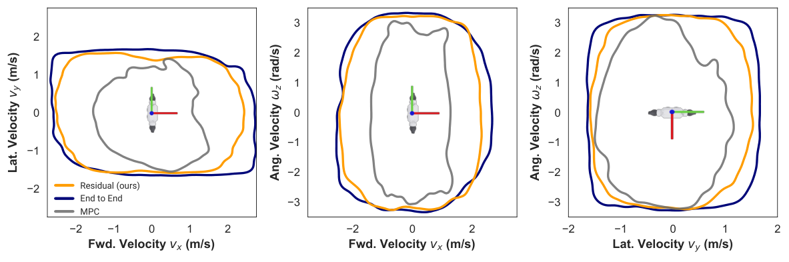

모델 예측 제어(MPC)와 강화학습을 섞는 시도는 오래됐지만, 섞은 뒤에 학습이 정확히 무엇을 고쳤는지 읽어내는 일은 드뭅니다. MIT와 고려대 연구진의 [Residual MPC](https://arxiv.org/abs/2510.12717)는 두 출력을 토크 수준에서 더하는 잔차 구조를 만들고, 그 잔차가 언제 커지고 어느 방향을 향하는지를 분석해 이 질문에 답합니다.

두 방법의 약점이 서로 대칭이라는 것이 출발점이에요. MPC는 물리 모델에 근거해 해석 가능하고 조정 가능하지만, 성능이 잦은 재계획과 온라인 최적화에서 나오기 때문에 가정한 모델의 부정확성에 취약합니다. 지형 형상이나 지면 마찰, 구동기 비선형성, 모델링되지 않은 컴플라이언스 같은 작은 불일치가 재계획 사이에 누적되면 제어기가 불안정해져요. 강화학습은 그런 것에 강한 대신 왜 그 행동을 골랐는지가 불투명하고, 보상 가중치나 환경 랜덤화의 작은 변화가 정책을 크게 바꾸며, 때로는 물리적으로 그럴듯한 보행 대신 시뮬레이터의 수치적 인공물을 이용하는 쪽으로 갑니다.

## MPC를 학습 루프 안에서 100 Hz로 돌려요

이 논문의 공학적 기여는 MPC를 GPU에서 병렬 평가한 것입니다. 저자들이 비교로 든 선행 연구는 MPC를 학습 루프에 넣되 2~3 Hz로 평가했는데, 여기서는 정책과 같은 주파수인 100 Hz로 돌려요. IsaacGym에서 병렬 환경 수는 병렬 MPC의 VRAM 제약 때문에 2048로 제한했습니다.

CasADi 객체를 CUDA 커널로 풀어 컴파일하는 것이 병목이 됩니다. CasADi 함수가 수백만 개 명령어를 담을 수 있어서 커널이 수백만 줄짜리 코드가 되기 때문이에요. cuDSS를 써서 가장 비싼 단계인 KKT 분해와 백솔브의 커널 컴파일을 피했습니다. QP 반복 횟수는 초기 속도를 무작위로 흩뜨린 뒤 5초 안에 생존하는 로봇 비율로 정했는데, 해가 충분히 좋아지고 나면 반복을 더해도 한계 이득이 급격히 줄어들어 보수적으로 25로 고정했어요. 실기 배포에서는 CPU 단일 스레드로 200~300 Hz에 평가됩니다.

비용을 솔직하게 적어 둔 대목이 읽을 만해요. CPU 10코어가 완벽히 병렬화된다고 낙관적으로 가정하고 CPU-GPU 전송 시간을 빼도, GPU 평가가 환경 1,000개 기준으로 약 2.5배 빠릅니다. 평가 시간의 70.7%는 ADMM 반복에 쓰여요. 그래도 시뮬레이션 한 스텝에 0.5초가 걸리고 PPO 반복당 24스텝이면 경사 갱신 한 번에 12초, 종단간 강화학습보다 약 8배 느립니다. PPO 1,000회 기준으로 종단간이 30분인데 잔차는 3~4시간이에요.

저자들이 이 비용을 정당화하는 방식이 이 논문의 논지입니다. 보상 가중치와 환경 파라미터를 고통스럽게 만지는 것보다 MPC 사전분포가 정책을 더 신뢰성 있게 유도한다는 거예요.

## 보상을 일부러 최소로 뒀어요

보상 설계에서 그 주장이 드러납니다. MPC를 모방할 전문가가 아니라 정책을 좋은 상태로 이끄는 사전분포로 다루기 때문에, 보상은 MPC 목적과 대체로 정렬시키되 온라인 최적화에서 다루기 어려운 비미분·희소 항만 추가했어요. 자기 충돌 회피와 종료 조건이 그것입니다.

발 유도, 체공 시간, 접촉 스케줄링 같은 구체적인 보상은 일부러 뺐어요. 목록은 선속도 추종 10.0, 각속도 추종 5.0, 1차 행동 변화율 -1e-3, 2차 행동 변화율 -1e-4, 토크 -1e-4, 자세 1.0, 높이 1.0, 관절 정규화 1.0, 자기 충돌 -1.0, 종료 -100으로 끝입니다. 보행 스타일을 빚는 항이 하나도 없어요.

블렌딩 방식도 세 가지를 비교합니다. MPC가 토크를 내는데 정책은 대개 관절 목표값으로 학습되기 때문에 어디서 합칠지가 문제가 돼요. 관절 행동을 관절 공간에서 섞는 방식, 관절 행동을 토크로 바꿔 섞는 방식, 토크 행동을 토크에 바로 더하는 방식 셋 중에 토크 공간 표현이 눈에 띄게 나쁩니다. 토크 표현은 관절을 가속도 수준에서 제어해 정책이 이득이 큰 행동을 매끄럽게 탐색하기 어렵고, 행동의 스케일 자체도 관절 공간보다 훨씬 큽니다.

앞의 둘은 성능이 비슷한데 최종 선택은 두 번째예요. 이유가 실용적입니다. MPC 해가 발산하면 첫 번째 방식은 실현 불가능할 수도 있는 MPC 목표값을 기준으로 행동을 내게 되는데, 두 번째는 기본 관절 위치를 기준으로 삼아 MPC 해와 무관하게 합리적인 출력을 보장해요.

## 추종 가능 속도가 넓어지지만 넓다고 좋은 게 아니에요

성능 평가는 명령을 무작위로 흩뿌린 뒤 추종 오차가 0.25 m/s 미만인 명령만 달성으로 보고 그 영역의 95% 커널 밀도 경계를 그립니다. 잔차 정책은 MPC 기준선 대비 전진 속도에서 약 78%, 측방 속도에서 12%, 요 각속도에서 9% 넓어져요.

<figure class="fig"><figcaption>세 축 조합 모두에서 회색 MPC 영역이 가장 좁다. 남색 종단간이 주황 잔차보다 넓지만 그것이 좋은 신호는 아니다</figcaption></figure>
<em>추종 가능한 속도 명령의 95% 밀도 경계 — 잔차가 모델 기반 기준선의 작동 범위를 넓힌다(출처: Jeon 외, Residual MPC · CC BY 4.0)</em>

여기서 저자들이 자기 그림을 스스로 경계하는 대목이 중요합니다. 잔차와 종단간의 성능이 비슷하고 그림에서는 종단간 쪽 영역이 더 넓은데, 종단간 정책이 하드웨어에 올라갈 수 있을 것 같지 않다고 적어요. 그 속도가 시뮬레이터 접촉 동역학의 수치적 불규칙성을 이용해 얻어진 것으로 보인다는 것입니다. 실제로 같은 보상으로 학습한 종단간 정책은 발로 지면을 빠르게 두드리며 미끄러지듯 이동하는 비현실적인 활강 동작을 보였어요.

**넓은 작동 범위가 좋은 제어기의 증거가 아니라 시뮬레이터를 잘 착취한 증거일 수 있다는 뜻입니다.** 그래서 저자들은 지표를 하나 더 붙이는데, 잔차 정책이 모든 지표에서 종단간보다 낮은 중앙값과 좁은 산포를 보인다는 분포 비교예요. 실기 전이 가능성을 그 쪽으로 판단합니다.

미분 불가능한 비용을 학습이 대신 맡는 사례도 구체적입니다. 이 MPC 정식화에는 자기 충돌 제약이 없어서 요 각속도 명령이 커지면 휴머노이드의 무릎이 회전 중에 반복적으로 부딪혔어요. 잔차 구조에서는 그 충돌이 완전히 사라지는데, 정책이 몸통 기준 높이를 올리고 스윙 궤적을 조정하는 법을 배웁니다. 자기 충돌 페널티가 학습 내내 꾸준히 줄어 수렴 시점에 0에 가까워져요.

## 잔차 토크의 방향이 진단 신호가 돼요

이 논문에서 제가 가장 흥미롭게 본 것은 성능이 아니라 분석 절입니다. 잔차 정책이 언제 얼마나 개입하는지를 잔차 토크와 MPC 토크의 크기 비로 재요. 순 관절 토크로 정규화하지 않은 이유도 적어 두는데, 두 토크가 서로 반대 방향일 수 있어서 그렇게 하면 실제 기여가 가려지기 때문입니다.

<figure class="fig"><figcaption>전진 속도를 기준으로 좌우가 갈린다. 세 번째 패널에서는 2사분면과 4사분면이 밝다</figcaption></figure>
<em>명령별 잔차 토크 비율 — 개입량의 지도가 MPC 정식화에서 빠진 것을 가리킨다(출처: Jeon 외, Residual MPC · CC BY 4.0)</em>

지도가 비대칭입니다. 잔차 비율이 전진 속도 명령과 양의 상관을 보이는데, 저자들은 MPC가 실제로는 뒤로 걸을 때 더 안정적이라 잔차에 덜 기댄다는 가설을 세워요. 측방 속도와 각속도 조합에서는 2사분면과 4사분면에서 비율이 높고 1·3사분면에서 낮은데, 이것이 자기 충돌 제약의 부재와 이어집니다. 측방 이동과 회전 방향이 어긋나면 휴머노이드가 안쪽으로 돌면서 앞으로 튀어나온 무릎이 부딪힐 위험이 생기고, 잔차가 그것을 피하려 적극적으로 개입해요. 반대 조합에서는 바깥으로 돌아 다리가 벌어집니다.

방향까지 보면 더 선명해져요. MPC 토크와 잔차 토크의 정규화된 내적을 접촉 위상에 걸쳐 그리면 잔차가 얼마나 적대적인지를 읽을 수 있습니다. -1이면 잔차가 MPC 토크를 정확히 반대 방향으로 상쇄하고, 1이면 순전히 더해서 MPC 토크를 배율만 바꾸는 셈이에요. 그림에서 잔차 토크는 접촉 전환 근처에서 MPC 출력을 거의 완전히 반대합니다. 잔차 비율도 위상이 전환에 가까워질 때, 즉 발이 지면에 닿기 직전에 올라가요.

닿는 순간이 모델 기반 제어가 가장 약한 자리라는 것을 이 두 그림이 함께 가리킵니다. 그리고 잔차가 무엇을 하는지도 드러나요. 원래 MPC 제어기는 뒤꿈치와 발끝이 동시에 착지하도록 제약되어 있는데, 잔차 정책은 그것을 조정해 발뒤꿈치-발끝 전이를 만들어 냅니다. 그런 행동을 유도하는 보상은 없었어요. 착지 속도가 위상 0.48과 0.52 근처에서 두 단계로 나뉘어 0으로 돌아가는데 뒤꿈치와 발끝이 따로 닿는 것으로 보이고, MPC 쪽은 단일한 뾰족한 봉우리 하나입니다.

## 학습 뒤에도 MPC 파라미터를 만질 수 있어요

분포 밖 적응 실험도 이 구조가 왜 유용한지를 보여줍니다. 학습이 끝난 뒤 MPC의 위상 파라미터를 바꿔 접촉 스케줄에 양발 지지 구간과 체공 구간이 생기게 했는데, MPC 단독으로는 안정적으로 걷지 못하는 그 걸음을 잔차 정책은 따라갑니다. 학습 중에 겪은 적 없는 접촉 모드예요.

평지에서만 학습했는데 울퉁불퉁한 지형과 계단식 경사 지형도 미세조정이나 도메인 랜덤화 없이 통과합니다. MPC 단독은 지면 높이 가정이 틀리자마자 실패해요. 단차가 큰 지형에서 발이 걸리는 문제는 MPC의 스윙 높이 파라미터를 0.075 m에서 0.15 m로 올려 해결했는데, 이 파라미터도 학습에서 건드린 적이 없습니다. 저자들 표현으로 놀랍게도 잔차 정책은 기저 MPC 파라미터 변경에 강건해서 학습 이후에도 행동을 조정할 수 있어요.

실기 검증은 MIT 휴머노이드에서 했고, MPC를 로봇 위에서 OSQP로 100 Hz에 돌리며 잔차 출력을 토크에 직접 더합니다. 여기서도 조심스러운 문장이 붙는데, 커스텀 시스템의 파손을 우려해 고각속도 자기 충돌 시험 같은 것은 하지 않았고, 배포 전에 접촉 동역학이 더 정확한 자체 시뮬레이터로 검증했을 때 MPC 단독에서조차 롤아웃에 상당한 불일치가 있었다고 적어요. 그것이 실기 전이 격차를 설명할 것이라고요.

## 개입량 지도를 만들 수 있는지를 봤어요

제 작업에 옮길 만한 것은 잔차 구조 자체가 아니라 분석 방법입니다. 두 제어 출력을 더하는 구조를 만들어 두면 학습된 쪽이 얼마나 개입하는지가 측정 가능한 양이 되고, 그 양을 명령 공간이나 위상에 걸쳐 그리면 기저 제어기가 어디서 부족한지가 지도로 나와요. 저자들이 자기 충돌 제약의 부재를 짚어낸 것도 성능 저하를 관찰해서가 아니라 개입량 지도의 사분면 패턴을 읽어서였습니다.

SO-101 픽앤플레이스에서도 같은 구조를 세울 수 있어 보여요. 기구학으로 푼 목표 자세와 정책이 낸 보정을 나눠 기록하면 보정이 커지는 구간이 데이터로 남습니다. 접촉 전환 근처에서 잔차가 커진다는 이 논문의 관찰은 파지 순간, 즉 그리퍼가 물체에 닿는 시점이 제 하네스에서도 같은 성격의 구간이라는 뜻이고, 정확도로 점수를 매길 때 실패가 그 구간에 몰리는지를 따로 세어 볼 근거가 됩니다.

보상을 최소로 두고 모델 기반 사전분포에 커리큘럼 역할을 맡긴 설계도 같은 성격이에요. 저자들이 향후 과제로 든 것 중 하나가 MPC 해가 반환하는 값으로 모델 기반 제어기의 불확실성을 추정해 네트워크와 MPC의 비중을 조절하는 것인데, 큰 외란이나 모델 파라미터 오차가 예측값에 스파이크를 만든다는 관찰이 근거입니다. 모델 내부에서 나오는 신호로 자기 확신을 재는 발상이라, [[2026-07-20_층을_나눈_제어가_잃는_것|계층 제어의 최적성 손실을 단일수준 축약으로 계산한 Bilevel MPC]]가 계층 분리의 비용을 계산으로 드러낸 것과 층이 다릅니다. 그쪽은 구조가 얼마를 잃는지를 재고, 이쪽은 구조 안에서 학습이 무엇을 메우는지를 잽니다.

---
<!-- src-block -->
출처 — https://arxiv.org/abs/2510.12717
