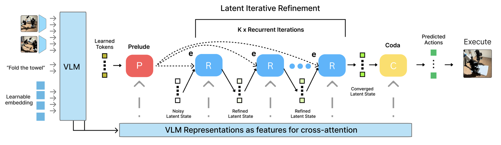
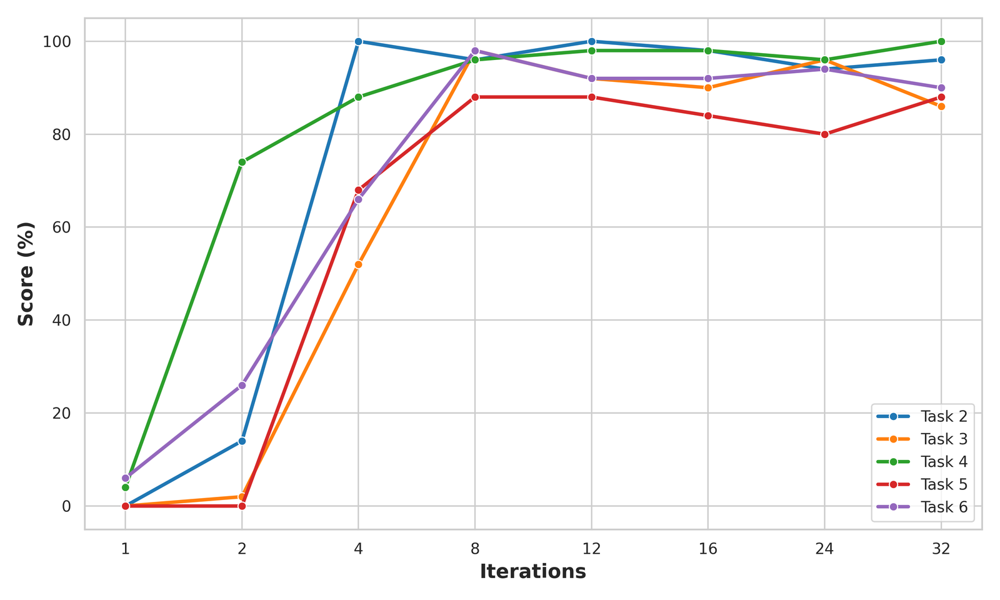

지금 대부분의 시각-언어-행동(VLA) 모델은 계산 깊이가 고정입니다. 그리퍼를 조금 조정하는 스텝과 어질러진 공간을 정밀하게 지나는 스텝이 같은 수의 파라미터를 통과해요. 스탠퍼드·뮌헨공대·워싱턴대·Allen AI 연구진의 [RD-VLA](https://arxiv.org/abs/2602.07845)는 그 깊이를 상태마다 다르게 두되, 사고 과정을 토큰으로 뱉지 않고 잠재 공간 안에서만 반복합니다.

## 출력 공간에서 추론하면 매번 이산화를 거쳐요

기존의 추론형 VLA는 대개 사고 사슬(Chain-of-Thought)을 텍스트나 하위 목표 이미지, 2D 궤적 같은 토큰으로 생성한 뒤 행동을 냅니다. 저자들이 지적하는 문제는 두 층입니다.

하나는 비용이에요. 추론 사슬 길이에 비례해 메모리가 늘고, 그 사슬을 학습시키려면 과제별로 큐레이션한 추론 데이터셋이 필요합니다. 물리적 조작의 추론은 언어보다 미묘하고 토큰화에 잘 맞지 않는데, 그것을 굳이 말로 옮기는 데 상당한 오버헤드가 든다는 지적이에요.

다른 하나가 더 근본적입니다. 이 모델들은 출력 공간에서 추론해요. 고차원 잠재 공간과 이산화된 저대역 출력 공간 사이를 반복해서 오가야 하는데, 연속적인 내부 상태를 손실 있는 이산 표현으로 접었다가 다음 추론 단계를 위해 다시 인코딩하는 순환이 원리적으로 불리합니다. 정보 병목과 양자화 잡음이 추론 충실도를 제한하고, 모델의 숙고가 환경의 연속적인 물리 동역학이 아니라 자기 출력 어휘의 해상도에 갇혀요.

디퓨전 정책과의 구분도 명시합니다. 디퓨전 정책도 여러 스텝의 정제를 거치지만 그것은 출력 공간에서 행동 궤적을 반복적으로 디노이징하는 것이에요. 다중 모드 분포를 모델링하는 데는 효과적이지만 근본적으로 생성적 샘플링 기법이지 숙고가 아니라서, 행동 신호를 다듬을 뿐 장면에 대한 표현 자체를 풍부하게 만들지 않습니다.

<figure class="fig"><figcaption>P는 중간층 특징으로 질의를 접지하고, R은 가중치를 공유한 채 K회 반복하며, C가 수렴한 상태를 행동으로 디코딩한다</figcaption></figure>
<em>RD-VLA 아키텍처 — 반복 깊이 K가 추론 시점에 과제 복잡도에 따라 바뀐다(출처: Tur 외, RD-VLA)</em>

## 잡음에서 시작하는 스크래치패드를 반복해서 닦아요

구조는 세 부분입니다. 비순환 인터페이스인 프렐류드(Prelude)와 코다(Coda)가 잠재 다양체 안팎으로 표현을 옮기고, 그 사이에 가중치를 공유하는 순환 코어(Recurrent Core)가 있어요.

프렐류드는 학습된 질의 8개를 받아 VLM 중간층 시각 특징에 교차 어텐션해 접지된 잠재 기반을 만듭니다. 여기에 나란히 잠재 스크래치패드를 고엔트로피 절단 정규분포에서 초기화해요. 이 잡음 초기화가 설계 의도인데, 모델이 특정 시작점에 과적합하지 않고 안정적인 정제 연산자를 배우게 하려는 것입니다. 스크래치패드는 모델이 반복해서 닦아야 하는 빈 작업대예요.

긴 언롤에서 표현이 붕괴하지 않게 매 스텝 입력을 다시 넣습니다. 순환 블록이 현재 스크래치패드 상태와 프렐류드가 준 고정 기반을 함께 보는 방식이에요. 어텐션의 키와 값은 과제 정렬 잠재 토큰 64개, VLM 최종층 시각 토큰 512개, 그리고 로봇의 현재 고유수용성으로 이루어진 조건 다양체입니다. 어떤 중간 상태도 유효한 표현이고 다음 상태가 그보다 엄격히 더 정제된 행동 계획이 되도록 설계했다고 적어요.

학습에서 반복 횟수를 고정하지 않는 것이 이 설계를 성립시킵니다. 무거운 꼬리를 가진 로그정규-푸아송 분포에서 반복 수를 뽑되 평균을 32로 두고, 절단 시간역전파(TBPTT)로 마지막 8회에만 경사를 흘리고 앞쪽은 경사를 끊어요. 그래서 어떤 잡음 초기값에서 출발해도 안정된 다양체로 정제하는 법을 배우고, 재학습 없이 추론 시점에 연산량을 늘릴 수 있습니다.

## 반복을 늘린 효과가 로그선형으로 나타나요

고정 반복 횟수를 1에서 32까지 바꿔 가며 LIBERO 전체 과제군을 잰 값이 이 논문의 뼈대입니다.

| 반복 | Spatial | Object | Goal | Long | 평균 |
|---|---|---|---|---|---|
| 1 | 9.0 | 12.2 | 11.4 | 1.0 | 8.4 |
| 2 | 38.0 | 61.2 | 47.6 | 15.0 | 40.5 |
| 4 | 79.2 | 93.0 | 89.2 | 74.8 | 84.1 |
| 8 | 93.0 | 97.8 | 94.2 | 85.2 | 92.6 |
| 12 | 92.0 | 99.0 | 96.0 | 84.8 | 93.0 |
| 24 | 92.4 | 99.2 | 94.2 | 86.6 | 93.1 |
| 32 | 91.4 | 98.8 | 93.8 | 84.4 | 92.1 |

반복 1회는 평균 8.4%로 거의 무작위입니다. 연산을 두 배로 할 때마다 40.5%(382% 증가), 84.1%(108% 증가), 92.6%(10% 증가)로 오르고 8~12회 사이에서 포화해요. 24회에서 93.1%로 정점을 찍지만 12회를 넘으면 수익이 급격히 줄고, 32회에서는 92.1%로 오히려 내려갑니다.

여기서 Long 열의 움직임이 가장 큽니다. 1회에서 1.0%, 4회에서 74.8%예요. 긴 지평 과제가 반복 깊이의 효과를 가장 크게 받는다는 뜻이고, 이것이 뒤따르는 과제별 분석의 출발점이 됩니다.

<figure class="fig"><figcaption>같은 과제군 안에서도 수렴 시점이 갈린다. 반복 2회에 이미 80% 가까이 닿는 곡선과 2회까지 0%에 머무는 곡선이 함께 있다</figcaption></figure>
<em>LIBERO Long 과제 다섯 개의 반복별 점수 — 필요한 깊이가 과제 맥락에서 저절로 드러난다(출처: Tur 외, RD-VLA)</em>

논문의 표현으로는 필요한 반복 수가 지정되는 것이 아니라 과제 맥락에서 창발합니다. 저자들이 든 예로 한 과제는 반복 1회의 6%에서 2회에 80% 가까이 뛰고, 다른 과제는 2회까지 0%에 머물다 3회는 되어야 70% 언저리에 닿아요. 고정 예산을 쓰면 앞의 과제에서는 낭비하고 뒤의 과제에서는 아예 실패합니다.

## 자기 수렴을 불확실성 대용으로 삼아요

적응적 연산의 정지 기준이 단순합니다. 연속한 두 반복의 행동 분포 사이 KL 발산을 행동 공간의 평균제곱오차로 근사하고, 그 값이 임계값 아래로 내려가면 멈춰요. 별도의 판정기나 난이도 라벨이 필요 없고 모델 자신의 수렴이 확신의 대용이 됩니다.

이진 적응 전략을 임계값 5×10⁻⁴로 두면 평균 반복 7.93회로 92.5%가 나옵니다. 고정 12회의 93.0%와 거의 같은 성능을 연산 34% 절감으로 낸 거예요. 세 가지 적응 전략이 같은 연산 예산에서 비슷하게 나온다는 관찰도 함께 적는데, 핵심은 특정 정지 기준이 아니라 조건 의존적으로 연산을 배분한다는 원리라고 해석합니다.

임계값을 느슨하게 잡으면 어디가 먼저 무너지는지도 표에 남아 있어요. 임계값 1×10⁻²에서 평균 반복이 3.36회로 줄면 Spatial은 74.6%로 버티는데 Long은 43.6%까지 떨어집니다. 순수 KL 전략에서는 Long이 33.8%예요. 연산을 줄일 때 손실이 균등하지 않고 긴 지평 과제에 몰립니다.

**여기서 더 흥미로운 것은 반복 깊이를 실행 지평에도 연결한 대목이에요.** 깊은 반복이 필요한 상태는 대개 불확실성이 높은 상태인데, 그런 구간에서 긴 행동 지평을 실행하면 초기 계획의 작은 오차가 시간에 걸쳐 누적된다는 관찰입니다. 그래서 수렴에 임계 이상의 스텝이 들면 실행 지평을 짧게 잘라 재계획을 자주 하게 만들어요. 저자들의 표현으로 복잡한 상태에서 효율보다 안전을 택하는 설계입니다.

## 0.5B가 7B 추론형 모델들을 앞서요

LIBERO 벤치마크에서 RD-VLA는 고정 반복 93.0%, 적응 92.5%로 비교 대상 전부를 앞섭니다. 토큰 추론 계열에서 가장 강한 Fast-ThinkAct가 89.7%(3B), MolmoAct가 86.6%(7B), ThinkAct가 84.4%(7B)예요. 종단간 계열에서는 SmolVLA가 88.8%, π₀-FAST가 85.5%입니다. RD-VLA의 백본은 0.5B로 7B 토큰 추론 모델들보다 14배 작아요.

긴 지평 연쇄를 보는 CALVIN ABC→D에서도 평균 연쇄 길이 3.39로 OpenVLA의 3.27을 앞서고, 다섯 과제를 연속으로 끝낸 비율이 45.3%입니다. 실기 실험은 양팔 YAM 로봇으로 큐브를 그릇에 넣기, 접시 닦기, 수건 접기, 빵 굽기 네 과제에서 진행했고, 고정 8회 구성이 접시 닦기에서 거의 100% 완료에 닿았어요. 적응 구성은 큐브 놓기에서 가장 높은 점수를 냈지만 수건 접기 같은 복잡한 조작에서는 약간 손해를 봤습니다.

한계도 구체적입니다. 최적 반복 수를 넘겨 계속 반복하면 정제가 이어지는 것이 아니라 상태 포화나 성능 저하로 갈 수 있고, 이 깊이 일반화의 경계를 다루는 것이 열린 문제로 남았어요. 표의 32회 값이 12회보다 낮은 것이 그 증상입니다. 그리고 초록이 내세운 "선행 추론형 VLA 대비 최대 80배 추론 가속"은 본문 어느 표나 그림에도 대응하는 측정치가 없어요. 논문에서 speedup을 언급한 곳은 초록 한 번뿐입니다.

## 채점 신호가 모델 안에서 나온다는 점을 봤어요

같은 잠재 추론 계열을 다룬 [[2026-07-20_말하지_않고_생각하기|토큰을 뱉지 않고 은닉 상태에서 추론하는 잠재 CoT, LOTUS]]와 비교하면 RD-VLA가 한 걸음 더 갑니다. LOTUS는 추론을 잠재로 옮기는 데까지 가고, RD-VLA는 그 잠재 반복의 수렴 속도를 불확실성 신호로 꺼내 써요. 지연을 정확도보다 앞세운 [[2026-07-31_늦은_정답은_틀린_답이에요|정확도 대신 응답 지연을 택한 로봇 두뇌 Gemini Robotics-ER 2]]와도 층이 다릅니다. 그쪽은 지연 상한을 설계 상수로 고정했고, 이쪽은 상태별로 지연을 다르게 쓰되 그 결정을 모델에 맡깁니다.

제가 SO-101 자동 수집 하네스를 다시 볼 때 쓸 만한 대목은 성능 표가 아니라 이 수렴 신호예요. 자동 수집에서 가장 어려운 것이 실패할 에피소드를 실패하기 전에 알아채는 일인데, 지금 제 판정은 전부 사후입니다. 잡았는지 못 잡았는지를 실행이 끝난 뒤에 봐요. 연속 반복 사이의 행동 변화량 같은 모델 내부 지표는 실행 전에 나오는 신호라 성격이 다릅니다. 정책이 확신하지 못하는 상태를 표시해 두면 그 에피소드를 학습셋에서 어떻게 다룰지가 수집 시점에 결정돼요.

실행 지평을 불확실성에 따라 줄이는 설계도 그대로 옮길 만합니다. 제 하네스에서 청크 단위로 명령을 내보낼 때 어려운 상태에서 긴 청크를 그대로 밀면 오차가 쌓이는데, 그 상태를 판별할 지표를 정책 바깥의 휴리스틱이 아니라 정책 안에서 얻을 수 있다는 것이 이 논문의 실용적 기여로 보여요.

---
<!-- src-block -->
출처 — https://arxiv.org/abs/2602.07845
