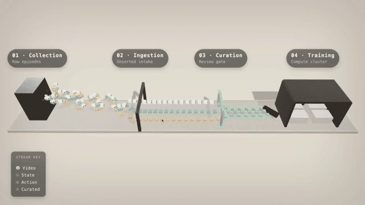

로봇 파운데이션 모델 이야기는 보통 모델 구조와 데이터 양에서 멈춥니다. Dyna Robotics가 공개한 [Dyna-2 학습 인프라 보고서](https://www.dyna.co/research/dyna-2-infrastructure)는 그 아래층을 다뤄요. 1인칭 영상 100만 시간, 에피소드 4,300만 개를 반복 가능하게 학습시키려다 만난 벽이 무엇이었고 어디를 고쳤는지를 단계별로 적었습니다.

보고서의 출발 진단이 나머지 전부를 규정합니다. 지난 1년간 돌릴 수 있는 실험 수를 제한한 것은 아이디어 부족이 아니라 각 실험이 데이터를 기다린 시간이었고, 병목이 저장 포맷에서 인제스션 파이프라인으로, 다시 학습 매니페스트로 옮겨 다녔기 때문에 GPU든 CPU 워커든 기계를 더 붙이는 것으로는 풀리지 않았다고 적습니다.

<figure class="fig"><figcaption>수집 · 인제스션 · 큐레이션 · 학습 네 단계를 데이터가 흘러가는 경로. 앞 12초만 GIF로 변환했다</figcaption></figure>
<em>Dyna-2 데이터 생애주기 — 스트림 종류(video · state · action)가 단계마다 다르게 다뤄진다(출처: Dyna Robotics)</em>

## 에피소드는 한 스트림이 아니라 여러 스트림이에요

로봇 학습 데이터가 언어나 영상 데이터와 갈리는 지점을 보고서는 명확히 짚습니다. 에피소드 하나에 카메라 여러 대와 고유수용성(proprioceptive) 상태, 행동 스트림이 각각 다른 주기로 함께 흐르고, 학습 샘플 하나는 그것들을 같은 시점으로 맞춰 조립해야 해요. 게다가 온보드 배포 제약 때문에 로봇 파운데이션 모델은 상대적으로 작아서, 학습이 데이터를 빨리 소비하는 나머지 데이터로더 자체가 병목이 됩니다.

Dyna-2는 영상과 행동을 함께 예측하는 모델이라 샘플 하나에 디코딩된 프레임 몇 장과 그보다 훨씬 긴 상태 시퀀스가 필요합니다. 보고서는 이 비대칭이 Dyna-2에만 있는 것이 아니라고 못박아요. 로봇 데이터는 본질적으로 다중 모달이고 어떤 수집 방식이든 센서 묶음을 달고 다니기 때문에, "읽기 패턴 자체가 모달리티마다 다른 학습 하이퍼파라미터가 된다"는 것입니다.

저장 포맷은 여기서 정면으로 충돌해요. 프레임별 독립 접근은 임의 오프셋 읽기를 쉽게 만들지만 프레임 단위 JPEG 기준으로 카메라 1분당 100 MB 수준을 씁니다. H.264 같은 프레임 간 압축은 용량을 크게 줄이는 대신 압축 프레임이 자기 GOP(group of pictures)의 키프레임부터 디코딩해야 풀려서 임의 타임스탬프 랜덤 접근과 어긋나요. 기존의 H5 + 프레임별 JPEG는 프레임 간 압축이 없어 그 비용을 그대로 물었습니다.

## 청크를 토픽이 아니라 읽기 패턴으로 묶었어요

해법은 자율주행에서 널리 쓰는 MCAP으로 옮기되 기본 설정을 그대로 쓰지 않고 접근 패턴에 맞춰 압축·인코딩·청킹을 조정한 것입니다.

첫째는 GOP를 크게 잡은 H.264 인코딩입니다. GOP 크기는 압축률과 랜덤 접근 사이의 전형적인 트레이드오프인데, 어느 쪽이 유리한지가 모델 종류에 따라 갈려요. VLA 학습은 짧고 드문드문한 윈도우를 샘플링해서 샘플마다 탐색 비용을 물지만, 월드-액션 모델은 긴 연속 구간을 읽어 키프레임 하나를 많은 프레임에 걸쳐 나눠 갚기 때문에 큰 GOP를 감당할 수 있습니다.

둘째가 토픽 그룹 청킹이에요. MCAP 기본 라이터는 토픽마다 자기 청크를 주기 때문에 샘플 하나를 조립하는 데 토픽 수만큼 읽기가 듭니다. Dyna는 같은 읽기 패턴을 공유하는 토픽을 묶어 그룹별로 시간축 우선(time-major)으로 써요. 카메라들끼리 한 스트림에 교차 배치하고 고유수용성과 행동을 다른 스트림에 넣는데, 둘은 청크를 절대 공유하지 않습니다. 샘플이 프레임 몇 장과 상태의 긴 밀집 윈도우를 각각 요구하기 때문이에요. 이렇게 하면 카메라나 상태 토픽을 하나 더 붙여도 왕복이 늘지 않습니다.

실제 원격조작(teleop) 에피소드에서 잰 값은 세 축으로 나뉩니다. 저장 용량은 카메라 1분당 80.3 MB에서 25.1 MB로 약 68% 줄었고, 샘플당 읽기 지연은 27.0 ms에서 9.4 ms로 약 2.9배 빨라졌으며, 샘플당 청크 페치는 11.33회에서 3.29회로 약 3.4배 줄었어요. 압축과 청킹은 직교하는 개선이라 용량 패널에서는 두 방식이 같은 25.1 MB로 찍힙니다.

## 인제스션은 스케줄러와 파일 크기 분포에서 막혔어요

인제스션 파이프라인은 주당 14,000 에피소드시간에서 천장을 쳤습니다. 그 속도면 100만 시간에 1년이 넘게 걸려요. 구성 자체는 표준적입니다. 데이터 변환에서 모든 카메라·고유수용성 스트림을 공통 타임스탬프 격자로 리샘플링해 MCAP으로 인코딩하고, 품질 검사에서 카메라 블랙아웃·끊기는 관절 상태·손 위치 누락이나 가림·불량 프레임을 걸러내며, 피처 보강에서 성능 라벨과 영상 캡션, 세그멘테이션을 붙여요.

단일 쿠버네티스 잡이던 것을 Airflow DAG로 다시 쓰면서 얻은 것이 셋입니다. 단계마다 CPU·메모리·GPU를 따로 할당해 최악 단계 기준으로 워커 풀을 부풀리지 않는 것, 단계에 치명/비치명 태그를 붙여 비치명 실패가 DAG 전체를 취소시키지 않게 한 것, 그리고 실행 시점에 단계를 켜고 끄는 동적 오케스트레이션이에요. 마지막 항목 덕분에 품질 검사가 변환 앞뒤의 독립 게이트가 됩니다.

에피소드마다 스키마 버전, 인제스션 파이프라인 버전, 녹화 당시 로봇 소프트웨어 버전을 함께 찍어 두는 설계도 규모에서 나온 결정이에요. 100만 시간 재처리에 몇 주가 걸리니 파이프라인을 고치면 코퍼스는 한동안, 때로는 영구히 혼합 버전으로 남습니다. 스탬프가 있으면 어느 에피소드가 낡았는지 정확히 찾아 그것만 다시 돌리고, 큐레이션 질의가 실험이 요구하는 버전 범위를 지정할 수 있어요.

DAG로 바꾸는 것만으로는 처리량이 선형으로 늘지 않았습니다. 수백만 개 실행이 동시에 벌어지면 스케줄러가 쓰기 폭주로 막히고, 파일 크기 편차가 커서 워크로드가 불균형해져요. 배치의 시작 시각을 어긋나게 흩어 같은 단계가 한꺼번에 끝나지 않게 하고, 빈 패킹(bin-packing)으로 입력 배치를 거의 같은 바이트로 쪼개 워커에 분배하면서 수평 확장이 풀렸습니다. 주당 14,000에서 440,000 에피소드시간으로 31배가 되었고, 100만 시간 처리 기간이 약 16개월에서 3주 아래로 내려왔어요.

## 매니페스트는 파일 목록이 아니라 질의여야 했어요

학습 실행은 매번 매니페스트를 만드는 것으로 시작합니다. 어떤 에피소드가 이번 실행에 들어가고 각각 어디서 시작해 어디서 끝나는지의 목록인데, 배치 구성과 GPU 샤딩, 에폭 길이가 전부 여기에 달려 있어요. 과제별로, 로봇별로, 성공 여부별로, 카메라가 빠졌는지 여부별로 필터가 달라서 실험마다 다시 만들어야 합니다.

처음에는 파일에서 직접 만들었습니다. 메타데이터 DB가 후보 경로 목록을 주지만 경로만으로는 매니페스트가 아니라서, 파일이 실제로 있는지 확인하고 품질 플래그를 담은 사이드카를 읽고 시간 범위를 얻으려 헤더를 열고 스텝 수를 세려 한 번 더 열어야 했어요. 에피소드당 저장소 왕복 네 번이고 데이터셋은 4,300만 에피소드입니다. 사전학습 한 번은 이 비용을 흡수할 수 있지만 실험마다 다시 내는 순간 반복 속도의 병목이 돼요.

고친 방향은 데이터베이스를 워크로드로 쪼갠 것입니다. 트랜잭션 위주의 프로덕션 DB를 원장으로 두고, 분석용 데이터 웨어하우스를 변경 데이터 캡처로 준실시간 동기화해 큐레이션은 웨어하우스에서 컬럼 몇 개만 훑게 했어요. 웨어하우스가 몇 초 뒤처지는 것은 감당할 수 있는데, 큐레이션이 고르는 에피소드는 누군가 학습에 쓰기 훨씬 전에 처리를 끝낸 것들이기 때문입니다. 에피소드 테이블이 5,000만 행을 넘겼는데도 생성 방식은 그대로예요. 질의가 파일 목록을 걷는 대신 테이블 위에서 계획되니 비용이 에피소드 수를 따라가지 않고, 약 48시간이던 콜드 스타트업이 1분 아래가 되었습니다.

읽어 들이는 것은 별개 문제였어요. GPU 노드의 CPU RAM이 보통 2 TB 수준인데 100만 시간짜리 매니페스트를 모든 랭크가 메모리로 읽으면 한 스텝도 못 돌고 죽었고, 네트워크 마운트에서 컬럼 포맷의 푸터 우선·산발 탐색 접근 패턴은 최악에 가까웠습니다. 랭크 하나가 객체 저장소 API로 직접 병렬 전송해 로컬 디스크에 내려받고, 모든 랭크가 그 사본을 컬럼 테이블로 메모리 매핑하고, 각 랭크가 자기 몫 1/N 행만 무복사 슬라이스로 가져가는 세 가지를 한 묶음으로 바꿔요. 마지막 항목은 매핑된 테이블에서만 의미가 있는데, 메모리로 읽는 방식에서는 자르기 전에 이미 테이블 전체를 실체화한 뒤니까요. 적재 시간은 737.0초에서 12.4초로, 노드당 상주 메모리는 2151 GB에서 218 GB로 내려갔습니다.

## 코퍼스는 한곳에 두고 계산이 그 주위를 돌아요

학습 데이터는 클라우드 객체 저장소에 있는데 학습 클러스터가 그 옆에 있으리라는 보장이 없습니다. LLM 붐 이후 GPU를 구할 수 있는 곳에서 구하다 보니 대개 여러 벤더를 동시에 쓰게 되었어요. 그렇다고 페타바이트급 코퍼스를 클러스터마다 복사하는 것은 선택지가 아닙니다. 인제스션이 계속 늘리고 사후 수정이 들어와 사본마다 동기화 대상이 하나씩 늘고, 저장 비용에 이그레스 비용이 곱해지며, 모든 벤더가 객체 저장소를 파는 것도 아니에요.

해법은 옮기지 않는 것입니다. 학습 중에는 클라우드에서 읽지 않고 작업 집합을 클러스터 위에 올려 두는데, GPU 노드에 이미 달려 있는 NVMe를 Alluxio 캐시 계층으로 써요. 파일 전체가 아니라 페이지 단위로 캐싱해 실제로 읽힌 부분만 상주시키니, 앞의 청킹 작업이 여기서 한 번 더 값을 합니다. 샘플이 건드리는 청크가 적으면 상주 페이지도 적어지니까요.

숫자는 단일 리더 기준이에요. 객체 저장소 단일 리더가 약 200 MB/s를 내는데 버킷 자체가 병목은 아니고, 연결 하나가 요청마다 왕복을 물고 한 번에 파일 하나를 읽는 랭크가 정확히 그 연결 하나이기 때문입니다. 캐시는 노드당 약 2 GB/s를 내고 그 아래 NVMe는 더 빨라서, 천장은 디스크가 아니라 읽기 경로예요. 페타바이트 한 번 훑기로 환산하면 클라우드 저장소 57.9일 대 클러스터 로컬 캐시 5.8일인데, 보고서도 둘 다 단일 리더라 경과일수가 아니라 비율이 요점이라고 못박습니다.

## 규모가 최적화의 방향을 뒤집어요

GPU 위에서 도는 쪽에서도 같은 패턴이 나옵니다. 옵티마이저 Muon이 스텝 벽시계 시간의 절반쯤을 쓰고 있어서 상태를 잡 전체 랭크에 쪼갰고 노드 몇 대에서는 잘 돌았는데, 노드를 늘리자 느려졌어요. 노드 안 GPU 간 통신은 B200 노드 기준 GPU당 약 1.8 TB/s인 NVLink로 매우 빠른 반면 노드 사이는 InfiniBand라 GPU당 한 자릿수 배 이상 느리기 때문입니다. FSDP 하이브리드 샤딩에서 착안한 대안은 노드 안에서만 쪼개고 노드끼리는 같은 갱신을 중복 계산하게 두는 것으로, 연산은 늘지만 통신량이 노드 수에 의존하지 않게 돼요.

여기서 읽을 만한 것은 배수보다 중앙값과 평균이 갈린다는 사실입니다. 완전 샤딩은 중앙값 0.18초로 하이브리드 0.14초와 비슷해 보이지만 평균이 0.47초로 중앙값의 2.6배예요. 브로드캐스트 트래픽을 7.6배 옮기면서 그것을 InfiniBand로 보내기 때문에 비용이 전부 꼬리에 몰려 있습니다. **동기 학습에서는 느린 스텝 하나를 모든 랭크가 함께 물고 벽시계 시간은 모든 스텝의 합이라, 비교해야 할 값은 중앙값이 아니라 평균입니다.** 전환이 걸릴 만큼 잡이 커지면 스텝이 평균 약 3배 빨라지지만 작은 잡에서는 여전히 전역 샤딩이 이겨서, 트레이너는 실행 시점에 본 노드 수로 전략을 고릅니다.

잡 복원력도 같은 성격입니다. 실행이 몇 주간 클러스터를 붙들면 모든 랭크가 건강할 때만 전진하는데, 나쁜 노드 대부분은 알림에 잡히지 않아요. 보고서가 든 예 중 하나는 정정된 ECC 오류를 250,000건 넘게 기록해 두고도 모든 검사를 통과하던 노드였습니다. 그래서 잡이 내려앉기 전에 Slurm이 GPU 인벤토리·오류 카운터·커널 로그·로컬 디스크·컨테이너 런타임을 확인해 실패한 노드를 드레인하는데, 까다로웠던 것은 어느 카운터를 믿을지였어요. 일부 GPU는 누적 총계를 지울 수 없어 오래전 한 번의 불량 구간이 건강한 노드를 영구히 배제해 버려서, 부팅 시 리셋되는 카운터로 게이트를 걸었습니다.

## 채점 기준을 파이프라인 안에 두는 문제로 읽었어요

SO-101 자동 수집 하네스를 다시 볼 때 제가 먼저 물어야 할 것은 카메라를 더 붙일지가 아니라, 에피소드 하나가 몇 번의 읽기로 조립되는지와 성공·실패 라벨이 어디서 찍히는지예요. Dyna의 품질 검사 항목이 그대로 점검표가 됩니다. 카메라 블랙아웃, 끊기는 관절 상태, 가려진 손 위치, 불량 프레임은 제가 이미 다른 맥락에서 본 실패 양상이고, 그것을 수집 뒤 별도 스크립트가 아니라 변환 앞뒤의 게이트로 두라는 것이 이 보고서의 처방이에요.

버전 스탬프도 규모와 무관하게 옮겨올 수 있는 설계예요. 수집 스크립트를 고치면 그 전후 데이터가 섞이는 것은 에피소드 수백 개짜리에서도 똑같이 일어나는데, 스탬프가 없으면 어떤 에피소드가 옛 규약으로 기록되었는지 되짚을 방법이 없습니다.

성공률을 정확도(accuracy)로 매기는 채점부도 같은 층입니다. Dyna는 성능 라벨을 피처 보강 단계에서 붙여 큐레이션 질의가 "성공한 실행만"을 조건으로 쓸 수 있게 했어요. 채점이 사후 분석이 아니라 에피소드에 박히는 컬럼이라는 뜻입니다.

데이터를 모으는 쪽 글과 나란히 두면 층이 갈립니다. [[2026-08-11_이름_붙이기를_포기했어요|균등 분할과 상태 전이 라벨로 10만 시간을 모은 VLA, XR-1]]는 라벨링 비용을 줄여 수집량을 늘리는 쪽이고, [[2026-08-10_웹_브라우저가_수집_장비예요|브라우저 원격조작으로 로봇 시연을 모으는 데이터 엔진 AXIS]]는 수집 장비의 진입 장벽을 낮추는 쪽이에요. Dyna의 보고서는 그렇게 모인 데이터가 학습 배치에 도달하기까지의 경로를 다뤄요. 주당 14,000시간이 천장이던 파이프라인에서는 로봇을 더 놓아도 처리 대기열만 길어졌을 겁니다.

---
<!-- src-block -->
출처 — https://www.dyna.co/research/dyna-2-infrastructure
