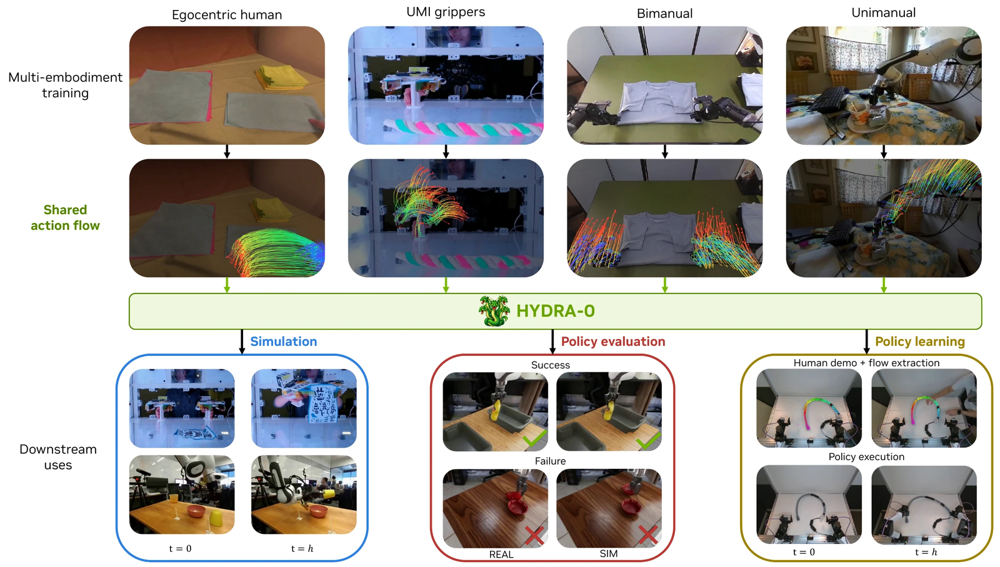
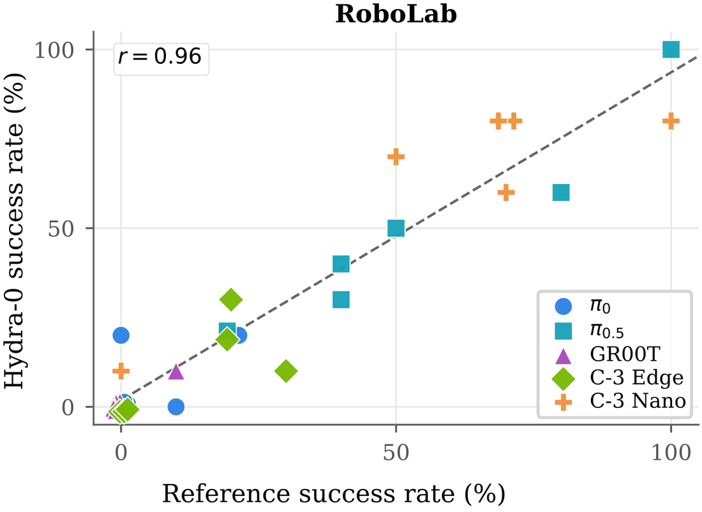

로봇 행동을 무엇으로 표현할지는 대개 관절 각도나 엔드이펙터의 6자유도 변위로 정해집니다. 그러면 데이터가 기체마다 갈라져요. 사람 손 시연과 손에 드는 UMI 그리퍼, 단일팔 프랑카, 양팔 로봇의 행동 공간이 서로 달라 한 모델에 넣을 수 없습니다. NVIDIA와 브라운·컬럼비아·하버드 연구진의 [Hydra-0](https://nvidia-isaac.github.io/video_to_data/hydra-0/)는 행동을 이미지 평면 위의 픽셀 운동으로 다시 적어 이 경계를 지웁니다.

<figure class="fig"><figcaption>위 두 줄은 네 기체의 원본 영상과 거기서 뽑은 공통 액션 플로우, 아래는 그 인터페이스가 여는 세 가지 용도</figcaption></figure>
<em>Hydra-0 전체 구성 — 이질적인 학습 데이터, 개방 루프 정책 평가, 실물 제어가 한 표현으로 연결된다(출처: Li 외, Hydra-0, NVIDIA)</em>

## 액션 플로우는 기체의 고유 좌표를 영상 모델에 노출하지 않아요

액션 플로우(action flow)는 보이는 기체의 명령된 운동을 카메라 평면 궤적 집합으로 적은 것입니다. 예측 지평 동안 추적한 이미지 좌표와 가시성 플래그가 전부예요. 같은 표현이 로봇 팔도, 손에 든 그리퍼도, 사람 손도 기술할 수 있고, 그 과정에서 각각의 고유 행동 공간은 영상 모델에 한 번도 노출되지 않습니다.

이 궤적을 얻는 경로가 학습과 배포에서 갈립니다. 학습에서는 상호작용 영상에 밀집 추적기를 돌려 궤적을 복원하고 접지된(grounded) 마스크로 기체 것과 물체 것을 나눠요. 로봇 기술 파일이나 캘리브레이션 같은 특권 메타데이터를 요구하지 않는데, 대형 상호작용 데이터셋 대부분이 그것을 제공하지 않기 때문입니다. 조건은 첫 프레임과 이 플로우뿐이고 나머지 구간이 플로우 매칭 학습 목표가 돼요.

로봇 기하와 캘리브레이션이 있을 때는 기하 기반으로 구성합니다. 첫 관측에서 보이는 로봇 표면점을 후보 명령에 따라 링크 변환으로 전파하고 캘리브레이션된 카메라로 투영해요. 여기서 가시성 판정이 까다로운데, 카메라 깊이가 양수이고 이미지 안에 있으며 3×3 이웃에서 렌더링된 깊이 버퍼와 1.2 cm 안에서 일치할 때만 보이는 점으로 셉니다. 자기 가림을 걸러내는 것이 이 조건이에요.

학습 중에는 매 스텝 조건 모드를 하나 뽑습니다. 기체 궤적이 0.40, 물체 궤적이 0.40, 구분 없이 전부가 0.15, 조건 없이 텍스트와 이미지만 주는 드롭아웃이 0.05예요. 물체 모드의 확률을 기체 모드와 같게 준 것이 뒤에 나오는 역방향 사용을 열어 둡니다.

## 배포는 시뮬레이터 둘이 각자 잘하는 것만 맡아요

배포 구성이 이 보고서에서 가장 읽을 만한 설계입니다. 시뮬레이터가 하나가 아니라 둘이에요. Isaac Lab이 로봇을 맡습니다. 강체이고 캘리브레이션되어 있으며 명령에 대한 반응이 이미 풀린 문제라 예측하지 않고 그대로 실행해요. Hydra-0는 물리 엔진이라면 에셋과 재질 모델을 요구했을 것 전부를 맡습니다. 천, 변형체, 접촉, 조명, 메시를 준 적 없는 장면이 그쪽이에요. 액션 플로우는 둘 사이의 이음매이고, 물리 엔진이 넘겨주는 것이자 영상 모델이 로봇에 대해 듣는 유일한 정보입니다.

한 사이클은 네 단계로 돕니다. 모델이 조건으로 삼는 단일 관측 프레임, Isaac Lab에서 물리 시뮬레이터가 실행하는 후보 명령, 그 명령을 이미지 평면으로 옮긴 기구학적 투영 플로우, 그리고 월드모델이 생성하는 결과예요. 시뮬레이터 렌더와 실제 관측이 같은 캘리브레이션된 상단 카메라라 궤적이 양쪽 팔 위에 똑같이 얹히는데, 시뮬레이션에서 실행한 명령이 실제 장면에 대한 예측을 조건 지을 수 있는 이유가 그것입니다.

<figure class="fig"><figcaption>정책-과제 쌍 하나가 점 하나이고 각 점은 롤아웃 10회를 합친 값이다</figcaption></figure>
<em>재생 성공률과 기준 성공률의 상관 — 절대값이 아니라 순위와 추세가 평가 대상이다(출처: Li 외, Hydra-0, NVIDIA)</em>

## 학습 코퍼스는 변형체 상호작용으로 좁혔어요

공개 소스 일곱 개를 모으되 천·케이블·로프·가방·종이 같은 변형체와의 상호작용이 있는 구간을 주로 남겼습니다. 전부 480p 16 fps로 리샘플링하고 약 5초에 해당하는 81프레임 창으로 겹치지 않게 잘랐어요. 창 단위 필터가 정지 구간과 그리퍼가 얼어 있는 구간을 궤적 경로 길이 50픽셀 바닥값으로 걸러내고, 언어 주석이 실행 가능한 내용을 담지 않은 DROID 에피소드도 뺍니다.

| 데이터셋 | 기체 | 에피소드 | 창 | 필터 후 | 시간 | 라이선스 |
|---|---|---|---|---|---|---|
| DROID | 단일팔 | 70,339 | 494,680 | 223,075 | 313.7 | CC BY 4.0 |
| ABC-130k | 양팔 | 54,961 | 1,060,456 | 1,048,681 | 1,474.7 | Apache-2.0 |
| MolmoAct2 | 양팔 | 7,723 | 129,589 | 126,335 | 177.7 | Apache-2.0 |
| EgoDex | 사람 손 | 41,888 | 89,380 | 89,380 | 125.7 | CC BY-NC-ND 4.0 |
| Deform360 | 손에 드는 그리퍼 | 1,714 | 87,224 | 60,315 | 84.8 | MIT |
| XVLA-Soft-Fold | 양팔 | 1,524 | 17,891 | 17,772 | 25.0 | Apache-2.0 |
| H1-Fold-Clothes | 양팔 | 38 | 76 | 76 | 0.1 | Apache-2.0 |
| 합계 | | 178,187 | 1,879,296 | 1,565,634 | 2,201.7 | |

필터가 남기는 비율이 소스마다 크게 다른 것이 눈에 띕니다. DROID는 494,680창에서 223,075창만 남아 절반 이하인데 ABC-130k는 1,060,456창에서 1,048,681창이 살아남아요. 야외 잡동사니 장면에서 팔이 움직이지 않는 구간이 얼마나 많은지가 이 비율에 그대로 찍힙니다.

## 표현을 바꾼 효과는 같은 백본 안에서 재요

여기가 이 논문의 통제된 비교입니다. Cosmos 2.5 백본을 고정한 채 조건만 고유 상대 6D 행동에서 액션 플로우로 바꾸면, 다섯 홀드아웃 세트 전부에서 PSNR·SSIM·그리퍼 EPE·FID·FVD가 개선되고 물체 EPE도 측정 가능한 네 세트에서 좋아져요. 백본이나 데이터가 아니라 조건 표현이 원인이라는 것을 이 설계가 분리합니다.

다섯 세트 평균에서 그리퍼 EPE는 34.28픽셀에서 13.80픽셀로 떨어집니다. Deform360 세트만 보면 47.85에서 21.53으로 내려가고요. 초록의 "로봇 운동 오차 90.4% 감소"는 여기서 더 나아가 최고 구성인 4스텝 증류 Wan2.2 A14B까지 갔을 때의 값이고, 그 구성의 평균 그리퍼 EPE는 3.29픽셀입니다. 같은 구성이 거의 모든 칸에서 최고이면서 가장 빠르기도 해요.

VLM 점수만 예외로 엇갈립니다. 저자들이 이유를 명시하는데, 심판 모델이 물리적 그럴듯함과 시간적 일관성을 매길 뿐 생성된 운동이 명령된 궤적을 따르는지를 보지 않기 때문이에요. 그것을 직접 재는 지표는 플로우 EPE입니다. 지표가 무엇을 재는지 밝혀 두고 그 지표에서 진 것을 그대로 적은 대목이라 읽을 값이 있어요.

데이터 효율 실험도 같은 성격입니다. 학습에서 제외한 Interactive World Simulator 과제 여섯 개를 0~100% 분량으로 적응시켜 보면, 과제 데이터가 하나도 없는 0%에서 이미 중간학습 체크포인트가 사전학습만 한 것을 여섯 과제 전부에서 LPIPS·물체 플로우 EPE·FVD 모두 앞서요. 그리고 대부분의 이득이 20%에서 나옵니다. 20%와 100% 사이에서 과제별 값이 LPIPS 3.4%, 플로우 EPE 6.7%, FVD 6.8% 넘게 움직이지 않아요.

## 채점은 절대 성공률이 아니라 기준과의 일치로 해요

정책 평가 실험이 이 글에서 제가 가장 오래 본 부분입니다. 방식은 개방 루프 재생이에요. 에피소드의 첫 관측으로 시뮬레이터를 초기화하고 그 에피소드가 실제로 그린 궤적을 액션 플로우로 재생합니다. 정책은 생성된 관측 위에서 한 번도 질의받지 않아요.

저자들이 이 설계의 한계를 곧바로 명시합니다. 이것이 재는 것은 시뮬레이터가 자기가 본 결과를 보존하는지이지, 실행되지 않은 명령에 대한 예측적 평가가 아니라는 거예요. 판정은 사람 평가자가 같은 과제 술어를 적용해 내리고 정책 정체는 가립니다.

RoboLab에서 정책 5개와 과제 6개, 에피소드 300개로 잰 결과가 피어슨 상관 0.96, 스피어만 0.93, 평균 절대 오차 5.7 %p입니다. 총 성공률은 시뮬레이션 26.3% 대 RoboLab 26.7%로 편향이 −0.3 %p고, 다섯 정책의 순위는 두 쪽이 완전히 일치해요. 에피소드 단위 판정은 93.0%가 일치하는데(코헨 카파 0.82), 그 불일치가 위양성 10건과 위음성 11건입니다.

**여기서 채점 기준이 절대 성공률이 아니라는 점이 핵심입니다.** 총 성공률 26.3%는 그 자체로 좋은 값이 아니에요. 의미가 있는 것은 그 값이 기준과 0.3 %p 안에서 붙어 있고 정책 순위를 뒤집지 않았다는 사실이고, 시뮬레이터를 계측기로 쓸 때 물어야 할 것이 정확히 그것이기 때문입니다. 같은 논지를 실기 쪽에서 다룬 [[2026-07-30_실패하는_자리까지_똑같아요|시뮬레이션을 훈련장이 아니라 계측기로 검증한 Real-to-Sim-to-Real]]와 겹치는 자리예요. 그쪽은 실패 지점의 일치를 봤고 이쪽은 성공률의 상관과 순위를 봅니다.

## 인터페이스를 거꾸로 돌리면 행동이 나와요

물체 플로우 확률을 기체 플로우와 같게 준 설계가 여기서 값을 합니다. 기체 플로우 대신 원하는 물체 플로우를 넣으면 월드모델이 그와 양립하는 로봇 운동을 생성하고, 학습된 행동 판독기가 그 잠재 특징을 14자유도 실행 명령으로 바꿔요. 실험에서 쓴 물체 플로우는 학습에서 제외한 사람 시연에서 옮겨온 것이고, 판독기는 성공과 실패가 섞인 실제 롤아웃 쌍으로 학습해서 과제별 전문가 로봇 시연을 요구하지 않습니다.

한계도 구체적으로 적혀 있어요. 이 월드-액션 모델은 대략 1 cm의 파지 부정확성을 보일 수 있고, 저자들은 깊이 인지의 한계가 기여한다고 가설을 세우되 원인으로 확정하지는 않습니다. 생성된 롤아웃에서 파지와 접촉 상태가 모호할 수 있다는 점, 특히 물체가 실제로 확보되었는지가 그렇다는 점도 명시해요. 여기 보고된 전부가 개방 루프이고 폐루프 정책 평가는 향후 과제로 남았습니다.

이 한계는 제가 SO-101 픽앤플레이스 데이터를 자동으로 모을 때 채점부를 어떻게 짜야 하는지와 직접 이어집니다. 생성된 영상이든 실제 카메라든 화면만 보고 파지 성립을 판정하면 같은 모호성을 물려받게 돼요. 그리퍼 각도로 파지를 추론할 수 없다는 것은 제가 정책 롤아웃에서 이미 확인한 문제인데, Hydra-0의 접촉 상태 모호성은 그 문제가 월드모델 쪽에도 같은 모양으로 있다는 뜻입니다. 저자들이 다음 단계로 드는 깊이·촉각·힘 신호 조건화가 그래서 우연이 아니에요. 채점을 무엇으로 하느냐가 수집기의 센서 구성을 되돌려 정합니다.

---
<!-- src-block -->
출처 — https://nvidia-isaac.github.io/video_to_data/hydra-0/
