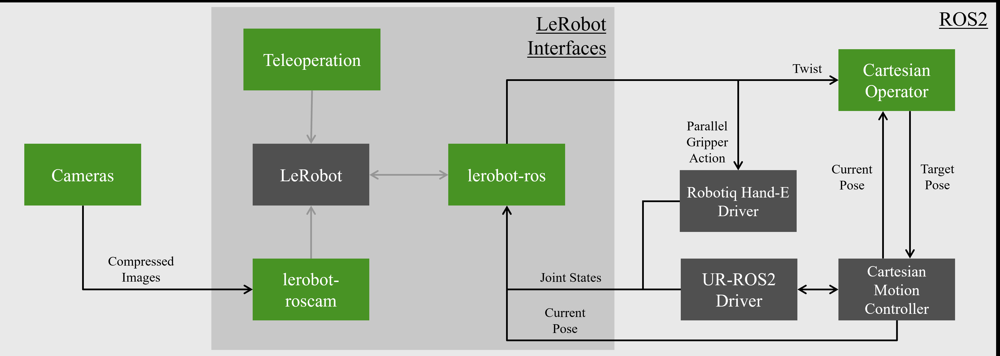
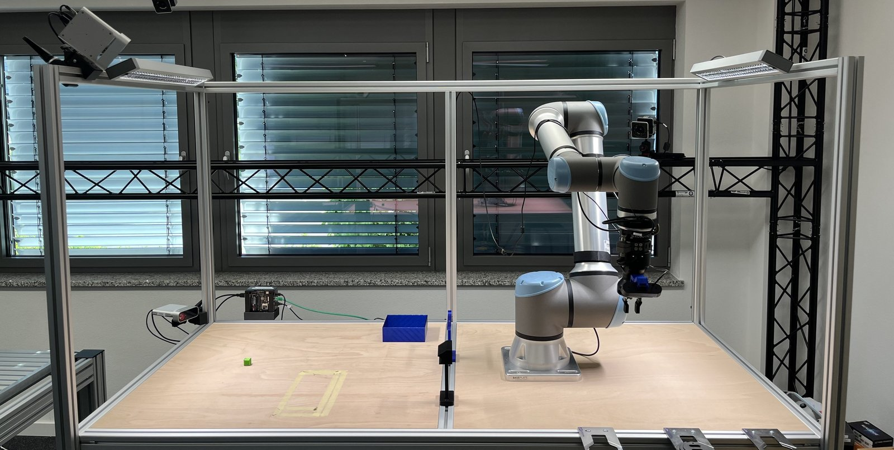
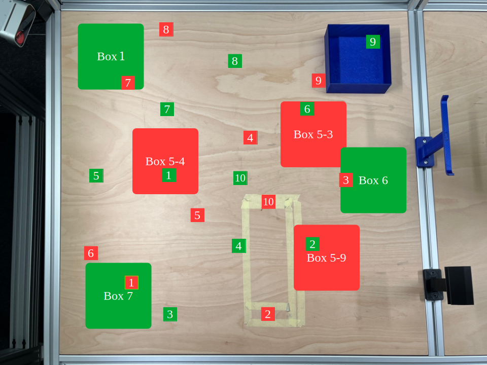

SmolVLA 같은 작은 VLA는 사내 워크스테이션에서 돌릴 수 있어 산업 현장에서 관심이 높지만, 지금까지의 검증은 SO-101이나 OpenMANIPULATOR 같은 랩 장비에서 이루어졌어요. 아우크스부르크 대학 메카트로닉스 연구진의 [ROS2SmolVLA](https://arxiv.org/abs/2608.23320)는 이 모델을 Universal Robots UR10e에 올려 픽앤플레이스로 검증하고, 코드·데이터·모델을 공개하면서 산업용 하드웨어에서 드러나는 한계를 정리한 논문입니다.

## 랩 장비와 산업용 장비 사이의 간격이 문제예요

저자들이 짚는 문제는 셋입니다. 수십억 파라미터 VLA는 자동화 설비가 요구하는 제어 주기를 추론 지연으로 넘기기 쉽고, 연산을 클라우드로 내보내면 컴플라이언스와 프라이버시 문제가 생겨요. 그리고 작은 VLA는 SO-101 같은 소형 장비에서만 벤치마크돼, 제어 루프·안전 요건·가반하중·작업공간이 전혀 다른 산업용 장비에서 어떻게 동작하는지 알 수 없습니다.

SmolVLA를 고른 이유는 구조에 있어요. 450M 파라미터 모델로 프레임당 시각 토큰을 64개로 묶어 실시간 추론을 강제하고, 액션 익스퍼트(Action Expert)가 VLM의 앞쪽 층만 참조하는 층 건너뛰기(layer-skipping)로 성능과 연산량을 맞바꿉니다. 행동 생성은 플로우 매칭(flow matching) 트랜스포머이고, 사전학습 데이터는 Hugging Face의 lerobot 라벨 아래 모인 커뮤니티 데이터셋 1,270개예요.

## LeRobot과 ROS 2 사이를 브로커 하나로 이었어요

시스템은 실시간 하드웨어 실행과 무거운 다중 모달 추론을 분리하는 엣지-워크스테이션 구조예요. 두 생태계를 잇는 lerobot-ros 브로커 덕에 LeRobot 쪽 정책은 산업용 버스 주기를 직접 관리하지 않고 관절 궤적이나 직교 속도 공간에서 동작합니다.

<figure class="fig"><figcaption>초록이 저자들이 만든 패키지, 회색이 외부 의존성이다. 진한 화살표가 ROS 2 토픽, 옅은 화살표가 LeRobot 인터페이스다</figcaption></figure>
<em>ROS2SmolVLA 구성 — LeRobot 쪽과 ROS 2 쪽을 lerobot-ros가 중개한다(출처: Mandischer 외, ROS2SmolVLA)</em>

하드웨어 층은 ros2_control 표준 컨트롤러로 추상화돼 있고, 로봇을 움직이는 경로가 네 가지예요. 관절 위치 직접 제어(JointGroupPositionController), 관절 궤적 보간(joint_trajectory_controller), MoveIt Servo의 작업공간 속도 추종, 그리고 TwistStamped 메시지를 Cartesian Operator가 받아 Cartesian Motion Controller로 넘기는 경로입니다. 그리퍼는 Robotiq Hand-E 드라이버로, 상태는 joint_state_broadcaster와 current_pose 토픽으로 돌아와요. 관절 대신 직교 좌표 명령을 고른 이유는 다른 기체로 옮기기 쉽기 때문입니다.

카메라 쪽은 lerobot-roscam이 정적 카메라 둘과 손목 카메라 하나의 비동기 입력을 ROS 2 메시지에서 LeRobot 카메라 인터페이스로 바꿔 줘요. LeRobot은 이 영상 텐서와 lerobot-ros가 준 텔레메트리를 합쳐 표준 데이터셋 포맷으로 직렬화합니다. 전체는 Docker 컨테이너로 묶여 있고 Gazebo 가상 트윈이 실기와 같은 제어 API·토픽 스키마를 쓰지만, 검증에는 실기 데이터만 써서 시뮬레이터 쪽은 완전히 검증되지 않았다고 명시해요.

## 349 에피소드를 게임패드로 모았어요

하드웨어는 Azure Kinect 두 대와 엔드이펙터에 단 웹캠, Robotiq Hand-E 조 그리퍼예요. 카메라 스트림은 NVIDIA Jetson AGX Orin 엣지 PC가 묶고, VLA 추론은 RTX 4080(16GB VRAM, 32GB RAM) 워크스테이션이 맡으며, 둘 사이는 10Gbit 이더넷으로 이어집니다.

<figure class="fig"><figcaption>주 작업공간은 왼쪽 절반이다. 블라인드와 확산 조명으로 조명을 통제했고, 다른 프로젝트가 쓰는 도구와 표식이 방해 요소로 남아 있다</figcaption></figure>
<em>검증에 쓴 UR10e 작업 셀(출처: Mandischer 외, ROS2SmolVLA)</em>

데이터셋은 카메라 뷰 셋, 관절 상태, 엔드이펙터 직교 위치를 담고 행동은 직교 델타 값이에요. 시연은 게임패드 텔레오퍼레이션으로 모았고, 반복 사이에 로봇을 손으로 시작 위치에 되돌려서 시작 자세가 조금씩 달라졌습니다. 공간 관계를 배우게 하려고 큐브 위치를 5×5 격자로 두고 위치마다 상자 위치를 바꿔 가며 5회씩 기록했고, 색이 다른 큐브가 여럿 있는 에피소드와 잘못 잡거나 떨어뜨린 뒤 복구하는 에피소드를 더해 합쳐서 349 에피소드예요.

미세조정은 LeRobot 문서대로 사전학습 모델 위에서 했고, train_expert_only=False와 compile_model=True로 두는 것이 학습에 더 나았다고 적었어요. 처음에는 50,000 스텝에서 멈췄지만 200,000 스텝까지 돌리자 성공률이 뚜렷하게 올라, 그 모델은 L40S 서버에서 약 25시간 학습했습니다. 정책 입력은 엔드이펙터 직교 자세와 시각 특징 셋이고, 제한된 시각 토큰을 아끼려고 상판 뷰는 작업공간이 든 아래 절반만 잘라 넣었어요. 출력은 TwistStamped 명령입니다.

## 아홉 시나리오로 분포 안팎을 갈라 쟀어요

테스트는 시작 전에 정의한 아홉 시나리오예요. 큐브 위치·색, 상자 위치·색·모양, 로봇 시작 자세(RC)를 축으로 잡고 분포 안(ID)과 분포 밖(OOD)을 나눴습니다. 다만 시작 자세와 상자 위치는 안팎 구분이 뚜렷하지 않다고 저자들은 적어 두었어요. 프롬프트는 전부 "Pick up the [CC] cube and put it in the [BC] box."였고 T6에서만 색 수식어를 뺐어요.

<figure class="fig"><figcaption>초록이 분포 안, 빨강이 분포 밖 위치다. 상자 위치는 작업공간을 아홉 구역으로 나눈 중심점에 두었다</figcaption></figure>
<em>큐브 위치와 상자 위치의 분포 안·밖 배치(출처: Mandischer 외, ROS2SmolVLA)</em>

채점은 집기와 놓기로 나눴어요. 집기는 큐브를 잡아 궤적 내내 놓치지 않았는지, 놓기는 상자 안에 넣었는지로 보고, 떨어뜨렸다가 스스로 다시 집으면 성공으로 칩니다. 놓기는 전체 시도 기준이라 집기 실패가 놓기 실패로도 잡혀요. 위치·자세·색 변화(T1에서 T5까지)의 결과는 이렇습니다.

| 시나리오 | 변인 | 집기 | 놓기 |
|---|---|---|---|
| T1 (ID 상자 위치) | Box 1 | 90% | 90% |
| | Box 7 | 100% | 100% |
| | Box 6 | 100% | 40% |
| T2 (OOD 상자 위치) | Box 5-4 | 70% | 60% |
| | Box 5-9 | 90% | 70% |
| | Box 5-3 | 40% | 20% |
| T3 (로봇 시작 자세) | RC 1 | 70% | 70% |
| | RC 2 | 80% | 80% |
| | RC 3 | 90% | 80% |
| | RC 4 | 80% | 80% |
| | RC 5 | 50% | 50% |
| | RC 6 | 90% | 90% |
| T4 (ID 큐브 색) | 노랑 | 50% | 50% |
| | 파랑 | 60% | 60% |
| | 회색 | 80% | 80% |
| T5 (OOD 큐브 색) | 주황 | 60% | 60% |

Box 6은 집기가 100%인데 놓기가 40%로 떨어지는데, 저자들은 이걸 그 구역의 학습 데이터 부족으로 봅니다. RC 5의 하락은 그 시작 자세가 카메라 시야 밖에 있어 손목 카메라가 큐브를 일찍 찾지 못하기 때문이에요. 큐브 색은 노랑과 주황이 회색보다 낮아 시각 모델의 편향이 드러납니다. 잡기 자체는 잘 배워서 모서리를 피해 면을 따라 잡도록 손목을 돌리는 것이 관찰됐어요.

전체 점수는 집기·놓기·집기 성공 후 놓기 순으로 ID(T1·T3·T4)에서 78.33%·72.50%·92.47%, OOD(T2·T5·T8·T9)에서 76.56%·46.88%·61.22%, 전체로는 77.72%·63.59%·81.69%예요. 집기는 분포 밖에서도 안과 비슷한데 놓기가 크게 떨어지고, 그 이유가 다음 절의 핵심입니다.

## 놓기 판단의 실제 트리거는 파란색이었어요

색 조건부 실험부터 편향이 선명해요. T6에서 초록과 회색 큐브를 함께 놓고 색을 지정하지 않으면 모델은 75%의 반복에서 초록을 골랐고, T7에서 프롬프트에 색을 넣자 결과는 이렇게 갈렸습니다.

| 큐브 | 프롬프트 색 | 지정 색 집기 | 놓기 |
|---|---|---|---|
| 2개 | 초록 | 70% | 100% |
| 2개 | 회색 | 20% | 90% |
| 2개, 위치 반전 | 초록 | 70% | 100% |
| 2개, 위치 반전 | 회색 | 30% | 90% |

회색을 지시해도 20%에서 30%만 회색을 집었어요. 모델은 조건을 사실상 무시하고 초록 편향으로 돌아갔습니다. 학습 에피소드의 33%가 여러 색 큐브와 명시적 색 프롬프트를 담고 있었는데도 색 구분 능력은 무시할 만한 수준이라고 저자들은 결론지어요.

상자 쪽은 더 직접적이에요. T8은 학습에 없던 검정·주황 사각 상자, T9는 파란 원형 상자와 골판지 상자입니다.

| 시나리오 | 상자 | 집기 | 상자 발견 | 놓기 |
|---|---|---|---|---|
| T8 (OOD 색) | 검정 | 100% | 17% | 17% |
| | 주황 | 100% | 100% | 17% |
| T9 (OOD 모양) | 파랑 원형 | 100% | 100% | 100% |
| | 골판지 | 83% | 50% | 17% |

검정 상자는 거의 찾지 못했고, 주황 상자는 매번 찾았는데도 놓기가 17%에 그쳤어요. 저자들은 정책이 손목 카메라에 잡히는 파란색을 놓을 시점의 판단 기준으로 쓴다고 추정했고, **파란 물체를 카메라 앞에 들이대는 방식으로 이를 직접 확인했습니다.** 파란 원형 상자가 100%인 것도 같은 설명에 맞아요. 모양은 새로웠지만 색이 같았고, 낮은 입력 해상도에서도 대비가 충분해 경계를 잡을 수 있었기 때문입니다. 골판지 상자는 모양과 질감이 모두 달라 크게 떨어졌지만, 상자라는 개념으로 일부 일반화한 것으로 저자들은 읽어요.

정리하면 학습된 것은 "상자에 넣는다"가 아니라 "파란 것이 보이면 놓는다"에 가까웠고, 모양과 모서리는 보조 단서에 머물렀어요. 분포 밖에서 집기는 유지되고 놓기만 무너진 이유가 여기에 있습니다.

## 교훈은 데이터의 양보다 분포에 관한 것이에요

저자들의 교훈은 실무적이에요. 입력 해상도가 낮아 초기에는 손목 카메라 밖의 물체를 찾지 못했고, 상판 뷰를 작업공간만 남게 자르자 큐브를 찾는 성공률이 뚜렷이 올랐어요. 한 프레임에 정보를 최대한 모아야 하고, 아주 작은 물체는 아예 처리되지 않을 수 있습니다. 상자가 큐브를 가리는 장면에서도 성공률이 떨어졌는데, 공격적인 토큰 최적화의 영향으로 봐요.

색과 질감 의존은 데이터를 더 넣는 것만으로는 해결되지 않는다고 적었어요. 우세한 표본 집단이 편향을 만들기 때문에, 작업공간에서 마주칠 색과 질감의 조합이 학습 데이터에 전부 들어가야 합니다. 이 편향을 거꾸로 써서, 검정 상자처럼 특정 색을 학습에서 비워 두면 건드리지 말아야 할 물체를 색으로 표시할 수 있다는 제안도 있어요. 복구 에피소드는 큰 데이터셋에서는 강건성을 높였지만 데이터가 적을 때는 단단히 잡기 전에 놓아 버리는 식의 행동으로 기울 수 있고, 게임패드 시연도 비슷한 궤적이 반복돼 편향을 심는다고 봐요.

결론은 단호해요. 산업용 하드웨어에서 SmolVLA가 동작하는 것은 확인했지만 현재 성공률은 실제 배치에는 너무 낮고, 주된 원인은 학습 데이터 부족이라는 겁니다. 깊이 정보는 설계 단계에서 고려했다가 LeRobot 데이터셋 포맷이 아직 깊이를 지원하지 않아 뺐고, 공간 추론을 도울 모달리티로 향후 과제에 남겼습니다.

제 관심은 이 결과를 평가 설계에 옮기는 데 있어요. 성공률 하나로 끝냈다면 집기 77.72%라는 숫자로만 읽혔을 결과가, 집기와 놓기를 가르고 색·모양·위치를 축으로 세우자 놓기의 트리거가 색이라는 사실까지 드러났습니다. SO-101 픽앤플레이스 평가를 짤 때 그대로 가져갈 구조라고 봅니다. 상자 색을 바꾼 시나리오를 평가셋에 미리 넣어 두지 않으면 정책이 상자를 배웠는지 파란색을 배웠는지 구분할 방법이 없어요. 같은 LeRobot 생태계에서 [[2026-07-28_리더암은_실물_로봇은_시뮬|실물 리더암으로 Isaac Lab 속 로봇을 조종해 시연을 모으는 LeIsaac]]가 데이터를 만드는 쪽의 이야기라면, 이 글은 그 데이터가 무엇을 가르쳤는지 되묻는 쪽입니다. 깊이 없이 시점과 색에 묶이는 문제는 [[2026-07-20_관측을_로봇의_좌표로_옮기면|관측을 로봇 좌표계로 옮겨 VLA 시점 취약성을 줄인 로봇 중심 포인트맵]]이 다른 각도에서 다룬 주제이기도 해요.

---
<!-- src-block -->
출처 — [ROS2SmolVLA: Enabling Small Vision-Language-Action Models for Integration into Industrial-Grade Lightweight Robots](https://arxiv.org/abs/2608.23320) · CC BY-NC-ND 4.0 · 그림 셋은 원문 Figure 1·2에서 본문이 논평하는 범위 안에서 인용했고, 크기 조정 외에 손대지 않았습니다.
