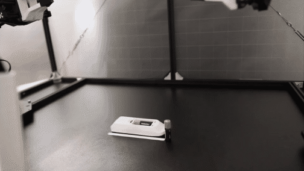
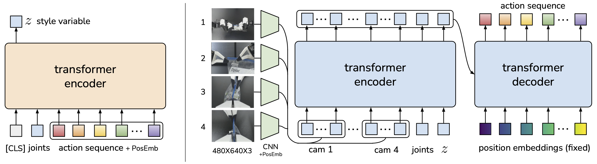

밀리미터 단위 정밀도와 접촉력 조절이 함께 필요한 조작은 지금까지 고급 로봇과 정확한 센서, 공들인 캘리브레이션의 영역이었어요. 스탠퍼드·Meta·UC 버클리 연구진의 [ALOHA·ACT](https://arxiv.org/abs/2304.13705)는 이 전제를 뒤집습니다. 정밀도가 떨어지는 저가 하드웨어에 학습을 얹어 조미료 컵 뚜껑을 따고 배터리를 슬롯에 밀어 넣는 작업을 성공률 80에서 90% 사이로 해내고, 학습에 쓴 시연은 과제당 10분에서 20분 사이예요. LeRobot 계열 텔레오퍼레이션 생태계가 지금 서 있는 자리를 만든 논문이라 뒤늦게 원문을 읽었습니다.

## 정밀 조작에 비싼 로봇이 필요하다는 전제를 학습으로 걷어내요

저자들이 세운 문제는 이렇습니다. 조미료 컵을 여는 동작을 뜯어 보면 오른손이 컵을 넘어뜨려 열린 왼 그리퍼 쪽으로 밀고, 왼손이 부드럽게 쥐어 들어 올린 뒤, 오른손 손가락 하나가 아래에서 접근해 뚜껑을 들어 올려야 해요. 각 단계마다 몇 밀리미터 오차가 곧 실패입니다. 기존 시스템은 이걸 정확한 상태 추정으로 풀었는데, 그러려면 비싸집니다.

반대 방향은 환경을 모델링하는 대신 정책을 학습하는 거예요. 컵을 미는 접촉과 뚜껑이 휘는 변형을 계획 가능한 수준으로 모델링하려면 자유도가 큰 물리를 다 다뤄야 하지만, 시각 피드백으로 반응하는 폐루프 정책은 컵과 뚜껑이 어디로 움직일지 미리 정확히 예측할 필요가 없습니다. 그래서 상용 웹캠의 RGB 영상을 곧장 행동으로 잇는 픽셀-투-액션 구조를 골랐어요.

## 조인트 공간 매핑으로 IK 특이점을 피했어요

ALOHA는 6자유도 ViperX 팔 두 대가 팔로워, 같은 회사의 더 작은 WidowX 두 대가 리더입니다. ViperX는 가반하중 750g에 도달범위 1.5m, 정확도는 5에서 8mm 수준이고 대당 5600달러, 리더 쪽 WidowX는 3300달러예요. 카메라는 Logitech C922x 넷으로 손목 둘, 정면과 상단에 하나씩 달아 각각 480×640 RGB를 흘려보냅니다. 전체가 2만 달러 예산 안에 들어가고, 이건 Franka Emika Panda 한 대 값이에요.

설계에서 가장 눈여겨볼 선택은 VR 컨트롤러의 손 자세를 엔드이펙터 자세로 옮기는 작업공간 매핑 대신, 리더 팔의 관절각을 팔로워 관절각에 그대로 꽂는 조인트 공간 매핑을 쓴 겁니다. 근거가 둘이에요. 정밀 조작은 특이점 근처에서 이뤄지는 일이 잦은데 6자유도에 여유자유도가 없는 이 팔에서는 기성 역기구학이 자주 실패합니다. 관절 공간 매핑은 관절 한계 안에서 고대역 제어를 보장하면서 연산도 지연도 적어요. 그리고 리더 로봇의 무게 자체가 조작자가 너무 빨리 움직이는 걸 막고 작은 진동을 감쇠합니다. 여기에 리더 쪽 중력을 부분 상쇄하는 고무줄 로드밸런싱을 붙여 30분이 넘는 텔레오퍼레이션 세션이 가능해졌어요.

학습 데이터에서 행동으로 기록하는 값이 팔로워가 아니라 리더의 관절 위치라는 점도 중요합니다. 실제로 가해지는 힘은 리더와 팔로워의 차이에 저수준 PID 제어기를 거쳐 암묵적으로 정의되기 때문이에요. 텔레오퍼레이션과 데이터 기록은 둘 다 50Hz로 돕니다.

<figure class="fig"><figcaption>학습된 ACT 정책의 실시간 롤아웃이다. 슬롯 안 스프링이 리모컨을 밀어내기 때문에 반대편 팔이 리모컨을 눌러 고정한다. 원본 영상에서 12초를 잘라 GIF로 변환했다</figcaption></figure>
<em>Slot Battery 과제의 정책 롤아웃(출처: Zhao 외, ALOHA 프로젝트 페이지)</em>

## 행동 청킹은 과제의 유효 지평을 k분의 1로 줄여요

모방학습의 고질은 오차 누적입니다. 이전 스텝의 오차가 쌓여 학습 분포 밖 상태로 흘러가고, 정밀 조작에서는 이게 특히 두드러져요. DAgger처럼 전문가 교정을 덧대는 방법은 텔레오퍼레이션 인터페이스에서 부자연스럽고, 시연 수집 때 노이즈를 주입하는 방법은 정밀 작업에서는 곧장 실패로 이어집니다.

ACT가 고른 길은 지평 자체를 줄이는 거예요. 정책이 한 스텝이 아니라 다음 k 스텝의 목표 관절 위치를 한꺼번에 내놓고 그대로 실행합니다. 과제의 유효 지평이 k분의 1로 줄어드니 누적할 스텝 수 자체가 줄어요. 덤으로 시연 중간의 멈춤처럼 시간 상관 교란 요인도 청크 안에 들어오면 흡수됩니다. 단일 스텝 마르코프 정책은 같은 상태에서도 시점에 따라 행동이 달라지는 이 현상을 모델링하지 못해요.

k 스텝마다 관측을 갱신하면 동작이 뚝뚝 끊기니, 매 타임스텝 정책을 질의해 청크를 겹치게 하고 같은 시점을 겨냥한 예측들을 지수 가중 평균으로 합칩니다. 인접 시점의 행동을 섞어 편향을 만드는 일반적인 스무딩과 달리, 같은 시점에 대한 예측끼리만 모으는 게 시간 앙상블의 요점이에요. 학습 비용은 늘지 않고 추론 연산만 더 듭니다.

사람 시연이 다중 모드라는 문제는 정책을 조건부 VAE로 학습해 다룹니다. 인코더가 관절 관측과 행동 시퀀스를 스타일 변수 z로 압축하고, 디코더인 정책이 영상·관절 위치·z를 받아 행동 시퀀스를 내놓아요. 인코더는 테스트 때 버리고 z는 사전분포의 평균인 0으로 고정해 결정적으로 디코딩합니다.

<figure class="fig"><figcaption>왼쪽 CVAE 인코더는 학습에만 쓰고 버린다. 오른쪽 정책은 카메라 넷의 특징과 관절 위치, 스타일 변수를 트랜스포머 인코더로 합치고 디코더가 행동 시퀀스를 낸다</figcaption></figure>
<em>Action Chunking with Transformers 구조(출처: Zhao 외, arXiv:2304.13705 Figure 3)</em>

관측은 480×640 영상 넷과 양팔 14자유도 관절 위치이고, 행동은 양팔의 절대 관절 위치 14차원이라 정책 출력은 k×14 텐서예요. ResNet18이 영상 하나를 15×20×512 특징맵으로 바꾸고 공간 축을 펴 300×512로 만든 뒤 넷을 이어 1200×512, 여기에 관절 위치와 z를 더해 1202×512가 트랜스포머 인코더 입력입니다. 재구성 손실은 L2가 아니라 L1을 쓰는데, 행동 시퀀스를 더 정밀하게 모델링한다는 관찰 때문이에요. 행동을 관절 위치 증분으로 바꾸면 성능이 떨어졌다고도 적었습니다. 모델은 80M 파라미터 남짓이고 과제마다 처음부터 학습하는데, 11GB RTX 2080 Ti 한 장에서 5시간이면 끝나고 추론은 0.01초예요.

## 단일 스텝 정책은 첫 단계조차 넘지 못했어요

실물 여섯 과제와 MuJoCo 시뮬 두 과제로 검증했고, 비교 대상은 BC-ConvMLP, BeT, RT-1, VINN입니다. BeT와 RT-1은 트랜스포머를 쓰되 관측 이력에서 행동 하나를 내놓고 행동 공간을 이산화하며, VINN은 시각 특징이 비슷한 시연을 검색해 가중 최근접이웃으로 행동을 돌려주는 비모수 방법이에요.

실물 결과에서 격차가 선명합니다. Slide Ziploc과 Slot Battery에서 ACT는 최종 88%와 96%를 냈고, 나머지 방법은 첫 단계를 넘지 못했어요. Slot Battery에서 BeT는 잡기 4%에 놓기와 삽입 0%입니다. 나머지 세 과제에서도 ACT는 컵 열기 84%, 테이프 준비 64%, 신발 신기기 92%를 낸 반면 BeT는 넷 다 최종 0%예요. 시뮬 두 과제에서는 직전 최고 방법을 각각 59%, 49%, 29%, 20%포인트 차로 앞섰습니다.

ACT가 낮은 성적을 낸 과제도 있어요. 벨크로 케이블타이 꿰기는 단계마다 성공률이 대략 절반씩 깎여 첫 단계 92%에서 최종 20%로 떨어졌습니다. 고리가 3×25mm, 타이가 2mm 두께라 첫 파지에서 몇 밀리미터 어긋나면 공중 재파지에서 증폭돼 삽입 구간에서 10mm 넘게 벌어져요. 게다가 검은 케이블타이와 검은 테이블은 대비가 낮고 상단 뷰에서 투영 면적이 작아 위치를 짚기 어렵습니다.

## 청킹을 빼면 44%가 1%로 무너져요

어블레이션이 이 논문에서 가장 값진 부분이라고 봅니다. 시간 앙상블을 끄고 청크 크기 k만 바꿔 가며 네 설정 평균 성공률을 보면, k를 1로 두어 청킹을 없앨 때 1%인 성공률이 k를 100으로 키우면 44%가 돼요. k를 200이나 400까지 올리면 다시 조금 내려가는데, 개루프에 가까워져 반응성이 사라지고 긴 행동 시퀀스를 모델링하기 어려워지는 탓으로 봅니다. BC-ConvMLP와 VINN에 청킹을 붙였을 때도 같은 추세가 나와서, 청킹이 특정 구조에 묶인 기법이 아니라는 근거가 됐어요.

시간 앙상블의 기여는 훨씬 작습니다. BC-ConvMLP가 4%포인트로 가장 크게 이득을 봤고 ACT는 3.3%포인트예요. 비모수 방법인 VINN에서는 오히려 성능이 떨어졌는데, 앙상블이 주로 모델링 오차를 매끄럽게 만드는 역할이라 데이터셋에서 참값 행동을 꺼내 오는 VINN에는 도움이 안 된다는 해석입니다.

CVAE 목적함수는 데이터 성격에 따라 갈려요. 스크립트로 만든 결정적 데이터에서는 빼도 차이가 거의 없지만, 사람 시연에서는 35.3%가 2%로 무너집니다. 사람 데이터를 쓰는 순간 생성 모델로 학습하는 게 선택이 아니라 필수라는 뜻이에요.

제어 주파수도 따로 쟀습니다. 같은 하드웨어에서 50Hz를 5Hz로 낮추고 참가자 여섯 명에게 케이블타이 꿰기와 겹친 컵 분리를 시켰더니, 케이블타이는 20초에서 33초로, 컵 분리는 10초에서 16초로 늘어 평균 62% 더 걸렸어요. 반복측정 설계로 p값 0.001 미만을 확인했습니다.

## 저가 모터의 벽과 인지의 벽은 서로 다른 곳에 있어요

한계를 논문이 직접 나눠 적은 점이 좋았어요. 하드웨어 쪽 벽은 토크입니다. 무거운 물체 들기, 밀봉된 물병 돌려 열기, 꽉 눌린 마커 뚜껑 빼기가 안 되는데 저가 모터가 힘을 못 내기 때문이에요. 손톱이 필요한 작업, 예컨대 자기 자신에 붙은 포장 테이프 끝을 들추거나 알루미늄 캔을 따는 것도 못 합니다.

학습 쪽 벽은 인지예요. 실패한 과제 둘을 그대로 보고했는데, 사탕 포장 벗기기는 시연 50회로 학습한 정책이 집기는 10/10, 양끝 당기기는 8/10인데 포장 벗기기는 0/10이었습니다. 당긴 뒤 뜯을 이음매가 포장 어디에 생길지 사람도 인쇄된 그림의 불연속을 보고 겨우 판단하는 수준이라, 정책이 이음매가 없는 자리를 계속 뜯으려 들었어요. 사탕마다 10회씩 다섯 개로 다시 재면 3/5는 성공합니다. 테이블에 납작하게 놓인 지퍼백 열기도 집기까지는 되지만 이후 공중 조작 세 단계에서 막혔고, 집는 위치가 조금만 달라도 봉투가 다르게 변형돼 당길 부위가 엉뚱한 데로 간다고 봤어요.

제 관심은 청킹 파라미터를 평가와 함께 읽는 데 있습니다. 이 논문의 k=100은 50Hz 기준이라 2초 분량이고, 청크를 끝까지 실행하는 동안 정책은 눈을 감고 있는 셈이에요. **k를 키워 얻는 것은 오차 누적 억제이고 잃는 것은 반응성이라, 200에서 400 구간의 하락은 그 교환이 뒤집히는 지점을 보여 줍니다.** 저는 스크립트 시연으로 학습한 ACT 정책을 실물 팔에서 롤아웃하면서 청크를 일정 스텝마다 다시 계획하며 실행하는 모드가 시간 앙상블 모드보다 먼저 자율 파지를 만들어 내는 걸 봤는데, 이 그래프를 보고 나니 그건 제 시연 데이터의 정지 구간이 많아 앙상블이 움직임을 상쇄해 버린 쪽에 가깝다고 읽게 됩니다. 청크 길이는 하이퍼파라미터라기보다 시연의 시간 구조를 반영하는 값이라는 게 제 판단이에요. 데이터를 더 부어도 복제 성능이 오르지 않던 문제를 다룬 [[2026-08-25_데이터를_더_모아도_안_오르던_복제_천장을_뚫은_FetchMan|데이터를 더 모아도 안 오르던 복제 천장을 뚫은 FetchMan]]과 같은 자리를 다른 각도에서 보는 셈이고, 같은 LeRobot 생태계에서 평가 축을 쪼갠 [[2026-08-26_UR10e에_SmolVLA를_올려_색상_편향까지_드러낸_ROS2SmolVLA|UR10e에 SmolVLA를 올려 색상 편향까지 드러낸 ROS2SmolVLA]]와 함께 읽으면 성공률 하나로 덮이던 것들이 드러납니다.

---
<!-- src-block -->
출처 — [Learning Fine-Grained Bimanual Manipulation with Low-Cost Hardware](https://arxiv.org/abs/2304.13705) · arXiv 비독점 배포 라이선스 · 도식은 원문 Figure 3, 영상은 프로젝트 페이지에서 본문이 논평하는 범위 안에서 인용했고 크기·프레임률 조정 외에 손대지 않았습니다.
