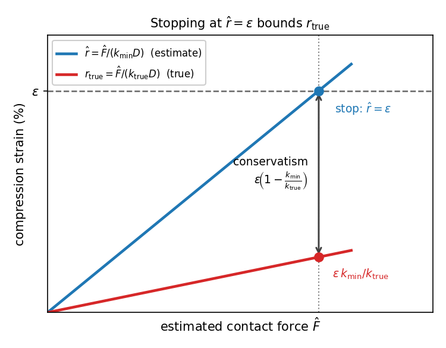
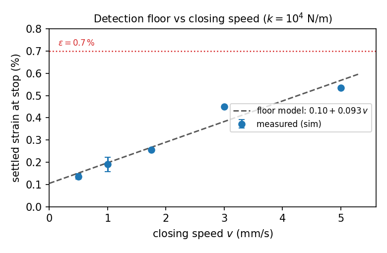
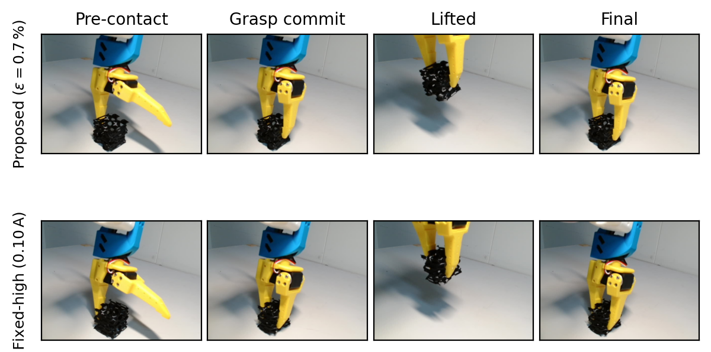

로봇이 과일을 딸 때 요구는 서로 반대 방향입니다. 옮기는 동안 놓치지 않을 만큼 쥐어야 하고, 무르지 않을 만큼 살살 쥐어야 해요. 문제는 같은 품종 안에서도 익은 정도에 따라 전체 과실 압축 강성이 물러진 토마토의 2000 N/m부터 단단한 것의 1만 N/m까지 몇 배로 갈린다는 데 있습니다. 규슈대 Shuto와 Vargas의 [Sensorless damage-safe grasping](https://arxiv.org/abs/2608.23983)은 이 범위를 하나의 파지력으로 덮으려는 시도를 포기하고, 제어 대상을 힘에서 변형으로 바꿔요.

## 힘을 맞추는 대신 변형을 묶어요

기존 대응은 크게 둘입니다. 하나는 촉각 센서를 붙여 접촉 상태를 읽는 쪽인데, GelSight 같은 시각 기반 촉각 카메라와 RGB 비전을 결합한 선행 연구는 각 파지를 안전·미끄러짐·손상으로 분류합니다. 다만 물체 모양에 따라 성능 편차가 커서 바나나에서 38%, 둥근 과일에서 90%로 갈렸고, 사용자에게 노출되는 것은 범주 라벨이지 조절 가능한 물리량이 아니에요. 다른 하나는 모터 전류에서 접촉력을 되찾는 무센서 힘 추정입니다. 일반화 운동량과 전류만으로 외력을 복원하는 고전적 방법부터 마찰 모델·시간 신경망으로 정밀도를 올리는 최근 연구까지 계보가 두터운데, 이쪽은 신호는 주지만 손상 한계를 정의하지는 않습니다.

이 논문의 출발점은 멍이 특정 압축 변형률에서 시작한다는 압축 시험 문헌입니다. 그렇다면 제어할 양은 파지력이 아니라 압축 변형률 r, 즉 물체가 원래 지름 D 대비 얼마나 눌렸는지의 비율이어야 해요. 제어기는 사용자가 지정한 상한 ε까지만 누르고 멈춥니다.

핵심은 그 변형률을 어떻게 재느냐인데, 직접 재려면 결국 피하려던 촉각 센서가 필요해요. 대신 후크 접촉 모델 δ = F/k를 쓰되, 강성을 물체마다 재지 않고 **대상 숙도 범위에서 가장 무른 값을 하한 k_min으로 고정**합니다. 여기서 보증이 나와요. 실제 물체는 모두 k_true ≥ k_min을 만족하므로 추정 변형률이 참값을 항상 위에서 덮습니다.

<figure class="fig"><figcaption>추정이 참값을 위에서 덮으므로 추정값 기준으로 멈춰도 참 압축은 상한을 넘지 않는다</figcaption></figure>
<em>보수적 압축 변형률 경계 — 두 직선의 간격이 강성 하한을 쓴 대가이자 안전 여유다(출처: Shuto·Vargas, Sensorless damage-safe grasping)</em>

추정값이 ε에 닿을 때 멈추면 참 압축은 ε·k_min/k_true에 머물고, 등호는 가장 무른 물체에서만 성립해요. 같은 여유가 힘 보정 오차도 흡수합니다. 부하값을 힘으로 바꾸는 계수 α를 대충 잡아도, 그 오차 비율이 강성 비율 이하이면 보증은 살아남아요. 로봇마다 힘 보정을 다시 하지 않아도 되는 이유가 여기 있습니다.

## 접촉을 알아내는 데도 변형이 듭니다

제어기가 읽는 신호는 두 개뿐이에요. 50 Hz로 들어오는 조 위치 x와 모터 부하 프록시 I입니다. 접촉 판정은 자유 폐쇄 구간 잡음의 3–4σ에 문턱을 두고 3틱 연속으로 넘을 때 선언해요. 미분 기반 검출을 쓰지 않은 이유가 문제 구조를 그대로 드러냅니다. 무른 물체에서는 접촉력 상승이 완만해서, 정작 손상 회피가 가장 중요한 영역에서 미분 검출이 불안정해져요.

여기서 이 논문의 두 번째 기여가 나옵니다. 잡음에 견디는 검출은 공짜가 아니에요. 문턱을 넘고 3틱을 확인하는 동안 조는 계속 닫히므로, 제어기가 개입하는 시점에는 이미 얼마간의 압축이 소비돼 있습니다. 저자들은 이 검출 바닥을 식으로 정리하고 시뮬레이션에서 측정했어요.

<figure class="fig"><figcaption>검출 바닥은 폐쇄 속도에 선형이고, 절편은 잡음 문턱이 정한다</figcaption></figure>
<em>폐쇄 속도별 정착 변형률 — 속도가 처리량과 부드러움을 가르는 손잡이가 된다(출처: Shuto·Vargas, Sensorless damage-safe grasping)</em>

바닥은 폐쇄 속도 v에 선형이고 측정 적합은 0.10% + 0.093%·v(mm/s)로 나왔습니다. 식에서 v를 뺀 나머지 항은 센서와 물체 종류가 정하니, 속도가 사실상 유일한 조절 손잡이예요. 보증도 이 바닥 위에서만 의미가 있습니다. 접촉이 있다는 사실을 알아내는 데 쓴 압축보다 낮은 지점에서 멈출 수 있는 제어기는 없으니까요. 실제로 ε을 0.3%로 두고 돌린 열은 바닥 아래라 달성 불가였고, 그 결과 파지력이 약해 들어 올리지도 못했어요.

이 진단이 실측을 설명하는 방식이 깔끔합니다. ε ≤ 1.3%인 구간에서 정착 변형률이 격자 전체에서 0.35–0.56%로 ε과 거의 무관하게 나왔는데, 그 구간의 정지는 ε이 아니라 검출 지연이 정하고 있었어요. 하드웨어에서도 ε = 0.7%와 1.3%의 정지 부하가 52 대 57 부하 단위로 거의 같았습니다.

## SO-ARM101 위에서 시뮬레이션과 실기를 같은 설정으로 돌렸어요

검증 플랫폼이 눈에 띕니다. 시뮬레이션은 MuJoCo 3.8.0에서 LeRobot 생태계의 gym-soarm이 제공하는 SO-ARM101 MJCF 모델을 쓰고, 하드웨어는 같은 SO-ARM101에 Feetech STS3215 서보를 50 Hz로 지휘해요. 여기서 부하 프록시는 시뮬레이션에서는 전류이고 실기에서는 Feetech 로드 레지스터 값, 즉 듀티 사이클 프록시입니다. 잡음 모델도 실기 측정에서 가져와서, 시뮬레이션의 틱당 가우시안 잡음 표준편차 0.003 A는 하드웨어 세션에서 잰 자유 폐쇄 잡음에 맞춘 값이에요. 검출 설정도 양쪽이 같습니다.

비교 대상은 고정 파지력 두 종입니다. 접촉하자마자 멈추는 부드러운 쪽과 단단한 물체에 맞춘 억센 쪽인데, 저자들은 이 둘이 고정 파지력 계열의 양극단에 해당한다고 봐요. 압축은 힘 문턱에 대해 단조 증가하므로 이 둘 사이의 어떤 설정도 두 결과 사이에 놓입니다.

시뮬레이션 결과에서 대비가 가장 선명한 지점은 중간 강성입니다.

| 제어기 | 종료 시 파지력 | 파지 성공 | 손상 |
| --- | --- | --- | --- |
| 제안 (ε = 0.7%) | 1.0 N | 100% | 0% |
| 제안 (ε = 1.3%) | 1.0 N | 98% | 0% |
| 제안 (ε = 2.0%) | 3.1 N | 100% | 0% |
| 고정 파지력 (억센 쪽) | 11.4 N | 100% | 100% |
| 고정 파지력 (접촉 시 정지) | 2.5 N | 68% | 2% |

강성 4000 N/m, 셀당 50시드 기준입니다. 억센 쪽은 제안 방식의 열 배가 넘는 힘으로 쥐어 전부 손상시키고, 부드러운 쪽은 거의 손상은 없지만 68%밖에 못 잡아요. 격자 전체로 보면 제안 방식은 k ≥ 4000 N/m의 모든 강성에서 ε ∈ [0.7, 2.0]% 전 구간에 걸쳐 파지 98% 이상·손상 0%를 유지했고, 30개 셀 중 17개가 정확히 100/0이었습니다.

고정 파지력 계열이 배제되는 논증은 가장 무른 쪽에서 나옵니다. 강성 2000 N/m에서는 접촉 시 정지, 즉 그 계열에서 가장 적게 누르는 설정조차 70%를 멍들게 했어요. 단조성에 따라 어떤 고정 문턱도 가장 무른 물체의 최소 70%를 손상시킵니다. 반대로 4000 N/m에서 잃은 파지를 되찾으려면 문턱을 올려야 하는데, 그러면 무른 쪽 피해는 그대로예요. 힘 손잡이 하나로는 강성 범위의 양 끝을 동시에 만족시킬 수 없다는 결론이 여기서 나옵니다.

## 실기에서는 무른 물체의 타임아웃이 차이를 드러냈어요

하드웨어 시험은 40 mm TPU 정육면체를 5%·10%·15% 인필로 뽑아 무름·중간·단단함 세 등급을 만들었습니다. 3D 프린트 물체를 쓴 이유가 실험 설계로서 타당해요. 인필만 강성을 바꾸고 형상과 재질은 고정되니, 보증이 다루는 변수인 강성만 분리해 관찰할 수 있습니다.

<figure class="fig"><figcaption>위는 제안 방식, 아래는 고정 파지력 억센 쪽. 아래 줄은 확정에 실패한 채 큐브가 눌린다</figcaption></figure>
<em>무른 TPU 큐브에서의 실기 시퀀스 — 접촉 전, 파지 확정, 들어 올림, 최종(출처: Shuto·Vargas, Sensorless damage-safe grasping)</em>

무른 큐브에서 두 고정 파지력 기준선은 손상률 100%였고, 제안 방식은 ε = 0.7%에서 40%로 내려갔습니다. 중간·단단한 큐브에서는 기준선과 같은 파지 성공을 유지하면서 파지력은 절반 수준이었어요. 다만 단단한 큐브의 ε = 0.7% 셀만은 파지가 80%로 내려갑니다. 제안 방식의 평균 부하가 약 62 단위인 데 비해 기준선은 103과 119였습니다.

차이를 가장 뚜렷이 드러내는 항목은 타임아웃입니다. 무른 큐브에서 부드러운 기준선은 60%, 억센 기준선은 100%가 폐쇄 창을 소진했어요. 변형 목표가 없으니 정지 조건을 만족시키지 못한 채 계속 눌린 겁니다. 반면 제안 방식은 세 ε 값 모두에서 타임아웃 0%로 매번 확정했습니다. 손상률만 보면 무른 큐브에서 40%가 남지만, 두 100%와는 실패의 층이 다르다고 봅니다. 제안 방식의 40%는 제때 멈췄는데도 그 지점이 이미 손상선 위였던 경우이고, 기준선의 100%는 멈출 지점 자체를 갖지 못한 경우예요.

시뮬레이션과 실기가 재현한 규칙성도 둘 있어요. 강성이 낮을수록 손상 없이 잡기 어렵다는 것과, 무른 물체에서 손상률이 ε에 단조 증가한다는 것입니다. 실기에서 ε = 0.7/1.3/2.0%에 대해 40/80/100%로 오른 것이 시뮬레이션의 2000 N/m 열과 같은 모양이에요.

## 강성을 추정하지 못하는 이유가 방법의 경계를 정합니다

논문이 스스로 밝히는 한계가 이 접근의 구조를 가장 잘 설명합니다. 저자들은 접촉 이후 힘과 변위의 기울기로 실제 강성을 온라인 추정하는 방식을 구현했다가 껐어요. 이유는 튜닝 부족이 아니라 목적 충돌입니다. 손상 없는 정지는 접촉 직후 몇 틱 안에 멈추므로, 기울기를 식별하는 데 필요한 변위 스프레드가 거의 남지 않아요. 최소제곱 분모가 0에 가까워지니 부하값 몇 단위의 잡음이 추정 강성을 허용 범위 전체로 흔듭니다. 추정에 필요한 여기(excitation)를 과제 자체가 억제하도록 설계돼 있는 셈이에요.

그래서 이 제어기는 닫는 국면만 보면 결국 힘 문턱 정책입니다. 정지 조건을 풀면 F_stop = ε·k_min·D라는 닫힌 형태가 나와요. 저자들은 이것을 결함이 아니라 강점으로 봅니다. 배포 난이도는 고정 파지력과 같은데, 손으로 고른 힘 값이 주지 못하는 셋이 붙어요. 참 압축이 ε 이하라는 보증, 로봇과 과일 크기를 넘어 이식되는 무차원 손잡이, 그리고 물체 지름 D에 따라 자동으로 조정되는 문턱입니다. 여기에 들어 올리는 동안 팔 관절이 밀려 추정 변형률이 떨어지면 같은 비례 법칙이 다시 조여요. 정적 힘 문턱에는 없는 거동입니다.

## 학습 정책의 안전 행동 공간이라는 쓰임, 그리고 남은 한계

저자들이 제시하는 확장 방향 중 눈여겨볼 것은 ε을 학습 정책의 행동 공간으로 넘기는 구상입니다. 수확 과제를 배우는 정책은 보통 접근·자세·들어 올리는 시점을 익히면서 손상 회피까지 보상 설계로 발견해야 하고, 탐색 내내 과일을 으깨게 돼요. 이 제어기를 파지 원시동작으로 깔면 정책은 검출 바닥 위의 ε 하나만 고르면 되고, 그 범위의 모든 값이 구성상 손상 안전합니다. 안전 강화학습에서 실드가 맡는 역할과 같은 자리예요.

이 선택을 최근 파지 연구들과 나란히 두면 층이 갈립니다. [[2026-08-24_사람_손_시연에서_물성을_읽는_파지|사람 손 시연에서 물체 물성을 읽어 파지 힘을 맞추는 ViTacPhys]]는 물성을 더 정확히 획득해 힘을 맞추는 쪽이고, [[2026-08-25_물체_데이터_없이_그리퍼_기하만으로_학습한_파지_GOAG|물체 데이터 없이 그리퍼 기하만으로 학습한 파지 계획 GOAG]]는 어디에 손가락을 놓을지를 기하로만 푸는 쪽입니다. 이 논문은 세 번째 선택지예요. 물성을 알아내려는 시도를 접고, 알려진 하한만으로 결과의 상한을 묶습니다. 신호 층에서 보면 [[2026-07-20_힘_센서_없이_힘을_아는_로봇|전류-토크 선형 모델을 신경망으로 갈아끼운 NeuralActuator]]와 재료가 같은데 방향이 반대입니다. 저쪽은 전류에서 토크로 가는 사상을 학습으로 정밀화했고, 이쪽은 그 사상이 부정확해도 보증이 살아남도록 여유를 설계했어요.

한계는 명확합니다. 가장 무른 영역에서는 안정적으로 드는 데 필요한 압축이 손상선에 붙어 있어서, 어떤 ε도 잡기와 손상 없음을 동시에 만족시키지 못했어요. 저자들도 이것을 제어기의 문제가 아니라 강체 패드 파지의 한계로 돌리고 그 영역은 연질·공압 그리퍼의 몫으로 넘깁니다. 실제 과일 검증도 아직인데, 진짜 토마토는 이방성과 숙도에 따른 점탄성, 불규칙한 형상을 더해서 후크 근사와 단일 지름 가정을 둘 다 압박할 겁니다. 구현과 실험 데이터는 [저장소](https://github.com/shutouyusei/damage-safe-grasping)에 공개돼 있어요.

읽고 나서 남는 것은 성능 수치보다 문제를 옮기는 방식이라고 봅니다. 강성을 모른다는 사실은 그대로 두고, 모른다는 것의 방향만 정한 다음 그 방향으로 반올림해 보증을 얻었어요. 추정을 포기하는 대신 보수성을 명시적 비용으로 회계하는 이 구도는, 과일 파지 밖에서도 센서를 못 붙이는 자리마다 되풀이될 만한 모양입니다.

---
<!-- src-block -->
출처 — [Sensorless damage-safe grasping](https://arxiv.org/abs/2608.23983) · CC BY 4.0 · 그림은 원문 논문에서 인용했습니다.
