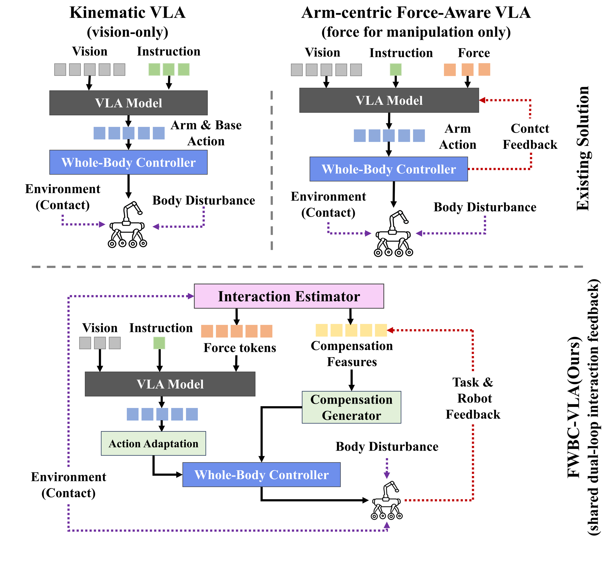

문을 열거나 칠판을 닦을 때 로봇팔 끝에 걸린 힘은 팔에서 끝나지 않아요. 몸체가 밀리면 팔이 의도한 궤적을 계속 따라가도 접촉은 어긋납니다. [FWBC-VLA 원문](https://arxiv.org/abs/2609.03889)는 이 문제에서 <abbr title="카메라 영상과 사람의 지시를 받아 로봇의 행동을 만드는 학습 모델">VLA</abbr>가 낸 작업 행동과 몸체를 지탱하는 <abbr title="팔과 다리와 몸체를 함께 움직여 자세를 지키는 제어기">전신 제어</abbr>가 같은 접촉 신호를 보게 하려 합니다.

## 팔끝의 힘이 몸체 문제로 번져요

이동 조작에서 팔끝이 문을 밀면 외력이 관절을 지나 베이스 자세까지 흔듭니다. 기존 방식은 작업 정책과 자세 제어기가 위치·속도 명령만 주고받는 경우가 많아서, 접촉이 시작됐는지 힘이 계속 걸리는지, 어느 순간 풀렸는지를 두 층이 같이 알기 어렵습니다. 팔에 힘·토크 센서를 붙이는 방법도 있지만 기구·배선·보정 작업이 추가됩니다.

저자들은 센서를 새로 붙이는 대신 팔·다리·베이스의 <abbr title="로봇이 자기 관절 위치와 속도 같은 몸 상태를 스스로 읽는 정보">고유수용 상태</abbr>를 입력으로 씁니다. 관절이 자유롭게 움직일 때의 토크와 실제 토크 차이를 시간 순서로 읽어 접촉의 크기와 변화를 추정합니다. 중요한 것은 이 추정값을 팔 행동 모델에만 넣지 않고, 베이스가 얼마나 보정돼야 하는지도 계산하는 공통 입력으로 쓴다는 점입니다.

<figure class="fig"><figcaption>접촉 추정값 하나를 행동 생성과 몸체 보정이 함께 받는 구조</figcaption></figure>
<em>FWBC-VLA의 두 피드백 경로 도식(출처: Zhang 외, FWBC-VLA)</em>

## 추정값은 두 갈래로 흘러요

논문은 이 추정기를 <abbr title="최근의 몸 상태를 함께 읽어 접촉 힘을 가늠하는 잔차 토크 추정기">HSR-Force</abbr>라고 부릅니다. 추정한 접촉 이력은 토큰으로 바꿔 VLA의 행동 생성기에 넣고, 같은 추정 토크는 관절 움직임과 힘의 관계를 나타내는 <abbr title="관절 움직임을 팔끝의 움직임과 힘으로 연결하는 계산 행렬">야코비안</abbr>을 거쳐 팔끝과 베이스의 힘 추정으로 바뀝니다. 그 뒤 몸체 보정기는 자세 이탈과 접촉 신호를 보고 수정 행동을 냅니다.

이 분리는 [[2026-07-20_힘_센서_없이_힘을_아는_로봇|전류-토크 선형 모델을 신경망으로 갈아끼운 NeuralActuator]]이 다룬 전류·토크 추정과 닿아 있어요. 다만 여기서는 추정 오차를 더 줄이는 데서 멈추지 않고, 그 값을 어느 제어층에 보낼지를 함께 정합니다. 신호를 잘 맞혀도 작업 정책만 받으면 베이스가 밀리는 문제는 남기 때문입니다.

## 데이터에도 접촉 의도를 남겼어요

학습 재료인 WL&Arm 데이터셋은 원격 조작 에피소드 5,000개 이상으로 구성됐고, 접촉 추정용 관절 데이터는 200Hz, 이동 조작 시연은 15Hz로 기록됐습니다. 조작자는 말단장치의 접선·법선 방향 힘 명령도 냈지만, 저자들은 이 값을 추정기나 정책의 입력으로 넣지 않고 데이터 점검용 메타데이터로만 남겼다고 설명합니다. 입력에 답을 섞어 넣지 않으려는 구분입니다.

이 선택은 데이터 층에서 볼 때도 유용합니다. 명령한 힘과 로봇이 추정한 접촉을 따로 보관하면, 나중에 성능 저하가 정책의 행동 문제인지 추정 신호 문제인지 나눠 볼 수 있습니다. 논문은 흰 칠판 닦기와 도어 클로저가 달린 문 열기를 사용했지만, 이 기록 방식 자체는 다른 접촉 작업에도 옮길 수 있어요.

## 끝 단계에서 차이가 커졌어요

실기 평가는 바퀴·다리 로봇에 6자유도 팔과 그리퍼를 붙여 했고, 각 과제는 25회씩 반복했습니다. 논문 표에서 FWBC-VLA는 칠판 닦기 단계 성공률 76%, 마지막 단계 64%를 보고합니다. 문 열기는 표 2에서 조작 단계 64%, 문을 밀고 통과하는 마지막 두 단계는 각각 52%예요. 다만 본문 서술은 조작 단계를 56%로 적어 표와 맞지 않습니다. 저자들은 힘 입력을 쓰는 비교 모델보다 마지막 단계에서 40퍼센트포인트 높은 결과라고 적습니다.

이 수치는 센서 없이 힘을 완벽히 복원했다는 뜻은 아닙니다. 실제 힘 센서를 쓴 FWBC-GT와 근접한 결과가 나왔다는 저자 해석도 이 플랫폼과 두 작업에 한정됩니다. 그래도 접촉이 길게 이어질수록 차이가 커졌다는 결과는, 행동 생성과 자세 보정을 따로 최적화하지 말고 같은 접촉 사건을 기준으로 묶어야 한다는 설계 판단을 뒷받침합니다.

## 남는 검증 범위가 있어요

논문은 한 종류의 바퀴·다리 플랫폼과 두 작업을 중심으로 평가했습니다. 추정값은 동적인 전신 운동, 마찰, 구동기 오차가 섞인 상태에서 만들어지므로 다른 팔 구조나 다른 바닥 조건에서 같은 수준으로 작동한다고 바로 일반화할 수는 없어요. 원격 조작 데이터가 공개될 예정이라고만 적혀 있어, 재현에 필요한 데이터·코드·학습 설정의 실제 공개 여부도 후속 확인이 필요합니다.

이 연구가 남기는 실용적인 질문은 "힘 센서가 있나"보다 "접촉 정보를 어느 제어층이 함께 봐야 하나"에 가깝습니다. 로봇이 접촉을 추정할 수 있다면 그 신호를 행동 정책의 입력으로만 쓰지 말고, 베이스 보정과 안전 판단에도 같은 시간축으로 남겨야 원인 추적이 가능해집니다.

---

<!-- src-block -->

출처 — https://arxiv.org/abs/2609.03889
