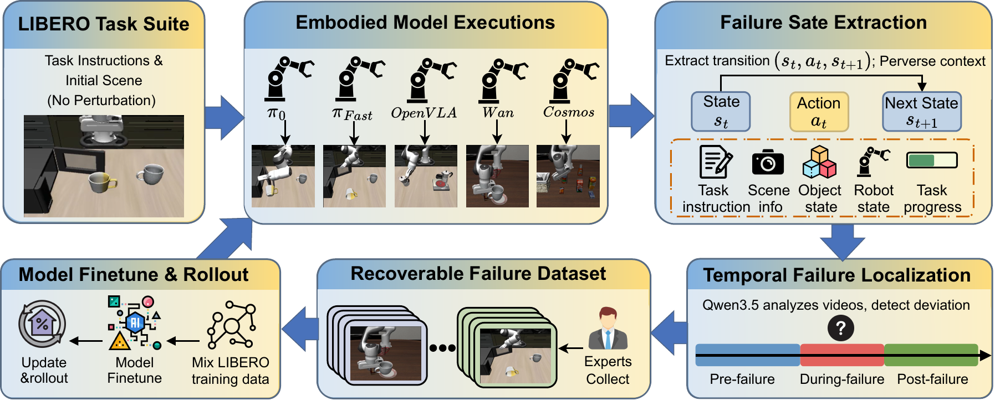

로봇 조작의 성공률은 시작 자세가 맞을 때의 결과만 보여 주기 쉽습니다. 컵을 집다가 미끄러지거나 물체를 밀어 목표 상태가 바뀐 뒤에도 과제를 이어 갈 수 있는지는 별도 질문이에요. [LIBERO-RECOVER](https://arxiv.org/abs/2609.05178)는 이 빈자리를 실패 복구 평가로 분리합니다. 기존 LIBERO 과제에서 여러 모델이 실제로 낸 실패를 출발점으로 삼고, 원래 목표를 다시 완성할 수 있는지를 측정합니다.

<figure class="fig"><figcaption>LIBERO-RECOVER의 실패 상태 추출과 복구 데이터셋 구성 흐름</figcaption></figure>
<em>원 논문의 TeX 원본 그림을 PNG로 변환했어요.(출처: Liu et al., LIBERO-RECOVER)</em>

## 성공한 시작 상태만으로는 실패 뒤를 알 수 없어요

기존 벤치마크는 미리 정한 초기 장면에서 과제를 끝냈는지 확인합니다. 이 방식은 모델끼리 비교하기 좋지만, 실행 중 생긴 파지 실패와 충돌, 물체 이동 뒤에도 다음 행동을 고를 수 있는지까지 말해 주지는 않아요. 논문은 표준 과제에서 앞서던 모델의 순위가 실패 상태에서는 뒤집힐 수 있다고 보고합니다. 저자들이 평가한 모든 모델은 자연스럽게 발생한 실패 상태에서 성능이 50% 이상 떨어졌어요.

여기서 중요한 재료는 실패한 마지막 프레임 한 장이 아닙니다. 과제 지시문, 원래 장면, 실패를 일으킨 행동, 실패 전·중·후 구간, 로봇과 물체 상태를 묶어야 복구의 이유를 추적할 수 있어요. 같은 "실패"라도 바로 다음 행동을 다시 하면 되는 경우와, 물체 관계를 다시 읽고 계획을 바꿔야 하는 경우는 데이터의 포함 기준과 평가 난도가 달라집니다.

## 복구 난이도는 상태를 얼마나 다시 읽어야 하는지로 나뉘어요

LIBERO-RECOVER는 복구를 네 단계로 나눕니다. 첫 단계는 실패한 행동을 다시 실행하는 경우이고, 다음 단계는 행동을 현재 장면에 맞게 조정하는 경우예요. 세 번째는 물체의 상태를 되돌려야 하며, 마지막 단계는 과제를 막는 환경 상태까지 복구해야 합니다. 뒤 단계로 갈수록 다음 행동 하나를 고르는 문제가 아니라, 무엇이 바뀌었고 원래 목표에 무엇이 남았는지 추론하는 문제가 됩니다.

저자들은 실제 모델 실행에서 나온 실패로 1,000개가 넘는 시나리오를 구성했습니다. 후보 실패 장면의 영상은 모델이 실패 전·중·후 시간 경계와 복구 유형을 판정하고, 시뮬레이터에서 해당 시점의 로봇 상태와 물체 자세를 꺼내 복구 과제로 만듭니다. 따라서 이 분류는 사람이 모든 장면에 붙인 정답 라벨이 아니라 자동 판정 단계를 거친 결과입니다. 실패 조건과 복구에 필요한 상태 변화는 에피소드에 남지만, 사람 원격 조작자가 수집한 복구 궤적은 일부 실패 시나리오의 미세 조정 데이터로 따로 쓰입니다.

## 복구 성공률 하나로는 부족해요

논문은 원래 과제를 실패 상태에서 끝까지 마친 비율을 <abbr title="실패 상태에서 시작해 원래 과제를 끝낸 비율">복구 성공률(RSR)</abbr>로 둡니다. 여기에 실패 전 성능과 실패 후 성능이 얼마나 줄었는지 보는 <abbr title="실패 뒤에 원래 수행 능력이 얼마나 줄었는지 나타내는 값">복구 저하도(RD)</abbr>, 복구 결과의 안정성을 보려는 <abbr title="복구 결과가 일정한지 보려고 논문이 제안한 값">복구 일관성(RC)</abbr>을 더합니다. 다만 논문은 RC를 같은 과제의 여러 실패 상태에서 안정적인지를 보는 값이라고 설명하면서, 제시한 수식은 과제별 복구 성공률의 표준편차를 사용합니다. 설명과 수식의 측정 단위가 맞지 않으므로, 이 값만으로 같은 실패 조건에서의 반복 가능성을 단정하면 안 됩니다.

실험에서는 표준 성공률이 복구 능력을 대신하지 못했습니다. 실패 복구 데이터를 섞어 학습한 GR00T N1.5는 복구 성공률이 17.8%에서 21.2%로 올랐지만, 일반 LIBERO 성공률은 86.5%에서 87.2%로만 변했습니다. OpenVLA-OFT는 복구 성공률이 20.8%에서 25.4%로 올랐는데도 일반 LIBERO 성공률은 97.1%에서 96.6%로 낮아졌습니다. 실패 상태를 더 보게 했다는 사실만으로, 실행 중 새로 생긴 실패를 알아차리고 대응하는 능력이 함께 생기지는 않았습니다.

## 데이터셋은 실패 상태의 판정 기준까지 남겨야 해요

복구용 데이터는 성공 시연을 더 모은 목록이 아닙니다. 어떤 물체 위치 변화와 접촉 실패를 같은 유형으로 묶을지, 어느 상태에서 에피소드를 제외할지, 원래 과제 성공을 무엇으로 판정할지를 먼저 정해야 합니다. 논문의 네 단계 분류는 이 기준을 난이도 이름으로만 두지 않고, 상태 추론의 깊이와 연결한다는 점에서 쓸모가 있습니다.

실패를 한 번 고쳤다는 기록도 충분하지 않습니다. 같은 실패 조건을 반복했을 때 복구 결과가 다시 흔들리는지까지 남겨야, 모델의 취약점인지 우연한 장면 차이인지 분리할 수 있습니다.

실물 조작 데이터를 다룰 때도 같은 구조를 옮길 수 있어요. 수집 조건에는 조명, 물체 위치, 카메라 시야, 기체 상태를 남기고, 실패 에피소드에는 포함·제외 이유와 원래 목표 상태를 붙입니다. 평가는 표준 성공률과 별도로 실패 조건별 복구율을 기록해야 합니다. 시각·언어·행동 모델에 접촉 신호를 더해 상태 전이를 읽는 [[2026-08-24_접촉음으로_접촉_전이를_읽는_Audio-VLA|접촉음을 VLA 입력으로 더해 접촉 전이를 읽는 Audio-VLA]]처럼, 실패를 감지할 관측을 늘리는 일도 이 평가표에서 효과를 확인할 수 있습니다.

---

<!-- src-block -->

출처 — https://arxiv.org/abs/2609.05178
