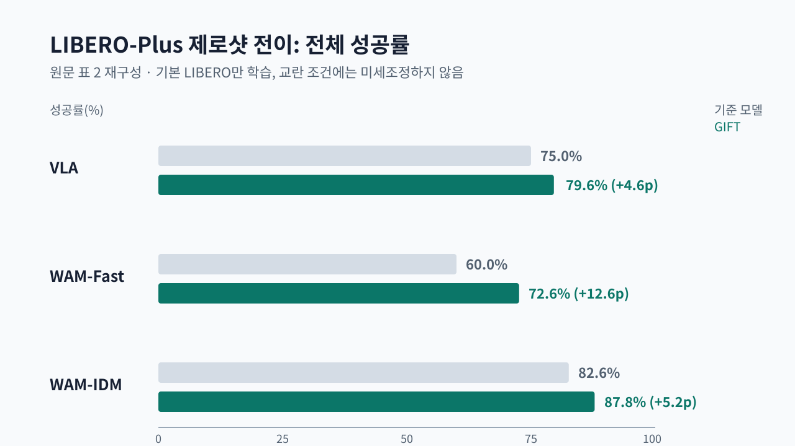

로봇 조작 정책은 카메라에서 물체를 찾아 행동을 내지만, 카메라 위치·조명·배경이 바뀌면 같은 물체를 보고도 실패할 수 있어요. [GIFT 원문](https://arxiv.org/abs/2609.04193)는 행동을 바로 예측하기 전에 거치는 특징에 세 가지 구조를 학습시키는 방법을 제안합니다. 물체까지 움직일 수 있는 경로를 위한 기하, 지시와 관련 있는 물체의 역할, 행동이 닿아야 할 목표 영역입니다.

## 행동에 쓸 정보만 중간에 남겨요

<abbr title="행동에 필요한 기하와 물체 역할, 목표 위치만 남긴 중간 특징 학습 방법">GIFT</abbr>는 원래 정책의 행동 출력 형식을 바꾸지 않습니다. 학습할 때만 중간 특징이 세 구조를 복원하도록 제약하고, 실행할 때는 이 보조 예측을 행동 입력으로 다시 넣지 않는 구성을 기본으로 둡니다. 저자들의 설명대로라면 정책이 배경처럼 제어에 덜 필요한 시각 정보보다, 움직임 가능성·물체 관계·목표 위치를 특징 안에 남기게 하려는 선택이에요.

이 구조는 <abbr title="카메라 영상과 사람의 지시를 받아 로봇의 행동을 만드는 학습 모델">VLA</abbr>와 두 종류의 <abbr title="다음 관측이나 행동의 관계를 예측해 행동을 만드는 모델">WAM</abbr>에 같은 방식으로 붙였습니다. 그래서 한 정책에만 맞춘 새 행동기가 아니라, 중간 특징을 어디에 학습시킬지에 관한 제안으로 읽어야 해요. [[2026-08-26_UR10e에_SmolVLA를_올려_색상_편향까지_드러낸_ROS2SmolVLA|UR10e에 SmolVLA를 올려 색상 편향까지 드러낸 ROS2SmolVLA]]도 작은 행동 모델을 산업용 팔에서 평가할 때 색상 편향을 분리해 본 사례입니다. 원문은 보조 예측을 행동기에 직접 주입하지 않은 경우가 더 높은 성능을 냈다고 보고합니다. 구조를 입력으로 덧붙이기보다 내부 표현에 남기는 쪽이 이 실험에서는 나았다는 뜻이에요.

<figure class="fig"><figcaption>원문 표 2의 전체 성공률을 다시 그렸어요. 모든 모델은 교란이 추가된 평가 데이터로 미세조정하지 않았습니다.</figcaption></figure>

## 일곱 가지 교란에서 확인했어요

저자들은 <abbr title="원래 학습 데이터와 달리 카메라·로봇·지시문·조명·배경·잡음·배치를 바꾼 로봇 조작 평가">LIBERO-Plus</abbr>에서 제로샷 전이를 측정했습니다. 학습은 원래 벤치마크 궤적만으로 하고, 바뀐 조건의 학습 데이터를 추가하지 않은 채 평가했습니다. 표 2에서 <abbr title="GIFT를 비전언어행동 정책에 붙인 구성">GIFT-VLA</abbr>는 대응 기준 모델의 75.0%보다 4.6퍼센트포인트 높은 79.6%를, <abbr title="GIFT를 빠른 행동 예측 월드액션모델에 붙인 구성">GIFT-WAM-Fast</abbr>는 60.0%보다 12.6포인트 높은 72.6%를 기록했습니다. <abbr title="GIFT를 역동역학 월드액션모델에 붙인 구성">GIFT-WAM-IDM</abbr>은 82.6%에서 87.8%로 5.2포인트 높아졌습니다.

다른 로봇 몸체와 가정 환경을 쓰는 <abbr title="집안 조작 과제를 여러 로봇 몸체로 평가하는 시뮬레이션 벤치마크">RoboCasa</abbr>에서도 세 구성은 각각 61.4%, 83.6%, 82.3%의 전체 성공률을 보였습니다. 특히 관절이나 문처럼 움직이는 물체를 다루는 과제에서는 빠른 행동 예측 구성과 역동역학 구성이 대응 기준보다 각각 21.3포인트, 24.6포인트 높았다고 표 3이 적고 있어요. 기하와 물체 역할을 따로 학습시킨 효과가 접촉 관계가 복잡한 과제에서 더 크게 나타났다는 관찰입니다.

## 평균 상승이 모든 조건의 승리를 뜻하지는 않아요

원문 표 2의 전체 성공률은 일곱 교란의 평균이라서, 어떤 교란이 개선을 주도했는지는 열별 수치를 따로 봐야 합니다. 예를 들어 GIFT-VLA의 배경 교란 성능은 96.9%지만 카메라 교란은 57.7%로, 같은 모델 안에서도 조건에 따라 난이도가 크게 달라집니다. 표에 적힌 결과는 저자들이 정한 벤치마크와 비교 모델에서 나온 값이므로, 다른 카메라·팔·물체 조합에서 같은 폭으로 오를 것이라고 단정할 수는 없어요.

실제 <abbr title="소형 6축 오픈소스 로봇팔 모델">SO-101</abbr> 같은 소형 팔에 적용하려면 먼저 실패 조건을 분리해 기록해야 합니다. 카메라 위치가 달라져 실패하는지, 배경이나 조명이 바뀌어 실패하는지, 물체의 관절 운동 때문에 실패하는지를 같은 성공률 하나로 합치면 무엇을 학습시켜야 하는지 알 수 없어요. GIFT의 결과는 행동 정책의 입력을 계속 늘리는 대신, 실패를 만드는 구조를 중간 표현의 학습 목표로 남길 수 있다는 근거를 제공합니다.

## 평가셋은 학습과 분리해야 해요

논문은 바뀐 조건의 데이터를 학습에 섞지 않고, 기본 궤적으로 학습한 정책을 그대로 평가했습니다. 이 분리는 성능이 올랐다는 결과를 "교란을 이미 본 모델이 맞힌 것"과 구분하게 해 줍니다. 소형 팔의 시연 데이터를 모을 때도 카메라 높이·물체 위치·조명처럼 실패를 만들 수 있는 조건을 메타데이터로 남기고, 일부 조건은 학습에서 빼 둬야 합니다. 그래야 중간 표현에 넣은 구조가 새 조건에서도 남는지, 아니면 학습 장면을 기억한 것인지 따로 판정할 수 있어요.

---

<!-- src-block -->

출처 — https://arxiv.org/abs/2609.04193
