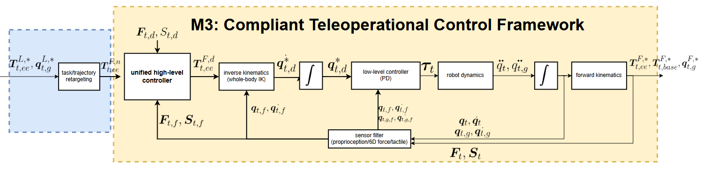

로봇 시연을 모을 때 카메라 영상만 저장하면, 물체를 누르는 힘이나 손끝이 미끄러지는 순간은 나중에 복원하기 어렵습니다. <abbr title="이동 바퀴와 로봇 팔, 그리퍼를 함께 움직이며 여러 센서 기록을 맞춰 저장하는 원격 조작 체계">M3-Tele</abbr>은 이동 바퀴·팔·그리퍼를 하나의 동작으로 조정하고, 영상·촉각·힘·자기 상태를 같은 시각의 기록으로 남기는 체계를 제안해요. 이 논문에서 중요한 점은 원격 조작 화면을 하나 더 만든 일이 아니라, 접촉을 제어하는 피드백과 학습용 시연 데이터의 시간 관계를 한 경로로 묶었다는 데 있습니다.

## 명령과 접촉 피드백이 다른 역할을 맡아요

조작자는 휴대 기기의 움직임으로 로봇 끝단의 목표 위치를 보냅니다. <abbr title="물체에 닿았을 때 힘을 읽어 목표 움직임을 조금 고쳐 충격과 과도한 힘을 줄이는 제어 방식">순응 제어</abbr>는 손목 힘 센서가 읽은 접촉 힘을 받아, 닿는 방향의 목표 위치만 고칩니다. 그 뒤 <abbr title="이동 바퀴와 팔의 움직임을 한 번에 계산해 같은 목표를 향하도록 만드는 계산">전신 역기구학</abbr>이 바퀴와 팔의 속도를 나눠 냅니다.

그리퍼에서는 촉각 영상으로 읽은 변형량을 다시 닫힘 명령에 돌려보냅니다. 즉 큰 동작은 힘 피드백과 바퀴·팔의 협조로, 손끝의 작은 접촉은 촉각 피드백으로 다룹니다. 논문은 이 두 경로를 분리하되, 최종 시연에는 카메라 영상, 촉각 영상, 힘·토크, 바퀴·팔·그리퍼 상태와 실행한 동작을 함께 기록합니다.

<figure class="fig"><figcaption>원문 그림 2의 제어 구조예요. 목표 동작, 힘·촉각 피드백, 바퀴·팔 상태가 어디에서 합쳐지는지 보여 줍니다.</figcaption></figure>
<em>M3의 원격 조작 제어 구조(출처: Chen 외, M3-Tele · CC BY 4.0)</em>

## 0.346 N은 제어 조건 안에서 읽어야 해요

저자들은 칠판을 지우는 과제에서 목표 접촉 힘을 8 N으로 두고, 순응 제어를 뺀 구성과 비교했습니다. 순응 제어를 뺀 경우 힘 추종 오차는 4.12 N, 힘의 흔들림은 19.1 N²였고, 제안 구성을 쓴 경우에는 각각 0.35 N과 0.56 N²였습니다. 초록은 더 정밀한 값으로 오차가 4.132 N에서 0.346 N으로 줄었다고 보고해요.

이 숫자는 어떤 환경에서도 힘을 정확히 맞춘다는 보증이 아닙니다. 다섯 명이 여섯 제어 구성을 10회씩 수행한, 총 300회의 원격 조작 시행에서 성공한 궤적을 대상으로 계산한 결과예요. 접촉이 끊긴 실패까지 빼고 제어 품질을 본 것이므로, 성공률과 힘 오차를 같은 지표처럼 합치면 안 됩니다.

## 촉각은 데이터의 빈 칸을 줄이지만 품질 판정은 따로 필요해요

촉각 피드백을 뺀 구성에서는 변형 오차가 2.230×10⁻³에서 6.369×10⁻³으로, 변형의 흔들림은 2.608×10⁻⁶에서 1.933×10⁻⁵로 커졌습니다. 저자들은 이 변화가 그리퍼가 과도하게 닫혀 센서 표면을 손상할 수 있는 상황과 연결된다고 설명합니다. 촉각은 물체가 손에 있는지만 알려 주는 신호가 아니라, 잡는 과정이 안전한 범위를 벗어나는지 판정하는 근거가 될 수 있어요.

학습 단계에서는 시뮬레이션에서 모은 시연으로 네 관측 조합을 비교했습니다. 영상만 쓴 경우, 영상과 촉각을 쓴 경우, 영상과 힘을 쓴 경우, 그리고 셋을 모두 쓴 경우예요. 각 조합은 시연의 25%, 50%, 75%, 100%를 사용했고, 학습된 정책은 시뮬레이션에서 조합마다 독립적인 100회 실행으로 평가했습니다. 따라서 이 논문은 촉각과 힘을 함께 저장할 이유를 보이지만, 다른 물체·조명·카메라 위치에서도 같은 차이가 난다고 증명한 것은 아닙니다.

## 시연 데이터는 센서 목록보다 시간 계약이 먼저예요

이 체계의 카메라는 30 Hz, 촉각 센서는 25 Hz, 힘 센서는 100 Hz, 높은 수준의 명령은 10 Hz로 움직입니다. 센서 주기가 다르기 때문에 파일을 한 폴더에 모으는 것만으로는 한 순간의 관측과 행동이 되지 않습니다. 어느 명령에 어떤 센서 시각과 로봇 상태가 대응하는지, 빠진 프레임과 지연은 무엇인지까지 남겨야 학습 데이터의 포함·제외 기준을 나중에 설명할 수 있어요.

M3-Tele은 시연을 수집할 때 제어와 기록을 분리된 부가 기능으로 두지 않습니다. 다만 데이터셋 품질은 센서 종류가 많다는 사실만으로 정해지지 않아요. 접촉 실패, 통신 지연, 목표에서 벗어난 동작을 같은 시각 축에서 찾아 제외하거나 별도 평가 조건으로 남길 수 있어야, 다음 정책의 실패를 제어 문제와 데이터 문제로 나누어 읽을 수 있습니다. [[2026-08-25_저장_포맷에서_매니페스트로_옮겨간_Dyna-2_데이터_병목|저장 포맷에서 매니페스트로 옮겨간 Dyna-2 데이터 병목]]도 서로 다른 센서 흐름을 학습 시점에 다시 조립하는 비용을 다뤘습니다. 이 논문은 그보다 앞선 수집 단계에서 어떤 기록을 같은 시간 축에 남길지 묻습니다.

그래서 시연 파일에는 센서 값뿐 아니라 수집 조건과 종료 사유도 들어가야 합니다. 물체 위치, 조명, 통신 상태, 접촉 실패 여부를 에피소드마다 남기면, 나중에 성공률이 낮아진 조건을 다시 분리해 평가할 수 있어요.

---

<!-- src-block -->

출처 — https://arxiv.org/abs/2609.07859
