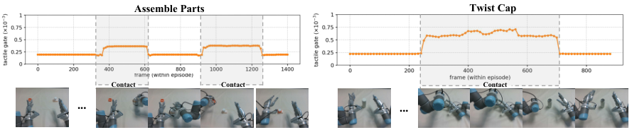

정교한 로봇 손이 컵 뚜껑을 돌리거나 부품을 끼울 때, 카메라는 물체의 위치를 잘 보여도 손끝이 실제로 닿았는지와 미끄러지는지는 놓치기 쉽습니다. <abbr title="카메라 영상과 사람의 지시를 받아 로봇의 행동을 만드는 학습 모델">VLA</abbr>에 촉각을 더하는 방법은 자연스럽지만, 접촉이 없는 구간까지 촉각을 같은 비중으로 넣으면 시각 정보를 읽는 과정이 흐트러질 수 있어요. <abbr title="접촉 상태를 보고 촉각 정보를 넣을지 정하는 정교 조작용 비전·언어·행동 모델">DeCAL</abbr>은 촉각을 항상 같은 비중으로 넣는 대신, 지금이 접촉 구간인지에 따라 촉각이 행동에 들어가는 정도를 바꾸는 쪽을 택합니다.

## 촉각은 항상 유용한 입력이 아니에요

로봇 손끝의 촉각 영상에는 손가락이 물체에 닿았을 때의 변형이 담깁니다. 그러나 물체를 찾거나 손을 접근시키는 동안에는 촉각 변화가 작고, 그때는 카메라가 물체와 손의 상대 위치를 판단하는 주된 근거가 됩니다. 논문은 촉각 정보를 모든 시점에 같은 방식으로 합치면, 시각 표현의 분포가 바뀌어 물체 위치를 맞추거나 잡는 동작까지 불안정해질 수 있다고 봅니다.

DeCAL의 접촉 인식 문은 손끝들에서 얻은 촉각의 전체 상태를 읽어 가중치를 만듭니다. 접촉 전에는 이 값이 낮아서 시각 신호가 행동을 주도하고, 손가락과 물체가 실제로 닿은 뒤에는 값이 커져 촉각 정보가 행동 생성에 더 많이 섞입니다. 중요한 것은 촉각을 켜고 끄는 이분법이 아니라, 접촉의 의미가 커지는 구간에서만 정보의 비중을 조절한다는 점이에요.

<figure class="fig"><figcaption>원문 그림 6은 접촉 단계에서 촉각 게이트 값이 커지는 모습을 보여 줍니다. (출처: Fu 외, DeCAL · CC BY 4.0)</figcaption></figure>

## 다음 접촉 상태를 함께 예상해요

이 모델은 현재 영상과 촉각만 읽고 바로 손 명령을 내지 않습니다. 과거와 현재의 시각·촉각 관측에서 다음 시점의 모습을 나타내는 내부 표현을 만들고, 그 표현을 행동 생성에 전달합니다. 손과 팔은 움직임의 크기와 제어 단위가 달라서, 논문은 둘의 행동을 같은 잡음 과정에서 한꺼번에 만들지 않고 분리해 만든 뒤 함께 조정합니다.

촉각 쪽에서는 손끝마다 읽은 힘과 토크를 이용해 미래의 촉각 영상, 변형 지도, 힘·토크 상태를 예측하도록 학습합니다. 실제 실행 때는 이 복원용 출력물을 다시 그리는 대신, 그 과정에서 만든 내부 표현만 행동 생성에 씁니다. 따라서 논문의 주장은 미래의 촉각 사진을 정확히 합성한다는 데보다, 접촉이 계속될 때 어떤 상태가 이어질지 미리 반영해 손과 팔의 행동을 고르게 만든다는 데 있습니다.

## 여섯 과제의 평균만으로 읽으면 안 돼요

저자들은 꽃병 닦기, 칠판 지우기, 부품 조립, 뚜껑 돌리기, 피펫 조작, 전구 끼우기 여섯 실기 과제를 사용했습니다. 과제마다 고품질 원격 조작 시연 100개를 모았고, 평가는 기본적으로 20회씩 했습니다. 전체 과제를 끝낸 비율의 평균은 71%, 과제 단계의 평균 진행 비율은 83.4%였어요.

하지만 평균은 쉬운 과제와 어려운 접촉 과제를 한 숫자로 합친 결과입니다. 꽃병 닦기에서는 DeCAL이 100% 성공했지만, 전구 끼우기는 40%였습니다. 부품 조립은 65%, 뚜껑 돌리기는 80%였고요. 이 차이는 촉각 게이트가 접촉 조작의 실패를 없앴다는 뜻이 아니라, 접촉을 읽는 방식이 특히 어려운 마지막 단계에서 얼마나 남는지 과제별로 다시 봐야 한다는 뜻입니다. [[2026-09-05_접촉_추정을_행동과_균형_보정에_함께_쓰는_FWBC-VLA|접촉 추정을 행동과 균형 보정에 함께 쓰는 FWBC-VLA]]도 접촉 신호를 한 제어층에만 두지 않는 문제를 다뤘지만, DeCAL은 손끝 촉각을 행동 모델 안에서 가변적으로 결합합니다.

## 낯선 물체에서 남은 75%의 조건

일반화 평가는 뚜껑 돌리기 과제에 배경, 주변 잡동사니, 조명, 물체를 각각 바꿔 적용했습니다. 물체의 높이·지름·형태를 바꾼 조건에서 DeCAL의 마지막 단계 성공률은 75%였고, 논문은 가장 좋은 비교 모델보다 30퍼센트포인트 높았다고 보고합니다. 이 결과는 단순한 화면 변화보다 손끝 접촉 방식이 달라지는 변화에서 촉각 정보가 도움이 될 수 있다는 근거입니다.

다만 이 평가는 6자유도 UR5 팔 두 대와 22자유도 손 두 개, 손끝 촉각 센서가 있는 한 실험 구성을 중심으로 합니다. 저자들도 센서 잡음, 보정 오차, 장기 사용 중의 모델 변화가 성능을 낮출 수 있고, 원격 조작자가 손끝 힘을 직접 느끼지 못해 시연의 접촉 조절이 늦어질 수 있다고 적습니다. 그러므로 DeCAL의 결과를 다른 손 구조나 다른 촉각 센서에도 그대로 옮긴 성능 보증으로 읽을 수는 없어요. [[2026-09-10_촉각과_힘을_동기화한_이동_조작_시연_데이터_M3-Tele|촉각과 힘을 동기화한 이동 조작 시연 데이터 M3-Tele]]처럼, 촉각을 정책에 넣기 전에는 어떤 접촉 신호가 어느 시각의 행동과 연결되는지도 함께 기록해야 합니다.

접촉 인식 문이 남기는 설계 기준은 단순합니다. 촉각 신호가 있다는 사실만으로 모든 순간에 같은 비중을 주지 말고, 시각이 더 믿을 만한 접근 구간과 손끝 반응이 중요한 접촉 구간을 구분해야 합니다. 그 구분이 틀리면 촉각은 보완 정보가 아니라 행동을 흔드는 잡음이 될 수 있고, 접촉 상태를 판정하는 경로가 먼저 검증 대상이 됩니다.

---

<!-- src-block -->

출처 — https://arxiv.org/abs/2609.09119
