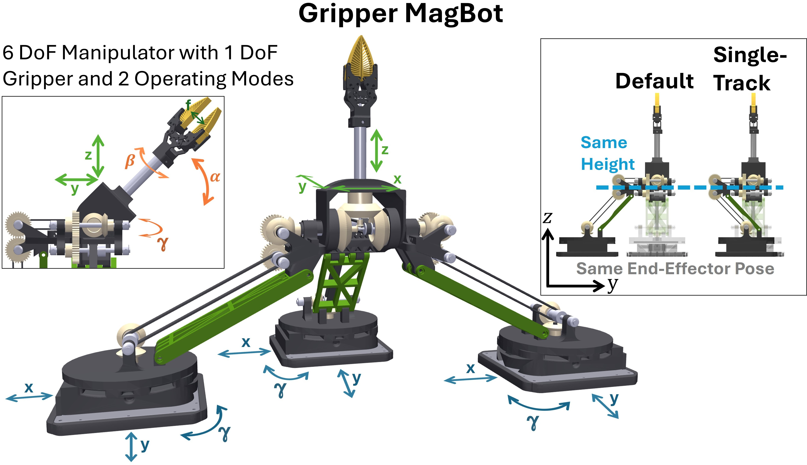

공장 안에서 물건을 옮기는 자기부상 이송기는 보통 정해진 경로를 따라 이동하는 데 쓰입니다. [원문](https://arxiv.org/abs/2609.12883)의 <abbr title="자기장을 이용해 물체를 띄우고 움직이는 이송 방식">MagLev</abbr> 위에서 물체를 집고 방향까지 바꾸려면, 별도의 로봇 팔을 더하는 대신 이송 장치의 움직임을 조작에 어떻게 연결할지 풀어야 합니다. <abbr title="자기부상 이동자 세 대의 움직임을 묶어 물건을 잡고 옮기도록 만든 로봇 장치">Gripper MagBot</abbr>은 그 연결을 기계 구조로 만든 사례예요.

## 세 이동자가 팔과 손가락을 나눠 맡아요

논문 속 장치는 이동자 세 대를 막대와 기어로 하나의 병렬 기구로 연결합니다. 세 이동자의 x·y 이동과 회전이 결합되어 도구 끝의 위치와 자세 여섯 축을 만들고, 그중 한 이동자의 회전은 손가락을 여닫는 축에도 전달됩니다. 그래서 별도 모터와 배터리를 장치 안에 넣지 않고도, 바닥 이송기가 원래 제공하던 구동력을 조작에 쓸 수 있습니다.

<figure class="fig"><figcaption>원문 그림 2는 세 이동자의 움직임을 연결한 Gripper MagBot과 두 배치를 보여 줍니다. (출처: Bergmann 외, Gripper MagBot · CC BY-NC-SA 4.0)</figcaption></figure>

두 배치는 같은 도구 끝 자세에 도달할 수 있지만, 쓰임은 다릅니다. 기본 배치에서는 세 번째 이동자가 옆에서 기구를 지지해 안정성이 더 높습니다. 단일 경로 배치에서는 그 이동자를 아래로 옮겨 옆 폭을 줄이므로 좁은 타일 경로를 지나기 쉬워집니다. 저자들은 이 배치를 조작 성능을 높이는 모드라기보다, 다른 이송 장치와 길을 나누기 위한 공간 절약 모드로 설명합니다.

## 이송기의 사양이 곧 조작의 경계가 돼요

장치 자체 무게는 이동자를 뺀 상태에서 1.775kg이고, 논문이 제시한 최대 적재량은 0.2kg입니다. 최대 속도는 초당 2m, 최대 가속도는 초당 속도가 10m씩 변하는 수준(10m/s²)이며 손가락 벌림 범위는 0–17mm입니다. 수직 작업 범위는 손이 위를 향한 조건에서 0–413.37mm로 제시했지만, 가로 범위와 회전 범위는 기구만으로 정해지지 않습니다. 바닥 타일의 배치와 각 위치에서 이동자가 돌 수 있는 범위가 함께 정합니다.

이 점은 실제 장비에서 더 분명해집니다. 저자들이 쓴 <abbr title="자기부상 이송 장치를 구성하는 상용 이동·제어 시스템">XPlanar</abbr> 타일은 일부 위치에서만 이동자의 한 바퀴 회전을 허용했습니다. 그래서 실제 기계에서는 장치를 180도 돌릴 수 없었고, 물체를 집거나 놓는 위치도 한 좌표로 제한됐습니다. 저자들이 보고한 위치 오차와 반복성은 기구만의 성능표가 아니라, 바닥 이송기의 회전 가능 위치와 저수준 제어기가 함께 만든 결과로 읽어야 합니다.

## 정밀도는 배치에 따라 달라져요

기본 배치에서 x축을 한 축씩 움직였을 때 위치 정확도(평균 절대오차)는 0.427mm, 반복성(표준편차)은 0.379mm였고, 같은 방식의 y축은 각각 0.792mm와 0.568mm였습니다. 단일 경로 배치의 y축 정확도와 반복성은 1.266mm와 0.931mm로 더 컸습니다. 여러 축을 동시에 움직인 나선 궤적에서는 기본 배치의 정확도와 반복성이 2.621mm와 2.265mm, 단일 경로 배치는 4.569mm와 4.717mm였습니다.

이 차이는 폭을 줄인 배치가 같은 도구 끝 자세에 닿는다고 해서 같은 여유를 주지는 않는다는 뜻입니다. 논문은 나선 궤적의 오차가 높은 동역학과 y방향 기계 유격에서 커지고, 두 배치의 차이에는 이동자 배치와 저수준 제어 파라미터가 함께 작용한다고 설명합니다.

저자들은 0–70g의 하중을 10g씩 바꾸며 두 배치에서 이동자 힘·토크 값을 기록했습니다. 배치마다 8개, 모두 16개 데이터를 비교했을 때 이 값에는 하중에 따라 달라지는 패턴이 남았습니다. 기본 배치에서는 첫째와 둘째 이동자의 힘·토크 차이를, 단일 경로 배치에서는 세 이동자의 평균 힘·토크를 각각 차원 축소 분석의 입력으로 썼습니다. 결과에서 기본 배치는 x·z 성분, 단일 경로 배치는 z 성분이 하중 변화에 가장 민감했습니다. [[2026-07-20_힘_센서_없이_힘을_아는_로봇|전류-토크 선형 모델을 신경망으로 갈아끼운 NeuralActuator]]처럼, 구동계가 내는 값은 제어 명령만이 아니라 물체를 든 상태를 판단할 단서가 될 수 있습니다.

## 시연의 처리량과 재구성 성공은 다른 근거예요

시뮬레이션에서 큐브를 집어 흰 면을 위로 돌린 뒤 다른 높이의 받침에 놓는 작업은 19.661초가 걸렸고, 시간당 약 183개라는 계산이 나왔습니다. 실물 장비에서는 큐브를 집고 궤적을 따라 움직인 뒤 같은 받침에 놓는 4개 위치·자세 축과 손가락 축의 작업을 약 1.142분에 마쳐 시간당 약 52개로 환산했습니다. 두 수치는 서로 다른 조건의 예시라서, 시뮬레이션 처리량을 실물 처리량으로 옮겨 읽을 수는 없습니다.

도킹도 별도 시험으로 확인했습니다. 저자들은 세 이동자의 역할을 바꿔 가며 장치를 각각 15회 집고 15회 내려놓았고, 두 동작 모두 100% 성공했다고 보고합니다. 이는 이송 장치가 필요할 때 조작 장치를 가져오고, 필요 없을 때 경로를 비우는 구성이 가능하다는 근거입니다. 다만 논문은 장시간 운전 중 이송기가 빨리 가열됐다고 적고, 온도가 올라갈수록 특정 회전 각도에서 쓸 수 있는 토크가 줄어 위치 오차가 생길 수 있다고 설명합니다.

이 연구가 남기는 설계 기준은 이송과 조작을 분리된 설비로만 보지 않는 데 있습니다. 이동자의 개수와 타일 배치, 회전 가능 각도, 제어기 토크 한계가 모두 손끝의 작업 공간과 파지 성공 조건으로 이어집니다. 따라서 이 구조를 다른 생산 라인에 적용할 때는 장치의 자유도 수만 세기보다, 실제 타일 위 어느 위치에서 어떤 자세와 힘을 낼 수 있는지부터 검증해야 합니다.

---

<!-- src-block -->

출처 — https://arxiv.org/abs/2609.12883
