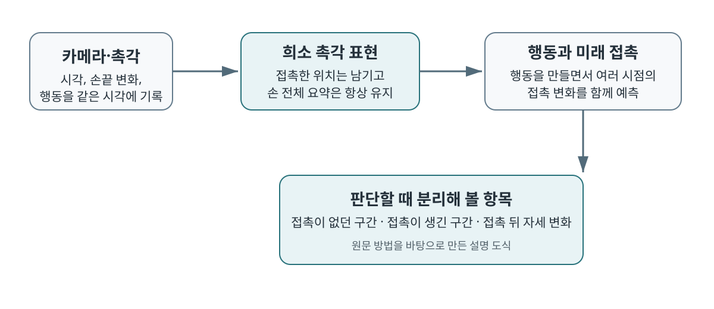

촉각 센서가 달린 손에서 모든 센서 값이 매 순간 중요한 것은 아닙니다. 물체에 닿기 전에는 대부분의 값이 변하지 않고, 닿은 뒤에도 손끝의 작은 영역만 반응합니다. <abbr title="접촉한 촉각 정보만 남기고 손 전체의 상태도 함께 요약하도록 학습한 정교 조작 방법">STAR</abbr>는 이 빈 구간까지 같은 비중으로 학습하는 대신, 접촉한 부분과 손 전체 상태를 나눠 다룹니다. 이 선택은 촉각을 더 달았다는 사실보다 어떤 접촉 변화가 행동에 필요한지를 구분하는 쪽에 초점을 둡니다.

## 촉각은 세 방향으로 비어 있어요

논문은 촉각 신호의 어려움을 세 종류의 희소성으로 나눕니다. 손바닥과 손가락에 센서가 많아도 실제로 눌린 위치는 일부뿐이라는 공간 희소성, 물체에 다가갈 때처럼 긴 시간 동안 접촉이 없다는 시간 희소성, 손끝은 닿은 자리만 알 뿐 물체 전체의 위치와 자세는 알기 어렵다는 정보 희소성입니다.

저자들은 양손 원격 조작으로 200시간 데이터를 모았습니다. 65개 과제의 10,576개 궤적 가운데 69.5%가 여러 손가락을 함께 써야 하는 조작이었고, 양쪽 손목 카메라·머리 카메라·양손 촉각·로봇 상태·명령·언어 지시를 타임스탬프를 기준으로 30 Hz에 동기화했습니다. 이 구성은 촉각이 한 장의 독립 이미지가 아니라, 같은 순간의 카메라 관측과 행동에 연결될 때 학습 자료가 된다는 전제에 서 있습니다.

<figure class="fig"><figcaption>접촉한 위치를 남기되 손 전체의 요약 정보는 보존하고, 행동 구간 전체에 걸친 접촉 변화를 예측하는 구조예요. 원문 방법을 바탕으로 만든 설명 도식입니다.</figcaption></figure>

## 접촉한 자리와 손 전체를 같이 남겨요

STAR는 보정된 센서 값이 문턱을 넘은 위치의 촉각 조각만 남기고, 반응하지 않은 조각은 가립니다. 대신 손 하나당 전체 촉각장을 요약하는 정보는 항상 남깁니다. 특정 손끝의 눌림만 남기면 물체가 어느 방향으로 움직이는지 잃을 수 있고, 모든 값을 넣으면 변하지 않은 값이 대부분이어서 학습기가 접촉 변화를 찾기 어려워진다는 판단입니다.

카메라와 촉각을 먼저 함께 가려진 조각 맞히기 방식으로 학습하는 것도 같은 이유입니다. 손끝 변화만 보고는 물체와 손의 관계를 충분히 알기 어렵기 때문에, 카메라가 보여 주는 장면과 맞추도록 촉각 표현을 준비합니다. 이는 촉각을 카메라의 대체재로 두기보다, 카메라가 잘 못 읽는 접촉 상태를 보완하는 입력으로 두는 설계예요.

## 다음 한 프레임보다 접촉의 전이를 봐요

행동을 만들 때는 미래 촉각을 다섯 장 예측합니다. 같은 다섯 장을 바로 다음 0.17초에 몰아두는 대신, 30 Hz 제어에서 1.67초에 걸쳐 떨어진 시점에 배치했습니다. 접촉 직후의 거의 같은 화면을 여러 번 맞히는 것보다, 물체를 밀다가 걸리거나 손가락이 미끄러지는 변화까지 예측하게 하려는 선택입니다.

두 과제 절제 실험에서 이 구성을 모두 뺀 경우 평균 성공률과 과제 완료율은 35%와 46%였고, 전체 구성을 넣으면 60%와 78%였습니다. 미래 촉각 예측만 빼도 53%와 69%로 낮아졌습니다. 다만 이 비교는 시점 간격과 최장 예측 범위를 함께 바꿨으므로, 성능 차이를 시점 분산 하나의 효과로 단정할 수는 없습니다.

## 평균 성공률은 접촉 과제의 차이를 숨겨요

네 실기 과제에서 STAR의 평균 성공률은 61%, 과제 단계 완료율은 79%였습니다. 과제별로 100개 시연을 사용해 추가 학습했고, 각 방법은 과제마다 20회 평가했습니다. 비교 대상인 같은 데이터 학습 구성에서 희소성 처리만 뺀 경우의 평균은 성공률 44%, 과제 완료율 61%였어요.

그러나 이 결과는 촉각을 넣으면 모든 조작이 같은 폭으로 좋아진다는 뜻이 아닙니다. 논문은 이어폰 뒤집기처럼 손끝 접촉이 중요한 과제에서는 촉각의 이득이 컸지만, 물체 위치를 먼저 찾아야 하는 과제에서는 카메라 기반 위치 판단의 비중이 더 크다고 분석합니다. 손가락 가장자리에 센서가 닿지 않는 구조에서는 촉각을 사용해도 자세 오차가 남았고, 일부 과제에서는 촉각이 시각 정보를 읽는 데 방해가 될 수 있다는 한계도 적었습니다. [[2026-09-11_DeCAL_접촉_게이트가_촉각을_늦게_쓰는_이유|DeCAL의 접촉 게이트가 촉각을 늦게 쓰는 이유]]가 접촉 구간에서만 촉각 비중을 높인 이유와도 이어집니다.

## 지금 작업과 만나는 지점

이 논문은 저가 로봇팔 모방학습, 양팔·조작, 서보·접촉·저수준 제어 주제와 만납니다. 저가 로봇팔의 시연 데이터를 다룰 때도 매 프레임의 관절값이나 접촉 관련 신호를 한 덩어리로 모으기보다, 접근·접촉·접촉 뒤의 자세 변화로 나눠 기록하면 실패를 더 좁은 구간에서 읽을 수 있습니다. 바로 시험해 볼 수 있는 기준은 한 시연에서 접촉 신호가 변한 시각, 그 전후 카메라 프레임, 같은 시각의 관절·그리퍼 명령을 한 묶음으로 확인하는 것입니다. 이 기준은 촉각 센서가 없는 구성에서도 서보 전류·위치 오차처럼 접촉의 간접 단서가 어느 구간에서만 의미가 커지는지 점검하는 출발점이 됩니다.

STAR가 남긴 결론은 촉각의 해상도나 모델 크기보다 먼저 기록과 평가의 시간축을 정하라는 데 있습니다. 어떤 센서가 언제 유효했는지, 그 신호가 다음 행동의 실패·성공과 어떻게 이어졌는지를 분리해 남겨야, 추가 센서와 학습 방법의 효과를 같은 기준에서 비교할 수 있습니다.

---

<!-- src-block -->

출처 — https://arxiv.org/abs/2609.12549
