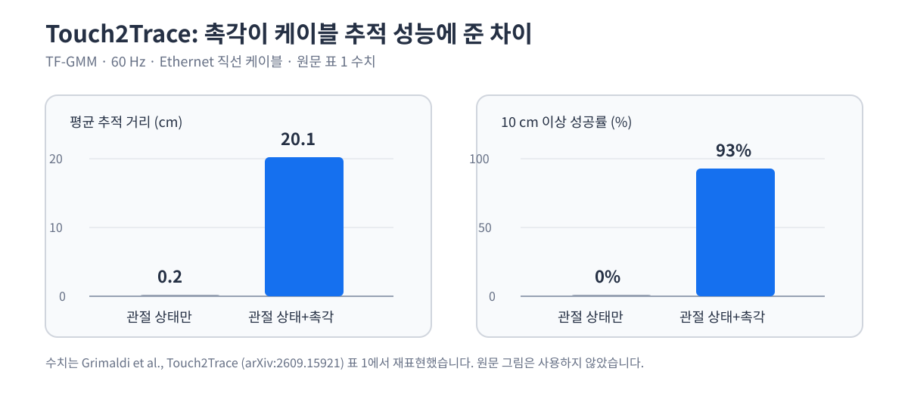

케이블을 손가락 사이로 계속 보내는 동작은 물체를 한 번 잡는 과제와 다릅니다. 압력과 미끄러짐이 매 순간 바뀌므로 관절 위치만 보고 명령을 내리면 접촉이 끊긴 이유를 알기 어렵습니다. <abbr title="손끝의 압력 변화를 읽어 케이블을 따라가는 행동을 시연 데이터로 학습한 로봇 손 제어 방법">Touch2Trace</abbr>는 손끝 압력 영상과 관절 상태를 함께 넣어, 케이블을 얼마나 멀리 보냈는지와 접촉을 유지했는지를 비교했습니다.

## 관절 상태만으로는 접촉을 대신할 수 없어요

저자들은 손가락 압력 신호를 뺀 조건과 넣은 조건을 같은 60 Hz 제어 주기에서 비교했습니다. <abbr title="로봇 관절의 현재 위치처럼 몸의 내부 상태를 알리는 정보">관절 상태</abbr>만 쓴 <abbr title="시간 순서대로 관측을 읽고 여러 가능한 관절 명령의 확률을 내는 정책">TF-GMM</abbr>은 평균 0.2 cm를 추적했고, 10 cm 이상 보낸 비율은 0%였습니다. 손끝 촉각을 함께 넣으면 평균 거리는 20.1 ± 4.6 cm, 10 cm 성공률은 93%가 됐습니다.

<figure class="fig"><figcaption>원문 표 1의 TF-GMM 60 Hz 결과를 새 차트로 정리했습니다. 원문 그림은 사용하지 않았습니다.</figcaption></figure>

이 차이는 촉각이 물체 위치를 대신 알아냈다는 뜻으로 넓힐 수는 없습니다. 논문은 카메라와 케이블 상태 추정을 의도적으로 제외하고, 손끝에서 생기는 압력 변화가 접촉 유지에 주는 효과만 분리했습니다. 따라서 이 결과는 케이블 추적이라는 과제와 이 손의 구성에서 확인한 근거이며, 다른 물체나 카메라가 있는 조작으로 그대로 일반화한 수치는 아닙니다. 손목·팔 움직임, 카메라, 케이블 자세 추정이 같은 테스트에 들어가면 각 입력이 접촉 유지에 낸 기여를 이 표 하나로 나눌 수 없습니다. 접촉이 필요한 구간에서만 신호를 더 강하게 쓰는 관점은 [[2026-09-15_STAR_촉각_희소성으로_정교_조작을_높인_방식|STAR의 촉각 희소성 처리]]와도 이어집니다.

## 적은 시연에서는 표현을 고정해요

학습용 자료는 원격 조작 시연 12개, 약 10.1분이었습니다. 각 시점에서 두 손끝의 32×32 압력 영상과 8개 관절 위치를 받아, 최근 15개 시점인 250 ms 구간을 보고 다음 관절 위치 명령을 냈습니다. 압력 영상을 과제 시연과 함께 처음부터 학습하지 않고, 미리 학습한 촉각 인코더를 고정한 채 행동 예측부만 학습한 점이 핵심입니다.

같은 데이터에서 인코더까지 미세 조정한 조건은 평균 4.7 ± 1.6 cm, 무작위 초기화 조건은 0.2 ± 0.1 cm에 머물렀습니다. 적은 과제 시연으로 모든 층을 바꾸면 접촉 패턴을 일반적으로 읽던 표현이 과제의 좁은 움직임에 맞춰질 수 있다는 해석과 맞닿습니다. 이 수치는 적은 데이터일수록 모델을 크게 바꾸기보다, 무엇을 고정하고 무엇을 새로 맞출지 분리해야 한다는 실험 근거입니다. 다만 고정이 항상 옳다는 결론은 아닙니다. 이 논문은 한 과제의 짧은 시연 집합에서 세 조건을 비교했으므로, 센서 형식·데이터 양·과제가 달라지면 다시 확인해야 합니다.

## 제어 주기보다 늦은 추론은 접촉을 놓쳐요

논문의 기본 정책은 한 번의 명령을 60 Hz, 즉 16.7 ms마다 내립니다. TF-GMM의 끝단 간 추론 시간은 3.4 ms였지만, 비교한 <abbr title="여러 후보 행동을 조금씩 다듬어 하나의 행동 묶음을 만드는 정책">확산 정책</abbr>은 10단계 계산에 32 ms가 걸렸습니다. 계산이 제어 주기보다 길면 새 관측을 받은 뒤 낸 명령이 이미 늦어지고, 이 논문에서는 촉각을 넣은 확산 정책도 60 Hz에서 평균 1.3 ± 0.4 cm에 그쳤습니다.

제어 주기를 30 Hz로 낮추고 다시 학습하면 확산 정책의 평균 거리는 15.5 ± 2.7 cm까지 올라갔지만, 20 cm 성공률은 0%였습니다. 이 비교는 한 모델이 다른 모델보다 일반적으로 낫다는 판정이 아닙니다. 접촉처럼 빠르게 변하는 신호에서는 정책의 표현력과 별개로, 센서 읽기·추론·명령 전달이 하나의 시간 예산 안에 들어오는지를 먼저 확인해야 한다는 결과입니다.

## 지금 작업과 만나는 지점

이 논문은 프로필의 저가 로봇팔 모방학습, 서보·접촉·저수준 제어와 만납니다. 시연 데이터를 모을 때 관절 위치와 명령만 저장하지 않고, 접촉이 바뀐 시각을 가리킬 간접 신호와 카메라 프레임을 같은 시간축에 두면 어떤 입력이 행동 결정에 필요한지 더 좁혀 볼 수 있습니다. 바로 시험해 볼 수 있는 것은 시연 한 건마다 그리퍼 명령·관절 위치·전류 또는 위치 오차·카메라 시각을 같은 타임스탬프로 묶고, 접근·접촉·미끄러짐 의심 구간에서 명령 지연이 제어 주기를 넘는지 확인하는 일입니다.

Touch2Trace가 남긴 기준은 촉각 센서의 유무보다 먼저 접촉 정보를 행동과 같은 속도로 처리할 수 있는가에 있습니다. 입력을 더하기 전에 시연의 시간 정렬, 고정할 표현, 그리고 한 주기 안의 추론 시간을 각각 분리해 측정해야 접촉 관련 실패를 원인별로 비교할 수 있습니다.

---

<!-- src-block -->

출처 — https://arxiv.org/abs/2609.15921
