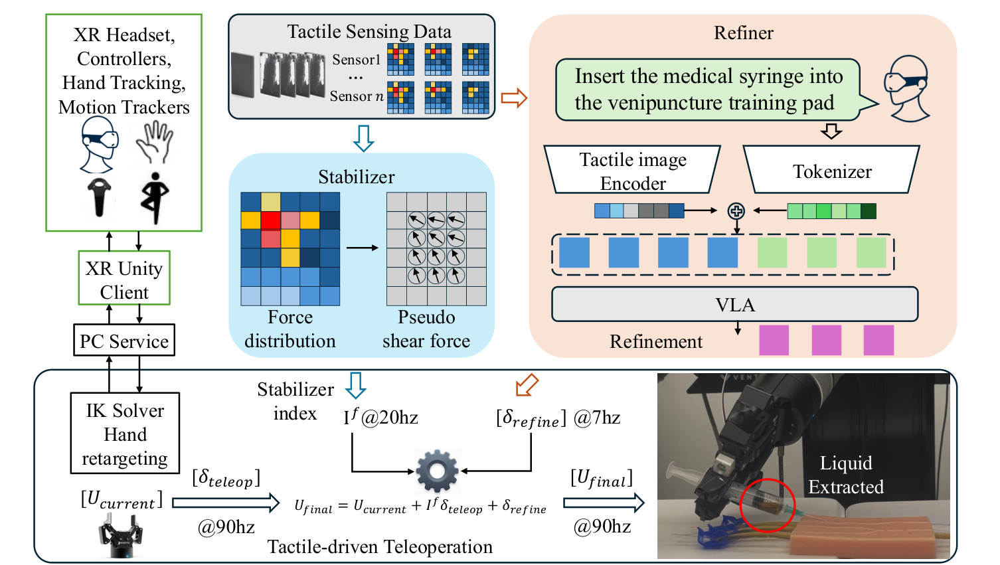

부드러운 물체를 잡거나 좁은 틈에 끼워 넣을 때는 조작자가 보낸 위치 명령만으로 접촉을 안정시키기 어렵습니다. <abbr title="촉각 신호로 접촉이 불안정한 때의 조작 명령을 줄이고, 별도 보정 신호를 더하는 원격 조작 시스템">XRoboToolKit-T</abbr>는 이 문제를 한 개의 큰 모델에 맡기지 않았습니다. 압력 분포가 급격히 바뀌는 순간을 빠르게 처리하는 안정화기와, 과제 문맥을 보고 작은 자세 보정을 내는 보정기를 다른 속도로 둡니다.

<figure class="fig"><figcaption>원문 그림 3. 원문이 CC0로 공개한 그림을 출처와 함께 사용했습니다. (출처: Dengxiong et al., XRoboToolKit-T · CC0 1.0)</figcaption></figure>

## 접촉이 흔들릴 때는 명령 크기부터 낮춰요

안정화기는 촉각 배열에서 가장 큰 압력이 나타난 위치와 크기의 변화를 읽습니다. 압력 중심이 빠르게 움직이거나 접촉이 불안정해지면 조작자 변위에 곱하는 계수를 낮춰서, 손이 미끄러지는 방향으로 명령이 더 커지는 일을 막습니다. 저자들은 이 경로를 20 Hz로 두고, 불안정한 변화가 감지되면 계수를 0으로 만들어 명령을 잠시 멈춥니다.

이 처리에서 중요한 것은 촉각이 힘의 절대값을 완벽하게 재는지가 아닙니다. 이 논문은 법선 압력 분포의 변화로 접선 방향의 불안정 지표를 만들고, 그 지표를 조작자 명령의 크기에 연결합니다. 그래서 접촉 상태가 흔들릴 때는 더 정확한 목표 자세를 예측하기보다 먼저 과한 움직임을 줄이는 흐름이 됩니다.

## 느린 보정은 빠른 안정화와 역할을 나눠요

<abbr title="이미지와 과제 문장을 함께 읽어 로봇이 다음 행동을 고르게 하는 모델">VLA</abbr> 기반 보정기는 촉각 이미지를 보고 끝단 자세의 작은 수정량을 예측합니다. 이 신호는 약 7 Hz로 갱신되며, 새 보정값이 도착한 시점에만 명령에 더해집니다. 반면 안정화기는 같은 접촉 구간에서 훨씬 짧은 주기로 조작자 명령을 억제합니다.

두 경로를 나누면 고수준 보정이 늦게 도착해도 접촉이 급변한 순간의 안전한 반응을 기다리지 않아도 됩니다. 논문은 이 구성이 촉각만 화면에 보여 주고 조작자가 판단하기를 기다리는 방식보다, 불안정 신호를 명령 경로에 먼저 반영하도록 만든다고 설명합니다. 다만 안정화 계수와 보정 모델은 이 장비와 과제에서 평가한 설계이므로, 다른 센서나 그리퍼에 같은 임계값을 옮겨도 된다는 근거는 아닙니다.

시연 기록도 이 역할 분리를 따라야 합니다. 촉각 배열의 원시값만 저장하면 나중에 어느 시점에 명령이 줄었는지 읽기 어렵습니다. 압력 분포, 접촉 상태, 끝단 자세와 관절 상태, 조작자 명령과 보정 명령을 같은 시간축에서 구분해 두면, 실패 장면을 센서 이상·조작 입력·보정 지연으로 나눠 볼 수 있습니다.

## 처리량은 접촉 보조를 켠 조건에서 늘었어요

물병과 종이컵을 집어 상자에 넣는 15분 실험에서 촉각 보조가 없는 Twist2는 성공 조작 128건을 기록했습니다. XRoboToolKit-T의 두 손가락 그리퍼 조건은 138건, 정교 손 조건은 132건이었습니다. 이 표는 과제 하나와 제한된 장비 조합의 처리량이므로, 촉각 센서만 더하면 모든 원격 조작이 같은 폭으로 빨라진다는 결과는 아닙니다.

성분을 나눈 비교도 같은 방향을 보입니다. 기준 시스템은 분당 8.5건, 촉각 보정기만 둔 조건은 9.0건, 안정화기와 보정기를 함께 둔 조건은 9.6건이었습니다. 저자들의 해석은 접촉이 흔들리는 구간에서 생기는 실패와 회복 시간을 줄여 반복 조작의 손실을 낮춘다는 것입니다. 이 수치는 성공률과 힘 오차를 각각 따로 보고하지 않으므로, 처리량 증가를 정밀도 전체의 증명으로 읽어서는 안 됩니다.

손 동작을 입력으로 쓴 조건의 제어 주기도 20.2 Hz에서 48.6 Hz로 보고됐고, 컨트롤러 입력 조건은 96.4 Hz였습니다. 다만 이 수치는 입력 장치와 통신 경로가 함께 바뀐 결과입니다. 촉각 신호 하나의 효과로 떼어 읽기보다, 시연 시스템 전체가 새 관측을 받아 명령을 내보내는 속도로 읽어야 합니다.

## 지금 작업과 만나는 지점

이 논문은 프로필의 저가 로봇팔 모방학습, 양팔·조작, 서보·접촉·저수준 제어와 만납니다. 시연 데이터에 관절 위치와 그리퍼 명령만 남기지 않고, 전류·위치 오차·카메라 프레임처럼 접촉 변화의 시각을 가리킬 신호를 같은 시간축에 기록하면 접촉 불안정과 조작 명령을 분리해 볼 수 있습니다. 바로 시험해 볼 수 있는 범위는 접근·접촉·이탈 구간을 나눠, 각 구간에서 명령이 갱신되는 주기와 전류 또는 위치 오차가 바뀌는 시각을 나란히 기록하는 일입니다.

[[2026-09-16_Touch2Trace_촉각_모방학습으로_케이블_추적을_높인_방식|Touch2Trace의 촉각 모방학습으로 케이블 추적을 높인 방식]]도 촉각 입력이 접촉 유지에 필요한지를 비교했습니다. XRoboToolKit-T는 여기서 한 걸음 앞서, 촉각을 학습 입력으로만 두지 않고 조작자 명령을 즉시 억제하는 경로와 느린 행동 보정 경로를 함께 둡니다. 시연을 모으는 단계에서는 센서가 몇 개냐보다, 접촉 변화가 명령 경로에 언제 반영되는지를 먼저 남겨야 원인을 비교할 수 있습니다.

---

<!-- src-block -->

출처 — https://arxiv.org/abs/2609.16437
