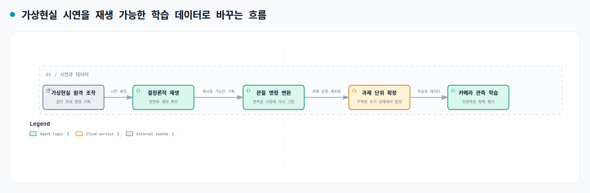

로봇팔 <abbr title="사람이 조작한 예시를 보고 로봇이 비슷한 행동을 배우는 방법">모방학습</abbr>에서 시연을 모으는 시간은 데이터 양만의 문제가 아닙니다. 큐브를 잘못 쌓거나 집기에 실패할 때마다 물체를 다시 놓고 장면을 복구해야 하면, 같은 조작을 이어 가는 비용이 커집니다. 이 논문은 작은 5자유도 로봇팔을 <abbr title="헤드셋이나 손 추적 장치로 가상 공간의 로봇을 조작하는 방식">가상현실 원격 조작</abbr>으로 움직이고, 그 기록을 나중에 다시 쓸 수 있는 데이터로 바꾸는 흐름을 제시합니다.

<figure class="fig"><figcaption>원문 방법 설명을 바탕으로 새로 구성한 데이터 흐름 도식입니다.</figcaption></figure>

## 시연 기록과 학습용 관측을 분리해요

저자들은 헤드셋과 장갑으로 로봇의 <abbr title="로봇 팔 끝에서 물체를 집거나 놓는 부분">끝단</abbr> 자세를 조작합니다. 이때 남기는 것은 관절 각도만이 아니라 작업 공간에서의 끝단 움직임과 장면 변화입니다. 수집 뒤에는 <abbr title="같은 입력이면 같은 결과가 나도록 기록한 시연을 다시 실행하는 과정">결정론적 재생</abbr>으로 궤적을 확인하고, <abbr title="끝단의 목표 자세를 각 관절의 움직임으로 바꾸는 계산">역기구학</abbr>으로 끝단 명령을 관절 위치 순서로 변환합니다.

이 분리는 카메라와 행동 형식을 시연 수집 시점에 굳히지 않는다는 뜻입니다. 논문은 재생 단계에서 로봇 뒤 약 1미터의 고정 카메라와 그리퍼 가까이의 카메라를 더했습니다. 배경, 테이블, 블록의 텍스처·반사율·재질·밝기도 이 단계에서 바꿨습니다. 이미 모은 궤적을 버리지 않고 관측 구성을 다시 정할 수 있지만, 재생이 처음 기록한 장면과 일관되게 맞아야 한다는 조건도 함께 생깁니다.

재생 뒤의 과제는 빨간 큐브를 집어 파란 큐브 위에 놓고, 초록 큐브를 그 위에 놓는 두 단계입니다. 따라서 기록을 다시 쓴다는 말은 단순히 파일 형식만 바꾸는 일이 아닙니다. 목표 물체의 순서, 카메라가 보는 장면, 그리퍼가 닫히는 시점이 함께 보존되어야 학습 데이터의 의미도 이어집니다.

여기서 재생은 데이터 양을 늘리는 앞단의 확인 절차이기도 합니다. 원문은 과제 단위로 나눈 뒤 물체의 초기 위치를 바꾸어 궤적을 합성하고, 성공한 결과만 내보낸다고 설명합니다. 초기 시연의 집기 위치가 어긋나거나 장면 상태가 복원되지 않으면, 뒤에 카메라 영상을 더해도 잘못된 행동 순서가 늘어날 수 있습니다. 수집률을 비교할 때 재생 통과율과 각 단계의 실패 원인도 함께 남겨야 하는 이유입니다.

## 빠른 수집과 느린 합성은 같은 비용이 아니에요

가상환경에서 30분 동안 수동으로 모은 시연은 약 200개였고, 비교한 실제 환경 수동 흐름은 같은 시간에 45개였습니다. 분당 수집률로 바꾸면 각각 6.67개와 1.50개로, 저자들은 조작자 시간이 같은 조건에서 약 4.4배 차이라고 계산했습니다. 장면을 즉시 초기화할 수 있어 실패 뒤의 물리적 복구 시간이 빠진 것이 이 차이의 핵심입니다.

<abbr title="기록한 과제를 작은 단계로 나누고 새 초기 상태에서 궤적을 만들어 주는 Isaac Lab 도구">Isaac Mimic</abbr>은 200개 수동 시연에서 약 3일 동안 100개를 더 생성해 데이터셋을 300개로 늘렸습니다. 이는 가상현실 수동 수집보다 벽시계 시간으로 느립니다. 다만 조작자가 계속 개입해야 하는 수집과, 초기 시연을 바탕으로 계산을 이어 가는 합성을 같은 처리량으로 묶으면 어떤 병목을 줄였는지 흐려집니다.

## 재생 가능한 데이터가 곧 성공률은 아니에요

논문은 두 카메라 관측으로 학습한 정책을 무작위 블록 위치의 시뮬레이션 30회에서 평가했습니다. 빨간 큐브를 파란 큐브 위에 놓고, 초록 큐브를 그 위에 쌓아야 전체 성공으로 계산합니다. 전체 성공은 3/30, 즉 10%였고, 빨간 큐브를 집는 단계와 놓는 단계는 각각 6/30이었습니다.

저자들이 짚은 실패는 순서에 맞는 큐브보다 가까운 큐브를 고르는 색상 혼동과 그리퍼 정렬입니다. 그래서 이 결과는 시연을 빨리 모으고 재구성하는 데이터 흐름의 유용성을 보인 것이지, 작은 로봇팔이 안정적으로 큐브를 적층한다는 근거는 아닙니다. 평가는 시뮬레이션에만 있으며, 합성 데이터도 초기 시연 품질과 재생 일관성에 의존합니다.

## 지금 작업과 만나는 지점

이 논문은 프로필의 저가 로봇팔 모방학습과 만납니다. 시연을 수집할 때 끝단 목표, 관절 위치, 그리퍼 명령, 카메라 관측의 시간 기준을 분리해 남기면, 나중에 관측 구성이나 행동 표현을 바꿔도 같은 궤적을 다시 평가할 수 있습니다. 바로 시험해 볼 수 있는 범위는 한 시연에서 이 네 신호의 타임스탬프와 재생 결과를 나란히 기록해, 관측을 바꾼 뒤에도 관절 명령과 과제 단계가 같은 순서로 복원되는지 확인하는 일입니다.

[[2026-08-26_오차_누적을_행동_청킹으로_끊고_2만_달러_양팔로_정밀_조작한_ALOHA-ACT|오차 누적을 행동 청킹으로 끊고 2만 달러 양팔로 정밀 조작한 ALOHA·ACT]]는 긴 조작을 행동 묶음으로 나눠 오차 누적을 줄였습니다. 이 논문은 그보다 앞단에서, 시연 수집과 학습용 관측 생성을 분리합니다. 작은 로봇팔에서 데이터 수집을 반복할 때는 시연 수를 늘리는 일과 기록을 재구성할 수 있게 남기는 일을 함께 평가해야 합니다.

---

<!-- src-block -->

출처 — https://arxiv.org/abs/2609.19040
