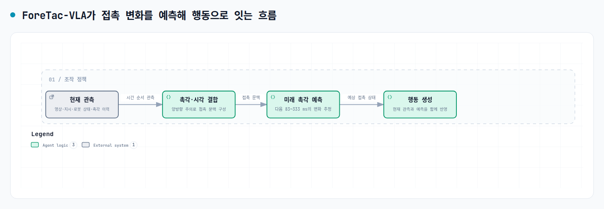

로봇이 물체를 집고 끼우고 돌릴 때 카메라 화면만으로는 접촉 상태를 구분하기 어렵습니다. 물체가 바르게 맞물린 것처럼 보여도 내부에서 걸릴 수 있고, 잡힌 것처럼 보여도 압력이 커져 깨질 수 있습니다. <abbr title="최근 촉각 변화에서 앞으로의 접촉 상태를 예측해 로봇 행동을 고르는 모델">ForeTac-VLA</abbr>는 지금 측정한 촉각만 반응하는 대신, 짧은 촉각 이력에서 몇 단계 뒤 접촉 변화를 먼저 추정해 행동 생성에 넣습니다.

<figure class="fig"><figcaption>원문 방법 설명을 바탕으로 새로 구성한 접촉 예측 흐름 도식입니다.</figcaption></figure>

## 현재 촉각만으로는 접촉의 다음 상태를 알기 어려워요

<abbr title="영상과 과제 문장을 함께 읽어 로봇이 다음 행동을 고르게 하는 모델">VLA</abbr>는 영상, 언어 지시, 로봇 상태를 행동으로 바꾸는 모델입니다. 접촉이 많은 조작에서는 같은 화면이라도 실제 상태가 다를 수 있습니다. 삽입 작업에서 핀이 구멍 앞에 있는 모습은 비슷해도, 한쪽이 걸렸는지 곧 들어갈지는 접촉 변화가 더 잘 가리킬 수 있습니다.

논문은 현재 촉각 한 장을 덧붙이는 데서 멈추지 않습니다. 최근 촉각 측정열을 시간 순서의 표현으로 바꾸고, 영상과 지시에서 얻은 표현이 서로 정보를 주고받게 합니다. 그 뒤 <abbr title="문장과 시간 순서 데이터를 앞뒤 관계로 읽는 신경망 구조">변환기</abbr>가 여러 시점 뒤의 촉각 상태를 예측합니다. 행동 생성기는 현재 관측과 예측 결과를 같이 받아, 접촉이 이미 바뀐 뒤에만 반응하는 흐름을 줄이려 합니다.

학습 초반에는 미래 촉각을 아직 정확히 예측하기 어렵습니다. 저자들은 처음에는 실제 미래 촉각으로 행동 생성을 조건짓고, 이후 모델이 예측한 촉각으로 바꾸는 두 단계 절차를 사용했습니다. 예측기가 불안정한 초기에 잘못된 미래 입력이 행동 학습 전체를 흔드는 일을 막기 위한 구성입니다.

## 예측 범위는 약 333 ms 앞까지예요

원문은 60 Hz로 기록한 학습 궤적에서 5, 10, 15, 20스텝 뒤의 촉각을 예측 대상으로 둡니다. 시간으로 바꾸면 약 83, 167, 250, 333 ms입니다. 한 시점만 맞히는 대신 가까운 미래 여러 지점을 함께 두어, 접촉이 빨리 커지는지 풀리는지의 방향을 행동 생성기가 읽게 합니다.

이 예측 범위가 어떤 그리퍼에도 맞는 제어 지연이라는 뜻은 아닙니다. 논문은 촉각 센서, 로봇, 네 과제의 조합에서 이 설정을 평가했습니다. 센서 주기나 서보 응답이 달라지면 같은 20스텝도 다른 물리 시간에 해당하므로, 단계 수보다 기록 주기와 실제 지연을 먼저 맞춰야 합니다.

## 네 과제 평균은 95%였어요

실제 로봇 평가는 삽입, 얇은 물체 다루기, 병뚜껑 풀기, 표면 닦기의 네 과제로 구성했고, 과제마다 20회씩 실행했습니다. ForeTac-VLA는 각각 20/20, 19/20, 19/20, 18/20 성공으로 평균 95%를 기록했습니다. 미세조정 VLA는 네 과제에서 13/20, 11/20, 12/20, 11/20이었고 평균은 58.75%였습니다. 촉각을 결합한 비교 모델은 14/20, 14/20, 16/20, 13/20으로 평균 71.25%를 기록했고, 다른 결합·게이팅 모델 평균은 72.50%였습니다.

원문 초록은 미세조정 VLA보다 36.25%포인트, 기존 촉각 보조 VLA 기준선보다 22%포인트 이상 높다고 설명합니다. 이 차이는 네 과제의 정해진 평가 조건에서 나온 결과입니다. 과제별 성공 수를 함께 보면 평균만 오른 것이 아니라 네 과제 모두에서 같은 표의 비교 모델보다 높은 값을 보였습니다. 저조도와 시각적 잡음 환경도 평가했지만, 다른 물체, 카메라, 센서, 제어 주기에 같은 성공률을 기대할 수 있다는 뜻은 아닙니다.

과제마다 20회라는 횟수도 같이 봐야 합니다. 삽입에서는 ForeTac-VLA가 20회 모두 성공했지만, 표면 닦기에서는 18회 성공으로 두 번 실패가 남았습니다. 접촉 예측이 모든 실패를 없앤다는 주장보다, 서로 다른 접촉 양상 네 가지에서 같은 평가 규칙으로 비교했다는 범위를 지키는 편이 정확합니다.

## 지금 작업과 만나는 지점

이 논문은 프로필의 저가 로봇팔 모방학습, 양팔·조작, 서보·접촉·저수준 제어와 만납니다. 접촉 조작 시연에서 접근, 닿음, 미끄러짐 또는 이탈처럼 상태가 바뀌는 구간을 구분해 두면, 현재 프레임만 보는 정책과 짧은 미래 구간을 함께 보는 정책의 입력·정답 쌍을 같은 기록에서 만들 수 있습니다. 바로 시험해 볼 수 있는 범위는 한 접촉 전이마다 현재 관측 창과 83, 167, 250, 333 ms 뒤의 기록을 짝지어, 누락 없이 미래 예측 표본으로 쓸 수 있는 구간이 얼마나 되는지 세는 일입니다.

[[2026-09-17_XRoboToolKit-T의_촉각_보조가_시연_안정성을_높인_구조|XRoboToolKit-T의 촉각 보조가 시연 안정성을 높인 구조]]는 접촉이 흔들릴 때 빠른 명령 억제와 느린 행동 보정을 나눴습니다. ForeTac-VLA는 여기에 미래 접촉 예측을 더합니다. 접촉을 다루는 조작 기록에서는 센서 종류를 늘리기 전에, 관측과 명령의 시간 관계를 나중에 다시 읽을 수 있게 남기는 일이 먼저입니다.

---

<!-- src-block -->

출처 — https://arxiv.org/abs/2609.20980
