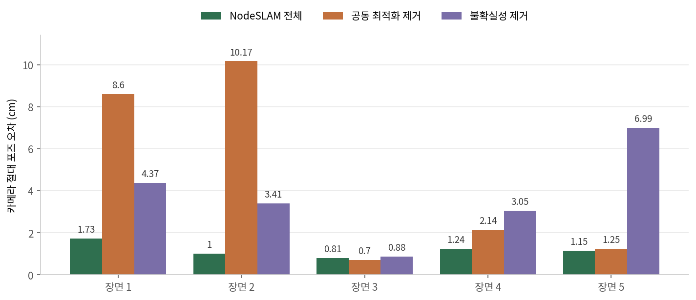

로봇이 방 안을 돌아다니며 지도를 만들 때, 그 지도를 무엇으로 채울지가 뒤따르는 계산을 거의 다 결정합니다. 흔한 선택은 점이나 표면 조각이고, 이 경우 지도는 관측한 부분만 담습니다. <abbr title="지도를 만들면서 자기 위치도 함께 찾는 기술을 SLAM이라고 하는데, 그 지도의 최소 단위를 점이나 표면이 아니라 물체 하나로 올린 방식">객체 단위 SLAM</abbr>은 지도의 단위를 물체 하나로 올리고, 관측하지 못한 뒷면까지 포함한 전체 형상을 지도에 넣습니다. <abbr title="물체의 전체 형상과 위치, 카메라 경로를 한꺼번에 맞춰 나가는 2020년 객체 단위 SLAM 시스템">NodeSLAM</abbr>은 그 물체 형상을 카메라 궤적과 같은 최적화 문제 안에 넣은 2020년 시스템입니다.

<figure class="fig"><iframe src="../static/diagrams/2026-09-22_nodeslam_흐름도.htm" title="NodeSLAM이 물체 형상과 카메라 궤적을 함께 푸는 흐름도. 확대와 이동, 경로 추적을 할 수 있습니다" loading="lazy" style="width:100%;height:780px;border:1px solid rgba(0,0,0,.12);border-radius:10px;background:#fff"></iframe><figcaption>원문 3~6절 설명을 바탕으로 새로 구성한 처리 흐름입니다. 그림 위에서 확대·이동할 수 있고, 노드를 누르면 연결된 경로만 남습니다. <a href="../static/diagrams/2026-09-22_nodeslam_흐름도.htm" target="_blank" rel="noopener">새 탭에서 크게 보기</a></figcaption></figure>

## 형상을 16차원 코드 하나로 줄여요

NodeSLAM은 물체 형상을 32 × 32 × 32 <abbr title="공간을 작은 정육면체로 잘라, 칸마다 물체가 차 있을 확률을 적어 두는 3차원 표현">점유 격자</abbr>로 표현합니다. 칸마다 0과 1 사이의 확률이 들어가고, 손잡이가 뚫린 머그처럼 구멍이 있는 모양도 담을 수 있습니다. 문제는 이 격자가 3만 개가 넘는 값이라 그대로 최적화 변수로 쓸 수 없다는 점입니다.

그래서 <abbr title="많은 예시를 배워 모양을 몇 개의 숫자로 압축하고, 그 숫자에서 원래 모양을 되살리도록 훈련한 신경망">변분 오토인코더</abbr> 하나를 머그, 그릇, 병, 캔 네 클래스로 학습시켜 격자를 16개 숫자로 압축했습니다. 클래스는 원-핫 벡터로 인코더와 디코더 양쪽에 조건으로 붙어서, 같은 코드라도 어느 클래스인지에 따라 다른 모양이 나옵니다. 최적화가 시작될 때 코드는 0으로 둡니다. 학습 때 가우시안 사전분포를 가정했기 때문에 0은 그 클래스의 평균 형상에 해당합니다. 이후 최적화는 평균 형상을 관측에 맞게 조금씩 변형하는 과정이 됩니다.

## 렌더링을 확률로 만들면 미분이 돼요

형상 코드를 관측과 비교하려면 코드에서 깊이 영상을 그려야 하고, 그 그리는 과정이 미분 가능해야 코드를 고칠 수 있습니다. NodeSLAM은 픽셀 하나를 광선으로 역투영해 광선 위에 깊이 표본을 일정 간격으로 놓고, 각 표본점의 점유 확률을 이웃 여덟 칸에서 <abbr title="주변 여덟 칸의 값을 거리에 비례해 섞어 중간 지점의 값을 매끄럽게 추정하는 계산">삼선형 보간</abbr>으로 읽습니다.

여기서 핵심은 광선이 각 지점에서 멈출 확률을 따로 정의한 것입니다. 어떤 표본점에서 멈출 확률은 그 지점이 차 있을 확률에, 앞선 모든 지점이 비어 있을 확률을 곱한 값입니다. 여기에 끝까지 아무것도 만나지 않을 탈출 확률을 더하면 하나의 이산 확률 분포가 됩니다. 이 분포의 기댓값이 렌더된 깊이이고, 분산이 그 픽셀의 불확실성입니다. 탈출 확률만 따로 보면 분할 마스크도 같은 식에서 나옵니다.

분산이 따라 나오는 것이 이 설계의 이득입니다. 최적화 손실은 측정 깊이와 렌더 깊이의 차이를 제곱해 그 픽셀의 분산으로 나눈 값에, 코드가 평균에서 멀어지는 정도를 더한 형태입니다. 물체 경계처럼 조금만 움직여도 깊이가 크게 튀는 픽셀은 분산이 커서 자동으로 덜 반영됩니다. 렌더 영상에 가우시안 흐림을 네 단계로 걸어 성긴 단계부터 푸는 것도 같은 목적입니다. 흐린 단계에서는 픽셀 하나가 여러 광선을 묶어 보게 되어, 초기 추정이 멀리 벗어나 있어도 기울기가 방향을 가리킵니다.

## 한 장에서 4.459mm, 세 장에서 3.484mm

원문 표 1은 <abbr title="연구용으로 공개된 대규모 3차원 물체 모델 모음">ShapeNet</abbr>의 머그 전체를 대상으로 무작위 시점 1, 2, 3개에서 각각 30회 최적화한 뒤의 중앙값을 적습니다. 복원 정확도는 한 장에서 4.459mm, 두 장에서 3.752mm, 세 장에서 3.484mm였고, 1cm 임계 기준 완성도는 93.492%에서 96.065%로 올랐습니다. 한 장만 보고도 완성도가 93%를 넘는 것이 형상 사전분포를 쓰는 이유입니다.

같은 표에서 불확실성을 빼면 한 장 정확도가 4.998mm, 가우시안 피라미드를 빼면 4.701mm로 나빠집니다. 비교 대상인 <abbr title="물체 표면을 직접 찾아 그리는 방식의 미분가능 렌더링 기법. 여기서는 같은 형상 표현에 이 렌더링만 바꿔 끼워 비교했습니다">DVR</abbr>은 8.967mm에 완성도 43.075%에 그쳤습니다. 원문은 그 렌더링의 수용 영역이 국소적이어서 멀리 있는 초기값을 끌어오지 못한 것으로 설명합니다. 마스크만으로 최적화하면 한 장에서 15.806mm까지 벌어지는데, 실루엣만으로는 물체가 크고 먼지 작고 가까운지 정할 수 없기 때문입니다.

## 형상이 정확하면 카메라가 따라와요

<figure class="fig"><figcaption>원문 표 2의 값을 그대로 옮겨 그린 카메라 절대 포즈 오차입니다. 장면 3만 공동 최적화를 빼도 오차가 낮습니다.</figcaption></figure>

SLAM 평가는 테이블 위에 물체 10개씩을 놓은 합성 장면 5개에서 했습니다. 사용한 3차원 설계 모델은 <abbr title="ShapeNet과는 다른 기관이 공개한 3차원 물체 모델 모음">ModelNet40</abbr>에서 가져와 형상 모델 학습에 쓰지 않았고, 영상은 포즈 예측 학습에 쓴 것과 다른 렌더러로 만들었습니다. 이 조건에서 카메라 절대 포즈 오차는 0.81cm에서 1.73cm 사이였습니다. 배경 특징점 없이 복원한 물체들만 보고 얻은 값입니다.

무엇이 이 값을 만드는지는 제거 실험이 보여 줍니다. 키프레임 세 개를 묶어 카메라 포즈와 물체 포즈, 형상 코드를 함께 푸는 단계를 빼면 장면 1과 2에서 8.6cm와 10.17cm로 무너집니다. 불확실성 가중을 빼면 장면 5에서 6.99cm가 됩니다. 두 요소가 없으면 형상 오차가 카메라 포즈로 그대로 새고, 그 카메라 포즈가 다시 형상을 망가뜨립니다.

장면 3은 예외입니다. 공동 최적화를 뺀 쪽이 0.7cm로 전체 구성의 0.81cm보다 낮습니다. 다섯 장면 중 하나이고 차이도 1mm 수준이라 이것으로 결론이 뒤집히지는 않지만, 궤적과 배치가 쉬우면 추가 최적화가 이득 없이 잡음만 섞을 수 있다는 뜻으로 읽는 편이 정확합니다. 속도도 함께 봐야 합니다. 카메라 추적은 초당 7프레임이고 공동 최적화에는 2초가 걸리므로, 이 2초를 매 키프레임마다 감당할 수 있는 작업에서만 성립하는 구조입니다.

## 이 결과가 서 있는 조건

네 클래스는 모두 탁상 위에 세워 두는 물건입니다. 초기 방향을 수평면 법선에 맞추는 것, 물체 바닥이 지지면에 닿도록 손실에 항을 더하는 것이 모두 이 가정에 기대고 있습니다. 물체 검출과 분할은 <abbr title="사진에서 물체를 찾아내고 그 물체가 차지한 픽셀만 오려 내는 신경망">Mask-RCNN</abbr>에 맡기므로 분할이 틀리면 그 물체는 처음부터 잘못 초기화됩니다. 저자들도 결론에서 코드 하나로 물체를 담는 이 압축 방식이 모든 클래스를 잘 표현하지는 못한다고 적고, 물체를 부품으로 나누는 코딩 방식을 다음 과제로 둡니다. 함께 실린 담기·정렬 로봇 데모는 성공률을 적지 않았고, 그 데모에서만 카메라 추적에 로봇 기구학을 썼다는 단서도 원문에 있습니다.

## 지금 작업과 만나는 지점

깊이 카메라로 물체를 재구성해 집는 작업에서는 관측 결손이 늘 남습니다. 얇거나 검거나 반사하는 표면은 깊이가 통째로 비고, 한 시점에서는 물체 뒷면이 항상 빕니다. 빈 픽셀을 0으로 채우고 평균을 내면 없는 표면을 만들어 내는데, NodeSLAM의 처리는 빈 곳을 채우는 대신 그 픽셀의 분산을 키워 최소제곱에서 스스로 빠지게 두는 쪽입니다. 형상 사전분포는 그다음에 뒷면을 메웁니다.

바로 해 볼 수 있는 범위는 지금 쓰는 깊이 카메라로 같은 물체를 여러 각도에서 찍어, 시점 수에 따라 유효 깊이 픽셀 비율이 어떻게 변하는지 세는 일입니다. 시점을 늘려도 끝내 비는 영역이 어디인지 알면, 형상 사전분포로 메워야 할 부분과 카메라 배치를 바꿔 해결할 부분이 갈립니다.

[[2026-07-20_관측을_로봇의_좌표로_옮기면|관측을 로봇 좌표계로 옮겨 VLA 시점 취약성을 줄인 로봇 중심 포인트맵]]은 관측을 어느 좌표계에 두느냐가 정책의 시점 의존성을 바꾼다고 봤습니다. NodeSLAM은 한 걸음 더 가서 좌표계의 원점을 물체 자신에 둡니다. 물체마다 자기 형상과 자기 포즈를 갖고 있으면, 카메라가 어디로 움직이든 지도에 적힌 내용은 그대로입니다.

---

<!-- src-block -->

출처 — https://arxiv.org/abs/2004.04485v2
