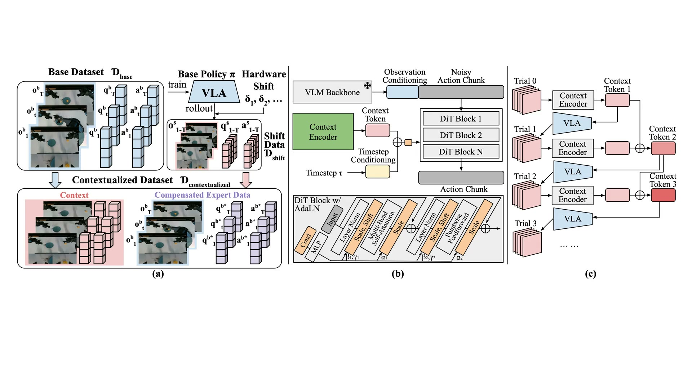

<abbr title="영상과 언어 지시, 로봇 상태를 받아 다음 행동을 만드는 로봇 정책">VLA</abbr>는 학습 때와 다른 하드웨어 조건을 만나면 같은 실패를 반복하기 쉽습니다. 모터가 낸 실제 움직임이 명령과 조금 어긋나거나, 관절 위치를 읽는 기준점이 밀리면 현재 프레임만 보는 정책은 그 차이가 어디서 왔는지 누적해 읽지 못합니다. <abbr title="실패한 실행 기록을 다음 판단에 쓰도록 학습한 로봇 행동 정책">Self-Adaptive VLA</abbr>는 실패한 실행 기록을 짧은 문맥으로 바꾸고, 다음 시도에서 그 문맥을 정책에 넣어 보정합니다.

<figure class="fig"><figcaption>하드웨어 오차가 있는 롤아웃을 문맥으로 쓰고, 여러 시도의 문맥 토큰을 합산하는 원문 방법 도식입니다. (출처: Zhang et al., Self-Adaptive VLA 프로젝트)</figcaption></figure>

## 같은 명령이 다른 자세를 만들 때 생기는 문제예요

논문은 배포 시점의 하드웨어 오차를 작동 편향과 관절 인코더 오프셋으로 나눕니다. 작동 편향은 정책이 낸 목표 관절 명령과 실제 관절 움직임 사이에 일정한 차이가 생기는 경우입니다. 관절 인코더 오프셋은 센서가 읽는 관절 위치의 기준점이 이동한 경우라, 정책이 받은 고유수용감각 값만으로는 학습 환경과 구분되지 않을 수 있고 시각 관측이 단서가 됩니다.

기준 정책은 현재 관측만 보고 행동하므로, 실패가 반복되어도 앞선 실패를 다음 행동에 반영하지 못합니다. 논문은 정밀 파지와 삽입을 포함한 네 양팔·다지 조작 과제에서 두 오차를 넣었을 때, 기준 정책의 성공률이 정상 조건의 거의 100%에서 거의 0%까지 떨어졌다고 보고합니다. 여기서 중요한 것은 재보정이 필요하다는 일반론보다, 실패의 모양과 관절 상태를 기록하지 않으면 정책이 오차의 방향을 구분할 재료도 없다는 점입니다.

## 실패 롤아웃을 보정용 문맥으로 바꿔요

학습 단계에서는 알려진 하드웨어 오차를 넣은 정책 롤아웃을 먼저 모읍니다. 그다음 기준 시연의 행동에 해당 오차를 앞서 반영한 목표 행동을 만들고, 실패 롤아웃과 짝지어 문맥 조건부 시연으로 바꿉니다. 이 짝짓기 덕분에 정책은 실패 기록을 봤을 때 어느 방향으로 행동을 바꿔야 하는지 학습합니다.

문맥 인코더는 시각 관측, 고유수용감각, 과거 행동을 하나의 <abbr title="여러 시도의 관측과 움직임 정보를 짧은 숫자 표현으로 압축한 값">문맥 토큰</abbr>으로 압축합니다. 이 토큰은 <abbr title="입력 조건에 따라 신경망 내부 값의 크기와 기준을 조절하는 계산">AdaLN</abbr>을 거쳐 행동 생성기 내부에 들어갑니다. 기준 VLA 본체와 문맥 인코더를 분리했기 때문에, 한 번 만든 토큰을 쓰는 평소 추론에는 추가 계산이 없다고 저자들은 설명합니다.

## 한 번의 실패보다 여러 시도의 잔차가 낫습니다

실패 한 번만으로는 원인이 하나로 정해지지 않을 수 있습니다. 링을 잡지 못한 원인이 한쪽 팔의 큰 오차인지, 두 팔의 작은 오차가 겹친 것인지는 같은 실패 화면만으로 가리기 어렵습니다. Self-Adaptive VLA는 이전 시도의 문맥 토큰을 더해, 먼저 드러난 큰 오차를 보정한 뒤 남은 작은 오차를 다음 시도에서 드러내는 방식으로 반복 보정합니다.

원문은 한 번의 시도 뒤 기준 성능 회복 비율이 46\~49%였고, 최대 여섯 번의 시도 문맥을 합치면 80\~84%였다고 보고합니다. 이는 모든 과제를 여섯 번 실행해야 한다는 뜻이 아닙니다. 각 에피소드에서 성공할 때까지 최대 여섯 번을 허용한 평가의 회복 비율이며, 첫 성공이 나오면 그 에피소드는 성공으로 계산합니다. 성공률 하나만 비교할 때보다, 몇 번째 시도에서 어떤 실패가 줄었는지를 함께 남겨야 이 반복 구조를 평가할 수 있습니다.

## 결과의 범위를 하드웨어 구성 안에 둬야 해요

평가는 평행 그리퍼가 달린 6자유도 Piper·Piper-X 팔의 세 과제와, 두 7자유도 Marvin 팔과 20자유도 Wuji Hand를 쓴 조립 과제로 구성했습니다. 과제마다 사람 원격조작 시연으로 기준 정책을 학습했고, 평가 에피소드마다 이전에 보지 못한 하드웨어 오차를 뽑았습니다. 각 과제의 20개 에피소드는 서로 다른 보정되지 않은 배포 환경을 뜻합니다.

따라서 이 결과를 카메라 위치 변화나 조명 변화까지 해결한다는 주장으로 넓히면 안 됩니다. 저자들도 현재 방법의 범위를 관절 인코더 오프셋과 작동 편향처럼 로봇 구성 공간에서 모델링할 수 있는 오차로 제한하고, 카메라 보정 오차 같은 더 넓은 환경 차이는 이후 과제로 남깁니다. 현장 적용에서는 먼저 실패가 명령 추종, 관절 측정, 시각 관측 중 어디에서 반복되는지 나누고, 그 구분에 맞는 기록을 보존해야 합니다.

문맥 토큰은 시도 사이에서 갱신하는 고정된 값이라 한 번의 시도 안에서는 새 실패에 적응하지 못합니다. 그래서 이 방법은 실패 롤아웃을 안전하게 모을 수 있는 환경을 전제로 하며, 첫 실패가 장비 손상이나 되돌릴 수 없는 과제 실패로 이어질 수 있는 작업에는 그대로 적용할 수 없습니다. 원문도 추론 중 최신 문맥으로 토큰을 갱신하는 방법을 이후 과제로 둡니다.

## 지금 작업과 만나는 지점

이 논문은 프로필의 저가 로봇팔 모방학습, 양팔·조작, 핸드아이·깊이·자세 추정과 만납니다. 저가 로봇팔에서 같은 시연을 재생할 때 목표 관절 명령, 인코더 위치, 카메라 프레임, 끝단 자세를 같은 시간축에 남기면, 실패가 모터 추종 오차인지 관절 기준점 오프셋인지 시각 좌표계 어긋남인지 나눠 볼 수 있습니다. 끝단 자세는 인코더에서 순기구학으로 다시 계산한 값만 쓰지 않고, 외부 비전이나 별도 계측값과 구분해 남겨야 관절 기준점 오프셋과 독립적으로 비교할 수 있습니다.

바로 시험해 볼 수 있는 범위는 새 실패를 만들지 않고 이미 보존된 재생 기록에서 실패한 시도와 다음 시도를 짝지어 네 신호의 차이를 읽는 일입니다. 두 번째 시도에서 달라진 오차가 어느 신호에 먼저 나타나는지 확인하면, 반복 보정 전에 기록 자체가 원인 분리에 충분한지 판단할 수 있습니다. 장비 손상이나 되돌릴 수 없는 실패가 가능한 작업은 이 논문의 전제처럼 실패 롤아웃을 새로 모으는 대상에서 제외해야 합니다.

[[2026-08-26_오차_누적을_행동_청킹으로_끊고_2만_달러_양팔로_정밀_조작한_ALOHA-ACT|오차 누적을 행동 청킹으로 끊고 2만 달러 양팔로 정밀 조작한 ALOHA·ACT]]는 긴 조작에서 행동 묶음이 오차 누적을 줄이는 방법을 다뤘습니다. Self-Adaptive VLA는 행동 묶음의 길이를 바꾸는 대신, 이미 실패한 시도를 다음 행동의 조건으로 남깁니다. 시연 수를 늘리기 전에 실패 재생을 다시 읽을 수 있는 기록 형식을 갖추면, 보정이 필요한 오차와 정책 자체의 한계를 같은 로그에서 분리할 수 있습니다.

---

<!-- src-block -->

출처 — https://arxiv.org/abs/2609.30092
