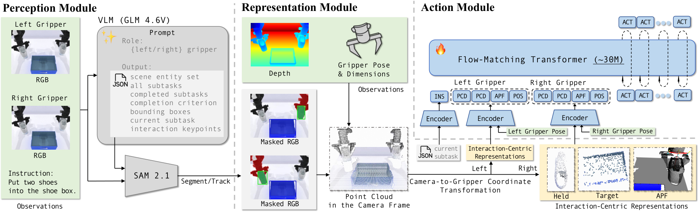

서로 다른 로봇에 조작 정책을 옮길 때, 영상 속 물체만 달라지는 것은 아니에요. 카메라가 보는 각도, 팔의 길이, 그리퍼의 폭과 손끝 위치가 한꺼번에 달라집니다. 이 논문은 그 차이를 한 장면 좌표계에 섞지 않고, 두 손가락 그리퍼를 기준으로 다시 표현해요. 학습한 로봇의 모양을 흉내 내는 대신, 어느 그리퍼가 무엇을 잡고 어디로 옮기는지를 공통된 상호작용으로 남기는 방법이에요.

<figure class="fig"><figcaption>논문의 방법 도식입니다. 지시와 색상·깊이 관측에서 그리퍼·잡은 물체·목표 물체를 찾아, 그리퍼 좌표계의 기하 표현으로 바꾼 뒤 행동 궤적을 만듭니다. (출처: Li et al., arXiv:2609.31207 Fig. 2)</figcaption></figure>

## 장면이 아니라 상호작용을 맞춰요

논문은 과제를 그리퍼, 현재 잡은 물체, 다음 목표 물체의 세 항으로 나눠요. 언어와 <abbr title="색상과 물체까지의 거리를 함께 주는 카메라 관측">RGB-D</abbr> 관측으로 이 세 항과 현재 세부 과제를 찾고, 추적한 물체 마스크를 3차원으로 올립니다. 그 뒤 모든 점을 카메라 원점이 아니라 그리퍼의 자세와 치수를 기준으로 옮겨요. 이러면 팔이 길어지거나 카메라가 옮겨도, 손끝에서 물체와 목표까지 어느 방향·간격인지라는 조작 조건은 같은 형식으로 남습니다.

표현은 두 겹이에요. 멀리 있는 목표와 피해야 할 충돌 물체는 <abbr title="가까워지면 끌고 피해야 할 곳에서는 밀어 내는 방향을 나타낸 장">인공 퍼텐셜장</abbr>으로 압축해 전체 방향을 주고, 가까운 손끝 접촉은 그리퍼 좌표계의 <abbr title="공간 속 점들의 위치를 모아 물체 모양을 나타낸 데이터">점군</abbr>으로 남겨 세부 형상을 봐요. 행동 생성기는 이 두 기하 정보와 지시·관절 상태를 함께 받아 여러 시점의 목표 움직임을 출력합니다. 전역 방향만 쓰면 물체 가장자리와 손끝의 관계가 사라지고, 장면 전체 점군만 쓰면 로봇마다 달라지는 배경과 팔 형상까지 외워야 한다는 판단이에요.

## 치수는 숨기지 않고 입력으로 둬요

두 손가락 그리퍼를 같은 틀로 표현하려면 손끝 위치만 맞춰서는 부족해요. 저자들은 그리퍼의 길이·폭·높이를 매개변수로 두고, 몸체 네 꼭짓점과 손끝 네 점으로 여덟 기준점을 정의합니다. 이 기준점이 목표 물체를 향한 끌림과 반대 손가락·충돌 물체를 피하는 힘의 기준이 됩니다. 그래서 "같은 물체를 잡는다"는 의미와 "이 그리퍼가 실제로 닿을 수 있는 공간"을 함께 담습니다.

이 선택은 치수를 잘못 넣었을 때의 결과로도 확인돼요. 시뮬레이터 그리퍼 치수는 0.095 m, 0.090 m, 0.030 m였고 실물 그리퍼 치수는 0.185 m, 0.110 m, 0.050 m였어요. 치수가 어긋난 변형은 특히 정확한 공간 정렬이 필요한 과제에서 성능이 더 떨어졌습니다. 로봇을 바꿀 때 점군 좌표계만 바꾸고 끝낼 수 없으며, 손끝 간격과 충돌 경계도 같은 좌표계의 일부로 기록해야 한다는 뜻이에요.

## 무작위 장면에서 남은 성공률을 봐야 해요

시뮬레이션 평가는 RoboTwin2.0의 25개 과제에서 과제마다 깨끗한 시연 50개로 학습하고, 깨끗한 조건과 장면을 무작위로 바꾼 조건 각각 100회로 시험했어요. 제안 방법은 깨끗한 조건에서 66.3%, 무작위 조건에서 46.1% 성공률을 냈어요. 비교한 DP3-W는 깨끗한 조건에서는 73.1%였지만 무작위 조건에서는 7.5%까지 떨어졌습니다. 이 논문의 핵심 수치는 최고 성능 하나보다, 장면 변화 뒤에도 남은 비율이에요.

실물에서는 위치·물체·카메라 시점 변화를 따로 시험했어요. 카메라를 35 cm, 45° 옮긴 조건에서 두 기준 방법은 네 과제 모두 0/10이었지만, 제안 방법은 집기·놓기 2/10, 밀기 3/10, 그릇 쌓기 2/10을 남겼어요. 양팔 ALOHA-AgileX 시뮬레이션 궤적만으로 학습한 정책을 다른 단일 팔에 옮긴 시험에서는, DOS-W1의 병 흔들기가 16/30, Jaka 근접 시점이 15/30이었어요. 다만 시뮬레이션에서 90%를 넘던 동작도 실물에서는 크게 떨어졌고, 정밀한 물체 배치는 DOS-W1 6/30, Jaka 근접 시점 5/30에 머물렀습니다.

## 전이가 되려면 카메라와 작업공간도 맞아야 해요

이 결과를 그리퍼 좌표계만으로 모든 로봇을 바꿀 수 있다는 뜻으로 넓히면 안 돼요. 논문은 한 대의 고정 시점 RGB-D 관측에 의존해서, 가려진 접촉이나 정밀 정렬처럼 손목·다중 시점이 필요한 과제를 평가에서 뺐어요. 카메라 시점 변화에는 수동 재보정이 필요했고, 이종 로봇 전이는 작업공간을 엄격히 맞춰야 하며 역기구학 실패도 남았어요. 언어 모델과 물체 분할기의 위치 오차가 이어지는 점도 한계예요.

따라서 이 방식은 로봇의 모든 차이를 없애는 변환이 아니라, 먼저 맞출 조건을 명확히 하는 표현이에요. 그리퍼 치수, 손끝 기준 좌표계, 카메라-그리퍼 변환, 작업공간을 함께 관리한 뒤에야 장면 변화에 덜 묶인 정책을 비교할 수 있어요. [[2026-08-25_물체_데이터_없이_그리퍼_기하만으로_학습한_파지_GOAG|물체 데이터 없이 그리퍼 기하만으로 학습한 파지 계획 GOAG]]도 물체별 데이터 대신 그리퍼 기하를 중심에 두었지만, 이 논문은 그 기하를 시각 관측·점군·행동 생성의 중간 표현으로 사용합니다.

## 지금 작업과 만나는 지점

이 논문은 프로필의 저가 로봇팔 모방학습, 양팔·조작, <abbr title="시뮬레이션에서 배운 정책을 실물 로봇으로 옮기는 과정">사족·시뮬 강화학습·sim-to-real</abbr>, 핸드아이·깊이·자세 추정과 만납니다. 두 손가락 그리퍼의 폭·길이·손끝 기준점과 카메라에서 그리퍼로 가는 좌표 변환을 분리해 두면, 시뮬레이션과 실물 또는 서로 다른 팔에서 나온 관측을 같은 형식으로 비교할 수 있어요. 바로 시험해 볼 수 있는 범위는 새 정책을 학습하거나 팔을 움직이는 일이 아니라, 기록 양식에 그리퍼 치수·손끝 좌표계·카메라 변환을 함께 넣고, 물체·목표·그리퍼를 같은 기준으로 저장할 수 있는지 확인하는 일입니다. 이 기록이 갖춰져야 시점 변화, 그리퍼 치수 차이, 작업공간 불일치를 서로 다른 원인으로 나눠 평가할 수 있어요.

---

<!-- src-block -->

출처 — https://arxiv.org/abs/2609.31207
