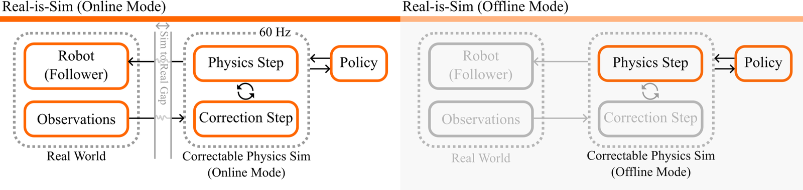
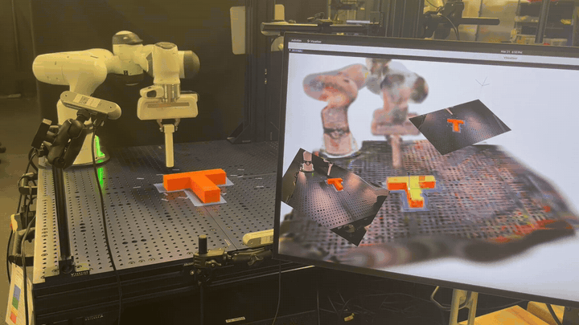

<abbr title="시뮬레이션에서 잘 되던 로봇 정책이 실제 로봇에서는 다르게 움직이는 차이">시뮬-실물 격차</abbr>를 넘는 흔한 방법은 정책을 더 강인하게 학습시키거나, 시뮬레이션과 실제의 입력을 서로 닮게 만드는 것이에요. <abbr title="실제 로봇을 움직이는 동안에도 시뮬레이터를 정책과 로봇 사이에 계속 두는 프레임워크">Real-is-Sim</abbr>은 이 부담을 정책에서 떼어 내요. 정책은 학습할 때도 실제 로봇을 움직일 때도 시뮬레이터 속 로봇만 조종하고, 실물 로봇은 시뮬레이터 로봇의 관절 위치를 그대로 따라가요. 시뮬레이터는 카메라 영상으로 <abbr title="1초에 몇 번 반복하는지 나타내는 단위. 60Hz는 1초에 60번이에요">60Hz</abbr>마다 물체 상태를 고쳐 받는 <abbr title="실제 장면의 상태를 계속 받아 스스로를 고치는 가상 복제본">동적 디지털 트윈</abbr>이라, 격차를 넘는 일은 정책이 아니라 이 동기화 장치가 맡아요.

<figure class="fig"><figcaption>온라인 모드(왼쪽)에서는 실물 로봇이 추종자로 붙고 카메라 관측이 보정 단계로 들어가요. 오프라인 모드(오른쪽)는 두 연결을 끄고 물리 단계와 정책만 남겨요. (출처: Abou-Chakra et al., Real-is-Sim 프로젝트)</figcaption></figure>

## 정책은 시뮬레이터 속 로봇만 조종해요

논문은 시스템을 실제 세계, 시뮬레이터, 학습된 정책 셋으로 나눠요. 실제 세계에는 카메라들과, 목표 관절 값을 받는 <abbr title="목표 관절 위치에서 벗어나지 않도록 강하게 끌어당기는 방식의 관절 제어기">고임피던스 관절 제어기</abbr>가 있어요. 시뮬레이터는 실제 세계와 연결되면 매 시간 단계마다 두 가지를 해요. 실물 로봇의 목표 관절 값을 시뮬레이터 로봇의 현재 관절 위치로 채우고, 카메라 영상으로 계산한 보정 힘과 토크를 시뮬레이터 속 물체에 가해요.

정책 입력은 시뮬레이터 상태에서 뽑은 표현이고, 출력은 1초 동안 따라갈 32개 <abbr title="로봇이 차례로 지나갈 중간 목표 자세">경유점</abbr>이에요. 경유점마다 목표 관절 값과 함께, 과제를 얼마나 끝냈는지 0에서 1 사이로 적은 <abbr title="시연의 경과 시간으로 매긴, 과제를 얼마나 끝냈는지 나타내는 값">진행도</abbr>가 들어가요. 실물 로봇이 따라가는 값은 정책이 낸 목표 관절 값이 아니라, 시뮬레이터 로봇이 물리 계산을 거쳐 실제로 도달한 관절 위치예요.

두 실행의 차이는 연결 두 개를 켜고 끄는 것뿐이에요. 실물 로봇의 추종과 보정 힘 계산을 끄면 같은 시스템이 시뮬레이터만으로 돌아가고, 환경을 여러 개 병렬로 띄울 수 있어요. 저자들은 가상 환경 20개를 동시에 돌려, 정책 입력 표현에 따라 5배에서 8배의 속도 향상을 보고해요.

## 영상과 렌더링의 차이로 물체를 당겨 맞춰요

시뮬레이터는 <abbr title="물리 계산용 입자와 겉모습용 3차원 표현을 묶고, 카메라 영상으로 계속 보정하는 시뮬레이터">Embodied Gaussians</abbr>예요. 장면을 물리 계산용 입자와, 색·투명도·크기를 가진 작은 타원체를 겹쳐 겉모습을 그리는 <abbr title="작은 타원체를 겹쳐 그려 사진 같은 3차원 장면을 빠르게 렌더링하는 방법">가우시안 스플래팅</abbr> 두 층으로 표현하고, 타원체를 입자에 묶어 함께 움직이게 해요. 실제 카메라 영상과 시뮬레이터가 같은 시점에서 그린 영상을 비교해 <abbr title="두 영상의 같은 자리 픽셀이 밝기와 색에서 얼마나 다른지 나타내는 오차">광도 오차</abbr>를 구하고, 이 오차를 줄이는 쪽으로 가상의 힘을 입자에 걸어 시뮬레이션을 실제 장면 쪽으로 당겨요. 물리 계산이 먼저 예측하고 영상이 그 예측을 고치는 순서라, 물리적으로 말이 되는 상태를 유지하면서 실물과도 어긋나지 않게 돼요.

<figure class="fig"><figcaption>온라인 모드 실행 영상의 18초부터 26초까지예요. 사람이 막대로 실물 T자 블록을 밀어 옮기면 모니터 속 시뮬레이션의 블록 위치도 바뀌고, 로봇이 블록 쪽으로 다시 움직여요. (출처: Abou-Chakra et al., Real-is-Sim 프로젝트)</figcaption></figure>

저자들은 원래 Embodied Gaussians에서 두 가지를 바꿨어요. 변형 물체를 위한 형상 구속을 빼고 모든 물체를 구 모양 충돌 요소로 이룬 <abbr title="힘을 받아도 모양이 변하지 않는다고 보고 계산하는 물체">강체</abbr>로 다뤄 온라인 모드 속도를 30Hz에서 60Hz로 올렸고, 위치만 옮겨 주던 로봇을 질량과 관성을 가진 물체로 바꿔 주변 환경에 반응하게 했어요. 로봇 링크에는 중력이 걸리지 않게 했는데, 중력이 있으면 시뮬레이터 로봇을 제어할 때 <abbr title="팔이 제 무게로 처지지 않게 제어 명령에 더해 주는 힘">중력 보상 항</abbr>이 따로 필요해지기 때문이에요. 실험 장비는 7자유도 <abbr title="독일 Franka Robotics의 연구용 7관절 로봇팔">Franka</abbr> 팔, 초당 90프레임으로 도는 <abbr title="인텔의 깊이·컬러 카메라 모델">RealSense D455</abbr> 카메라 세 대, 주 연산 장치인 <abbr title="NVIDIA의 작업용 그래픽카드">RTX 6000 Ada</abbr>예요.

## 시연도 실물 로봇을 붙인 채 모아요

시연은 온라인 모드에서 모아요. 시연자는 실제 장면 위에 겹친 시뮬레이터 상태를 보며 동기화가 무너지지 않게 움직임을 조절해요. 로봇 몸체로 카메라를 가리지 않고, 물체에 닿지 않을 때는 빠르게, 닿는 동안은 느리게 움직이며, 물체 가장자리와 간격을 넉넉히 둬요. 기록하는 것은 60Hz의 시뮬레이터 상태 전체이고, 그중 시간에 따라 바뀌는 값은 물체 자세와 로봇 관절 값뿐이에요.

부록은 시뮬레이터 안에서만 모은 시연의 위험을 과장된 사례로 보여 줘요. 시뮬레이터에서는 과제를 해냈지만 물체와의 간격이 모자라, 실물에서는 없던 충돌이 가상 세계에서만 일어났어요. 물리 계산은 어길 수 없는 구속으로 작동하므로 영상 보정이 이 어긋남을 되돌리지 못했고, 실제 실행에서 추적 오차가 크게 늘었어요. 그래서 저자들은 시연의 적어도 일부는 실물 로봇을 연결한 채 모아, 시연자와 정책이 동기화를 지키는 움직임을 함께 익히게 하라고 권해요.

누가 누구를 따라가는지도 설계 선택이에요. 시뮬레이터가 실물 로봇을 따라가는 <abbr title="실물 로봇이 움직이고 시뮬레이터가 그 상태를 받아 따라가는 연결 방식">리더 구성</abbr>에서는 정책에서 실물 로봇으로 가는 제어 입력, 실물 로봇에서 시뮬레이터로 가는 제어 입력, 실물 로봇에서 시뮬레이터로 가는 관측의 세 흐름이 경계를 넘어야 하고, 온라인과 오프라인을 오갈 때 연결 구조도 바뀌어요. 실물이 시뮬레이터를 따라가는 <abbr title="시뮬레이터 로봇이 먼저 움직이고 실물 로봇이 그 관절 위치를 따라가는 연결 방식">추종자 구성</abbr>은 경계를 넘는 흐름이 둘이고 두 모드의 연결이 같아요. 대신 실물이 늘 시뮬레이터보다 조금 늦게 움직이는데, 저자들은 이를 가까운 미래 상태를 미리 보는 성질로도 해석해요.

## 가상 평가가 실기와 같은 순서를 냈어요

평가 과제는 <abbr title="막대로 T자 블록을 밀어 정해진 자리와 방향에 맞추는 조작 과제">PushT</abbr>예요. 시연에 없는 시작 자세 20개를 정하고 자세마다 세 번씩 돌려, 성공률 하나에 60회를 측정했어요. 실기에서는 블록이 목표 자리에 들어갔는지로, 가상 평가에서는 정책이 낸 진행도가 0.9를 넘었는지로 성공을 판정했어요. 정책은 출발 궤적에서 시연 궤적으로 가는 경로 위의 속도를 학습하는 <abbr title="출발 궤적을 시연 궤적 쪽으로 옮기는 방향을 학습해 행동 궤적을 만드는 생성 방법">조건부 흐름 정합</abbr> 방식이에요.

물체 위치·자세 값을 입력으로 받는 정책을 시연 30개로 5만 스텝 학습하고, <abbr title="k는 1,000을 뜻해요. 10k는 학습 1만 스텝째에 저장한 모델이에요">10k·15k·25k·50k</abbr> 스텝의 네 <abbr title="학습 도중 저장해 둔 모델 가중치">체크포인트</abbr>를 실기로 평가하고, 나머지는 가상 평가로 촘촘히 훑었어요. 절대 성공률은 두 평가에서 다를 수 있었지만 체크포인트 사이의 순서는 유지됐고, 뒤쪽 체크포인트가 앞쪽보다 늘 낫지도 않았어요. 시연을 따라 하도록 배우는 <abbr title="사람 시연의 행동과 정책 출력의 차이를 줄이도록 학습시키는 오차 값">행동 복제 손실</abbr>은 실제 성능을 잘 알려 주지 않으므로, 체크포인트 선택이나 학습을 멈출 시점을 몇 시간 걸리는 실기 대신 몇 분 걸리는 가상 평가로 고를 수 있다는 것이 저자들의 결론이에요. 다만 이 비교는 두 평가에 같은 시작 자세를 쓴 경우이고, 가상 평가는 실기 성공률의 추정치가 아니라 순서를 가리는 도구로 검증됐어요.

데이터 보강도 같은 가상 환경에서 했어요. 실기 시연 30개로 학습한 정책은 약 57% 성공률을 냈고, 이 정책을 병렬 가상 환경에서 돌려 <abbr title="주변보다는 낫지만 목표에는 못 미치는 자리에 갇혀 더 나아가지 못하는 상태">국소 최솟값</abbr>에 빠지는 실패 상태를 찾은 뒤, 그 상태에서 시작하는 시연 30개를 시뮬레이터에서 더 받았어요. 둘을 합쳐 다시 학습하자 성공률이 80%로 올랐고, 실기 시연 60개로 학습한 정책도 비슷하게 올랐어요. 시뮬레이터에서만 모은 시연 30개로 학습한 정책도 실기 시연 정책과 비슷했는데, 저자들은 PushT가 힘의 효과보다 자세에 좌우되는 과제라서 영상 보정으로 맞추기 쉬웠다고 설명해요.

정책 입력도 바꿔 볼 수 있어요. 물체 자세, 그리퍼에 단 <abbr title="시뮬레이터 장면을 원하는 위치에서 그려 내는 가상의 카메라">가상 카메라</abbr>, 실제 카메라 자리에 둔 고정 가상 카메라를 각각 입력으로 쓴 정책이 모두 과제를 풀었고, 실제 카메라 영상만 쓴 기준 정책과 비슷하거나 나은 성능을 냈어요. 가장 높은 것은 그리퍼 가상 카메라 정책의 82%였어요. [[2026-07-30_실패하는_자리까지_똑같아요|시뮬레이션을 훈련장이 아니라 계측기로 검증한 Real-to-Sim-to-Real]]은 실제 장면을 복원한 시뮬레이션이 실기 성능을 미리 재는 계측기가 될 수 있는지 봤어요. Real-is-Sim은 복원한 시뮬레이터를 평가 뒤에도 실기 실행 경로에 남겨, 평가와 실행이 같은 종류의 입력을 쓰게 만들어요.

## 동기화가 버티는 범위가 곧 적용 범위예요

저자들이 적은 한계는 모두 동기화 장치가 무너지는 조건이에요. 시뮬레이터의 모델링 가정에서 크게 벗어나는 장면에서는 예측과 보정이 함께 흔들려요. 보정이 영상에서 나온 가상 힘에 기대므로 물체가 오래 가려지거나 보이지 않는 채 조작되면 쓸 수 없고, 영상 보정이 물리 예측과 반대 방향으로 물체를 밀면 동기화를 믿을 수 없어요. 카메라 수와 배치, 물체 복잡도에 민감한 장면 초기화도 한계로 들었고, 검증은 PushT 한 과제뿐이에요. 여러 물체 재배치나 천 조작에는 동역학과 보정 방식을 다시 맞춰야 해요.

프로젝트 페이지에는 정책이 오히려 영상 보정의 재동기화를 막는 행동을 만드는 사례도 실려 있어요. 정책은 시뮬레이터 상태만 보기 때문에 시뮬레이터가 실물과 어긋나도 그 사실을 알 수 없어요. 어긋남을 줄이는 몫은 온라인 시연에서 익힌 움직임과 보정 루프에 달려 있는 것으로 보여요. 저자들은 마찰이나 질량 같은 물리 값을 실시간으로 추정하거나, 영상 외의 대응점·분할 신호를 보정에 더하는 방향을 이후 과제로 둬요.

## 지금 작업과 만나는 지점

이 논문은 저가 로봇팔 <abbr title="사람 시연을 보고 같은 행동을 따라 하도록 로봇 정책을 학습시키는 방법">모방학습</abbr>, 물체 조작, 시뮬레이션과 실물 사이 전이의 세 주제와 만나요. [과부하 보호 오발이 만든 서보 급사와 뎁스캠 픽앤플레이스 완주](../physical-ai/2026-08-20_회고_서보급사_과부하보호_오발과_픽앤플레이스)에서 붙인 <abbr title="관절과 접촉을 빠르게 계산하는 물리 시뮬레이터">MuJoCo</abbr> 미러는 실팔 관절각을 10Hz로 읽어 넣는 읽기 전용 디지털 트윈이고, 물체와 상자는 실측 좌표로 배치돼요. 이 논문의 분류로 보면 시뮬레이터가 실물을 따라가는 리더 구성이고, 물체를 좌표로 놓는 방식이라 물리 예측을 영상 오차로 매 단계 고치는 논문의 보정 루프와는 달라요.

Real-is-Sim의 가상 평가가 실기 순서를 지킨 전제는 정책 입력이 처음부터 시뮬레이터 상태에서 나왔다는 점이에요. 실제 카메라 영상으로 학습한 정책을 미러에 연결한다고 같은 성질이 생기지는 않으므로, 이 방식을 시험하려면 시연 단계부터 시뮬레이터 상태를 기록해야 해요. 팔을 움직이지 않고 바로 해 볼 수 있는 범위는 미러의 물체 좌표를 카메라 검출로 주기적으로 갱신하고, 실물 영상과 미러 상태가 어긋나는 시점과 조건을 남기는 데까지예요.

추종자 구성으로 옮길 때는 저가 서보 팔의 보호 조건도 함께 봐야 해요. 실물 팔은 시뮬레이터 로봇의 관절 위치를 따라가므로, 시뮬레이터에 없는 실물 장애물에 막히면 도달할 수 없는 목표를 계속 추종하게 돼요. 논문은 Franka 팔의 관절 제어기로 추종을 구현했고 실물이 막혔을 때의 대응은 따로 다루지 않으므로, 위치 제어 서보에서는 트윈 동기화와 별도로 실물 쪽 부하·전류 감시를 남겨 둬야 해요.

---

<!-- src-block -->

출처 — https://arxiv.org/abs/2504.03597
