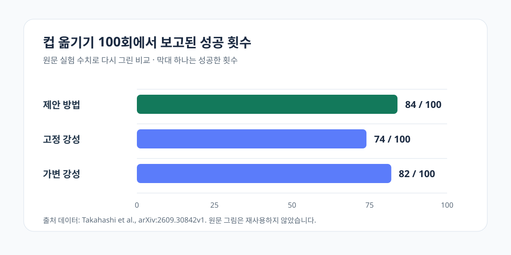

표면 높이나 물체 모양이 조금 바뀌면, 시연에서 본 궤적을 충실히 재생하는 정책은 접촉을 잃거나 힘을 과하게 줄 수 있어요. [이 논문](https://arxiv.org/abs/2609.30842)은 관측된 위치·힘을 그대로 따라 하기보다, 그 움직임을 만들었다고 보는 <abbr title="위치 오차가 생겼을 때 얼마나 큰 힘으로 되돌리려 하는지를 정하는 값">강성</abbr>과 <abbr title="스프링이 힘을 내지 않는 기준 위치를 뜻하는 가상의 목표 위치">평형점</abbr>을 행동으로 삼습니다. <abbr title="접촉 조작을 위해 평형점과 강성을 모방하도록 만든 논문의 방법 이름">Impedance Cloning</abbr>은 이 두 값을 시연에서 추정해 재생하거나 학습 정책의 출력으로 사용합니다.

<figure class="fig"><figcaption>논문이 보고한 컵 옮기기 100회 결과를 새로 그렸습니다. 원문 그림은 재사용하지 않았고, 원문의 84회·74회·82회 성공 수치를 사용했습니다. (출처 데이터: Takahashi et al., arXiv:2609.30842v1)</figcaption></figure>

## 궤적은 결과이고 강성은 반응 규칙이에요

논문이 구분하는 것은 같은 위치를 지나갔다는 기록과, 그 위치가 어긋났을 때 어떻게 힘으로 반응했는가예요. 위치·토크·힘은 시연 중 관측할 수 있는 결과지만, 평형점과 강성은 그 결과를 만들기 위한 제어 입력으로 둡니다. 목표면이 낮아지거나 높아질 때 궤적만 재생하면 접촉 상태를 고칠 근거가 없지만, 강성을 함께 재현하면 위치 오차가 힘 변화로 이어지는 경로를 남길 수 있습니다.

이 해석은 <abbr title="위치 오차에 따라 되돌리는 힘이 달라지도록 강성과 기준 위치를 쓰는 제어 방식">임피던스 제어</abbr>를 새로 발명했다는 뜻은 아니에요. 이미 쓰던 제어기의 설정값을 모방학습의 출력 표현으로 옮긴 선택에 가깝습니다. 따라서 실험이 보여 주는 범위도 “모든 접촉 작업에 강성이 답이다”가 아니라, 표면 기하가 시연 조건에서 벗어나는 상황에서 궤적보다 더 보존할 정보가 무엇인지에 있습니다.

## 보이지 않는 입력은 연속성으로 추정해요

저자들은 <abbr title="사람이 움직이는 리더 로봇과 이를 따르는 로봇이 위치와 힘 반응을 서로 주고받는 조작 방식">양방향 원격조작</abbr> 시연에서 얻은 관절각과 토크를 <abbr title="여러 가능한 상태를 동시에 두고 관측이 들어올 때마다 가능성이 큰 상태를 남기는 추정 방법">입자 필터</abbr>에 넣어, 시간에 따른 평형점과 강성을 구합니다. 힘·토크 센서를 별도로 달지 않고도 반력 관측기로 토크를 얻고, 두 대의 <abbr title="논문 실험에 사용한 8축 로봇팔 모델명">CRANE-X7</abbr> 로봇팔에서 평가했습니다. 추정이 가능한 전제는 명확해요. 제어 입력이 매 순간 크게 튀지 않고 작은 변화로 이어진다는 가정을 둡니다.

이 가정은 장점과 경계를 함께 만듭니다. 한 번의 시연에서도 값을 얻을 수 있지만, 충격처럼 입력이 급격히 바뀌거나 토크 추정이 흔들리는 조건에서는 필터가 실제 제어 의도를 잘못 나눌 수 있어요. 논문도 강성을 자유로운 전 행렬이 아니라 축마다 독립된 값으로 다루므로, 축 사이 결합이 강한 조작까지 검증한 결과는 아닙니다.

## 표면 높이가 달라질 때 기울기가 작았어요

닦기 과제에서 제안 방법은 기준보다 표면이 낮아진 -6 cm 이상에서 4∼5 N 접촉력을 유지했다고 보고합니다. <abbr title="로봇팔 끝의 위치를 x·y·z 방향으로 나타내는 좌표계">카테시안 좌표계</abbr> 비교에서는 0∼+8 cm 구간의 힘-높이 기울기가 0.13 ± 0.03 N/cm였고, 고정 강성 기준 방법은 0.34∼0.83 N/cm였습니다. 같은 높이 오차가 들어왔을 때 힘이 얼마나 민감하게 변하는지를 기울기로 나타낸 것이므로, 이 수치가 작다는 것은 이 실험 범위에서 접촉력이 덜 흔들렸다는 뜻이에요.

컵 옮기기에서는 서로 다른 컵 10종을 방법마다 10회씩, 모두 100회 시험했습니다. 제안 방법은 84회 성공했고 고정 강성 기준 방법은 74회였어요. 가변 강성 기준 방법은 82회였지만 강성을 계산하는 데 시연 10개를 썼고, 제안 방법과 고정 강성 기준 방법은 그중 하나의 시연으로 실행했습니다. 그래서 84와 82의 작은 차이를 보편적 우위로 읽기보다, 적은 시연으로도 가변 강성 기준과 비슷한 결과를 냈다는 비교로 읽는 편이 맞습니다.

## 이 결과가 곧 힘 제어의 보증은 아니에요

논문은 세 과제에서 결과를 냈지만, 실험 장비·물체·속도와 접촉 조건은 제한적입니다. 닦기에서는 보드 높이를 -10 cm부터 +10 cm까지 바꿨고, 컵 시험의 성공은 물체를 떨어뜨리지 않고 목표 위치까지 옮기는지로 판정했어요. 따라서 다른 재질의 마찰, 빠른 충돌, 센서 지연, 기구 백래시가 있는 환경에서 같은 힘 범위나 성공률을 기대할 근거는 아직 없습니다.

그럼에도 이 논문은 [[2026-08-27_모터_부하만으로_압축_변형률을_묶어_손상을_보증한_무센서_파지|모터 부하만으로 압축 변형률을 묶어 손상을 보증한 무센서 파지]]처럼 외부 힘 센서가 없는 조건에서 무엇을 측정하고 무엇을 추정할지를 분리해 봐야 한다는 점을 보여 줍니다. 측정값 하나를 곧바로 접촉 상태로 읽기보다, 그 값이 어떤 제어 입력과 어떤 모델 가정 아래에서 의미를 얻는지 기록해야 비교가 가능합니다.

## 지금 작업과 만나는 지점

이 논문은 프로필의 저가 로봇팔 모방학습, 양팔·조작, 서보·접촉·저수준 제어와 만납니다. 논문처럼 평형점·강성을 바로 추정할 수 있는지는 기구의 토크 관측과 제어 구조에 달려 있지만, 바로 시험해 볼 수 있는 범위는 접촉 시연을 저장할 때 위치 목표만 남기지 않고 관절 오차, 토크 또는 전류 관측, 목표 속도, 접촉 조건을 같은 시간축에 기록하는 일입니다. 이 기록이 있으면 시연 재생이 실패했을 때 원인이 궤적 오차인지, 접촉 조건 변화인지, 강성 설정인지 분리해 볼 수 있어요.

---

<!-- src-block -->

출처 — https://arxiv.org/abs/2609.30842
