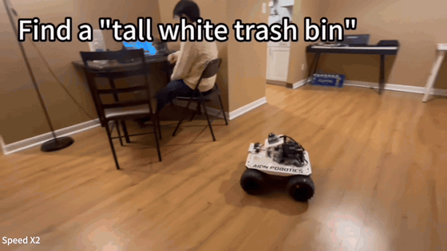
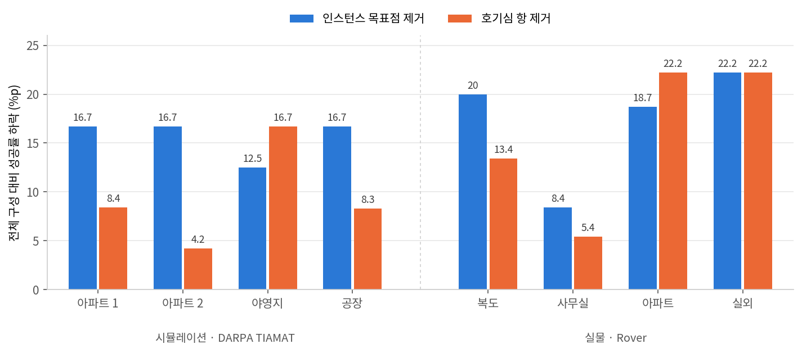

"오늘 날씨 예보에 비 소식이 있어요. Rob이 우산과 알맞은 재킷, 신발을 찾도록 도와주세요." <abbr title="미국 국방고등연구계획국(DARPA)의 로봇 자율성 과제. 추상적인 지시를 추론해 수행하는지 시험해요">DARPA TIAMAT</abbr> 챌린지의 이 지시에서 재킷과 신발은 종류가 정해져 있지 않아요. 로봇은 비에서 방수 장비를 떠올려 우산, 우비, 장화를 목표로 정하고, 처음 보는 넓은 공간에서 세 물건을 제한 시간 안에 찾아야 해요. 버펄로 대학교 연구진의 [VL-Nav](https://sairlab.org/vlnav/)는 이런 <abbr title="말로 된 지시와 카메라 영상을 함께 이해해 목표 물체까지 찾아가는 로봇 길찾기. 지시 속에 숨은 의미까지 추론해야 하는 경우예요">추론 기반 시각-언어 내비게이션</abbr>을 다룬 로봇 학회 IROS 2026 논문이고, 프로젝트 페이지는 이 논문이 IROS 인지 로봇 분야 최우수 논문상을 받았다고 적어요.

구조의 중심은 역할 분담이에요. 큰 <abbr title="사진과 글을 함께 이해하는 대형 AI 모델">VLM</abbr>은 지시 분해와 재계획, 후보 확인을 맡고, 탐사 중 다음 목표점은 로봇에 실은 가벼운 검출기와 점수식이 정해요.

<figure class="fig"><figcaption>실물 실험 영상의 한 구간이에요. 키 큰 흰색 쓰레기통을 찾으라는 지시에 로봇이 주방을 먼저 발견해 그쪽으로 가고, 후보 두 개 가운데 지시에 맞는 큰 쪽으로 다가가 확인해요. 원본 2배속 편집본을 여기서 1.75배 더 빠르게 재생해요. <span class="cap-src">(출처: Du et al., VL-Nav 프로젝트)</span></figcaption></figure>

## 추론은 원격에서 가끔, 탐사는 로봇에서 매 순간

논문은 입력에서 행동까지 한 번에 배우는 기존 방식이 데이터가 많이 들고 실물로 옮기면 성능이 무너지기 쉽다고 봐요. VLM을 부품으로 끼운 모듈형 방식은 목표 이름이 주어진 문제를 전제로 하고 목표 확인과 탐사를 한데 묶어서, 장화 대신 아무 신발이나 목표로 잡기 쉽다고 지적해요. 무거운 모델을 주행 내내 돌리면 실시간성이 깨진다는 점도 들어요.

VL-Nav는 이를 둘로 나눠요. <abbr title="신경망의 의미 판단과, 그래프·점수식처럼 사람이 정한 구조를 함께 쓰는 방식. neuro-symbolic을 줄여 NeSy라고 써요">신경기호(NeSy)</abbr> 작업 계획기는 VLM으로 지시를 탐색과 이동 하위 작업으로 쪼개고, NeSy 탐사기는 그 하위 작업을 받아 다음 목표점을 골라요. 실물 실험에서 탐사기는 로봇에 실은 소형 컴퓨터 Jetson Orin NX에서, 계획기는 원격 서버의 그래픽 카드 RTX 4090에서 Qwen3-VL-8B 모델로 돌아요. 계획기는 비동기로 돌며 새 지시가 오거나 하위 작업이 끝날 때만 갱신되므로, 원격 연산이 매 주행 단계에 끼어들지 않아요.

<figure class="fig" style="width:min(1320px,94vw);margin-left:calc(50% - min(660px,47vw))"><div style="height:419px;overflow:hidden;border:1px solid rgba(0,0,0,.12);border-radius:10px;background:#fff"><iframe src="../static/diagrams/2026-10-06_vl-nav_흐름도.htm" scrolling="no" title="VL-Nav 작업 계획과 탐사 흐름도" loading="lazy" style="display:block;width:100%;height:700px;border:0"></iframe></div><figcaption>원문 3절과 실물 실험 구성을 바탕으로 새로 그린 흐름이에요. 위 갈래는 원격 장비의 작업 계획, 아래 갈래는 로봇의 실시간 탐사예요. <a href="../static/diagrams/2026-10-06_vl-nav_흐름도.htm" target="_blank" rel="noopener">새 탭에서 크게 보기</a></figcaption></figure>

계획기의 기억은 <abbr title="물체와 방을 점으로, 포함 관계를 선으로 이어 지도를 그래프로 정리한 표현">3D 장면 그래프</abbr>와 물체별 사진이에요. 물체 노드는 중심 좌표, 최고 검출 신뢰도, 그때의 로봇 자세, 가장 잘 보인 시점의 사진을 저장하고, 방 이름은 연결된 물체들을 보고 <abbr title="글을 이해하고 만들어 내는 대형 언어 모델">LLM</abbr>이 붙여요. 우비로 가라는 이동 작업이 나오면 장면 그래프가 검출 신뢰도로 후보를 몇 개(논문 예시는 3개)로 거르고, VLM은 그 후보들의 저장 사진과 이웃 노드만 보고 하나를 골라요. 고른 물체가 가장 잘 보였던 자세가 그대로 주행 목표가 돼요. VLM이 지도 전체가 아니라 좁혀진 후보 사이에서만 판단하도록 기호 기억이 범위를 묶어 두는 구조예요.

## 후보점마다 매기는 점수

다음 목표 후보는 두 종류예요. <abbr title="이미 확인한 빈 공간과 아직 모르는 공간이 맞닿은 경계. 그곳에 가면 새 공간이 센서에 들어와요">프런티어</abbr>점은 <abbr title="공간을 칸으로 나눠 칸마다 비었는지, 막혔는지, 모르는지를 적은 지도">점유 격자</abbr>에서 이웃에 미지 칸이 있는 빈 칸이에요. 격자가 갱신될 때마다 로봇 정면의 시야각과 센서 거리 안쪽만 검사하고, <abbr title="가까운 칸부터 넓혀 가며 이어진 칸을 모두 찾는 방법">너비 우선 탐색</abbr>으로 묶은 덩어리에서 대표점을 뽑아요. 인스턴스점은 <abbr title="글로 적은 이름을 입력받아 물체를 찾는 실시간 검출 모델">YOLO-World</abbr>와 분할 모델 FastSAM이 보고한 물체 위치 가운데 신뢰도 문턱을 넘은 것이에요. 확실하지 않은 검출도 일단 다가가 확인하고, 틀리면 다른 후보로 넘어가요.

```text
S_VL(g)      = clip( sum_k a_k * exp(-0.5 * ((dth - mu_k) / sigma_k)^2) * C(dth), 0, 1 )
C(dth)       = cos^2( dth / (fov / 2) * pi / 2 )
S_dist(g)    = 1 / (1 + d(robot, g))
S_unknown(g) = 1 - exp(-k * ratio(g))
S_NeSy(g)    = w_dist * S_dist(g) + w_VL * S_VL(g) * S_unknown(g)
```

`S_VL`은 검출 방향들을 시야각 위의 <abbr title="종 모양 분포 여러 개를 가중치를 줘 겹친 분포">가우시안 혼합</abbr>으로 펼친 의미 점수예요. 방향의 퍼짐은 0.1로 고정하고, 시야 중앙에서 1이고 가장자리에서 0인 `C`를 곱해 곁눈으로 본 검출을 덜 믿어요. `S_unknown`은 후보 주변에서 도달 가능한 칸 가운데 미지 칸의 비율로 커져요. 최종 점수에서 곱셈은 의미 점수와 미지 비율 사이에만 걸려 있어서, 관련 있어 보이는 방향이라도 주변을 이미 다 봤으면 힘을 잃고 거리 항은 따로 더해져요. 선택은 인스턴스점이 먼저이고, 없을 때 프런티어점 가운데 최종 점수가 가장 높은 곳을 고르며, 경로는 <abbr title="아직 모르는 공간을 지나는 길도 시도해 보는 빠른 경로 계획기">FAR Planner</abbr>가 만들어요.

## 시뮬레이션 75.0~87.5%, 실물 86.3%

시뮬레이션은 TIAMAT 1단계의 네 환경이에요. 아파트 두 곳은 시뮬레이터 HabitatSim, 야영지와 공장은 IsaacSim에서 돌렸고, 로봇은 <abbr title="색 영상과 함께 픽셀마다 거리 값을 주는 카메라">RGB-D</abbr> 카메라 다섯 대를 단 사족보행 로봇 Spot이에요. 상호작용 과제를 빼고 환경마다 과제 8개를 3회씩 수행했어요. 표의 환경 열은 성공률(%)이고, 마지막 열은 네 환경 값의 범위로 낮을수록 시간을 덜 쓴 거예요.

| 방법 | 아파트 1 | 아파트 2 | 야영지 | 공장 | <abbr title="과제마다 걸린 시간을 제한 시간으로 나눈 값의 평균">최대 시간 사용 비율</abbr> |
|---|---:|---:|---:|---:|---:|
| 최근접 프런티어 탐사 | 8.3 | 8.3 | 0.0 | 0.0 | 0.884~1.000 |
| VLFM | 8.3 | 8.3 | 4.2 | 8.3 | 0.859~0.953 |
| SG-Nav | 0.0 | 4.2 | 0.0 | 8.3 | 0.901~1.000 |
| ApexNav | 25.0 | 25.0 | 20.8 | 12.5 | 0.795~0.861 |
| VL-Nav | 87.5 | 79.2 | 75.0 | 75.0 | 0.562~0.679 |

SG-Nav는 주행 단계마다 LLM에 <abbr title="답을 바로 내지 않고 중간 추론 과정을 글로 풀어 쓰게 하는 방식">사고 연쇄</abbr> 추론을 시켜 자주 시간 초과로 끝났어요. 실물 실험은 바퀴 로봇 Rover에 <abbr title="레이저를 쏘아 주변까지의 거리를 점으로 재는 센서">라이다</abbr>와 RealSense 카메라를 달고 복도, 사무실, 아파트, 실외에서 했어요. 성공률은 86.7, 91.7, 88.9, 77.8%이고 이 넷의 단순 평균이 86.3%예요. 경로 효율을 보는 <abbr title="성공한 시행을 최단 경로 대비 실제 이동 거리로 깎은 점수">SPL</abbr>은 사무실에서 0.812로 VLFM의 0.556, 최근접 프런티어 탐사의 0.317보다 높았고, 483m 장거리 주행도 이 실물 실험에 포함돼요.

## 제거 실험을 칸별로 읽으면

논문은 인스턴스점을 빼면 물건이 많은 아파트에서(시뮬레이션 87.5에서 70.8%, 실물 88.9에서 70.2%), 호기심 항(거리와 미지 비율)을 빼면 넓은 공장과 실외에서(75.0에서 66.7%, 77.8에서 55.6%) 크게 떨어진다고 설명해요. 여덟 환경을 모두 하락폭으로 바꾸면 그림이 조금 달라요.

<figure class="fig"><figcaption>원문 표 I·II의 성공률을 전체 구성과의 차이로 바꿔 그렸어요. 시뮬레이션은 환경당 24회 시행이라 4.2%p가 시행 한 번이에요.</figcaption></figure>

16칸이 모두 떨어졌으니 두 요소가 성공률을 받친다는 결론은 단단해요. 반면 어느 환경에서 어느 쪽이 더 중요한지는 표가 갈라 주지 않아요. 인스턴스점 제거의 하락폭이 크거나 같은 곳이 여덟 중 여섯이고, 호기심 항 제거가 더 큰 곳은 야영지와 작은 실내인 실물 아파트(22.2 대 18.7)뿐이에요. 논문이 호기심 항의 예로 든 공장의 8.3%p는 아파트 1의 8.4%p와 같은 시행 두 번 차이예요.

실물 표의 값이 나눠 떨어지는 가장 작은 분모는 복도 15, 사무실 12, 아파트와 실외 9라서 환경당 9회에서 15회 시행으로 보여요. 그러면 한 번이 6.7%p에서 11.1%p라 이 하락폭 차이 대부분이 시행 한두 번이에요. 사무실의 호기심 항 제거 86.3%와 아파트의 인스턴스점 제거 70.2%는 같은 열의 다른 값과 달리 나눠 떨어지지 않는데, 논문이 인스턴스점 효과의 예로 든 값이 그중 하나예요.

## 이 결과가 서 있는 조건

실물 과제 9개는 "키 큰 흰색 쓰레기통"처럼 흔치 않은 묘사로 지정한 대상을 찾는 일이라, 원문 설명으로는 우비를 추론하거나 여러 목표를 모으는 TIAMAT 과제와 구성이 달라요. 의미를 보지 않는 최근접 프런티어 탐사도 시뮬레이션에서는 8.3%를 넘지 못했는데 실물에서는 33.3%에서 55.6% 사이를 냈어요. 환경과 로봇, 과제가 함께 바뀐 두 설정의 성공률은 같은 눈금으로 읽기 어려워요.

실물 비교에서 SG-Nav와 ApexNav는 탑재 장비에서 돌지 않아 빠졌고, VLFM은 무거운 원래 모델 대신 VL-Nav와 같은 검출기를 끼운 구성이었어요. 탑재 장비에서 실시간으로 돈다는 말도 탐사기에만 해당해요. 점수식의 가중치 `w_dist`와 `w_VL`, 기울기 `k`, 검출 문턱과 최소 거리 값은 논문에 없고, 계단을 오른 사족보행 로봇과 휴머노이드는 성공률 없이 시연으로만 제시됐어요. 물체 노드의 네 가지 속성에는 시간 정보가 없고, 저자들도 움직이는 대상을 따라가도록 기억을 시간 추론으로 넓히는 일을 다음 과제로 적었어요.

## 지금 작업과 만나는 지점

[[2026-07-23_웨이포인트만_보내면_되는_대회|저수준 주행을 주최 측이 맡는 계층 분리형 대회, CMU VLN Challenge]]는 경로 계획과 충돌 회피를 주최 측에 맡기고 참가팀은 웨이포인트만 보내게 했어요. VL-Nav도 경로는 FAR Planner에 넘기고 자기 기여를 목표점 선택에 두는데, 그 위층을 느린 추론과 빠른 점수식으로 한 번 더 나눴어요.

[점유 격자의 미지·자유 이분법이 만든 frontier 탐사 실패](../physical-ai/2026-08-10_회고_탐사가_벽옆만_맴돈_이유)에서 만든 탐사 노드도 프런티어 쪽 골격이 같아요. 미지 칸에 맞닿은 빈 칸을 경계로 잡아 8방향으로 묶고, 0.45m보다 가까운 목표는 건너뛰고, 덩어리 크기를 거리 더하기 1로 나눈 점수로 골랐어요.

차이는 세 곳이에요. 첫째, VL-Nav는 빈 칸(0)과 미지 칸(−1)이 바로 맞닿는다고 가정하는데, 그 글의 <abbr title="구글이 공개한 라이다 지도 작성 프로그램">Cartographer</abbr> 격자는 둘 사이에 확률 50 근처의 띠를 깔아서 자유를 25 이하로 잡으면 경계가 9칸, 65 미만이면 308칸이었어요. VL-Nav의 경계 정의를 그대로 가져와도 이 문턱 결정은 다시 해야 해요. 둘째, 정보량을 재는 단위가 달라요. 덩어리 크기는 경계선의 길이를, 미지 비율은 후보 주변에 남은 미지 공간을 세서, 경계는 길고 뒤가 좁은 자리에서 순위가 갈릴 수 있어요. 셋째, 지금 노드는 크기를 거리로 나눠 큰 덩어리가 멀어도 이길 수 있고, VL-Nav는 거리 항을 따로 더해 가중치로 비중을 정해요.

그 글에서 로봇이 같은 벽 옆을 왕복한 원인은 경계 판정과 실패 차단 단위였어요. VL-Nav의 호기심 항은 그다음 문제를 다뤄요. 경계가 여럿일 때 어디부터 갈지를 정해 되돌아가는 이동을 줄여요.

---

<!-- src-block -->

출처 — https://sairlab.org/vlnav/
