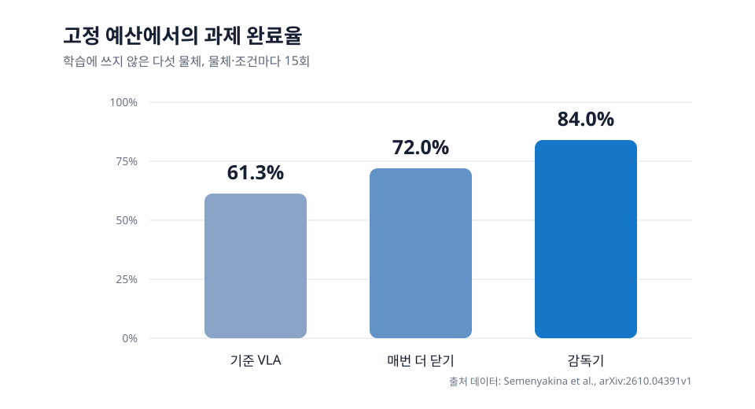

<abbr title="영상과 언어 지시, 로봇 상태를 받아 다음 행동을 만드는 로봇 정책">VLA</abbr>는 물체까지 팔을 가져가는 전략을 낼 수 있어도, 손가락이 물체를 실제로 지지했는지는 별도 문제예요. 물체 모양과 탄성이 달라지면 같은 파지 목표도 손가락마다 닿는 깊이가 달라지고, 손이 닫히는 동안에는 카메라 화면도 접촉 부위를 가립니다. <abbr title="고정된 로봇 정책 위에서 접촉 상태를 보고 손가락 보정과 재시도를 결정하는 논문의 방법 이름">AgenticTactileVLA</abbr>는 이 틈을 정책 재학습이 아니라 실행 중의 감독 단계로 다룹니다.

<figure class="fig"><figcaption>논문이 보고한 고정 예산 평가의 완료율을 새로 그렸습니다. 원문 그림은 사용하지 않았고, 표의 61.3%·72.0%·84.0% 수치만 옮겼습니다. (출처 데이터: Semenyakina et al., arXiv:2610.04391v1)</figcaption></figure>

## 접근 전략과 접촉 보정을 나눠요

이 방법에서 고정 VLA는 팔의 접근 움직임과 처음 손가락 목표를 냅니다. 감독기는 손가락이 닫히는 마지막 구간에서만 개입합니다. 충분히 지지됐다고 판단하면 원래 명령을 그대로 통과시키고, 지지가 부족하면 팔의 다음 기준점 진행을 잠시 멈춘 뒤 손가락별로 목표를 더 움직입니다. 보정 뒤 지지가 형성되면 그 자세를 유지하고, 그렇지 않으면 손 보정을 풀어 VLA가 손을 다시 열고 다음 접근을 만들게 합니다.

이 분리는 VLA가 모든 물체의 접촉 결과를 미리 맞혀야 한다는 부담을 줄입니다. 다만 접근 자체가 물체와 맞지 않는 경우를 고치는 방법은 아닙니다. 논문도 파지 전략은 가능한데 실제 손가락 접촉이 어긋난 상황을 대상으로 둡니다. 따라서 이 결과를 임의의 접근 실패를 복구한다는 주장으로 넓힐 수는 없습니다.

## 손가락 위치와 모터 노력값을 같이 읽어요

감독기는 별도 촉각 센서 대신 명령한 손가락 위치, 측정된 손가락 위치, 모터 노력값을 사용합니다. 명령은 계속 닫히는데 측정 위치가 그만큼 따라오지 않으면 저항을 만났다는 신호가 됩니다. 보정 단계에서는 모터 노력값이 기준값에서 일정 시간 벗어나는지도 함께 봅니다. 저자들은 이 값을 손끝 힘으로 보정하지 않았고, 장치별 접촉 저항의 단서로만 다뤘습니다.

논문 구현은 다섯 손가락 채널 가운데 세 채널 이상에서 지지 신호가 잡히면 파지가 형성됐다고 판정합니다. 보정 중에는 이미 지지된 손가락을 멈추고, 아직 지지되지 않은 손가락만 조금씩 더 닫습니다. 부드러운 물체는 닿아도 손가락이 계속 움직여 저항 신호가 약할 수 있으므로, 이 판정이 접촉이나 파지 안정성을 보증하지는 않습니다. 얇은 컵처럼 눌리기 쉬운 물체에는 닫기 전에 전류 제한 방식의 순응 제어를 선택하는 경로를 따로 둡니다.

## 매번 더 닫는 것보다 선택적으로 보정했어요

평가는 학습에 쓰지 않은 다섯 물체에서 조건마다 15회씩, 모두 75개 짝맞춤 블록으로 진행됐습니다. 기준 VLA의 완료율은 61.3%였고, 매번 손가락을 끝까지 더 닫는 비교 방법은 72.0%였습니다. 감독기를 붙인 조건은 84.0%였어요. 손가락을 더 닫는 동작만으로도 일부 회복이 있었지만, 같은 실행 예산에서 접촉 증거가 부족한 경우에만 보정한 조건이 더 높은 완료율을 냈습니다.

주 실험에서는 매번 더 닫는 방법이 75개 시험에서 101회의 연장 동작을 냈고, 감독기는 36회의 보정 에피소드만 냈습니다. 이 수는 완료율 비교와 같은 75개 시험에서 관측한 횟수입니다. 별도 100개 짝맞춤 블록 절제실험에서는 매번 개입하는 완전 감독기가 134회, 선택 개입 감독기가 46회의 보정을 냈습니다. 두 조건의 완료율은 84%와 86%였고, 저자들은 이 차이를 검출하지 못했습니다. 이 절제실험에서 선택 개입은 보정 에피소드를 65.7% 줄였습니다. 다른 손 구조나 다른 모터 피드백에서도 같은 기준이 통한다는 증거는 아닙니다.

## 지금 작업과 만나는 지점

이 논문은 프로필의 저가 로봇팔 모방학습, 양팔·조작, 서보·접촉·저수준 제어와 만납니다. 별도 촉각 센서를 늘리기 전에, 시연 재생에서 손가락 목표 위치와 실제 위치, 모터의 부하 또는 전류 관측, 손을 닫기 시작한 시각을 같은 시간축에 남기면 접촉 보정 규칙을 시험할 수 있습니다. 바로 확인할 수 있는 범위는 목표는 계속 닫히는데 실제 위치가 멈춘 구간을 찾고, 그 구간이 파지 성공·실패와 어떻게 함께 나타나는지 기록으로 나누는 일입니다. 이 기록이 쌓이면 모든 파지에서 끝까지 닫는 방식과, 부족한 지지 신호가 있을 때만 보정하는 방식을 같은 예산으로 비교할 수 있습니다.

[[2026-09-29_Impedance_Cloning이_접촉_불확실성을_평형점과_강성으로_옮긴_이유|접촉 조작에서 평형점과 강성을 모방하는 Impedance Cloning]]은 접촉 오차를 제어 입력의 표현으로 남기는 방법을 다뤘습니다. AgenticTactileVLA는 학습 정책의 출력 표현을 바꾸지 않고, 실행 마지막 구간의 판정과 보정으로 같은 문제 일부를 다룹니다. 두 방법은 접촉 실패를 위치 오차 하나로 뭉뚱그리지 않고, 어떤 관측을 근거로 어느 제어 층에서 고칠지를 분리한다는 점에서 이어집니다.

---

<!-- src-block -->

출처 — https://arxiv.org/abs/2610.04391
