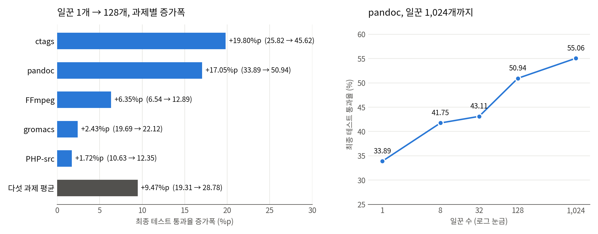
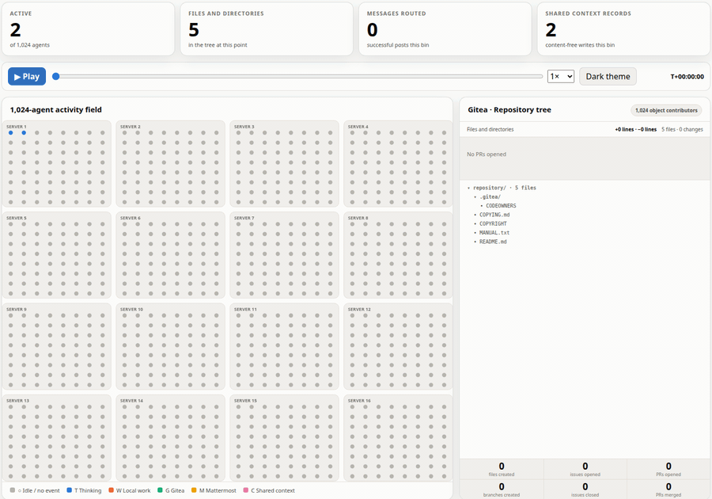

코딩 에이전트 여럿에게 큰 일을 맡기는 도구는 대부분 <abbr title="지휘 에이전트 하나가 일을 나눠 주고 결과를 모아 합치는 구성">오케스트레이터-워커 구조</abbr>를 써요. 마이크로소프트 리서치는 지휘 에이전트가 관리할 수 있는 일꾼 수가 곧 전체 규모의 한계라고 보고, 지휘 에이전트를 없앤 <abbr title="언어모델이 도구를 쓰며 일하도록 감싸는 실행 틀">하네스</abbr> [Agensh](https://arxiv.org/abs/2609.26781)를 2026년 9월 기술 보고서로 냈어요. 일꾼은 모두 같은 <abbr title="언어모델에게 주는 작업 지시문">프롬프트</abbr>를 받고, 맡을 일을 스스로 골라 선언한 뒤 구현·검증·병합을 반복하며, 서로의 진행 상황은 공유 저장소와 채팅, 짧은 기록 게시판으로 나눠요.

<figure class="fig" style="width:min(1320px,94vw);margin-left:calc(50% - min(660px,47vw))">
<iframe src="../static/diagrams/2026-10-08_agensh_흐름도.htm" scrolling="no" title="Agensh 협력 루프 흐름도" loading="lazy" style="display:block;width:100%;height:700px;border:0"></iframe>
<figcaption>원문 2절과 부록 A 프롬프트를 바탕으로 새로 그린 흐름이에요. 위 갈래는 모든 일꾼이 같은 순서로 도는 단계, 아래 갈래는 일꾼끼리 상태를 나누는 공유 서비스예요. <a href="../static/diagrams/2026-10-08_agensh_흐름도.htm" target="_blank" rel="noopener">새 탭에서 크게 보기</a></figcaption></figure>

## 누가 무엇을 할지 정하는 주체가 없어요

일꾼의 루프는 다섯 단계예요. 목표와 동료 진행 상황, 쌓인 발견을 읽고, 할 일 하나를 골라 범위를 게시판에 선언하고, 도구로 구현하고, 합격 기준에 맞는지 확인한 뒤, 공유 저장소의 <abbr title="여러 작업을 합쳐 두는 저장소의 기준 줄기. 평가는 이 줄기의 최신 상태로 해요">main 브랜치</abbr>에 합치고 무엇을 왜 바꿨는지와 검증 근거를 알려요. 선언이 겹치면 두 일꾼이 1:1 메시지로 정리하도록 권할 뿐, 배정하는 쪽은 없어요. 루프는 실행 코드가 아니라 프롬프트 지시문으로 정해지고, 부록 A의 프롬프트는 일꾼 번호만 빼면 1,024개 모두 같아요. 일꾼 하나의 추론과 도구 실행은 기존 단일 에이전트 하네스가 맡고, Agensh는 그 위에 이벤트 전달, 공유 서비스 접근, 복구 같은 조직 수준 기능을 얹어요.

공유 저장소는 <abbr title="서버에 설치해 쓰는 코드 저장소 관리 프로그램">Gitea</abbr>예요. 일꾼은 각자 갈라 낸 작업 줄기(브랜치)에서 일하고 <abbr title="내 작업 줄기의 변경을 기준 줄기에 합쳐 달라는 요청">풀 리퀘스트</abbr>(PR)로 main에 합치며, 같은 곳을 다르게 고쳐 생긴 충돌은 일꾼이 최신 main을 받아 풀어요. 메시지는 <abbr title="서버에 설치해 쓰는 팀 채팅 프로그램">Mattermost</abbr> 채널과 1:1 메시지로 나뉘는데, 1:1 메시지는 상대의 공유 서비스 도구 호출 결과에 덧붙어 진행 중인 작업 한가운데로 들어가요. 그래서 프롬프트는 같은 것을 고치려는 충돌이 임박했을 때만 쓰라고 해요.

게시판은 덧붙이기만 되는 기록장이고 항목마다 유형이 있어요. 관찰한 동작은 <code>OBSERVED</code>, 확인한 사실은 <code>FACT</code>, 반증된 가설은 <code>FAIL</code>, 진행 중인 선언은 <code>CLAIM</code>, 끝낸 변경의 요약은 <code>PATCH_SUMMARY</code>로 쓰고, 항목 길이는 100자(요약은 300자)로 묶여요. 프롬프트는 <code>FAIL</code>을 동료가 같은 시도에 예산을 쓰지 않게 막는 가장 가치 높은 항목으로 꼽아요. [[2026-07-28_기억을_어디에_둘지가_병목이에요|에이전트 워크플로의 병목은 컨텍스트 밖 기억과 평가의 배치]]에서 다룬 <abbr title="에이전트끼리 작업 변경을 주고받게 만든 실험용 저장소 서버">AgentHub</abbr>는 main 브랜치와 병합 요청을 두지 않아요. 견주어 보면 Agensh는 main 하나와 병합을 그대로 두고, 누가 무엇을 하는지와 무엇이 실패했는지를 게시판으로 꺼내 두는 쪽이에요.

## 실행 파일만 보고 다시 짓는 시험에서 평균 49% 상승

시험대는 <abbr title="컴파일된 프로그램만 주고 같은 동작을 하는 코드를 처음부터 다시 짜게 하는 코딩 에이전트 평가 묶음">ProgramBench</abbr>예요. 일꾼은 내용을 읽을 수 없고 실행만 되는 기준 프로그램을 돌려 동작을 관찰하며, 인터넷 없이 6시간 안에 같은 동작을 하는 코드를 새로 짓고, 평가는 숨겨진 테스트로 해요. 저자들은 200개 과제 중 최신 모델의 평균 통과율이 가장 낮은 다섯 개를 골랐어요. 동영상 처리 FFmpeg, 분자 시뮬레이션 gromacs, 문서 변환 pandoc, 언어 해석기 PHP-src, 코드 색인 ctags예요. 모델은 모든 구성에서 <abbr title="언어모델 이름. 높은 추론 강도 설정으로 모든 일꾼이 같은 모델을 썼어요">GPT-5.6-sol</abbr>, 아래층 하네스는 GitHub의 코딩 에이전트 Copilot이에요.

다섯 과제 평균 최종 통과율은 일꾼 1개 19.31%, 8개 20.68%, 32개 26.52%, 128개 28.78%였어요. 9.47<abbr title="퍼센트 포인트. 비율끼리 뺀 차이로, 19%에서 29%가 되면 10%p 올랐다고 해요">%p</abbr>, 상대적으로 약 49% 오른 값이에요. pandoc은 1,024개까지 돌려 33.89%에서 55.06%가 됐어요. 도달 시간도 줄어서, pandoc에서 128개는 30분 시점에 통과율 30%를 넘었고 32개와 8개는 60분과 90분에 처음 넘었으며 1개는 첫 2시간 동안 넘지 못했어요.

<figure class="fig"><figcaption>원문 그림 1·5의 데이터 라벨을 옮겨 새로 그렸어요. 과제별 값의 산술평균은 원문 평균과 소수 둘째 자리까지 같아요. (출처 데이터: Zhan et al., arXiv:2609.26781v1)</figcaption></figure>

과제별로 나누면 상승은 고르지 않아요. 평균 9.47%p의 대부분은 ctags(+19.80%p)와 pandoc(+17.05%p)에서 나왔고, gromacs는 2.43%p, PHP-src는 1.72%p에 그쳤어요. 단조롭게 오르지도 않아서, ctags는 8개(18.47%)가 1개(25.82%)보다, FFmpeg는 128개(12.89%)가 32개(13.22%)보다, gromacs는 8개와 32개(19.37%)가 1개(19.69%)보다 낮아요. 일꾼을 8배 늘린 두 구간을 pandoc에서 견주면 1개→8개는 7.86%p, 128개→1,024개는 4.12%p였어요.

## 규모마다 다르게 기록된 협업

저자들은 규모에 따라 협업 형태가 넓어졌다고 사례로 보고해요. 8개에서는 일꾼들이 부품끼리 맞물리는 규격을 먼저 공지하고 그에 맞춰 각자 구현했고, 32개에서는 여러 동료가 승인한 기여에 다른 일꾼이 반례를 찾아 승인이 철회됐어요. 128개에서는 경험을 기준으로 검토자를 고르고, 작성자가 자기 변경의 식별 번호를 넘기면 동료가 검증해 병합하는 절차를 정해 다른 일꾼들이 따라 썼어요. 1,024개에서는 여러 일꾼이 통합 담당을 맡았어요. 프롬프트에 없는 행동이라는 것이 저자들의 강조점이지만, 근거는 수치가 아니라 골라 낸 사례예요.

## 1,024개 재생 기록에서 생성을 못 따라간 병합

프로젝트 페이지는 1,024개 실행의 행동 기록을 내용 없이 사건 종류와 시각만 남겨 재생 화면으로 공개했어요. 재생 데이터의 실행 정보는 2026-09-13부터 이틀, 48시간을 담고 시간 확장 계수 8을 둬서 이를 화면 시계 6시간으로 보여 줘요. 일꾼을 차례로 켜는 시차 기동 일정(첫 1시간은 30초, 이후 3초 간격)은 이 줄인 시계에서 맞아요. 256번째 일꾼이 처음 관측된 기록상 시각 32,100초를 8로 나눈 1시간 7분이 일정과 같고, 512번째와 768번째도 맞아요. 마지막 1,024번째는 4시간 43분에야 관측돼 일정보다 늦은데, 늦게 켜졌는지 기록이 늦게 남았는지는 가를 수 없어요. 1,024개 실행이 실제 시간으로 48시간 걸렸는지 표시용 변환인지는 논문에 설명이 없어요. 시간 예산을 앞세운 결과라 해명이 필요한 부분이에요.

<figure class="fig"><figcaption>재생 화면의 시간 막대를 4분 간격 91곳으로 옮기며 찍어 이었어요. 점 하나가 일꾼 하나이고 회색은 대기, 파랑은 추론, 주황은 각자 작업 공간 안의 작업이에요. 오른쪽 아래 누적 계수에서 PR 생성과 병합의 차이가 벌어져요. (출처: Zhan et al., Agensh 프로젝트 재생 페이지)</figcaption></figure>

화면 시계로 한 시간씩 사건을 세면 병합이 생성을 따라가지 못해요. 6시간 동안 PR은 11,111건 열렸고 병합은 2,800건(25.2%)이었어요. 병합되지 않은 PR이 열린 채 남았는지 닫혔는지는 데이터에 없어요. 평균 활성 일꾼은 기록 5분(화면 37.5초) 구간마다 활동이 하나라도 있는 일꾼 수를 화면 1시간 동안 평균한 값이고, 첫 1시간이 낮은 것은 시차 기동 때문이에요.

| 시간대 | 평균 활성 일꾼 | PR 생성 | PR 병합 | 병합 비율 |
| --- | --- | --- | --- | --- |
| 0~1시간 | 59 | 637 | 611 | 95.9% |
| 1~2시간 | 655 | 2,714 | 1,167 | 43.0% |
| 2~3시간 | 985 | 3,006 | 167 | 5.6% |
| 3~4시간 | 1,006 | 1,471 | 431 | 29.3% |
| 4~5시간 | 1,012 | 1,779 | 354 | 19.9% |
| 5~6시간 | 1,008 | 1,504 | 70 | 4.7% |

활성 일꾼이 17배 가까이 늘어난 2~3시간 구간의 시간당 병합은 첫 1시간의 4분의 1 수준이에요. 원인은 이 데이터로 가를 수 없어요. 병합 전마다 최신 main을 다시 받아 확인하는 일이 되풀이됐을 수도 있고, 저장소 서버의 처리량이나 PR 품질 탓일 수도 있어요.

게시판 기록 148,079건 중 <code>CLAIM</code>이 74,700건으로 절반이었고, <code>FAIL</code>은 56,472건으로 <code>FACT</code> 5,551건의 열 배쯤이었어요. 메시지 144,290건 중 97.7%는 1:1 메시지였어요. 충돌이 임박했을 때만 쓰라던 경로가 건수로는 주된 통신 수단이었고, 내용 없는 집계라 어떤 용도였는지는 알 수 없어요.

## 이 결과가 서 있는 조건

비교 대상이 일꾼 1개뿐이에요. 논문은 중앙 조율자가 규모를 막는다는 주장에서 출발하지만, 오케스트레이터-워커 구성을 같은 조건에서 돌린 결과는 없어요. 보여 준 것은 Agensh 안에서 일꾼을 늘리면 통과율이 오른다는 데까지예요. 모델·하네스·시험대가 하나씩이고, 반복 횟수와 편차가 없어 ctags 8개의 하락이 잡음인지 가릴 수 없고, 1,024개는 pandoc 한 과제뿐이에요. <abbr title="언어모델이 글을 잘게 나눠 처리하는 단위. 사용량이 곧 비용이에요">토큰</abbr> 사용량과 비용도 보고되지 않았어요. 실행에는 시차 기동과 종료 45분 전·5분 전의 병합 안내, 10분 멈춘 일꾼에게 보내는 재촉이 들어갔고, 1개 기준선에는 6시간을 채우도록 멈춤을 막는 장치를 따로 붙였어요. 논문이 적은 코드 저장소는 2026-10-08 확인 시점에 열리지 않았어요.

## 에이전트에게 일을 나눠 맡길 때 볼 것

에이전트 여럿에게 일을 맡기고 맡긴 쪽이 결과를 받아 검수하는 방식은 Agensh가 넘어서려는 쪽이에요. 재생 기록은 조율자를 없애도 결과를 하나로 합치는 자리는 남고, 합쳐지는 PR 수가 일꾼 수를 따라 늘지 않을 수 있다는 것을 시사해요. 바로 해 볼 수 있는 범위는 동시에 맡기는 작업 수를 늘릴 때 완료 보고 수와 실제로 합쳐진 수를 시간대별로 나눠 세는 일이에요. 생성 대비 병합 비율이 꺾이는 지점은 동시 작업 수를 정할 때 쓸 첫 신호가 돼요.

게시판에서 가져올 것은 확인한 사실과 반증된 가설을 나눠 남기는 방식이에요. 뒤에 오는 일꾼이 같은 가설을 세우기 전에 <code>FAIL</code>부터 찾을 수 있어요. 다만 <code>FAIL</code>이 많이 쌓인 데에는 프롬프트가 그것을 가장 가치 높게 꼽고 기록을 재촉한 영향도 섞여 있어, 기록량만으로 효과를 말할 수는 없어요.

---

<!-- src-block -->

출처 — https://arxiv.org/abs/2609.26781
