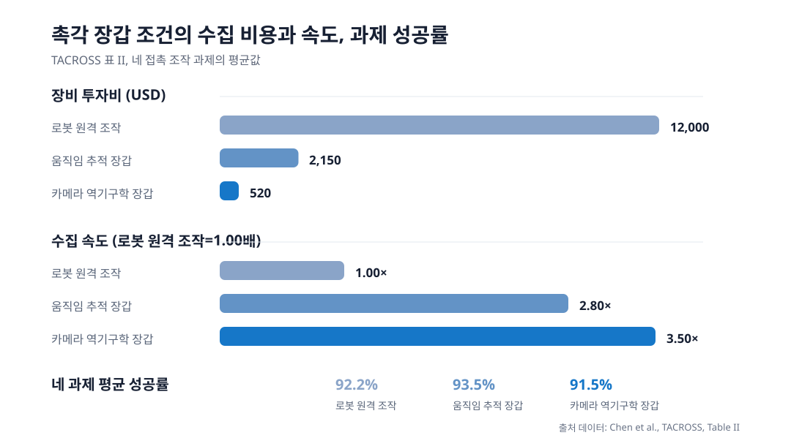

사람 손의 촉각 장갑과 로봇 손의 센서는 같은 숫자를 내도 같은 접촉을 뜻하지 않아요. 센서의 압력 읽는 방식, 손바닥에서의 위치, 해상도와 시간 응답이 다르기 때문입니다. <abbr title="서로 다른 촉각 센서의 신호를 접촉 사건 단위로 연결해 로봇 조작 학습에 쓰는 방법 이름">TACROSS</abbr>는 채널별 값을 맞추는 대신, 닿기 시작함·힘이 실림·안정됨·미끄러짐 의심·놓기처럼 조작에 필요한 접촉 사건을 공통 표현으로 만들었습니다.

<figure class="fig"><figcaption>원문 표 II의 장비 투자비, 수집 속도, 네 접촉 조작 과제 평균 성공률을 새 차트로 정리했습니다. 원문 그림은 사용하지 않았습니다. (출처 데이터: Chen et al., TACROSS, CC BY-NC-SA 4.0)</figcaption></figure>

## 값이 아니라 접촉의 역할을 맞춰요

논문에서 사람 장갑은 압력을 받으면 저항이 바뀌는 방식이고, 로봇 손의 Revo2 센서는 정전용량 변화를 읽습니다. 센서마다 채널 수와 배열도 달라서, 같은 물체를 잡아도 어느 위치가 얼마나 반응하는지가 일치하지 않습니다. 원시값을 한 채널씩 짝지으면 장치의 특성 차이를 학습하기 쉬워지고, 조작에 필요한 상태를 잃을 수 있습니다.

TACROSS는 각 센서값을 손의 부위별 접촉 확률, 상대 세기 변화, 지속 시간, 접촉 면적, 압력 중심, 불안정 신호와 신뢰도로 요약합니다. 이 정보에 유효하지 않은 채널을 표시하는 마스크를 함께 두고, 최근 16개 프레임의 시간 변화와 손가락 사이 관계를 인코더로 읽습니다. 그래서 사람 장갑과 로봇 손이 같은 수치를 내지 않아도, "어느 손가락이 닿았고 접촉이 어느 단계에 있는가"라는 질문에는 같은 형식으로 답하게 합니다.

이 표현은 촉각을 힘의 정확한 절대값으로 바꾸는 방법은 아닙니다. 논문도 상대 세기와 불안정 단서를 쓰며, 불안정 신호를 미끄러짐의 측정값으로 두지 않았습니다. 다른 손, 다른 물체, 다른 센서에서 같은 접촉 사건 정의가 유지되는지는 별도의 검증이 필요합니다.

## 사람 시연은 표현을, 로봇 시연은 행동 답을 맡아요

사람 손의 움직임을 로봇 관절 명령으로 그대로 쓰기는 어렵습니다. 손의 형태와 자유도가 다르고, 화면에서 추정한 손 자세에도 오차가 있기 때문입니다. 이 논문은 로봇 시연의 행동만 정답으로 두고, 사람 시연은 촉각 표현을 학습하는 자료와 신뢰도에 따라 가중한 보조 신호로 썼습니다.

정책은 배포 때 로봇의 카메라, 관절 상태, 로봇 촉각 표현만 받습니다. 사람 장갑은 수집 단계의 촉각 패턴을 넓히지만, 로봇에서 낼 행동의 기준을 대체하지 않습니다. 이 분리는 사람 시연이 많아도 로봇 행동의 좌표계와 접촉 결과를 확인해야 한다는 제한을 남깁니다.

원문은 사람 시연 150개와 로봇 시연 30개를 쓴 네 과제 평균에서, 전체 방법이 91.9% 성공률을 보고했습니다. 같은 구성에서 사람 촉각 입력을 뺀 조건은 73.1%, 접촉 사건 정렬을 뺀 조건은 49.4%였습니다. 비교는 촉각 입력과 정렬 단계를 함께 바꾸는 구성이라, 한 요소만의 효과로 읽기보다는 사람 촉각 자료를 로봇 정책에 연결하는 전체 경로의 근거로 보는 편이 맞습니다.

## 수집 장비의 값싼 쪽이 성능을 자동으로 보장하지는 않아요

표 II에서 로봇 원격 조작 조건의 장비 투자비는 12,000달러, 수집 속도는 기준값 1.00배, 네 과제 평균 성공률은 92.2%였습니다. 움직임 추적 장갑 조건은 2,150달러와 2.80배, 카메라로 손 자세를 추정하는 장갑 조건은 520달러와 3.50배를 기록했습니다. 두 장갑 조건의 평균 성공률은 각각 93.5%와 91.5%였습니다.

여기서 95.7% 비용 감소와 3.5배 수집 속도는 카메라 기반 장갑 조건을 로봇 원격 조작과 비교한 장비·수집 지표입니다. 네 과제의 성공률 차이가 수집 속도만으로 생겼다는 뜻은 아닙니다. 저자들은 이 비교에서 로봇 시연을 기준점으로 남기고, 사람 촉각 시연을 더하는 구성을 사용했습니다.

## 지금 작업과 만나는 지점

이 논문은 프로필의 저가 로봇팔 모방학습, 양팔·조작, 서보·접촉·저수준 제어와 만납니다. 저가 장비에서 사람 손과 로봇 손의 센서값을 같은 값으로 맞추기 어려울 때, 시연 기록을 접촉 시작·하중 변화·안정·해제처럼 제어에 필요한 사건으로 먼저 나누는 방식을 시험해 볼 수 있습니다. 바로 확인할 수 있는 범위는 그리퍼 명령, 관절 위치, 전류 또는 위치 오차, 카메라 시각을 같은 시간축에 남기고, 각 구간에 붙인 사건 표지가 실제 성공·실패와 얼마나 일관되게 연결되는지 비교하는 일입니다.

[[2026-09-16_Touch2Trace_촉각_모방학습으로_케이블_추적을_높인_방식|Touch2Trace의 촉각 모방학습으로 케이블 추적을 높인 방식]]은 한 손의 접촉 정보를 행동과 같은 제어 주기 안에서 쓰는 문제를 다뤘습니다. TACROSS는 센서와 손이 달라진 뒤에도 그 접촉 정보를 어떤 단위로 남겨야 하는지에 초점을 둡니다. 두 글을 함께 보면 접촉 신호의 시간 예산과, 센서 간에 보존할 사건의 정의를 나누어 검토할 수 있습니다.

---

<!-- src-block -->

출처 — https://arxiv.org/abs/2610.11945
