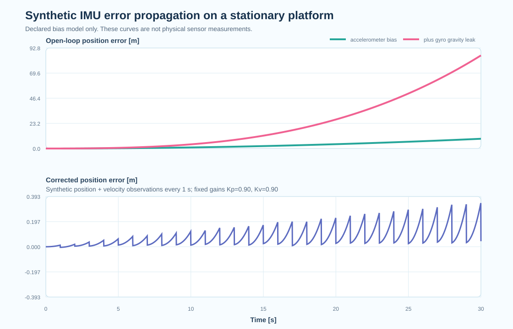

MPU6050을 처음 연결했을 때 자이로 Z축 원시값을 2초 동안 200번 읽어 평균을 냈어요. 이후 측정값에서 그 평균을 빼고 각속도를 적분했어요. 이 절차가 알려 주는 값은 전원을 켠 시점의 오프셋 하나예요.

## 2초 정지 평균은 초기화예요

정지 평균은 시작할 때의 자이로 바이어스를 추정하는 데 쓸 수 있어요. 센서가 움직인 채로 평균을 내면 실제 각속도까지 오프셋으로 흡수하고, 온도가 달라지거나 시간이 지나 바이어스가 변하면 처음 구한 값과 다시 어긋나요. 가속도계와 자이로스코프의 scale factor, 축 비직교성, 센서 축 사이의 misalignment도 이 평균으로는 알아낼 수 없어요.

Tedaldi 등은 센서를 여러 정적 자세에 놓고 자세 사이의 회전 구간을 함께 사용해, 별도의 고가 장비 없이 가속도계와 자이로스코프의 intrinsic parameter를 추정했어요. 한 자세에서 얻은 평균과 여러 자세에서 식별하는 보정 행렬은 답하는 질문이 달라요. 2초 평균은 런타임 초기화이고, 다자세 캘리브레이션은 축과 배율을 포함한 센서 모델을 구하는 절차예요.

출처 — [Tedaldi 외, ICRA 2014 원문](https://albertopretto.altervista.org/papers/tpm_icra2014.pdf)

## 위치 오차는 자세에서 시작될 수 있어요

가속도계 바이어스가 일정하고 자세가 정확하다고 단순화하면, 위치 오차는 시간의 제곱에 비례해 커져요. 가속도 오차를 한 번 적분하면 속도 오차가 되고, 다시 적분하면 위치 오차가 되기 때문이에요.

$$
\delta p_a(t) \approx \frac{1}{2} b_a t^2
$$

자이로 바이어스에는 한 단계가 더 붙어요. 작은 각속도 오차를 적분하면 자세가 기울고, 틀어진 자세로 중력을 제거하면 중력 일부가 수평 가속도로 남아요. 그 가짜 가속도를 다시 두 번 적분하면 위치 오차의 주도항이 시간의 세제곱에 비례할 수 있어요.

$$
\delta \theta(t) \approx b_g t, \qquad
\delta p_g(t) \approx \frac{1}{6} g b_g t^3
$$

**위치가 흐를 때 가속도계 값만 보지 않고, 자이로 바이어스가 자세와 중력 보상을 거쳐 위치까지 퍼진 경로를 함께 확인해야 해요.** Farrell 등의 IMU 오차 모델 튜토리얼도 측정 오차를 연속시간 모델과 이산 상태공간 모델로 연결해, 바이어스와 잡음을 추정기 안에서 어떻게 다뤄야 하는지 설명해요.

출처 — [Farrell 외, IMU error-modeling tutorial](https://escholarship.org/uc/item/1vf7j52p)

## 30초 합성 모델로 전파 경로를 분리했어요

오차가 퍼지는 모양을 확인하려고 정지한 물체를 가정한 30초짜리 단순 합성 모델을 만들었어요. 이 결과는 MPU6050이나 다른 실센서를 측정한 성능값이 아니에요. 일정한 바이어스와 작은 합성 잡음이 있는 위치·속도 관측을 1초마다 고정 gain으로 반영해 위 식의 전파 경로를 검산한 값이에요.

| 합성 조건                                         | 30초 뒤 위치 오차 |
| ------------------------------------------------- | ----------------: |
| 가속도 바이어스 0.02 m/s²만 적용                  |             9.0 m |
| 자이로 바이어스 0.1 deg/s의 중력 투영 오차 포함   |          85.972 m |
| 같은 예측에 1초마다 외부 위치·속도 관측 보정 적용 |     최종 0.0433 m |

첫 번째 값 9.0m는 `0.5 × 0.02 × 30²`와 일치해요. 두 번째 조건에서는 자이로 바이어스가 만든 자세 오차 때문에 중력이 수평축으로 새면서, 가속도 바이어스만 넣은 경우보다 오차가 빠르게 커졌어요. 세 번째 값은 외부 관측이 누적 오차를 끊는 역할을 보여 주지만, 완벽한 센서 성능이나 실제 환경의 정확도를 뜻하지 않아요.

<figure class="fig"><figcaption>실센서 계측이 아닌 단순 합성 모델의 위치 오차 비교예요. 일정 바이어스의 전파 경로와 1초마다 합성 위치·속도 관측을 고정 gain으로 반영한 결과만 분리해 보여 줘요.</figcaption></figure>

## 외부 관측 사이에서도 바이어스를 추정해요

카메라나 LiDAR가 위치를 보정하더라도 IMU 오차 모델은 없어지지 않아요. 외부 관측 사이의 짧은 구간은 IMU가 예측하고, 관측이 끊기면 그 구간이 길어져요. Forster 등의 on-manifold preintegration은 두 키프레임 사이의 고주기 IMU 측정을 하나의 상대 운동 제약으로 묶고, 바이어스가 바뀔 때의 보정항과 공분산을 함께 다뤄요.

출처 — [Forster 외, on-manifold IMU preintegration](https://arxiv.org/abs/1512.02363)

자세 표현도 같은 문제와 이어져요. 자이로 각속도를 오일러각 세 축에 그대로 더하는 방식은 회전의 비가환성과 특이점을 숨겨요. 회전행렬과 쿼터니언이 필요한 이유는 [[2026-08-05_회전표현_쿼터니언_오일러_회전행렬|회전 표현 — 오일러는 UI, 쿼터니언은 데이터]]에 정리했고, 서로 다른 센서의 장단점을 한 추정기에서 묶는 출발점은 [[2026-08-05_센서융합_상보필터와_칼만|센서 융합 — 결함이 정확히 반대인 두 센서]]와 연결돼요.

국내 연구에서도 외부 가속도와 자이로 바이어스를 상태에 포함할지에 따라 자세 추정기의 거동이 달라지는 문제를 비교했어요. 장태호 등은 여러 칼만필터 기반 방법을 같은 틀에서 비교했고, 동적인 구간에서 외부 가속도를 중력으로 오인하지 않도록 모델링하는 문제를 다뤘어요.

출처 — [장태호 외, 외부가속도와 바이어스를 고려한 자세추정 비교](https://doi.org/10.7736/KSPE.2018.35.8.745)

## 다음 측정은 값보다 조건을 남겨야 해요

MPU6050의 2초 정지 평균은 그대로 유지할 만한 초기화 절차예요. 여기에 시작과 종료 시점의 정지 평균, 센서 온도, 샘플 간격, 읽기 실패 횟수를 같은 로그에 남기면 바이어스가 언제 변했는지 비교할 수 있어요. 반복 회전에서는 목표 각도와 적분 각도의 차이를 기록하고, 센서를 다른 자세로 놓았을 때 가속도 norm이 일정한지도 확인해야 해요.

상태추정 실험에서는 외부 관측이 정상적으로 들어오는 구간의 평균 오차만으로 충분하지 않아요. 관측을 일부러 끊은 구간에서 자세와 위치 오차가 어떤 차수로 자라는지, 보정이 돌아왔을 때 innovation과 공분산이 함께 회복되는지를 기록해야 해요. 이렇게 남긴 로그라면 필터 파라미터를 바꾼 뒤 오차가 줄었는지뿐 아니라, 어느 오차 경로를 고쳤는지도 설명할 수 있어요.
