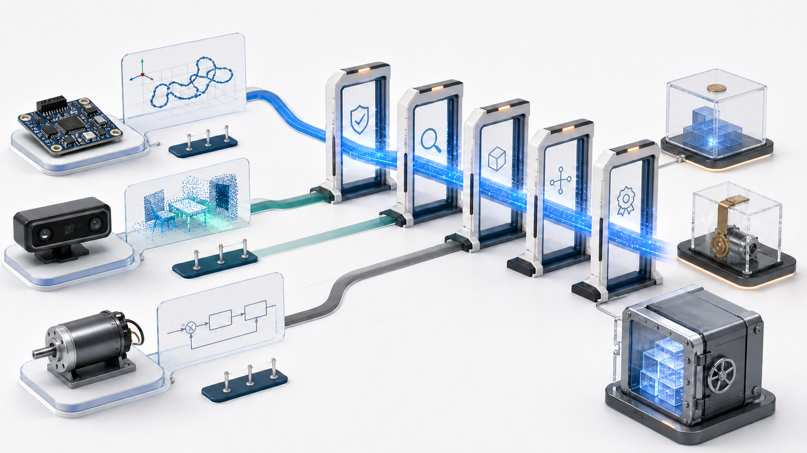
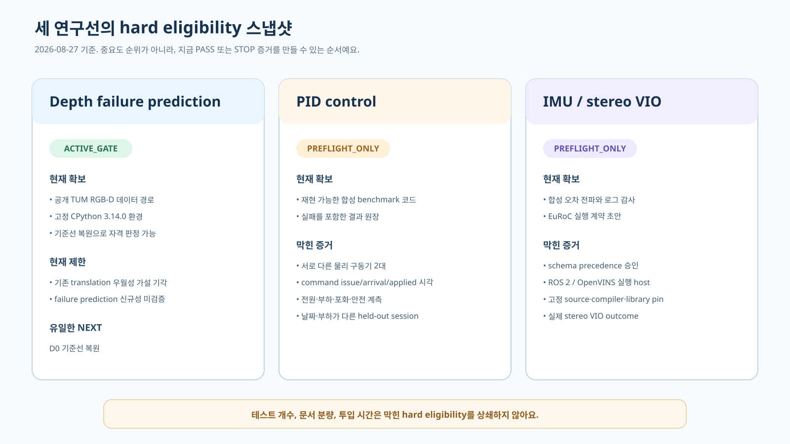
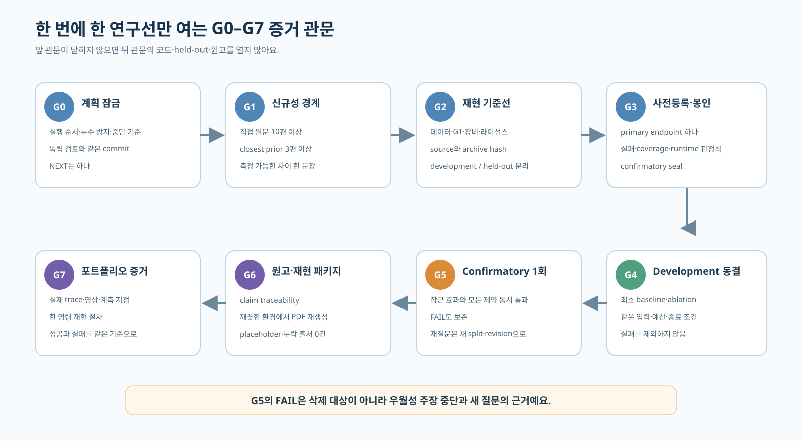

Depth camera, PID 제어, IMU는 모두 로봇 포트폴리오에 필요한 주제지만 현재 논문 준비도는 같지 않아요. 세 주제를 동시에 밀기보다 지금 검증 가능한 주장 하나만 `NEXT`로 두자, 문서 분량이나 테스트 수에 가려졌던 차단 조건이 드러났습니다.

<figure class="fig"><figcaption>세 연구 주제를 상시 병렬 실행하지 않고, 현재 자격을 갖춘 연구선 하나만 순차 관문으로 보내는 운영 개념도예요. 실제 연구 순위나 성능을 나타내는 결과 그림은 아니에요.</figcaption></figure>

## Hard eligibility는 점수로 상쇄할 수 없어요

Hard eligibility는 연구 질문을 검증하기 전에 반드시 있어야 하는 조건이에요. 원문으로 확인한 신규성 경계, 데이터와 ground truth, 장비와 계측값, 라이선스, development·held-out 분리, 고정 환경의 baseline이 여기에 들어갑니다. 하나가 비어 있으면 문서를 더 쓰거나 테스트를 더 만드는 것으로 메울 수 없어요.

가중 점수만 쓰면 이 차이가 흐려져요. 예를 들어 포트폴리오 가치와 기존 투자량이 높은 연구선은 장비가 없어도 총점이 높게 나올 수 있습니다. 하지만 실제 모터가 없는 PID 우월성 실험이나 stereo VIO outcome이 없는 IMU 원고는 점수와 관계없이 confirmatory 평가를 시작할 수 없어요.

현재 순위는 Depth, PID, IMU예요. 이 순서는 기술의 중요도나 논문 채택 가능성을 뜻하지 않습니다. 지금 가진 자료와 환경으로 가장 짧은 bounded gate를 닫을 수 있는 순서예요.

<figure class="fig"><figcaption>2026-08-27의 자격 스냅샷이에요. Depth는 기준선 복원으로 PASS 또는 STOP을 만들 수 있지만, PID와 IMU는 각각 하드웨어·실행 환경 증거가 없어 preflight만 열 수 있어요.</figcaption></figure>

## Depth가 먼저인 이유는 성능이 좋아서가 아니에요

Depth 연구에는 공개 TUM RGB-D 데이터 경로와 고정 CPython 3.14.0 환경이 있어요. 환경 잠금과 관련된 133개 테스트는 통과했고, archive·sequence manifest와 현재 source hash에 맞는 smoke를 다시 만들면 D0를 PASS 또는 STOP으로 닫을 수 있습니다. 기존 input-confidence ICP의 translation 우월성 가설은 이미 기각됐으므로, 결과가 좋다는 이유로 1순위가 된 것도 아니에요.

PID에는 재현 코드와 대규모 합성 결과가 있어요. 그래도 서로 다른 물리 구동기 두 대, command issue·arrival·applied timestamp, 전원·부하·포화·안전 차단 계측, 날짜와 부하가 다른 held-out session이 없습니다. 이 네 조건을 확보하지 못하면 실제 모터 우월성 연구를 시작하지 않아요.

IMU도 합성 오차 전파와 기존 로그 감사까지는 끝났지만 schema precedence, ROS 2/OpenVINS 실행 host, 고정 source·compiler·library pin, 실제 stereo VIO outcome이 없어요. EuRoC 데이터를 확보했다는 사실만으로 estimator 결과가 생기지는 않습니다. PID가 중단된 뒤 environment preflight가 `NEXT`가 될 때 이 네 항목부터 확인합니다.

이 판정에서 테스트 개수, 문서 분량, 지금까지 투입한 작업량은 순위 근거에서 제외했어요. 많이 만든 연구선과 다음 반증을 만들 수 있는 연구선은 다를 수 있기 때문입니다.

## `NEXT` 하나가 주제 간 증거 혼입을 막아요

한 시점의 `NEXT`는 하나만 둬요. 활성 연구선이 Depth D0라면 PID·IMU의 방법 코드, 데이터 split, 원고 주장을 함께 고치지 않습니다. 내부 병렬 작업도 현재 gate의 원문 조사, 저장소 탐색, 독립 검증처럼 읽기 중심의 보조 작업으로 제한해요.

이 제약은 속도 향상을 입증한 실험 결과가 아닙니다. 목적은 연구 상태를 섞지 않는 데 있어요. 세 연구선을 동시에 구현하면 한 주제에서 배운 threshold나 실패 조건이 다른 주제의 protocol에 사후 반영되기 쉽고, 어느 held-out을 언제 열었는지 추적하기 어려워집니다. `NEXT`가 하나면 method 변경과 outcome 열람의 시간 순서를 한 원장에 남길 수 있어요.

대기 중인 연구선은 버린 것이 아니에요. 현재 gate가 PASS하면 같은 연구선의 다음 gate로 가고, STOP이면 다음 연구선의 preflight를 열어요. 장비 설치나 대형 데이터 접근처럼 외부 권한이 필요하면 `WAITING_EXTERNAL_AUTHORITY`로 바꾸고 `NEXT`를 0개로 둡니다. 그 틈에 다른 연구선을 자동으로 여는 규칙은 두지 않았어요.

| 현재 판정                              | 다음 상태                                 |
| -------------------------------------- | ----------------------------------------- |
| Depth D0 PASS                          | Depth 신규성·dataset feasibility로 진행   |
| Depth D0 또는 후속 gate STOP           | PID hardware preflight를 `NEXT`로 지정    |
| PID preflight PASS                     | PID 신규성 gate로 진행                    |
| PID preflight FAIL 또는 후속 연구 중단 | IMU environment preflight를 `NEXT`로 지정 |
| 외부 권한이 필요함                     | `WAITING_EXTERNAL_AUTHORITY`, `NEXT` 0개  |
| G7까지 PASS                            | 목표 달성, `NEXT` 0개                     |

## 원고보다 먼저 여덟 관문을 닫아요

G0는 실행 순서와 누수 방지 규칙을 잠그는 계획 관문이에요. G1은 직접 원문과 closest prior로 신규성을 확인하고, G2는 데이터·GT·장비·라이선스와 고정 baseline을 복원합니다. 이 둘을 통과하지 못하면 방법 구현을 시작하지 않아요.

G3에서는 primary endpoint 하나, 최소 실용 효과, failure·coverage·runtime 판정식, split hash를 결과 전에 봉인해요. G4는 development에서만 방법을 고치고 baseline과 제안법의 입력·예산·종료 조건을 맞춥니다. G5의 held-out 평가는 한 번만 실행하며, 잠근 조건 가운데 하나라도 실패하면 우월성 주장을 중단해요.

G6에서야 LaTeX 원고, claim traceability, source·data manifest, 재현 명령과 arXiv source archive를 묶어요. 마지막 G7은 논문 PDF와 별개로 실제 run trace, 영상, 계측 지점, 한 명령 재현, 대표 실패 사례를 포트폴리오 증거로 확인합니다.

<figure class="fig"><figcaption>G0–G7은 문서 작성 순서가 아니라 작업 권한의 경계예요. 앞 관문이 닫히지 않으면 뒤 관문의 코드·held-out·원고를 열지 않아요.</figcaption></figure>

## FAIL을 지우면 다음 연구도 약해져요

G5에서 FAIL이 나오면 같은 confirmatory split을 반복해 우연히 좋은 결과를 찾지 않아요. 새 방법을 시험하려면 질문, split, protocol revision을 다시 만들고 신규성 gate부터 돌아갑니다. Benchmark나 failure taxonomy로 방향을 바꿀 때도 기존 우월성 원고의 제목만 바꾸지 않고 별도 기여로 다시 판정해요.

Depth에서 translation superiority가 기각된 기록은 그래서 남아 있어요. 이 결과가 선택적 registration과 failure prediction이라는 새 질문의 출발점은 될 수 있지만, 새 방법의 성능 근거로 재사용할 수는 없습니다. PID의 합성 rank-reversal 결과도 실제 모터 confirmatory 증거가 아니고, IMU의 시간 텔레메트리 감사도 VIO 정확도 결과가 아니에요.

우선순위가 바뀔 때는 기존 판정 문서를 덮어쓰지 않고 새 receipt를 만들어요. 최소 기록은 판정일, 전체 순위, 선택한 연구선, 활성 gate, 확보한 자격, 막힌 증거, 검토 상태예요. 과거 판정이 남아야 새 장비나 데이터가 들어왔을 때 왜 순위가 바뀌었는지 설명할 수 있습니다.

## 포트폴리오에는 결과와 연구 통제를 함께 보여 줘요

각 연구선의 공개 구조는 `STATUS`, `PROVENANCE`, versioned protocol, split manifest, 결과 생성 명령으로 나눌 수 있어요. `STATUS`에는 다음 gate 하나와 현재 차단 조건을 적고, `PROVENANCE`에는 source·data hash와 환경을 남깁니다. 저장 방식보다 manifest가 먼저라는 판단은 [[2026-08-25_저장_포맷에서_매니페스트로_옮겨간_Dyna-2_데이터_병목|저장 포맷에서 매니페스트로 옮겨간 Dyna-2 데이터 병목]]과도 맞닿아 있어요. 결과표에는 성공 run만 두지 않고 failure, coverage, runtime과 제외 규칙을 함께 넣습니다.

이 구조는 arXiv 수락을 보장하지 않아요. 신규성, 통계 설계, 외부 타당도, 글의 완결성은 별도 심사를 받아야 합니다. 다만 제출 전에 무엇이 아직 논문 근거가 아닌지 드러내고, 포트폴리오 문구가 실험 범위를 넘어가지 않게 막을 수 있어요.

현재 세 연구선 가운데 제출 준비가 끝난 것은 없습니다. Depth D0가 유일한 `NEXT`이고, 그 결과가 PASS인지 STOP인지부터 기록해야 해요. **연구 준비도는 산출물의 양보다 다음 주장을 검증할 자격이 있는지로 판단해야 합니다.**

출처 — https://doi.org/10.1073/pnas.1708274114

출처 — https://www.jmlr.org/papers/v22/20-303.html

출처 — https://blog.neurips.cc/2021/03/26/introducing-the-neurips-2021-paper-checklist/

출처 — https://www.acm.org/publications/policies/artifact-review-and-badging-current
